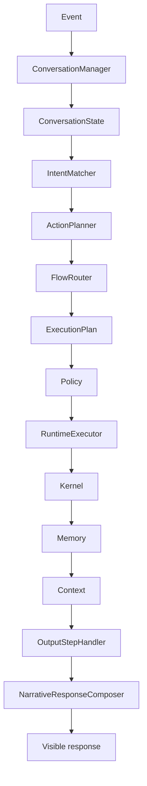
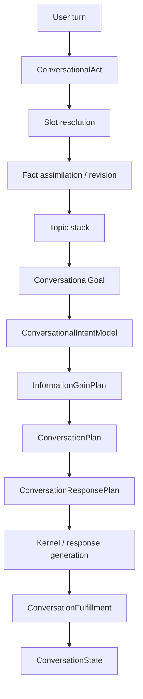
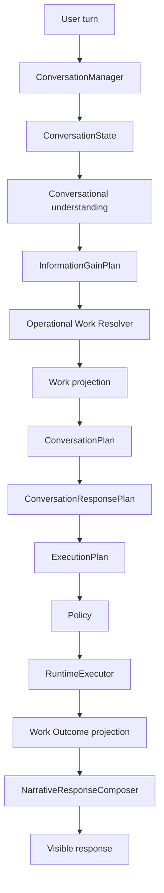
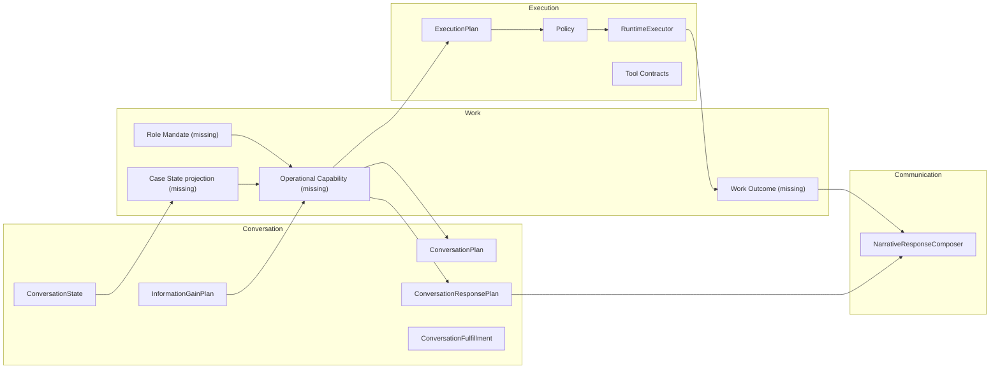

# ACA-006 - Operational Work Model Architecture

Status: Research and architecture freeze for Sprint 73  
Scope: Architectural analysis and first integration boundary only  
Non-goals: no Operational Planner, no Work Scheduler, no Case Engine, no Capability Engine, no new Runtime, no implementation

## 1. Purpose

ACA already has a mature cognitive conversation runtime. It can preserve
conversation state, resolve pending questions, assimilate and revise facts,
track focus, plan conversational next steps, evaluate fulfillment, execute
plans through `RuntimeExecutor`, and verbalize consolidated state through
`NarrativeResponseComposer`.

The next architectural question is different:

```text
What work can ACA perform, prepare, block, or delegate from its role?
```

This document freezes the Sprint 73 analysis for moving ACA from a
conversation-centered architecture toward an operational work model, without
introducing a full operational engine yet.

The guiding principle from the ACA Vision & Work Model research is:

```text
ACA does not converse to look intelligent.
ACA converses to perform service work intelligently, safely, and audibly.
```

This document answers only:

1. Which Work Model concepts already exist?
2. Which concepts do not exist yet?
3. Which existing components can be reused?
4. Who owns each concept now and who should own it later?
5. What exact gaps block a work-oriented model?
6. What is the minimum number of new components needed?
7. What is the impact on current runtime components?
8. What incremental roadmap avoids a big bang migration?

## 2. Current Architectural Baseline

The current official runtime path is:



The current conversation cognition path is:



This is strong conversational cognition. It is not yet a formal work model.

## 3. Concepts That Already Exist

| Work Model concept | Existing ACA concept | Current coverage | Assessment |
|---|---|---:|---|
| Conversation memory | `ConversationState` | High | Reuse directly. It is the operational owner of conversational state. |
| Case facts | `ConversationState.confirmed_facts`, `refuted_facts`, `relevant_evidence` | Medium | Reuse, but separate case facts from purely conversational facts. |
| Case focus | `focus`, `topic_stack`, `active_mission` | Medium | Reuse as input to future Case State. |
| Mission | `active_mission`, `MissionManager` | Medium | Reuse as current domain objective, but do not treat it as full operational case state. |
| Required information | `slots`, `pending_questions`, `InformationGainPlan` | High | Reuse. It already prevents unnecessary questions. |
| Conversation path | `ConversationPlan` | High for dialogue, low for work | Reuse for dialogue continuity, not for operational planning ownership. |
| Response priority | `ConversationResponsePlan` | High | Reuse as communication planning after work selection. |
| Turn fulfillment | `ConversationFulfillment` | High for conversation | Reuse, but do not overload it with operational completion. |
| Runtime execution authority | `ExecutionPlan` | High | Reuse to execute selected flows or future operation steps. |
| Step execution | `RuntimeExecutor`, `StepHandlerRegistry`, `StepHandler` | High | Reuse for execution. Handlers execute, they do not select work. |
| Step outcome trace | `ExecutionStepOutcome` | High | Reuse as execution audit. Future work outcomes may reference it. |
| Policy validation | `PolicyManager`, `PolicyResult` | High | Reuse for authorization and restrictions. Do not make Policy discover work. |
| Tool safety | `ToolExecutionContract`, `ToolExecutionContext` | High | Reuse for operational tools with side effects. |
| Plugin capability vocabulary | plugin `handles`, `blocked_capabilities`, `public_actions`; `CapabilityRegistry` | Medium | Reuse as seed catalog, but current capability is routing/UI-oriented. |
| Public action limits | `PublicAction.enabled`, `requires_real_tool`, `disabled_reason` | Medium | Reuse for public surface, not as full operational capability. |
| Narrative communication | `NarrativeResponseComposer` | High | Reuse to verbalize selected work and outcomes. It must not decide work. |

### 3.1 Important Observation

Some current names sound operational, especially in `ConversationPlan`:

- `active_plan`;
- `pending_steps`;
- `completed_steps`;
- `provide_next_step_guidance`;
- `complete_documentation`.

These are currently conversation or mission steps. They do not declare:

- capability availability;
- permission;
- tool requirement;
- operational preconditions;
- side effects;
- case transition;
- work outcome.

Therefore they are reusable signals, not a complete Work Model.

## 4. Concepts That Do Not Exist Yet

| Missing concept | Current closest proxy | Why proxy is insufficient |
|---|---|---|
| Role Mandate | Domain context, mission goal, plugin manifest | No explicit statement of permanent responsibilities, allowed work, and forbidden claims for the role. |
| Responsibility | Mission, policy, plugin handles | Mission is a current objective; responsibility is a stable role obligation. |
| Operational Capability | Plugin capability, public action, action plan | Existing capability mostly routes plugins or UI actions; it lacks preconditions, outcome, case transition, permission, and operation type. |
| Case State | ConversationState + active_mission + facts | Current state is conversation-owned; there is no explicit operational case lifecycle. |
| Work Outcome | ExecutionStepOutcome, ConversationFulfillment | Execution outcome says a step ran; fulfillment says a turn objective was satisfied. Neither says work was completed, prepared, blocked, delegated, or no-op. |
| Operational Transition | ConversationPlan replanning, mission advancement | Existing transitions advance conversation or mission, not explicit case state. |
| Permission | PolicyResult, ToolExecutionContext.permissions, plugin blocked capabilities | Permissions are distributed and not attached to operational capabilities. |
| Operational Constraint | Policy restrictions, disabled public actions, tool contracts | Constraints exist but are not normalized as work-level blockers or modifiers. |
| Handoff Package | human_handoff flow, public action `prepare_handoff`, legacy projections | Handoff exists as interruption, but not as reusable work product with facts, evidence, blockers, and next owner. |
| Work Product | response text, memory facts, trace records | No first-class artifact representing prepared review, prepared visit, associated docs, or escalation summary. |
| Operational Value | benchmark quality metrics | Current metrics are conversation quality and runtime equivalence, not work value per turn. |

## 5. Reuse Strategy

The Work Model must not duplicate existing cognition. It should reuse the
current components as follows.

### 5.1 ConversationState

Reuse as the source for:

- user-provided facts;
- focus and topic;
- active mission;
- slots and pending questions;
- user signals;
- relevant evidence;
- derived runtime projections.

Do not turn `ConversationState` into the owner of operational work. It can
project into a future Case State or carry a derived operational projection, but
it should not absorb Role Mandate, Operational Capability, Permission, and Work
Outcome as permanent conversation fields.

### 5.2 ConversationPlan

Reuse as:

- dialogue continuity plan;
- side-step insertion;
- topic/mission continuation;
- completed and pending conversational steps.

Do not make it the operational planner. It can consume a selected operational
work signal later.

### 5.3 InformationGainPlan

Reuse as the cost/benefit model for asking questions. In the Work Model, its
question value should be interpreted as:

```text
Does this answer unlock, change, or safely block an operation?
```

No new clarification system is needed.

### 5.4 ConversationResponsePlan

Reuse as the visible response plan. It should communicate:

- selected useful operation;
- what was prepared or completed;
- what cannot be done;
- what minimal information is needed;
- why the next step matters.

It should not select operations.

### 5.5 ConversationFulfillment

Reuse for conversational objective closure. Add no operational meaning to it
in Sprint 73. A future Work Outcome can reference fulfillment, but should not
be stored inside it.

### 5.6 ExecutionPlan and RuntimeExecutor

Reuse for execution. Future operational work should eventually map to either:

- existing runtime flows;
- existing step handlers;
- future step types after separate approval.

No new runtime is needed.

### 5.7 Policy and Tool Contracts

Reuse without semantic drift:

- Policy authorizes, restricts, or interrupts.
- Tool contracts decide safe execution mode and side-effect control.

Neither should discover what work should be done.

### 5.8 Plugin Architecture

Reuse plugin capability declarations as the first capability catalog seed.
However, the current plugin capability is not yet an operational capability.
Future evolution should extend capability metadata carefully rather than create
a parallel catalog.

## 6. Responsibility Map

| Concept | Responsible today | Future responsible | Needs changes |
|---|---|---|---|
| User message lifecycle | `ConversationManager` | `ConversationManager` | No |
| Conversational state | `ConversationState` | `ConversationState` | No |
| Case facts | `ConversationState.confirmed_facts` | `ConversationState` with future Case State projection | Minor |
| Case State | None | Minimal Case State projection, likely derived from `ConversationState` | Yes |
| Role Mandate | Implicit in domain context/docs/policy | New operational model metadata or domain/plugin metadata | Yes |
| Responsibility | Implicit in mission/plugin/domain docs | Operational model metadata | Yes |
| Operational Capability | Plugin handles/public actions, partially | Plugin/domain metadata plus operational resolver | Yes |
| Operation selection | ActionPlanner for runtime action, ConversationPlan for dialogue | Minimal Operational Work Selector/Resolver | Yes |
| Conversation planning | `ConversationState.plan_conversation` | `ConversationPlan` remains owner | No |
| Question selection | `InformationGainPlan` | `InformationGainPlan` | Minor |
| Response planning | `ConversationResponsePlan` | `ConversationResponsePlan` consumes selected work | Minor |
| Response verbalization | `NarrativeResponseComposer` | `NarrativeResponseComposer` | Minor |
| Execution authority | `ExecutionPlan` | `ExecutionPlan` | No |
| Execution engine | `RuntimeExecutor` | `RuntimeExecutor` | No |
| Tool safety | `ToolExecutionContract` | `ToolExecutionContract` | No |
| Authorization | `PolicyManager` | `PolicyManager` | Minor |
| Work Outcome | None | Minimal work outcome projection | Yes |
| Handoff Package | human_handoff flow + legacy/public projections | Work product generated from existing state and outcomes | Yes |
| Operational metrics | Benchmark partials | Cognitive benchmark plus operational metrics | Yes |

## 7. Gap Analysis

### Gap 1: No Role Mandate

ACA can infer domain and mission, but it cannot explicitly answer:

```text
What responsibilities does this representative role have?
What can it do directly?
What can it only prepare?
What must it refuse or escalate?
```

This blocks a work-oriented model because operation selection must be bounded
by role, not only by intent.

### Gap 2: Capability Means Too Many Things

Current capability vocabulary appears in:

- plugin manifests;
- public actions;
- component registry;
- domain pack metadata;
- runtime endpoint catalog;
- public projections.

These are not the same concept. Operational capability must mean:

```text
A declared ability to perform, prepare, explain, block, or delegate a service operation under explicit preconditions, permissions, restrictions, and expected outcomes.
```

### Gap 3: No Case State Boundary

`ConversationState` holds many case-like facts, but it is still conversation
owned. There is no explicit boundary for:

- case lifecycle;
- case blockers;
- current operational stage;
- responsible actor;
- work products;
- case transition history.

### Gap 4: No Work Outcome

ACA can report that a runtime step succeeded and that a conversational goal was
fulfilled. It cannot yet say:

```text
The case was prepared for review.
The documentation association was blocked because no upload tool exists.
The handoff package is complete.
No operation was necessary.
The safest operation was protective guidance.
```

### Gap 5: No Work-Level Permission Model

Policy and tools contain authorization and execution safety, but no single
work-level view says:

```text
This operation is available, blocked, dry-run only, preparation-only, or requires human owner.
```

### Gap 6: ConversationPlan Is Absorbing Operational Language

`ConversationPlan` currently names some steps as operational, but its real
responsibility is dialogue. This is not a bug, but it is a boundary risk. If
future Sprints keep adding work concepts there, ACA will blur conversation and
work.

### Gap 7: Public Actions Are Not Work Products

`prepare_handoff` exists as a public action and maps into runtime flow. It does
not yet define a durable handoff package with evidence, blockers, next owner,
and case status.

### Gap 8: Benchmark Measures Conversation More Than Work

Current benchmark metrics validate pipeline, response quality, repeated
questions, opacity leaks, topic recovery, facts, slots, and plans. They do not
yet score:

- operation selected;
- operation completed/prepared/blocked;
- case state progress;
- work product quality;
- handoff completeness;
- operational value per turn.

## 8. Minimal Proposal

Sprint 73 should not introduce implementation. Architecturally, the minimum
future addition is not a planner or runtime. It is one small operational
selection boundary:

```text
Operational Work Resolver
```

This is a conceptual name, not an implementation directive.

### 8.1 Responsibilities

The minimal resolver would:

- read current `ConversationState`;
- read current mission, facts, slots, focus, topic, user concern, and response need;
- read available plugin/domain capabilities;
- read policy/tool availability signals;
- produce a derived operational projection:
  - candidate operations;
  - selected useful operation;
  - required information, if operation-changing;
  - availability status;
  - restrictions;
  - expected work outcome;
  - recommended communication payload.

### 8.2 Non-responsibilities

It must not:

- execute tools;
- generate user-facing prose;
- replace `ConversationPlan`;
- replace `ExecutionPlan`;
- replace `Policy`;
- replace `RuntimeExecutor`;
- become a new conversational planner.

### 8.3 Minimum New Components Needed

| Component | Needed? | Reason |
|---|---:|---|
| Operational Work Resolver | Yes | No current component owns "what useful work can ACA do now?" |
| Case Engine | No | Too large. Start with projection from `ConversationState`. |
| Work Scheduler | No | Scheduling is future domain/tool behavior. |
| Capability Engine | No | Start by enriching/reusing plugin/domain capability metadata. |
| New Runtime | No | `RuntimeExecutor` is already the execution boundary. |
| New Narrative Composer | No | Existing composer should verbalize selected work. |
| New Conversation Planner | No | Existing `ConversationPlan` remains dialogue planner. |

Minimum new runtime-facing concept later:

```text
work_projection
```

This should initially be derived/introspection-only, not a permanent central
state contract.

## 9. Impact Analysis

| Component | Compatibility | Expected change | Notes |
|---|---|---|---|
| Conversation Runtime | Changes menores | Add work projection before response planning in a later Sprint | Keep `ConversationManager` as lifecycle owner. |
| Execution Runtime | Compatible | None initially | `ExecutionPlan` and `RuntimeExecutor` remain execution authority. |
| Plugin Runtime | Changes menores | Reuse capabilities as catalog seed; avoid legacy brain | Do not restore public pipeline duplication. |
| NarrativeResponseComposer | Changes menores | Consume selected work/outcome when available | Must not select work. |
| ConversationPlan | Changes menores | Consume work selection as input; keep dialogue ownership | Avoid absorbing work state. |
| ConversationResponsePlan | Changes menores | Order response around selected operation | Do not become operational selector. |
| InformationGainPlan | Changes menores | Score questions by operation impact | Existing mechanism is reusable. |
| Policy | Changes menores | Authorize/restrict selected operation | Do not rediscover operation. |
| Tool Contracts | Compatible | No structural change | Already safe for execution modes. |
| RuntimeExecutor | Compatible | No change in Sprint 73 | Later operations may map to existing steps. |
| Public Product Layer | Compatible | Adapter only; surface public actions from runtime/work projection later | Must not regain decision ownership. |
| Studio | Compatible | Future read-only work panels | Studio remains projection-only. |
| Benchmark | Changes menores | Add operational metrics in later Sprint | Keep existing scenarios. |

## 10. Proposed Future Flow

This is not implemented in Sprint 73. It is the target shape for later design.



Important ordering rule:

```text
Conversation determines what the user means.
Work determines what ACA can usefully do.
Execution performs authorized steps.
Narrative communicates the work.
```

## 11. Operational Work Taxonomy

ACA should use a small taxonomy before adding domain-specific operations.

| Operation type | Meaning | Example |
|---|---|---|
| Informative | Reduce uncertainty without changing case systems | Explain repair risk or process timing |
| Preparatory | Produce a reusable work product | Prepare review summary |
| Administrative | Update or associate case records | Associate documentation |
| Resolutive | Directly change service/case state | Apply bonus, register visit |
| Coordinative | Connect actors, times, or sectors | Request callback, prepare technical visit |
| Escalation | Move responsibility to another owner | Human handoff, specialized review |
| Protective | Avoid unsafe or false action | Refuse real status claim without tool |
| Recovery | Repair prior failure or reduce retrabalho | Use already provided data, rebuild summary |

This taxonomy should live as architecture guidance first. Do not encode it in
runtime until the benchmark validates operational scenarios.

## 12. Mermaid Responsibility Diagram



## 13. Duplications And Boundary Risks

### 13.1 ConversationPlan vs Future Work Plan

Risk: `ConversationPlan` becomes a hidden operational planner.

Recommendation: keep it responsible for dialogue path only. It may include
work-aware steps only as derived labels from a future work projection.

### 13.2 Plugin Capability vs Operational Capability

Risk: plugin capability names become business operations without metadata.

Recommendation: reuse plugin capabilities as catalog seeds, but require future
operational metadata before a capability can drive work selection.

### 13.3 Policy vs Work Selection

Risk: Policy starts deciding what work should happen.

Recommendation: Policy only authorizes, blocks, or modifies explicitly
selected work.

### 13.4 Narrative Composer vs Work Selection

Risk: response wording starts inventing operations.

Recommendation: composer can only verbalize work selected elsewhere.

### 13.5 Public Product Layer Regression

Risk: public layer regains its own work brain through `public_actions` or
legacy shadow.

Recommendation: public layer remains adapter. Public actions should eventually
call runtime work projections, not determine work independently.

## 14. Roadmap

### Sprint 73 - Architecture Freeze

Deliver this document.

No runtime changes.

Outcome:

- clarify reuse;
- identify missing concepts;
- define minimum future component;
- document risks and roadmap.

### Sprint 74 - Operational Benchmark Extension

Goal:

- do not implement work selection yet;
- extend benchmark scenarios with expected work outcomes.

Add metrics such as:

- expected_operation_selected;
- work_prepared;
- work_blocked_with_reason;
- handoff_context_completeness;
- case_progress;
- operational_value_per_turn.

Rationale:

Before adding a resolver, ACA must measure work value. Otherwise the next
layer may optimize for architecture rather than user value.

### Sprint 75 - Work Projection Shadow Mode

Goal:

- introduce an introspection-only operational work projection;
- no behavior change;
- no execution change.

The projection should classify:

- candidate operation type;
- selected operation label;
- required missing information;
- blocked/available/preparation-only status;
- expected outcome.

It should be derived from existing:

- ConversationState;
- InformationGainPlan;
- ConversationPlan;
- plugin/domain capabilities;
- Policy/tool availability signals.

### Sprint 76 - Response Integration From Work Projection

Goal:

- allow `ConversationResponsePlan` and `NarrativeResponseComposer` to consume
  work projection;
- improve visible responses by communicating useful work rather than only
  conversational next step.

No tool execution expansion yet.

### Sprint 77 - Work Outcome Trace

Goal:

- after runtime execution, record whether selected work was:
  - completed;
  - prepared;
  - blocked;
  - delegated;
  - explained;
  - not needed.

This should reference existing `ExecutionStepOutcome`, `PolicyResult`,
`ToolResult`, and `ConversationFulfillment`, not duplicate them.

### Sprint 78 - Capability Metadata Consolidation

Goal:

- evolve plugin/domain capability metadata only if benchmark proves the need;
- avoid separate capability registry unless plugin metadata cannot represent
  operational capabilities safely.

### Sprint 79 - First Executable Operational Slice

Goal:

- choose one low-risk operation, likely `prepare_handoff` or `prepare_review`;
- map work projection to existing `ExecutionPlan` and `RuntimeExecutor`;
- keep side effects absent or dry-run only.

## 15. Acceptance Criteria For Future Work

Future implementation should be rejected if it:

- creates a second runtime;
- duplicates `ConversationPlan`;
- makes Policy discover work;
- makes Narrative Composer decide work;
- stores operational case lifecycle as unstructured conversation facts only;
- lets public layer decide work independently;
- claims real work was done without `Work Outcome`;
- cannot be evaluated by benchmark.

Future implementation should be accepted if it:

- reuses current conversation contracts;
- keeps execution under `ExecutionPlan` and `RuntimeExecutor`;
- makes work selection auditable;
- distinguishes execute vs prepare vs block vs explain;
- records why an operation is useful;
- records what changed or why nothing changed;
- improves operational benchmark without regressing conversation benchmark.

## 16. Final Recommendation

Do not build an Operational Planner yet.

The minimum next architectural step is:

```text
benchmark operational value before selecting work in production
```

Then introduce a small, introspection-only operational work projection. If it
proves useful, promote it into a bounded resolver that feeds existing
ConversationPlan, ConversationResponsePlan, ExecutionPlan, Policy, and
RuntimeExecutor.

ACA should evolve toward:

```text
ConversationState
  -> operational work projection
  -> conversation/response planning
  -> execution
  -> work outcome
  -> narrative communication
```

This preserves the current architecture and shifts ACA in the correct
direction: from answering like a chatbot to working like a service
representative with explicit responsibility, limits, operations, and outcomes.

