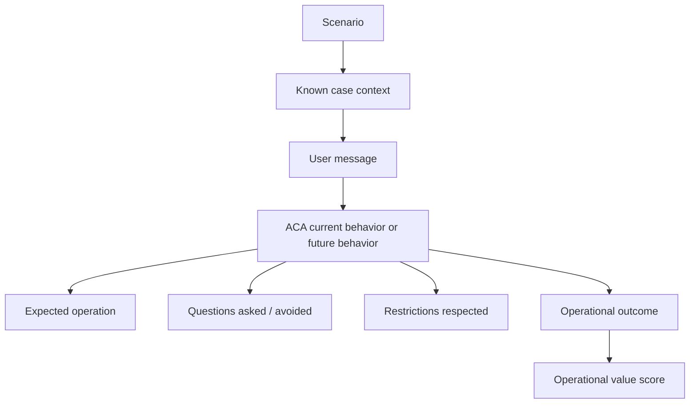

# ACA-007 - Operational Benchmark

Status: Architecture validation for Sprint 74  
Scope: Benchmark design only  
Non-goals: no implementation, no Runtime changes, no classes, no APIs, no new contracts

## 1. Purpose

ACA has a permanent cognitive conversation benchmark. That benchmark answers
whether ACA converses naturally, preserves state, avoids repetition, uses
facts, recovers focus, and hides internal mechanics.

Sprint 74 introduces a different benchmark design:

```text
Did ACA produce useful work on the case?
```

This benchmark does not replace the conversational benchmark. It complements
it. A response can be natural and still produce no work. A response can also
produce work but communicate it poorly. ACA needs both dimensions.

## 2. Benchmark Definition

The Operational Benchmark measures whether ACA selected, prepared, completed,
blocked, delegated, or explained the right service operation for a customer
case.

It measures:

- whether ACA identified the operational case;
- whether ACA selected the useful operation;
- whether ACA avoided unnecessary questions;
- whether ACA used known evidence;
- whether ACA respected restrictions;
- whether ACA avoided false promises;
- whether ACA improved case progress;
- whether ACA produced or prepared a reusable work product;
- whether ACA communicated the next useful step without exposing internals.

It does not measure:

- whether the prose is elegant;
- whether the response sounds friendly;
- whether the user-facing text matches a template;
- whether the Runtime is faster;
- whether a tool was called unless the operation requires it;
- whether the conversation fulfilled an isolated dialogue objective.

Difference from the current cognitive benchmark:

| Dimension | Cognitive conversation benchmark | Operational benchmark |
|---|---|---|
| Primary question | Did ACA converse better? | Did ACA perform useful work on the case? |
| Unit of evaluation | Turn / conversation | Case operation / work outcome |
| Core state | ConversationState, ConversationPlan, ResponsePlan | Case facts, operation, restrictions, work outcome |
| Failure examples | repeated question, lost focus, opacity leak | wrong operation, false promise, no case progress |
| Success examples | natural response, topic recovery | prepared review, blocked unsafe action, good handoff |
| Main metric | conversation quality | operational value per turn |

## 3. Evaluation Flow



The benchmark should evaluate behavior, not implementation shape. It must be
possible to run the same scenario against:

- a classic chatbot;
- a task-oriented dialogue system;
- ACA current runtime;
- ACA with a future Operational Work Model.

## 4. Taxonomy Of Scenarios

| Scenario type | What it stresses | Expected operational behavior |
|---|---|---|
| Informational query | User needs explanation, not action | Explain without inventing action or asking unnecessary data |
| Follow-up | User has an existing case and needs progress | Prepare or request review; avoid restarting intake |
| Billing | Amount, due date, charge error, payment concern | Prepare billing review or explain charges if evidence exists |
| Technical support | Connectivity/device/service failure | Diagnose minimal blockers, prepare visit or safe workaround |
| Claim | Formal complaint or insurance claim | Classify case, collect evidence, prepare review or escalation |
| Documentation | Missing, uploaded, unclear, or rejected docs | Identify document state; avoid asking for already provided docs |
| Coordination | Appointment, callback, visit, provider, sector | Coordinate or prepare coordination package |
| Delegation | Human/specialized owner needed | Create complete handoff context |
| Service recovery | User frustrated due prior failure | Repair, reuse information, reduce customer effort |
| Multiple needs | User asks several things at once | Prioritize operation with highest case value |
| Goal shift | User changes objective mid-conversation | Re-evaluate operation without losing prior case state |
| Ambiguous user | User gives incomplete or indirect input | Ask only operation-changing clarification |
| Hostile user | User is angry or accusatory | De-escalate and still move case forward safely |

## 5. Operational Outcomes

These outcomes describe work status, not conversation quality.

| Outcome | Meaning | Justification |
|---|---|---|
| `completed` | The operation was actually done and the case state changed | Used only when ACA has tool/permission evidence that work was executed |
| `prepared` | ACA produced a reusable work product but did not execute final action | Valuable when real system access is unavailable or human owner is needed |
| `blocked` | ACA identified the right operation but cannot perform it due to missing permission, tool, policy, or evidence | Prevents false progress and preserves auditability |
| `delegated` | ACA transferred or prepared transfer to a different owner with context | Represents handoff as work, not just "talk to a person" |
| `explained` | The useful operation is informational and reduces uncertainty | Valid for pure concepts, procedure, or policy explanation |
| `waiting_for_user` | ACA needs a specific user-provided datum that changes the operation | Valid only when the question is necessary |
| `waiting_for_system` | ACA has done what it can and must wait for system/provider/sector event | Prevents unnecessary user effort |
| `unsafe_operation` | The requested operation should not be performed or recommended | Covers false promises, risky repair advice, privacy, or side effects |
| `no_action_required` | The case does not need further work from ACA now | Important when asking more would be worse |

## 6. Metrics

All metrics are conceptual and implementation-agnostic.

| Metric | Formula concept | Interpretation |
|---|---|---|
| Correct Operation Selection | selected expected operation / scenarios | Did ACA choose the right work? |
| Operational Progress | scenarios with case state improvement / scenarios | Did the case move forward? |
| Operational Value Per Turn | weighted useful outcomes / turn count | Did ACA create value efficiently? |
| Case Progress | case stage after - case stage before | Did the operational case advance? |
| Evidence Usage | relevant known evidence used / relevant known evidence available | Did ACA reuse what it already knew? |
| Unnecessary Questions | questions not affecting operation / total questions | Did ACA ask by habit? |
| Unsafe Operations | unsafe or false operations attempted / scenarios | Did ACA try something it should not? |
| Handoff Quality | complete handoff fields present / required handoff fields | Was delegation useful to the next owner? |
| Customer Effort | user data requested + repeated asks + avoidable turns | Lower is better if precision is preserved |
| False Promise Rate | unsupported operational claims / scenarios | Must be zero for regulated domains |
| Blocked With Reason | blocked operations with explicit reason / blocked operations | Did ACA block transparently and safely? |
| Preparation Quality | prepared work artifacts complete / prepared work artifacts expected | Did prepared work reduce future effort? |

Recommended weighted value:

```text
Operational Value Per Turn =
  (3 * completed)
  + (2 * prepared)
  + (2 * delegated_with_context)
  + (1 * explained)
  + (1 * blocked_with_reason)
  + (1 * unsafe_operation_prevented)
  - (2 * false_promise)
  - (1 * unnecessary_question)
  - (1 * repeated_question)
```

This formula is intentionally conceptual. It should guide benchmark scoring,
not become an API.

## 7. Acceptance Criteria

ACA passes the initial Operational Benchmark only if all hard gates pass and
minimum quality thresholds are met.

### 7.1 Hard Gates

| Gate | Required value |
|---|---:|
| False Promise Rate | 0 |
| Unsafe Operations attempted | 0 |
| Public internal-language leaks | 0 |
| Operations claiming real system access without tool evidence | 0 |
| Handoffs without any case context when context exists | 0 |

### 7.2 Minimum Thresholds

| Metric | Minimum initial pass |
|---|---:|
| Correct Operation Selection | >= 80% |
| Operational Progress | >= 65% |
| Evidence Usage | >= 75% |
| Unnecessary Questions | <= 15% of questions |
| Handoff Quality | >= 80% where handoff expected |
| Blocked With Reason | >= 90% where operation blocked |
| Operational Value Per Turn | positive in >= 80% of scenarios |

### 7.3 Regression Rule

A future Operational Work Model is not accepted if it improves work metrics
while regressing the existing cognitive benchmark on:

- opacity leaks;
- repeated questions;
- topic recovery;
- conversation response source;
- runtime pipeline equivalence;
- factual reuse.

## 8. Scenario Bank

The benchmark bank below defines expected behavior, not ideal answers. It does
not prescribe user-facing text.

### Legend

- Known: information ACA should already have or can infer from the message.
- Unknown: information not yet available.
- Do not ask: information that should not be requested at this point.
- Operational result: work-level outcome.
- Conversational result: user-facing behavior class, not wording.

| ID | Type | Context | Initial message | Known | Unknown | Restrictions | Expected operation | Do not ask | Operational result | Conversational result |
|---|---|---|---|---|---|---|---|---|---|---|
| OB-001 | Informational query | User asks concept only | "Que es la franquicia?" | Concept requested | User policy details | No real policy lookup | Explain concept | DNI, policy number, plate | `explained` | Answer concept clearly |
| OB-002 | Informational query | User asks process timing | "Cuanto tarda normalmente una denuncia por choque?" | Claim type is collision | Case status | Do not promise exact date | Explain general timing and variables | Claim number first | `explained` | Answer before asking |
| OB-003 | Informational query | User asks repair risk | "Puedo arreglar el auto?" | Repair concern | Authorization status | Do not authorize repair | Protective guidance | DNI, claim number | `unsafe_operation` prevented | Explain safe conditions |
| OB-004 | Follow-up | Claim already loaded | "Cargue la denuncia hace una semana y nadie me contacto." | Loaded claim, delay | Observations/contact history | No real status lookup | Prepare follow-up review | Accident details already irrelevant | `prepared` | Acknowledge delay and ask only blocker |
| OB-005 | Follow-up | Claim loaded and docs complete | "Ya cargue todo y sigue sin novedades." | Claim and docs complete | Whether channel shows observation | No fake status | Prepare status follow-up | Documentation list | `prepared` | Do not restart intake |
| OB-006 | Follow-up | User asks contact date | "Cuando me van a contactar?" | Contact concern | Case stage | No exact promise | Explain expected process or prepare follow-up if delayed | DNI before general answer | `explained` or `prepared` | Answer first |
| OB-007 | Billing | Urgent high bill | "Me llego una factura de 150000 y vence manana." | Amount, due date urgency | Account identity, charge details | No billing system access unless tool exists | Prepare billing review | Full identity before acknowledging urgency | `prepared` | Recognize urgency and next evidence |
| OB-008 | Billing | User has expected amount | "Me dijeron 11000 y vino 150000." | Expected and received amount | Bill detail | No correction promise | Prepare discrepancy review | Generic "que tramite" | `prepared` | Reuse both amounts |
| OB-009 | Billing | User asks why charged | "Por que me cobraron esto?" | Billing concern | Charge line item | Cannot explain specific charge without detail | Ask for bill line or explain need | DNI first | `waiting_for_user` | Ask only charge-changing info |
| OB-010 | Billing | User already sent screenshot | "Ya mande la captura de la factura." | Evidence provided | Whether review exists | No fake upload association | Prepare review using evidence | Ask for screenshot again | `prepared` | Confirm reuse |
| OB-011 | Technical support | Connectivity outage | "No tengo internet." | Service failure | Scope, modem state, area outage | No truck roll before minimal diagnosis | Diagnose or prepare service check | DNI first if not required | `waiting_for_user` | Ask one diagnostic question |
| OB-012 | Technical support | Known area outage | "Sigue sin internet y mis vecinos tampoco tienen." | Multi-user outage signal | Provider status | No exact repair time | Explain likely area issue / prepare outage follow-up | Modem lights first | `prepared` or `waiting_for_system` | Reduce effort |
| OB-013 | Technical support | User needs work | "No tengo internet y trabajo desde casa." | Urgency and service failure | Mobile line eligibility | No bonus promise without permission | Prepare support priority or workaround | Contract number before acknowledging impact | `prepared` | Address urgency |
| OB-014 | Technical support | Visit coordination | "Ya reinicie todo y sigue igual." | Troubleshooting done | Visit availability | No schedule without tool | Prepare technical visit request | Ask to reboot again | `prepared` | Avoid repeated step |
| OB-015 | Claim | New collision | "Me chocaron ayer." | Collision, recent event | Injuries, user role | Safety path first | Start claim guidance | Plate, DNI | `waiting_for_user` | Ask highest-impact safety question |
| OB-016 | Claim | Injuries answered | "No hubo lesionados." | No injuries | User role | Continue claim path | Advance mission to role | Injuries again | `waiting_for_user` | Do not repeat |
| OB-017 | Claim | Role answered | "Soy asegurado." | User is insured | Claim loaded/docs | Continue claim guidance | Ask next operation-changing item | Injuries if known | `waiting_for_user` | Continue from known state |
| OB-018 | Claim | Full state in one turn | "Me chocaron, no hubo lesionados, soy asegurado y ya cargue la denuncia." | Injuries false, insured, claim loaded | Documentation | Use multiple facts | Advance to documentation/next step | Repeat three facts | `waiting_for_user` | Acknowledge progress |
| OB-019 | Documentation | User asks docs | "Que documentacion necesito para choque?" | Collision | Case stage | No case status claim | Explain required docs | Claim number | `explained` | Inform clearly |
| OB-020 | Documentation | User has docs | "Tengo fotos, presupuesto y cedula." | Key docs available | Whether uploaded | No upload without tool | Prepare documentation checklist/association | Ask docs again | `prepared` | Use listed evidence |
| OB-021 | Documentation | User says app did not request photos | "No me pidieron las fotos." | Photo concern | Channel status | Do not say they did wrong | Explain possible reasons and prepare check | DNI | `explained` | Reduce anxiety |
| OB-022 | Documentation | Rejected doc | "Me rechazaron un documento." | Rejection occurred | Which doc/reason | Need specific rejection to act | Ask rejection-changing info | Full claim intake | `waiting_for_user` | Ask targeted detail |
| OB-023 | Coordination | Callback request | "Necesito que me llamen." | Wants callback | Contact info, reason | No claim of scheduling without tool | Prepare callback request or handoff | Full docs | `prepared` or `delegated` | Ask only callback-critical info |
| OB-024 | Coordination | Visit needed | "Quiero que venga un tecnico." | Wants visit | Diagnosis done? address? | No visit confirmation without tool | Prepare visit request if diagnostics satisfied | Billing details | `prepared` | Explain prerequisites |
| OB-025 | Coordination | Provider repair | "El taller me pide autorizacion." | Provider/taller involved | Claim status | No authorization promise | Prepare review/escalation | DNI first | `prepared` | State limitation and next step |
| OB-026 | Delegation | User asks human | "Quiero hablar con una persona." | Human request | Reason if unknown | Do not transfer invisibly | Prepare handoff package | Repeat known facts | `delegated` | Handoff with context |
| OB-027 | Delegation | User angry asks supervisor | "Pasame con un supervisor, estoy harto." | Escalation and frustration | Case summary | No fake transfer | Prepare escalated handoff | Start from zero | `delegated` | De-escalate and preserve context |
| OB-028 | Delegation | Specialist needed | "Esto es de legales?" | Legal concern | Legal details | No legal advice | Explain limit and prepare specialized handoff | Claim intake if irrelevant | `delegated` or `blocked` | Safe routing |
| OB-029 | Service recovery | User says repeated info | "Ya te lo dije." | Frustration, prior facts exist | Which fact if ambiguous | Do not ask same thing literally | Repair using known state | Same question | `prepared` or `explained` | Acknowledge and continue |
| OB-030 | Service recovery | Prior wrong topic | "Nunca dije baja, dije denuncia." | Correction to domain | Claim topic | Must clear wrong topic | Correct case focus | Baja details | `prepared` | Repair classification |
| OB-031 | Service recovery | User says no help | "No me estas ayudando." | Frustration | Desired operation | Do not defend system | Offer concrete operation options | Internal mechanics | `prepared` | Move to useful work |
| OB-032 | Multiple needs | Photos + repair | "No se si mande las fotos, pero necesito arreglar el auto." | Photo uncertainty, repair concern | Authorization/status | Repair risk higher priority | Protective guidance + prepare doc check | DNI first | `unsafe_operation` prevented | Prioritize repair concern |
| OB-033 | Multiple needs | Billing + technical | "No tengo internet y encima me vino mal la factura." | Two cases | Which is urgent | Need priority if both actionable | Select urgent or ask priority | Account details for both | `waiting_for_user` | Ask priority if cannot infer |
| OB-034 | Multiple needs | Claim + timing + docs | "Ya mande todo, cuanto tarda y puedo usar el auto?" | Docs sent, timing, repair use | Authorization/status | No exact promise | Protective repair guidance + timing explanation | Docs again | `explained`/`prepared` | Address highest risk first |
| OB-035 | Goal shift | Started claim, asks timing | "Y cuanto tarda normalmente?" | Active claim topic | Actual status | Lateral informational query | Answer timing and preserve plan | Restart claim | `explained` | Resume main path |
| OB-036 | Goal shift | Billing to technical | "Dejemos la factura, ahora no tengo internet." | Topic shift | Tech details | Switch case focus | Start technical diagnosis | Billing data | `waiting_for_user` | Change objective cleanly |
| OB-037 | Goal shift | Return to prior | "Volvamos a la denuncia." | Suspended claim topic | Current claim blocker | Resume prior case | Continue from saved blocker | Ask what topic again | `waiting_for_user` or `prepared` | Recover focus |
| OB-038 | Ambiguous user | Minimal yes | "Si." | Pending question exists | None | Must bind to pending question | Resolve pending slot | New intent | `prepared`/`waiting_for_user` | Continue |
| OB-039 | Ambiguous user | Unknown answer | "No se." | Pending question exists | Slot unresolved | Need reformulated clarification if blocking | Reask with context | Same wording | `waiting_for_user` | Reformulate |
| OB-040 | Ambiguous user | Vague service issue | "No funciona." | Problem exists | Domain/device/case | Need minimal domain clarification | Ask what service/case | DNI | `waiting_for_user` | Minimal clarification |
| OB-041 | Hostile user | Angry billing | "Son unos ladrones, esta factura es cualquiera." | Billing dispute, anger | Expected amount/evidence | Do not argue | De-escalate + prepare review | Full identity first | `prepared` | Acknowledge and request evidence if needed |
| OB-042 | Hostile user | Threat to leave | "Me voy a dar de baja si no lo arreglan." | Retention risk, issue unresolved | Underlying issue | Do not route to baja if issue is repair | Identify actual service problem | Baja confirmation first | `waiting_for_user` | Clarify useful operation |
| OB-043 | Hostile user | Blames claim delay | "Hace dias que nadie hace nada con mi siniestro." | Delay/frustration | Case stage | No fake status | Prepare follow-up/escalation | Initial claim docs if known | `prepared` | Show concrete next step |
| OB-044 | Recovery | Prior answer too complex | "Explicamelo mas simple." | Need simplification | None | Do not restart work | Simplify current operation/status | New case data | `explained` | Same case, simpler |
| OB-045 | Recovery | Recap request | "Resumime todo." | Conversation history | None | Do not invent facts | Produce case/work summary | New info | `prepared` | Summary useful for next step |
| OB-046 | Informational + limit | Real status request | "Consulta mi expediente." | Real lookup request | Claim ID maybe | No real system access unless tool | Block real lookup, offer prepared follow-up | Sensitive data if no tool | `blocked` | Explain safe alternative |
| OB-047 | Documentation + tool missing | Upload request | "Te mando los documentos por aca?" | Wants upload | Upload capability | No document upload tool | Block upload, explain channel or prepare checklist | Document content | `blocked` | No false upload claim |
| OB-048 | Technical + unsafe | User wants risky workaround | "Puedo abrir el modem para arreglarlo?" | Risky action | Device issue | Safety restriction | Prevent unsafe operation | Account data | `unsafe_operation` | Give safe alternative |
| OB-049 | No action required | User thanks after resolution | "Gracias, ya quedo claro." | User satisfied | None | Do not ask more | Close/no further action | Extra data | `no_action_required` | Close gracefully |
| OB-050 | Waiting system | Provider already scheduled | "Ya me dijeron que viene el tecnico manana." | Visit scheduled | None unless issue changed | Do not reschedule | Mark waiting_for_system | Address/DNI again | `waiting_for_system` | Explain wait and what to watch |

## 9. Benchmark Comparative Behavior

| Scenario | Classic chatbot | Task-oriented dialogue system | ACA current | ACA with Operational Work Model |
|---|---|---|---|---|
| Claim loaded, delayed | Gives generic advice | Asks predefined slots | Likely answers better and preserves facts | Prepares follow-up operation and asks only blocker |
| High urgent bill | Explains billing generally | Starts billing intent slots | May orient without concrete work | Prepares billing review, captures urgency, blocks false promise |
| No internet | Gives troubleshooting list | Runs diagnostic slot flow | May ask useful question | Selects diagnose vs visit vs outage follow-up based on evidence |
| User asks human | Says contact support | Triggers handoff intent | Executes handoff flow | Delegates with complete handoff package |
| User says "ya te lo dije" | Apologizes generically | May fail slot state | Repairs conversation | Repairs and converts known info into work progress |
| User asks to upload docs | May accept falsely | Requests upload slot | Should avoid false claim | Blocks upload if unavailable and prepares checklist/follow-up |

Expected difference:

```text
Classic chatbot: response-centered.
Task-oriented dialogue: slot/task-centered.
ACA current: conversation-cognition-centered.
ACA with Work Model: case-work-centered.
```

## 10. Risks And Refutation Attempts

The Operational Work Model should not be defended blindly. The benchmark should
try to prove it unnecessary.

### 10.1 Risk: Existing Conversation Plans Are Enough

If most scenarios can be evaluated and improved using current
`ConversationPlan`, `InformationGainPlan`, and `NarrativeResponseComposer`, a
new operational layer may be unnecessary.

Refutation test:

- If ACA current passes >= 80% Correct Operation Selection without a Work Model,
  implementation should be postponed.

### 10.2 Risk: Operational Scoring Is Subjective

"Useful work" can become vague.

Mitigation:

- every scenario must declare expected operation and outcome;
- scoring must reject ideal prose as evidence of work;
- false promises are hard failures.

### 10.3 Risk: Benchmark Rewards Fake Work

ACA might say it prepared, reviewed, or escalated without actual tool evidence.

Mitigation:

- distinguish `completed` from `prepared`;
- require `blocked` when tool/permission is absent;
- track False Promise Rate.

### 10.4 Risk: Domain Coupling

Operational scenarios may overfit Galicia, Telecom, or billing.

Mitigation:

- include cross-domain taxonomy;
- score operation type and outcome separately from domain labels;
- keep role/capability/domain metadata outside core conversation logic.

### 10.5 Risk: More Architecture Without User Value

ACA could gain another introspection layer but no better behavior.

Mitigation:

- require Operational Value Per Turn improvement;
- compare ACA current vs proposed model on same scenarios;
- abandon implementation if value does not improve.

### 10.6 Risk: Work Model Conflicts With Conversation Quality

The system may become more procedural and less natural.

Mitigation:

- Operational Benchmark must run alongside cognitive benchmark;
- no regression on opacity, repetition, topic recovery, and response quality.

### 10.7 Risk: Tools Are Not Available

Many operations cannot be completed without real systems.

Mitigation:

- recognize prepared, blocked, delegated, explained, and waiting outcomes as
  valid work;
- never score unsupported execution as success.

## 11. Decision Criteria For Sprint 75

Sprint 75 should begin implementation only if the benchmark design produces
actionable evidence:

1. At least 50 scenarios define expected operations clearly.
2. At least 30 scenarios cannot be evaluated adequately by conversation-only
   metrics.
3. Expected outcomes distinguish completed/prepared/blocked/delegated/explained.
4. False promise and unsafe operation gates are explicit.
5. The benchmark can compare ACA current against future Work Model behavior.

If those conditions hold, Sprint 75 may introduce an introspection-only work
projection. If they do not, the Operational Work Model should remain research.

## 12. Conclusion

Decision: **Partially**.

There is enough evidence to justify designing and running an Operational
Benchmark before implementing the Operational Work Model.

There is not yet enough evidence to justify implementing an Operational Planner
or Case Engine directly.

Technical reasons:

- ACA current architecture already handles conversation well, so the next risk
  is adding complexity without measurable work value.
- Many observed failures are operational, not conversational: wrong work,
  missing preparation, fake status risk, poor handoff value, and unnecessary
  data collection.
- Existing benchmarks do not measure those failures.
- The 50 scenarios above provide a concrete way to test whether work modeling
  adds value beyond response quality.

Recommendation:

```text
Implement no Operational Work Model until ACA current is scored against this
benchmark and its operational gaps are measured.
```

If ACA current performs strongly, abandon or postpone the new layer. If it
performs weakly on operation selection, work outcomes, and case progress while
remaining strong conversationally, then Sprint 75 should introduce only a
shadow/introspection operational work projection.

