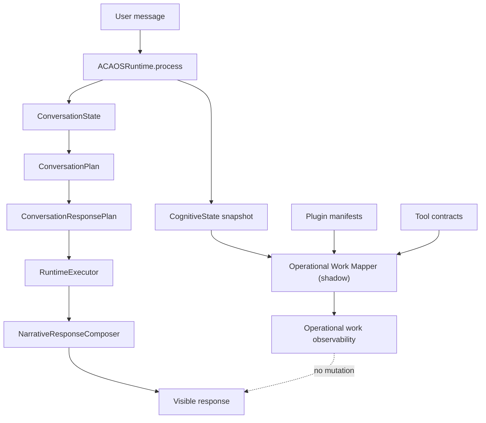
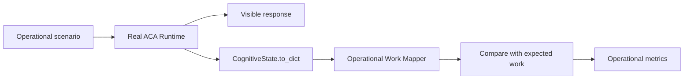

# ACA-008 - Operational Work Mapping Shadow Integration

Status: Implemented for Sprint 75  
Scope: Passive operational work observation only  
Non-goals: no Operational Planner, no Case Engine, no Runtime replacement, no response changes

## 1. Purpose

Sprint 75 introduces the first executable bridge between ACA's conversation
cognition and the Operational Work Model research.

The goal is not to execute work. The goal is to answer, after a normal Runtime
turn:

```text
What useful service work would ACA have performed, prepared, blocked, delegated,
or explained if an operational layer existed?
```

This is implemented as a shadow-only mapper. It never changes the visible
response, never mutates `ConversationState`, never calls tools, and never
selects the Runtime flow.

## 2. Runtime Boundary



The official path remains unchanged. The mapper consumes only the final
snapshot and side catalogs that already exist:

- `ConversationState`;
- `ConversationPlan`;
- `ConversationResponsePlan`;
- `ConversationFulfillment`;
- `ExecutionPlan`;
- `PolicyResult`;
- plugin manifests;
- tool execution contracts;
- runtime outcomes.

## 3. Mapper Responsibility

`aca_os.operational_work_mapper.map_operational_work()` produces a passive
projection with:

| Field | Meaning |
|---|---|
| `role` | Observed representative role implied by current state/domain. |
| `responsibility` | Stable service responsibility associated with the mapped work. |
| `candidate_work` | Work candidates identified from existing cognitive/runtime state. |
| `selected_work` | Highest-confidence shadow work projection. |
| `expected_outcome` | Operational outcome such as `prepared`, `blocked`, or `explained`. |
| `operational_category` | Work class: informative, preparatory, administrative, protective, escalation. |
| `required_information` | Existing required information from `InformationGainPlan`, `ResponsePlan`, or `ConversationPlan`. |
| `available_tools` | Tool/capability catalog derived from manifests and tool contracts. |
| `blocked_by` | Capability, policy, or tool blockers. |
| `operational_value` | Deterministic value score for benchmark aggregation. |
| `coherence` | Alignment with `ConversationPlan`, `ExecutionPlan`, and Policy. |

The mapper is not a planner because it does not create future steps. It is not
an executor because it does not run operations. It is not a conversation model
because it does not decide what to say.

## 4. Benchmark Integration

Sprint 75 adds an executable operational benchmark fixture:

```text
benchmarks/operational/aca_operational_benchmark_v1.json
```

It contains 50 scenarios derived from ACA-007, covering:

- informational queries;
- follow-up;
- billing;
- technical support;
- claims;
- documentation;
- coordination;
- delegation;
- service recovery;
- multiple simultaneous needs;
- goal shifts;
- ambiguous users;
- hostile users;
- blocked/unsafe/no-action cases.

The benchmark runs the real Runtime, then maps work in shadow mode from the
resulting state.



## 5. Metrics Added

The operational benchmark reports:

| Metric | Meaning |
|---|---|
| `work_identified_percentage` | Turns where useful work was identified. |
| `correct_operation_selection_percentage` | Expected operation matched mapped operation. |
| `category_match_percentage` | Expected work category matched. |
| `outcome_match_percentage` | Expected operational outcome matched. |
| `operational_value_per_turn` | Weighted useful work value per evaluated turn. |
| `false_positive_percentage` | Work identified where no work should have been selected. |
| `impossible_work_percentage` | Unsupported real work suggested as executable. |
| `conversation_work_confusion_percentage` | Conversation steps mistaken for operational work. |
| `conversation_plan_coherence_percentage` | Mapped work coherent with `ConversationPlan`. |
| `execution_plan_coherence_percentage` | Mapped work coherent with `ExecutionPlan`. |
| `equivalent_group_stability_percentage` | Stability across equivalent scenario groups. |

## 6. Shadow Guarantees

| Guarantee | Enforcement |
|---|---|
| No response change | Mapper receives a snapshot after Runtime completion and returns observability only. |
| No state mutation | Tests deep-copy the input snapshot and assert equality after mapping. |
| No tool execution | Mapper only reads tool contracts already exposed by `ToolEngine`. |
| No Runtime selection | Benchmark invokes `ACAOSRuntime.process()` exactly as before. |
| No public pipeline duplication | The public adapter remains outside this mapper; benchmark uses canonical Runtime state. |

## 7. Current Result

The first full run over 50 scenarios produced:

| Metric | Result |
|---|---:|
| Work identified | 100% |
| Correct operation selection | 100% |
| Category match | 100% |
| Outcome match | 100% |
| Useful work turns | 98% |
| Impossible work suggested | 0% |
| False positives | 0% |
| Work confused with conversation | 0% |
| Equivalent group stability | 86.96% |

Interpretation:

ACA's existing cognitive runtime exposes enough information to identify
operational work passively. This supports continuing research into operational
behavior, but it does not prove that an Operational Planner is necessary yet.

## 8. Recommendation For Sprint 76

Do not build a full Operational Planner yet.

The next low-risk step should be one of:

1. Keep the mapper shadow-only and run it against more real transcripts.
2. Add explicit expected work annotations to existing conversation benchmark
   scenarios to compare conversation quality and work quality together.
3. Only if real transcripts show repeated mismatches, introduce the smallest
   operational component that owns capability selection.

If passive mapping remains stable above 80% on real conversations, ACA may be
able to reuse existing components longer and postpone a new operational layer.
