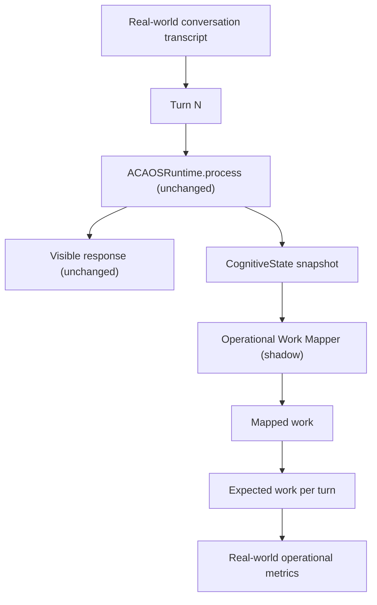

# ACA-009 - Operational Validation On Real Conversations

Status: Sprint 76 validation  
Scope: Shadow benchmark over real development conversations  
Non-goals: no Runtime integration, no Operational Planner, no Case Engine, no response changes

Note: Sprint 77 expands the same benchmark file with candidate-work breadth
scenarios. The Sprint 76 baseline below is preserved as historical validation;
see `ACA-010_Candidate_Work_Model.md` for current corpus size and metrics.

## 1. Purpose

Sprint 75 proved that `OperationalWorkMapper` can map useful work on a
synthetic operational benchmark.

Sprint 76 validates a harder question:

```text
Does the mapper stay coherent when users behave like real users?
```

The validation corpus uses:

- existing cognitive benchmark conversations;
- historical public/runtime regression conversations;
- roleplay cases used during ACA development.

It intentionally includes ambiguity, corrections, mixed needs, lateral
questions, topic changes, closure, blocked operations, and long conversations.

## 2. Flow Under Test



No Runtime path changed. The mapper still runs only after the Runtime has
finished a turn.

## 3. Dataset

File:

```text
benchmarks/operational/aca_operational_real_world_benchmark_v1.json
```

Coverage:

| Metric | Value |
|---|---:|
| Conversations | 16 |
| Turns | 52 |
| Sources from existing conversation benchmark | 14 |
| Historical roleplay groups | 2 |

Conversation groups:

| ID | Source | Focus |
|---|---|---|
| RW-001 | `denuncia_basica_sin_lesionados` | claim intake progression |
| RW-002 | `conversacion_larga_denuncia` | long conversation, correction, recap, resume |
| RW-003 | `cambio_tema_y_vuelta_denuncia` | topic shift and return |
| RW-004 | `interrupcion_lateral_tiempos` | lateral timing question |
| RW-005 | `correccion_lesionados` | contradiction / correction |
| RW-006 | `respuesta_parcial` | partial answer and uncertainty |
| RW-007 | `narrativa_recupera_ya_te_lo_dije` | repeated information complaint |
| RW-008 | `correccion_nunca_dije_baja` | lexical collision regression |
| RW-009 | `cambio_dominio_factura_a_siniestro` | billing to claim domain shift |
| RW-010 | historical Sprint 76 roleplay | mixed billing + internet + handoff |
| RW-011 | historical Sprint 76 roleplay | blocked operations and closure |
| RW-012 | `usuario_ansioso_auto_para_trabajar` | implicit repair concern |
| RW-013 | `recapitulacion` | recap after claim progress |
| RW-014 | `documentacion_pendiente` | documentation uncertainty |
| RW-015 | `consulta_cleas` | concept explanation and deepening |
| RW-016 | `prioridad_fotos_vs_reparacion` | mixed documentation + repair concern |

## 4. Metrics

Sprint 76 adds these real-world metrics:

| Metric | Meaning |
|---|---|
| Work Transition Accuracy | Whether mapped work changes/persists/resumes as expected between turns. |
| Multi-Work Detection | Whether candidate work includes expected secondary operations in mixed-need turns. |
| Work Persistence Error | Whether the mapper incorrectly keeps previous work when the user shifted. |
| Work Abandonment Accuracy | Whether abandoned work is actually left behind when the user changes objective. |
| Mixed Intent Handling | Whether mixed-need turns select the primary work and preserve secondary work. |
| Operational Drift | Turn-level mismatch between expected and mapped primary operation. |
| Operational Stability Across Turns | Stability on turns expected to continue the same work. |

## 5. Result

Command:

```text
python tools/aca_cli.py operational-real-world-benchmark --format json
```

Observed result:

| Metric | Value |
|---|---:|
| Correct Operation Selection | 98.08% |
| Category Match | 98.08% |
| Outcome Match | 98.08% |
| Work Transition Accuracy | 100% |
| Work Persistence Errors | 0 |
| Work Abandonment Accuracy | 100% |
| Operational Stability Across Turns | 100% |
| Operational Drift | 1 turn / 1.92% |
| Multi-Work Detection | 0% |
| Mixed Intent Handling | 0% |

## 6. Error Analysis

Errors detected:

| Error type | Count | Meaning |
|---|---:|---|
| `multi_work_not_detected` | 5 | The mapper selected the main work but did not preserve expected secondary work candidates. |
| `operational_drift` | 1 | The mapper treated an indirect repair concern as generic explanation. |

### 6.1 Correct Work Changes

The mapper changed work correctly in:

- billing to claim: `prepare_billing_review` -> `prepare_claim_follow_up`;
- lateral timing to claim resume: `explain_domain_concept` -> `collect_claim_blocker`;
- blocked lookup to blocked upload to close: `block_real_status_lookup` -> `block_document_upload` -> `close_case_no_action`;
- technical diagnosis to visit to handoff: `diagnose_connectivity_issue` -> `prepare_technical_visit` -> `prepare_handoff`.

### 6.2 Incorrect Persistence

No persistence errors were observed. The mapper did not keep an old operation
when the benchmark expected a shift.

### 6.3 Multi-Work Weakness

The main weakness is not primary work selection. It is candidate breadth.

Examples:

| Conversation | User turn | Expected secondary work | Mapper candidate list |
|---|---|---|---|
| RW-010 | "No tengo internet y encima me vino mal la factura." | `diagnose_connectivity_issue`, `prepare_billing_review` | `continue_conversation_plan`, `collect_missing_information` |
| RW-016 | "No se si mande las fotos... pero lo que mas me preocupa es si puedo arreglar el auto." | `prepare_documentation_review` | `provide_repair_risk_guidance`, `collect_missing_information` |
| RW-008 | "Ayer cargue una denuncia... necesito el auto para trabajar..." | `provide_repair_risk_guidance` | `prepare_claim_follow_up`, `collect_missing_information` |

This means the mapper can usually pick the primary work, but it does not yet
represent parallel or secondary work with enough fidelity.

### 6.4 Indirect Repair Concern Drift

RW-012 exposed one real drift:

```text
Estoy bastante nervioso, necesito el auto para trabajar y no se si puedo tocarlo antes de que me respondan.
```

Expected:

```text
provide_repair_risk_guidance
```

Mapped:

```text
explain_domain_concept
```

The phrase "tocarlo antes de que me respondan" carries the same operational
meaning as "repararlo antes de autorizacion", but the mapper does not yet
generalize that indirect expression.

## 7. Answers Required By Sprint 76

### 1. Does the Work Mapper remain correct outside the synthetic benchmark?

**Parcialmente.**

Evidence:

- primary operation selection remains high: 98.08%;
- transition behavior remains strong: 100%;
- no incorrect work persistence was observed;
- but multi-work detection is 0%.

The mapper is reliable as a primary work observer. It is not reliable yet as a
complete work candidate model.

### 2. What real errors were detected?

- Five multi-work misses.
- One indirect-concern drift around repair authorization.
- No persistence errors.
- No abandonment errors.
- No Runtime or response regressions.

### 3. Does the current model need conceptual modifications?

**Yes, but not a Planner.**

The missing concept is not execution. It is richer passive candidate
representation:

- primary work;
- secondary work;
- suspended work;
- abandoned work;
- evidence for ordering work candidates.

This can still live inside the mapper in shadow mode. It does not justify
moving work selection into the Runtime yet.

### 4. Is Shadow Mapping still sufficient?

**Yes.**

Shadow mode is still sufficient because:

- primary mapping is strong;
- transition mapping is strong;
- the failures are observational breadth issues;
- no evidence shows that executing work would improve the current weakness.

### 5. Is there enough evidence to begin Sprint 77?

**Parcialmente.**

There is enough evidence for a Sprint 77 focused on improving shadow candidate
work breadth and mixed-intent detection.

There is not enough evidence to begin a Sprint 77 that introduces an
Operational Planner, Case Engine, or Runtime-integrated operational execution.

## 8. Recommendation

Do not implement an Operational Planner next.

Recommended Sprint 77:

```text
Operational Candidate Work Breadth & Mixed-Need Mapping
```

Goal:

- keep mapper in shadow mode;
- improve secondary candidate work detection;
- preserve primary work accuracy;
- keep Runtime and responses unchanged;
- rerun both operational benchmarks and the cognitive benchmark.

Acceptance target before considering operational execution:

| Metric | Target |
|---|---:|
| Correct Operation Selection | >= 95% |
| Work Transition Accuracy | >= 95% |
| Multi-Work Detection | >= 70% |
| Work Persistence Errors | 0 |
| Operational Drift | <= 3% |

Until multi-work detection improves, executing an operational model would risk
dropping secondary user needs even when the primary work is correct.
