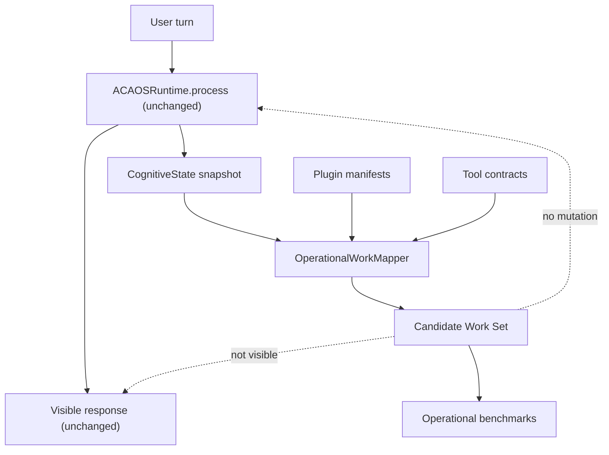
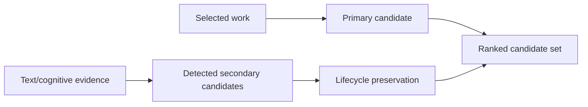

# ACA-010 - Candidate Work Model

Status: Sprint 77 implemented in Shadow Mode  
Scope: Operational Work Mapper breadth and mixed-need mapping  
Non-goals: no Runtime integration, no Operational Planner, no Case Engine, no visible response changes

## 1. Purpose

Sprint 76 validated that the `OperationalWorkMapper` can identify the dominant
work of a turn with high stability on real conversations. Its main weakness was
breadth: when the user expressed more than one need, the mapper often preserved
only the dominant work.

That is not how a strong representative works. A representative may decide what
to handle first, but they do not forget the rest of the customer's work. They
keep secondary, blocked, suspended, recovered, or completed work visible until it
is resolved or explicitly abandoned.

Sprint 77 therefore changes the mapper from:

```text
one mapped work
```

to:

```text
ordered candidate work set
```

The change is still passive. It does not execute, plan, ask, route, or modify
the user's response.

## 2. Why Single Work Was Insufficient

The single-work model was adequate for conversations like:

```text
User: "Cargue una denuncia y nadie me contacto."
Work: prepare_claim_follow_up
```

It was not adequate for mixed needs:

```text
User: "No tengo internet y ademas la factura vino mal."
Work 1: continue_conversation_plan
Work 2: diagnose_connectivity_issue
Work 3: prepare_billing_review
```

The old model could be correct about the primary work while still losing
operational value. Losing secondary work creates future risk:

- the next turn may appear as a new conversation;
- a suspended issue may not be recoverable;
- benchmark precision can look good while real customer effort remains high;
- an eventual operational layer would execute a narrow view of the case.

## 3. Shadow Architecture



The mapper consumes only existing state:

- `ConversationState`;
- `ConversationPlan`;
- `ConversationResponsePlan`;
- `ConversationFulfillment`;
- `ExecutionPlan`;
- Policy result;
- plugin manifests;
- tool contracts;
- runtime outcomes.

No new cognitive contract was introduced.

## 4. Candidate Work Shape

Each candidate now exposes the operational information needed for observability:

| Field | Meaning |
|---|---|
| `operation` | Work the representative would consider. |
| `category` | Administrative, preparatory, informative, protective, escalation, or none. |
| `expected_outcome` | `prepared`, `blocked`, `delegated`, `explained`, `waiting_for_user`, etc. |
| `rank` | Position in the ordered candidate set. |
| `priority` | Deterministic priority score used for ordering. |
| `status` | `pending`, `blocked`, `suspended`, `completed`, etc. |
| `work_role` | `primary`, `secondary`, `suspended`, `recovered`, `completed`, or `discarded`. |
| `evidence` | Markers or cognitive state evidence that justified the candidate. |
| `confidence` | Deterministic confidence in the candidate projection. |
| `dependency` | Required information or condition, when known. |
| `selection_reason` | Why the candidate was included or ranked. |
| `blocked_by` | Capability, policy, or missing-tool blockers. |
| `suspension_reason` | Why the work was suspended, when applicable. |
| `discard_reason` | Why the work was discarded, when applicable. |

The existing top-level `selected_work` remains for compatibility. It points to
the first ranked candidate, but it is no longer the only observable work.

## 5. Candidate Lifecycle Roles

| Role | Meaning | Example |
|---|---|---|
| `primary` | Dominant work for the current turn. | User needs repair risk guidance now. |
| `secondary` | Relevant work that should remain visible but not necessarily first. | User also mentioned photos. |
| `suspended` | User explicitly deferred the work. | "Dejemos la factura." |
| `recovered` | User explicitly returned to previous work. | "Volvamos a la denuncia." |
| `completed` | User indicates no further work is needed for that item. | "Listo, ya quedo claro." |
| `discarded` | Work is no longer applicable. | Reserved for future explicit abandonment cases. |

These roles are observational. They do not change `ConversationState`, do not
update `ConversationPlan`, and do not alter the response.

## 6. Ranking Rules

Ranking is deterministic and intentionally simple:

1. Keep the mapper's dominant work as rank 1 for compatibility.
2. Preserve lifecycle roles when deduplicating candidates. A suspended candidate
   must not be overwritten by a generic secondary candidate for the same work.
3. Sort non-primary work by lifecycle role and priority.
4. Prefer protective and blocked work visibility over low-value informational
   side work.



## 7. Benchmark Changes

The real-world benchmark was expanded:

| Metric | Previous | Sprint 77 |
|---|---:|---:|
| Conversations | 16 | 56 |
| Turns | 52 | 92 |
| Mixed-work scored turns | 5 | 37 |
| Candidate operations scored | n/a | 150 |

New scenario groups include:

- multiple simultaneous problems;
- changing priorities;
- recurring work;
- dependent work;
- incompatible or blocked work;
- suspended work;
- completed work that should not disappear from audit;
- work that becomes secondary after another issue is prioritized.

## 8. New Metrics

| Metric | Meaning |
|---|---|
| Candidate Work Recall | Expected candidate operations found / expected candidate operations. |
| Candidate Work Precision | Matched candidate operations / all emitted candidate operations. |
| Work Ranking Accuracy | Rank 1 candidate matches expected primary operation. |
| Secondary Work Detection | Expected secondary work appears in candidates. |
| Suspended Work Accuracy | Expected suspended work appears with suspended role/status. |
| Recovered Work Accuracy | Expected recovered work appears with recovered role/status. |
| Candidate Stability | Candidate set remains stable when the conversation continues/resumes. |
| Priority Consistency | Candidate priorities are ordered consistently. |

The legacy `multi_work_detection_percentage` remains as a compatibility alias
for secondary work detection.

## 9. Observed Results

Command:

```text
python tools/aca_cli.py operational-real-world-benchmark --format json
```

Observed Sprint 77 real-world result:

| Metric | Value |
|---|---:|
| Correct Operation Selection | 98.91% |
| Category Match | 100% |
| Outcome Match | 100% |
| Work Transition Accuracy | 100% |
| Multi-Work Detection | 100% |
| Candidate Work Recall | 100% |
| Candidate Work Precision | 92.02% |
| Work Ranking Accuracy | 98.91% |
| Secondary Work Detection | 100% |
| Suspended Work Accuracy | 100% |
| Recovered Work Accuracy | 100% |
| Priority Consistency | 100% |
| Operational Drift | 1 turn / 1.09% |

The remaining ranking drift is informative:

```text
User: "Listo, la denuncia ya quedo cargada, pero no se si faltan documentos."
Expected primary: prepare_documentation_review
Mapped primary: prepare_claim_follow_up
Candidate set: prepare_claim_follow_up, prepare_documentation_review, close_case_no_action
```

The candidate set contains the right work, but the rank still overweights
claim-follow-up markers when the user mentions a completed claim and a
documentation uncertainty in the same sentence. This should remain visible as a
ranking limitation rather than be hidden by changing the visible Runtime.

## 10. Why This Avoids an Operational Planner

The Candidate Work Model does not decide what ACA should do next. It only shows
what work is present in the already-executed turn.

That matters architecturally:

- `ConversationPlan` remains the conversation path.
- `ConversationResponsePlan` remains the response organization.
- `RuntimeExecutor` remains the execution engine.
- `NarrativeResponseComposer` remains the verbalization layer.
- `OperationalWorkMapper` remains a shadow projection.

No component gained operational authority.

## 11. Evidence-Based Conclusion

The mapper now represents substantially more of the work that a strong
representative would keep in mind:

- primary work is still accurate;
- secondary work is no longer dropped;
- suspended and recovered work are visible;
- blocked capabilities remain auditable;
- mixed turns can be evaluated without changing the response.

This reduces the immediate need for an `OperationalPlanner`. The current
Runtime already exposes enough cognitive state to identify most operational work
passively. The stronger next step is not execution. It is improving ranking and
case-state evidence for the small set of turns where the right work exists but
is not ranked first.

## 12. Recommendation

Do not introduce an Operational Planner yet.

The next architectural bottleneck is operational ranking and case-state
disambiguation, not operational execution. A planner would add authority before
the framework has proved that ranked candidate work is stable under longer,
messier conversations.

Recommended next work:

1. Keep the Candidate Work Model in Shadow Mode.
2. Add more long, multi-turn candidate persistence cases.
3. Improve ranking where documentation/completion and follow-up markers collide.
4. Only consider operational execution after candidate ranking remains stable
   across real conversations, not only one-turn mixed-need scenarios.
