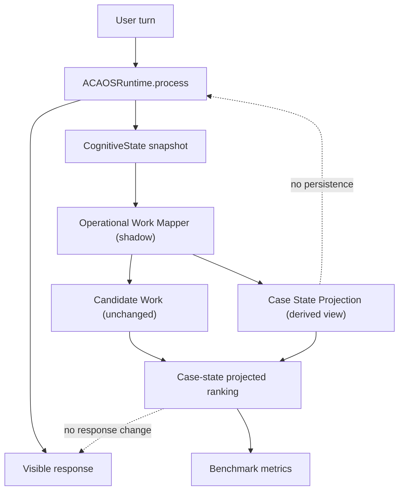

# ACA-012 - Case State Projection

Status: Sprint 79 implemented in Shadow Mode  
Scope: Derived operational case-state projection and projected ranking audit  
Non-goals: no Runtime changes, no response changes, no Operational Planner, no Case Engine, no CaseState owner

## 1. Purpose

Sprint 78 showed that the remaining Candidate Work issue was not detection.

The right work existed in the candidate set. The only remaining gap was ranking:

```text
prepare_claim_follow_up
prepare_documentation_review
```

Both were valid, but the order was wrong when the user had already completed
one operational milestone and introduced a more specific unresolved case state.

Sprint 79 validates the hypothesis:

```text
ACA does not need a CaseState owner yet.
It needs a derived Case State Projection.
```

The projection is rebuilt on each turn from existing Runtime state. It is not
persisted, does not mutate state, and does not change the visible response.

## 2. Boundary



The projection consumes:

- `ConversationState`;
- confirmed facts;
- `ConversationPlan`;
- `ConversationFulfillment`;
- `CandidateWork`;
- `ExecutionPlan`;
- runtime outcomes.

It does not create a new source of truth.

## 3. Shape Of The Projection

The projection is intentionally a payload, not a new cognitive contract.

It exposes:

| Field | Meaning |
|---|---|
| `case_stage` | Operational stage inferred from current state. |
| `claim` | Claim-loaded and follow-up-needed signals. |
| `documentation` | Documentation state: unknown, pending, available, blocked upload. |
| `repair` | Repair-risk state. |
| `technical_service` | Connectivity/service state. |
| `billing` | Billing issue state. |
| `current_owner` | Who appears to own the next operational change. |
| `blockers` | Capability/tool/policy blockers from candidates. |
| `dependencies` | Existing required information from current plans. |
| `pending_actions` | Operational actions still useful. |
| `completed_actions` | Milestones or candidate work already completed. |
| `available_evidence` | Evidence used to derive the projection. |
| `expected_next_change` | What would change next operationally. |
| `derived_from` | Which existing Runtime structures were used. |

Important guarantees:

| Guarantee | Value |
|---|---|
| Persistent | `false` |
| Mutates state | `false` |
| Reconstructable each turn | `true` |
| Source of truth | `ConversationState` and existing Runtime facts |
| Changes `candidate_work` | `false` |

## 4. What Already Existed

The projection confirmed that most Case State already existed implicitly.

| Existing source | Case-state evidence found |
|---|---|
| `ConversationState.active_mission` | Domain and active case mission. |
| `ConversationState.confirmed_facts` | Latest raw payload and reusable facts. |
| `ConversationPlan.steps` | Fact-like operational milestones. |
| `ConversationFulfillment` | Answered vs pending conversation objectives. |
| `CandidateWork.status` | Pending, blocked, suspended, completed work. |
| `CandidateWork.blocked_by` | External system/tool blockers. |
| `ExecutionPlan` | Current cognitive flow and program. |

The missing piece was not data. It was operational projection.

## 5. What Is Inferred

The projection infers:

- claim report loaded;
- claim follow-up needed;
- documentation pending or blocked;
- repair risk active;
- billing issue open or suspended;
- technical issue open;
- current operational owner;
- pending/completed operational actions.

Those inferences are deterministic and auditable. They are not used to modify
Runtime behavior.

## 6. What Never Appears

Some real Case State still does not exist because ACA has no connected external
case systems:

- real claim analyst assignment;
- real claim number;
- real document upload status;
- real billing adjustment status;
- real technician dispatch slot;
- real SLA state.

The projection correctly does not invent these. It can only expose blockers or
unknowns.

## 7. Ranking Simulation

### Before projection

User:

```text
Listo, la denuncia ya quedo cargada, pero no se si faltan documentos.
```

Candidate order:

```text
1. prepare_claim_follow_up
2. prepare_documentation_review
3. close_case_no_action
```

Reason:

- `denuncia` created a strong claim-follow-up signal;
- documentation was detected but ranked secondary;
- there was no explicit operational state saying the claim report was already
  loaded and the unresolved case concern was documentation.

### With projection

Derived projection:

```text
case_stage = documentation_pending_after_claim_loaded
claim.loaded = true
claim.follow_up_needed = false
documentation.state = blocked_upload
```

Projected order:

```text
1. prepare_documentation_review
2. prepare_claim_follow_up
3. close_case_no_action
```

The original `candidate_work` list remains unchanged. The projected ranking is
only a benchmark/audit view.

## 8. Benchmark Results

Synthetic operational benchmark:

| Metric | Value |
|---|---:|
| Scenarios | 50 |
| Turns | 63 |
| Correct Operation Selection | 100% |
| Errors | 0 |

Real-world operational benchmark:

| Metric | Value |
|---|---:|
| Conversations | 56 |
| Turns | 92 |
| Candidate Work Recall | 100% |
| Original Work Ranking Accuracy | 98.91% |
| Original Ranking Ambiguity Rate | 1.09% |
| Case State Projection Available | 100% |
| Case State Projection Reconstructable | 100% |
| Case-State Projected Ranking Accuracy | 100% |
| Case-State Projected Ranking Ambiguity | 0% |
| Resolved Ambiguities | 1 |
| Unresolved Projected Ranking Errors | 0 |
| Missing State Evidence | 0 |

The old `operational_drift` and `work_ranking_mismatch` are still reported for
the original baseline ranking. They are intentionally not hidden. The new
projected ranking resolves them without changing the old candidate order.

## 9. Architectural Findings

### ConversationState remains the source of truth

`ConversationState` should continue to own conversational and turn lifecycle
state. Case State Projection should not become a separate owner.

### Case State Projection is a view

The projection is useful because it derives operational case meaning without
duplicating storage.

### No Case Engine is justified

The benchmark does not justify a Case Engine:

- ranking gap resolved;
- no persistence needed;
- projection reconstructs every turn;
- no external case lifecycle is connected yet;
- no operational execution authority is required.

### No Operational Planner is justified

The Candidate Work Model already finds the work. The projection only improves
ranking/explanation. A planner would add authority before ACA needs it.

## 10. Risks Avoided

| Risk | Avoided by projection |
|---|---|
| Duplicating `ConversationState` | Projection is derived and non-persistent. |
| Duplicating `ConversationPlan` | Projection reads plan steps but does not plan. |
| Duplicating `ConversationFulfillment` | Projection reads fulfilled/pending signals only. |
| Hidden operational planner | Projected ranking is not consumed by Runtime. |
| Domain lock-in | Projection uses generic buckets with domain-specific evidence only as input. |
| False external state | Real API states are not invented. |

## 11. Conclusion

The last ranking gap disappears when using the Case State Projection.

Therefore:

```text
Do not create a CaseState owner.
Do not create a Case Engine.
Do not create an Operational Planner.
```

ACA's operational model should continue evolving by projection over the existing
Runtime until real external systems introduce independent operational state that
cannot be reconstructed from conversation/runtime evidence.

Recommended next Sprint:

```text
Operational Projection Consolidation & Benchmark Governance
```

Goal:

- consolidate operational shadow outputs;
- keep Candidate Work and Case State Projection as benchmarked views;
- define acceptance gates for future operational execution;
- avoid adding execution authority until external capabilities require it.
