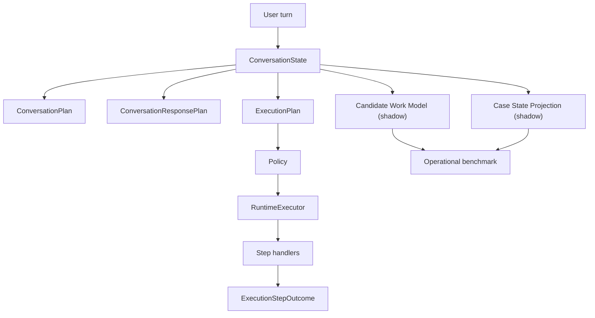
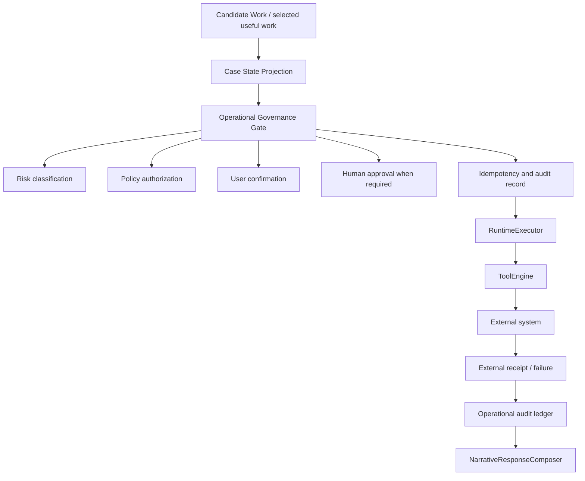

# ACA-013 - Operational Readiness Review

Status: Sprint 80 architecture audit  
Scope: operational governance and production readiness  
Runtime impact: none  
Behavior impact: none

## 1. Executive Answer

ACA is partially ready for real operational work.

It is ready to:

- identify useful operational work;
- rank candidate work;
- explain why a work item was selected;
- derive case-state meaning from existing runtime evidence;
- execute cognitive steps through `RuntimeExecutor`;
- run safe tool calls under explicit tool execution contracts;
- prevent unsafe shadow duplication.

It is not yet ready to execute irreversible or externally visible operations
against real systems such as CRM, ticketing, billing, scheduling, payments,
email, document upload, or claim status mutation.

The missing piece is not an `OperationalPlanner`, a `CaseEngine`, or a second
runtime. The missing piece is an operational governance boundary:

```text
selected work
-> risk classification
-> policy authorization
-> confirmation or human approval
-> idempotent execution
-> durable audit receipt
-> rollback or compensation path
```

The current Runtime decides well. The remaining question is whether ACA is
authorized to act, how that action is made safe, and how the action is audited.

## 2. Evidence Reviewed

| Evidence | Location | Finding |
|---|---|---|
| Tool execution contract | `aca_os/tool_engine.py` | Tools declare determinism, side effects, dry-run, replay, shadow support, idempotency, and guarantee. |
| Tool execution decision | `aca_os/tool_engine.py` | Shadow mode reuses evidence, dry-runs, replays, executes only safe tools, or rejects unsafe execution. |
| Policy result | `aca_os/policy_manager.py` | Policy receives the execution plan, validates, allows, asks clarification, uses tools, or escalates. |
| Runtime executor | `aca_os/runtime_executor.py` | Executes `ExecutionPlan.steps` through handlers and records outcomes, evidence, interruptions, and response. |
| Step handlers | `aca_os/step_handlers.py` | Tool lookup, memory, context, output, handoff, and escalation are handler-owned cognitive steps. |
| Plugin actions | `plugins/galicia.insurance/manifest.yaml` | Real claim lookup and document upload are explicitly blocked because no real tool is connected. |
| Candidate work model | `docs/architecture/ACA-010_Candidate_Work_Model.md` | Candidate works are shadow projections, not operational authority. |
| Case state projection | `docs/architecture/ACA-012_Case_State_Projection.md` | Projected ranking reaches 100% without persistent `CaseState` or `CaseEngine`. |

## 3. Current Operational Shape



Important boundary:

```text
Candidate Work Model and Case State Projection observe work.
They do not execute work.
They do not modify conversation.
They do not override Runtime decisions.
```

## 4. Conditions Already Met

| Condition | Status | Evidence |
|---|---|---|
| Cognitive runtime stability | Met | RuntimeExecutor executes plan steps through registered handlers. |
| Single conversational state owner | Met | ConversationState remains the source of truth. |
| Work detection | Met | Candidate Work Recall reached 100% in real-world benchmark. |
| Work ranking | Met with projection | Case-State Projected Ranking Accuracy reached 100%. |
| Transition stability | Met | Real-world benchmark validates work transitions and persistence. |
| Secondary work visibility | Met | Candidate Work Model represents primary and secondary work. |
| Case meaning | Met as projection | Case State Projection is reconstructable every turn. |
| Shadow safety | Met | Work projection is passive and non-mutating. |
| Tool shadow safety | Met | Tool contracts prevent unsafe shadow execution. |
| Cognitive observability | Met | Execution outcomes, policy results, tool execution records, and runtime comparisons are available. |
| Public capability blocking | Met | Plugin manifest blocks real claim lookup and document upload. |

## 5. Conditions Not Yet Met

| Missing condition | Why it matters | Current gap |
|---|---|---|
| Operational authorization | ACA must know whether a selected operation is allowed in this channel, role, user, case, and risk level. | Policy governs cognitive plans, not full operational permissions. |
| Human approval gate | Some actions require a person before execution. | No durable approval workflow exists. |
| User confirmation gate | Risky actions require explicit user confirmation. | Conversation can ask, but execution is not bound to a confirmation receipt. |
| Durable operational audit | Real actions need external IDs, request payloads, receipts, failures, and correlation IDs. | Current trace records cognitive outcomes, not production operation receipts. |
| Idempotency key governance | Repeated retries must not duplicate writes. | Tool contract has idempotency labels, but no mandatory key lifecycle or receipt validation. |
| Rollback or compensation | Some external writes require undo, reversal, or compensating action. | No compensation contract exists. |
| External error taxonomy | Real systems fail with timeouts, conflicts, partial writes, validation errors, and auth failures. | Tool errors are generic. |
| Distributed execution control | External operations may outlive the turn or complete asynchronously. | Runtime steps are synchronous cognitive execution. |
| Permission scopes | Tools must declare who can do what under which role and environment. | ToolExecutionContext has `permissions`, but no enforced operational scope model. |
| Data validation and PII handling | External writes need schema validation and sensitive-data controls. | Current contracts do not define PII classes or payload constraints. |
| Monitoring and kill switch | Real operation execution needs disablement and alerts. | No operation-level kill switch exists. |
| External state reconciliation | Real systems become independent sources of truth. | Case State Projection is derived from internal evidence only. |

## 6. Operational Risk Classification

ACA should not treat all operations equally. The following risk levels are a
production governance proposal, not a new runtime contract.

| Level | Name | Description | Examples | Auto execution |
|---:|---|---|---|---|
| 0 | Inform | No external state change. Reduces uncertainty only. | Explain coverage, explain timing, describe required documents. | Yes. |
| 1 | Prepare | Produces an internal draft, summary, checklist, or handoff package without writing to external systems. | Prepare claim follow-up, prepare documentation review, prepare handoff summary. | Yes, if visible as preparation only. |
| 2 | Internal reversible write | Changes internal ACA-controlled state or draft metadata that can be safely reverted. | Save draft note, update internal case summary, mark document checklist item. | With user confirmation or policy allowlist. |
| 3 | External side effect | Creates or modifies state in a real external system. | Create ticket, upload document, update CRM, schedule visit, request callback. | Usually confirmation plus operational policy; sometimes human approval. |
| 4 | Irreversible or high-liability action | External action with financial, legal, safety, identity, or irreversible impact. | Cancel service, issue payment/refund, send legal statement, approve claim, change coverage. | Human approval required; automation should remain gated. |

## 7. Current Operations By Risk

| Operation family | Candidate operations observed | Risk level before tool connection | Risk level after real tool connection | Governance required |
|---|---|---:|---:|---|
| Informative guidance | `explain_process`, `explain_timing`, `provide_repair_risk_guidance`, `explain_documentation_requirements` | 0 | 0 | Cognitive policy and opacity filters are enough. |
| Conversational continuation | `continue_conversation_plan`, `answer_lateral_question`, `close_case_no_action` | 0 | 0 | Existing Runtime is enough. |
| Evidence gathering | `collect_claim_blocker`, `request_rejection_detail`, `request_billing_line_item`, `diagnose_connectivity_issue` | 0 or 1 | 0 or 1 | Information gain plus normal privacy rules. |
| Preparatory work | `prepare_claim_follow_up`, `prepare_documentation_review`, `prepare_billing_review`, `prepare_outage_follow_up`, `prepare_technical_visit` | 1 | 1 or 3 | Safe as preparation; governed if submitted externally. |
| Handoff preparation | `prepare_handoff`, `prepare_case_summary` | 1 | 3 when assigned or sent | Approval or confirmation depending destination. |
| Administrative write | associate documentation, add internal note, update case metadata | Not active | 2 or 3 | Idempotency, audit, confirmation, rollback. |
| Coordinative action | schedule visit, request callback, assign owner | Not active | 3 | Confirmation, external receipt, retry policy. |
| Resolutive action | apply credit, bonify service, approve claim, close ticket | Not active | 3 or 4 | Human approval for high-impact actions. |
| Protective refusal | block real status lookup, block document upload, prevent unsafe action | 0 | 0 | Current blocking behavior should remain. |

## 8. Category Execution Rules

| Risk level | Can execute automatically? | Requires user confirmation? | Requires human approval? | Should remain shadow-only? |
|---:|---|---|---|---|
| 0 | Yes | No | No | No. |
| 1 | Yes, if no external write | Optional when user-facing handoff content is produced | No | No. |
| 2 | Only in allowlisted internal systems | Yes unless explicitly low-risk | Sometimes | Until audit and rollback exist. |
| 3 | No by default | Yes | Sometimes, based on domain and policy | Yes until governance is implemented. |
| 4 | No | Yes | Yes | Yes unless human-controlled workflow exists. |

## 9. Tool Contract Audit

Current strengths:

- tools must declare an execution contract;
- contracts validate unsafe non-idempotent shadow execution;
- execution modes are explicit: official, shadow, dry-run, replay, simulation;
- shadow mode avoids duplicate side effects by reusing evidence, dry-running,
  replaying, or rejecting;
- introspection exposes execution mode, action, owner, reason, and contract.

Current limitations for real operational execution:

| Missing metadata | Why it is needed |
|---|---|
| Risk level | Policy needs to know whether a tool is informative, preparatory, external, or irreversible. |
| Operation type | A tool call must map to the kind of business operation it performs. |
| Permission scopes | Real systems require role, user, tenant, environment, and capability permissions. |
| Confirmation requirement | The Runtime must know whether user confirmation is required before execution. |
| Human approval requirement | Some tools must not execute without human approval. |
| Idempotency key lifecycle | `requires_idempotency_key` exists, but key creation, persistence, and receipt validation are not enforced. |
| External receipt | Real execution must return stable external IDs and operation receipts. |
| Rollback or compensation | Side effects need reversal, cancellation, or explicit "not reversible" status. |
| Retry policy | Timeouts and partial failures need safe retry rules. |
| Payload schema and PII class | External writes must validate payloads and sensitive data handling. |
| Environment constraints | Production, staging, sandbox, and demo modes must be explicit. |

Conclusion:

```text
Tool Contracts are sufficient for shadow safety.
Tool Contracts are not yet sufficient for production operational execution.
```

## 10. Policy Audit

Current Policy strengths:

- consumes `ExecutionPlan` when present;
- validates planned tool lookup;
- confirms tool availability for knowledge lookup;
- escalates safe escalation and human handoff flows;
- records validations, modifications, triggered rules, and source;
- no longer acts as a parallel classifier when a plan exists.

Current Policy limits:

- it authorizes cognitive flows, not business operations;
- it does not classify operation risk level;
- it does not enforce user confirmation receipts;
- it does not enforce human approval;
- it does not evaluate external permission scopes;
- it does not evaluate rollback or compensation availability;
- it does not bind authorization to a durable operation receipt.

Conclusion:

```text
Policy is ready as cognitive policy.
Policy is not yet sufficient as operational governance.
```

Policy should not become an operational planner. It should authorize or block
already-selected work under an operational governance boundary.

## 11. RuntimeExecutor Audit

Current RuntimeExecutor strengths:

- walks `ExecutionPlan.steps`;
- delegates to registered `StepHandler`s;
- carries policy result, tool evidence, runtime context, and conversation state;
- records outcomes step by step;
- supports official and shadow execution modes;
- owns migrated flows including simple responses, guided process, knowledge
  lookup, and policy interruptions;
- uses ToolEngine for tool execution ownership.

Current RuntimeExecutor limits for real work:

- no durable operation ledger;
- no transaction boundary;
- no compensation or rollback path;
- no asynchronous operation state;
- no approval workflow;
- no external state reconciliation;
- no production retry semantics;
- no per-operation kill switch;
- no operation-specific monitoring or alerting.

Conclusion:

```text
RuntimeExecutor is stable as the cognitive execution engine.
RuntimeExecutor should not be stretched into operational governance.
```

The engine can execute real operational steps later, but only after governance
decides that the step is authorized and safe.

## 12. Readiness Matrix

| Area | State | Risk | Ready for production? |
|---|---|---|---|
| Cognitive decision chain | Stable | Low | Yes. |
| ExecutionPlan authority | Stable | Low | Yes. |
| RuntimeExecutor cognitive execution | Stable | Low | Yes. |
| Step outcomes and introspection | Stable | Low | Yes. |
| ConversationState ownership | Stable | Low | Yes. |
| Candidate Work detection | Shadow validated | Low | Yes as observability. |
| Case State Projection | Shadow validated | Low | Yes as observability. |
| Work ranking | Shadow validated | Low | Yes as observability. |
| Tool shadow safety | Implemented | Medium | Yes for shadow/dry-run/replay. |
| Tool production writes | Incomplete | High | No. |
| Policy for cognitive flows | Implemented | Low | Yes. |
| Policy for real operations | Incomplete | High | No. |
| Human approval | Missing | High | No. |
| User confirmation binding | Missing | Medium | No. |
| Operation ledger | Missing | High | No. |
| Idempotency receipt lifecycle | Partial | High | No. |
| Rollback or compensation | Missing | High | No. |
| External system reconciliation | Missing | High | No. |
| Monitoring and kill switch | Missing | High | No. |
| Public adapter compatibility | Stable | Low | Yes. |

## 13. Readiness Gate For Future Operational Execution

Before ACA can execute real Level 2 or higher operations, every operation should
pass the following entry criteria:

1. The work is represented by Candidate Work and explained by Case State
   Projection.
2. The operation has a risk level.
3. The target tool declares production-grade execution metadata.
4. Policy authorizes the operation for the role, channel, user, case, risk
   level, and environment.
5. Required user confirmation is captured and linked to the operation.
6. Required human approval is captured and linked to the operation.
7. The operation has an idempotency strategy.
8. The operation creates a durable audit record before execution.
9. The tool returns an external receipt or stable failure record.
10. Retry behavior is explicit and safe.
11. Rollback or compensation is defined, or the operation is explicitly marked
    non-reversible.
12. The visible response is based on the operation result, not on optimistic
    assumptions.
13. Monitoring and kill-switch controls exist for the operation category.
14. The operation passes benchmark scenarios in dry-run and replay before live
    execution.

## 14. Future Governed Execution Shape

This is the target governance shape, not a Sprint 80 implementation.



The future gate does not decide what ACA wants to do. It decides whether ACA is
allowed to do the selected work in the real world.

## 15. Attempt To Refute Readiness

The strongest argument against beginning operational execution now:

```text
Benchmarks prove that ACA identifies work.
They do not prove that ACA can safely create real-world consequences.
```

Specific refutations:

1. Shadow projections can be perfect while real external writes are unsafe.
2. Case State Projection is reconstructable internally, but a real CRM may have
   independent state that ACA has not seen.
3. Current Policy can escalate and authorize cognitive flows, but it does not
   enforce role-based operation permissions.
4. Current Tool Contracts prevent duplicate shadow effects, but do not enforce
   production idempotency receipts.
5. RuntimeExecutor records cognitive outcomes, but not durable external
   transaction receipts.
6. There is no generic human approval or compensation mechanism.
7. Public manifests already block real claim lookup and document upload, which
   is correct evidence that ACA should not pretend those actions are available.

Therefore ACA should not jump from shadow work recognition to unrestricted
external execution.

## 16. What Can Be Enabled First

The safest first operational execution slice is not a CRM write.

Recommended safe order:

1. Level 0: continue automatic informative responses.
2. Level 1: generate internal preparation artifacts, such as handoff summaries,
   checklists, or review packages, without external writes.
3. Level 2: allow reversible internal writes only after audit and confirmation.
4. Level 3: connect one external tool in dry-run and replay first, then live
   with explicit confirmation.
5. Level 4: keep human approval mandatory.

The first real operational slice should be:

```text
prepare_handoff_package
```

Only if it creates a local/auditable artifact and does not assign, send, or
submit anything externally.

## 17. Roadmap For Operational Enablement

| Sprint | Goal | Runtime risk | Expected output |
|---|---|---|---|
| Sprint 81 | Operational Governance Boundary design | None | Document or shadow-only specification of risk, authorization, confirmation, approval, and audit rules. |
| Sprint 82 | Tool Contract production-readiness extension | Low | Add production metadata to tool contracts without changing behavior. |
| Sprint 83 | Operational audit ledger in shadow | Low | Record intended operations, authorization decisions, and simulated receipts. |
| Sprint 84 | Level 1 local preparation execution | Medium-low | Generate auditable handoff/review packages without external writes. |
| Sprint 85 | Level 2 reversible internal action pilot | Medium | One reversible internal write with confirmation, audit, and rollback. |
| Sprint 86 | Level 3 external dry-run/replay pilot | Medium | One real-system connector exercised in dry-run/replay only. |
| Sprint 87 | Level 3 controlled live execution | High | One external operation live behind confirmation, policy, idempotency, audit, and kill switch. |

This roadmap deliberately avoids an Operational Planner. It assumes the current
Runtime remains the decision source and adds only governance around execution.

## 18. Architecture Recommendation

Do not build:

- `OperationalPlanner`;
- `CaseEngine`;
- another runtime;
- another conversation planner;
- another state owner.

Do build later, only when approved:

```text
Operational Governance Gate
```

Responsibilities:

- classify operation risk;
- check operation permission;
- require confirmation or human approval;
- enforce idempotency requirements;
- create durable audit records;
- validate production tool readiness;
- reject unsafe execution;
- expose receipts and failures to introspection.

Non-responsibilities:

- no work selection;
- no conversation planning;
- no response composition;
- no case-state ownership;
- no tool implementation.

## 19. Final Readiness Decision

```text
Operational readiness: Parcialmente
```

ACA is ready to identify, rank, explain, and prepare operational work. It is
ready for informational and non-side-effect preparation work.

ACA is not ready to execute externally visible or irreversible operations until
operational governance exists.

The architecture does not need a major restructuring. It needs a narrow
governance boundary between selected work and real-world side effects.

