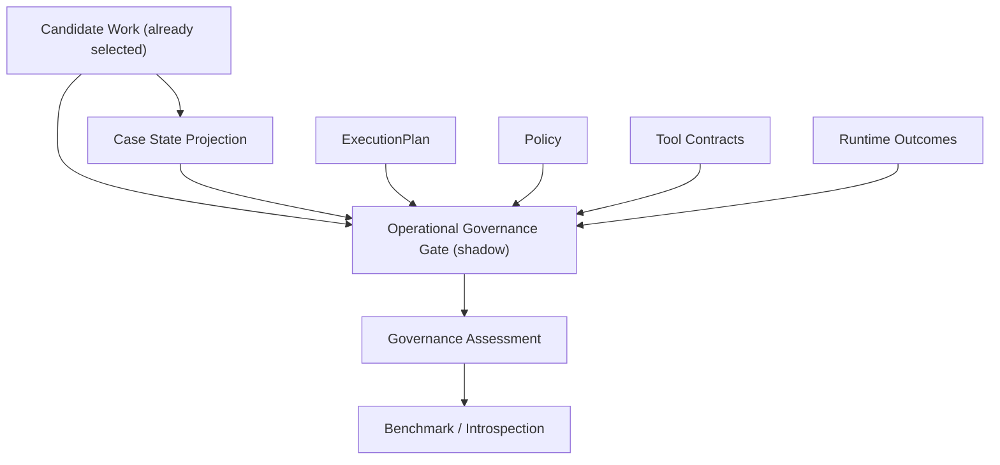
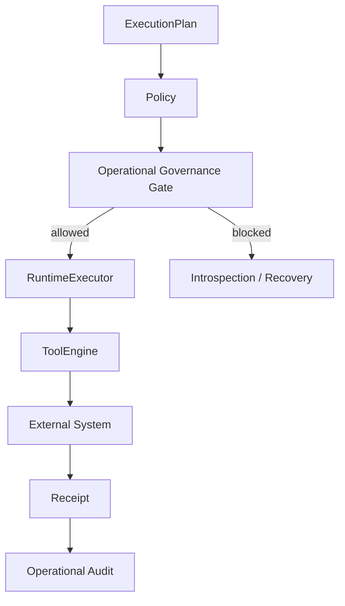

# ACA-014 - Operational Governance Gate

Status: Sprint 81 shadow implementation  
Runtime impact: none  
Visible response impact: none  
Execution impact: none  

## 1. Purpose

Sprint 81 introduces an Operational Governance Gate in Shadow Mode.

The gate answers one question:

```text
If ACA had already selected this work, would it be safe and authorized to
execute it under real production conditions?
```

It does not answer:

```text
What work should ACA do?
```

That distinction is the entire architectural point of this Sprint.

## 2. Why This Is Not A Planner

The gate does not:

- select work;
- rank work;
- create candidate work;
- change `ConversationState`;
- change `ConversationPlan`;
- change `ExecutionPlan`;
- change visible responses;
- call tools;
- execute side effects.

It only audits already-selected work.



No arrow returns from the gate into the Runtime.

## 3. Why This Does Not Replace Policy

Policy currently governs cognitive execution:

- it receives `ExecutionPlan`;
- it authorizes cognitive flows;
- it escalates/handoffs when required;
- it validates planned tool lookup;
- it records validations and modifications.

The Governance Gate evaluates operational execution readiness:

- risk level;
- permission requirement;
- user confirmation;
- human approval;
- real tool availability;
- idempotency;
- reversibility;
- audit requirements;
- missing operational evidence.

Policy decides whether the cognitive plan is allowed.
The gate audits whether real-world execution would be safe.

Future integration should keep this separation:

```text
Policy authorizes the plan.
Governance authorizes the real-world effect.
```

## 4. Why This Does Not Replace Tool Contracts

Tool Contracts declare what a tool can safely do:

- deterministic or not;
- side effects or not;
- dry-run support;
- replay support;
- shadow support;
- idempotency guarantee.

The Governance Gate consumes those contracts. It does not redefine them.

Example:

```text
Tool contract says: this tool requires an idempotency key.
Governance assessment says: execution is blocked because no key is present.
```

The gate is therefore a consumer of Tool Contracts, not a replacement.

## 5. Why This Does Not Replace RuntimeExecutor

`RuntimeExecutor` executes cognitive plan steps.

The Governance Gate does not execute anything. It only produces a Shadow
assessment. It has no handlers, no step loop, no state mutation and no tool
dispatch.

Future production execution should look like:



In Sprint 81, the `allowed` branch is not connected to execution.

## 6. Implemented Component

Implemented module:

```text
aca_os/operational_governance_gate.py
```

Public functions:

- `assess_operational_governance(...)`
- `compare_governance_to_expected(...)`

Assessment contract:

```text
operational_governance_assessment.v1
```

Core output fields:

| Field | Meaning |
|---|---|
| `selected_work` | Work being audited. |
| `risk` | Risk level and risk name. |
| `execution_allowed` | Whether execution would be allowed under supplied conditions. |
| `execution_blocked` | Whether execution is blocked by governance. |
| `requires_confirmation` | User confirmation requirement. |
| `requires_human_approval` | Human approval requirement. |
| `manual_only` | Whether automation must remain disabled even with approval. |
| `required_evidence` | Evidence needed before execution. |
| `missing_preconditions` | Concrete blockers. |
| `tool_availability` | Required tool/capability availability. |
| `permissions` | Required operational permission status. |
| `idempotency` | Idempotency safety status. |
| `reversibility` | Rollback/compensation status. |
| `audit_requirements` | Required audit artifacts before production execution. |
| `regulatory_constraints` | High-impact constraints that require human governance. |
| `reasoning` | Deterministic explanation of the assessment. |

## 7. Risk Levels

| Level | Name | Meaning | Default action |
|---:|---|---|---|
| 0 | inform | No external state change. | Auto allowed. |
| 1 | prepare | Prepare internal work without external writes. | Auto allowed. |
| 2 | internal_reversible_write | Write reversible internal state. | Requires permission, confirmation, audit, idempotency. |
| 3 | external_side_effect | Create or modify external state. | Requires tool contract, permission, confirmation, audit, idempotency. |
| 4 | irreversible_or_high_liability | High-impact or irreversible action. | Human approval and manual-only by default. |

## 8. Benchmark

New benchmark:

```text
benchmarks/operational/aca_operational_governance_benchmark_v1.json
```

New CLI:

```text
python tools/aca_cli.py operational-governance-benchmark --format json
```

Scenario categories:

- informational;
- preparatory;
- external write;
- document association;
- technical visit;
- double execution/idempotency;
- missing evidence;
- financial adjustment;
- identity-sensitive operation;
- irreversible operation;
- unavailable tool;
- insufficient permission.

## 9. Metrics

The benchmark records:

| Metric | Meaning |
|---|---|
| Governance Accuracy | Full assessment match against expected governance. |
| Unsafe Execution Detection | Unsafe operations correctly blocked. |
| Missing Evidence Detection | Required evidence gaps found. |
| Confirmation Requirement Accuracy | User confirmation requirement classified correctly. |
| Human Approval Accuracy | Human approval requirement classified correctly. |
| Tool Availability Accuracy | Tool/capability availability classified correctly. |
| Idempotency Detection | Idempotency safety classified correctly. |
| Governance False Positives | Operations incorrectly allowed. |
| Governance False Negatives | Operations incorrectly blocked. |

## 10. Current Benchmark Result

Sprint 81 benchmark result:

| Metric | Value |
|---|---:|
| Scenarios | 16 |
| Governance Accuracy | 100% |
| Unsafe Execution Detection | 100% |
| Missing Evidence Detection | 100% |
| Confirmation Requirement Accuracy | 100% |
| Human Approval Accuracy | 100% |
| Tool Availability Accuracy | 100% |
| Idempotency Detection | 100% |
| Governance False Positives | 0 |
| Governance False Negatives | 0 |
| Immediately executable operations | 2 / 16 |
| Immediate enablement | 12.5% |
| Requires confirmation | 14 / 16 |
| Requires human approval | 5 / 16 |
| Manual-only | 5 / 16 |
| Tool-contract dependent | 14 / 16 |

Interpretation:

```text
The gate can classify execution readiness correctly.
It does not make ACA ready for unrestricted operational execution.
It shows that only low-risk informational/preparatory work is immediately safe.
```

## 11. Findings

### 11.1 Low-risk work is ready

Level 0 and Level 1 work can be considered operationally safe when it does not
write to external systems:

- explanation;
- guidance;
- case summaries;
- review preparation;
- handoff package preparation.

### 11.2 Real external work remains gated

Level 3 work is not safe merely because ACA selected it correctly.

It needs:

- real tool contract;
- permission;
- user confirmation;
- idempotency;
- durable audit;
- external receipt.

### 11.3 High-liability work remains manual

Level 4 work remains manual-only by default:

- service cancellation;
- billing mutation;
- credits or bonifications;
- account holder change;
- irreversible or regulated actions.

Even with human approval represented in the benchmark, the gate keeps those
operations out of automatic execution.

### 11.4 Current Tool Contracts are useful but not enough alone

Tool Contracts answer:

```text
Can this tool run safely in this mode?
```

Governance adds:

```text
Should ACA be allowed to perform this operation now?
```

Both are needed.

## 12. Architecture Impact

| Component | Impact |
|---|---|
| `ACAOSRuntime` | None. |
| `RuntimeExecutor` | None. |
| `ConversationState` | None. |
| `ExecutionPlan` | None. |
| `Policy` | None. |
| `ToolEngine` | None. |
| `ToolExecutionContract` | None. |
| `Candidate Work Model` | Read-only input. |
| `Case State Projection` | Read-only input. |
| Benchmark harness | Extended. |
| CLI | Added governance benchmark command. |

## 13. Recommendation

Do not create an `OperationalPlanner`.

Do not create a `CaseEngine`.

Do not integrate Candidate Work or Case State Projection into the Runtime yet.

The next missing production concept is not cognitive. It is durable operational
execution evidence:

```text
Operational Audit Ledger
```

The Governance Gate can say whether an operation would be allowed. Before ACA
executes real operations, the framework also needs a durable place to record:

- operation intent;
- authorization decision;
- confirmation receipt;
- human approval receipt;
- idempotency key;
- tool request;
- external result;
- external receipt;
- rollback/compensation status.

Until that exists, real execution should remain disabled except Level 0 and
non-side-effect Level 1 preparation.

## 14. Final Decision

```text
Operational execution readiness: Parcialmente
```

ACA can begin preparing low-risk operational artifacts.

ACA should not yet execute external writes in production.

The Governance Gate resolves the decision-readiness question. It does not
resolve production execution durability.

