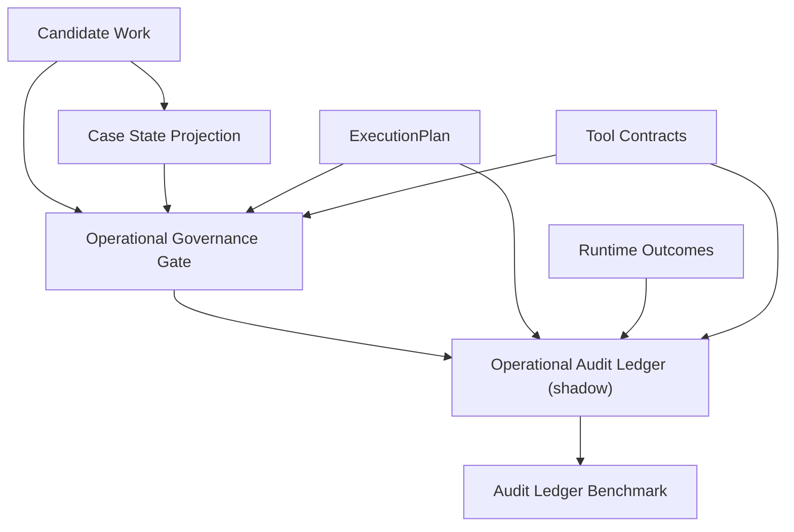

# ACA-015 - Operational Audit Ledger

Status: Sprint 82 shadow implementation  
Runtime impact: none  
Visible response impact: none  
Execution impact: none  
Persistence impact: none

## 1. Purpose

Sprint 82 introduces an Operational Audit Ledger in Shadow Mode.

The ledger answers:

```text
If ACA executed this operational work against a real system, what record would
need to exist so the action can be reconstructed, retried, audited or reversed?
```

It does not:

- execute operations;
- authorize operations;
- select work;
- plan work;
- modify `ConversationState`;
- modify `ExecutionPlan`;
- call tools;
- persist to a database;
- change the visible response.

## 2. Position In The Architecture



No arrow returns from the ledger into the Runtime.

## 3. Implemented Component

Implemented module:

```text
aca_os/operational_audit_ledger.py
```

Public functions:

- `project_operational_audit_ledger(...)`
- `compare_ledger_to_expected(...)`

Record contract:

```text
operational_audit_ledger_record.v1
```

The ledger record is deterministic and derived from existing inputs. It is not
durable storage.

## 4. Ledger Record

Core fields:

| Field | Meaning |
|---|---|
| `ledger_id` | Stable shadow id derived from existing inputs. |
| `conversation_id` | Conversation id when available. |
| `timestamp` | Timestamp from input context or runtime outcomes. |
| `selected_work` | Already-selected work being audited. |
| `governance_decision` | Result from Operational Governance Gate. |
| `risk` | Risk level and name. |
| `preconditions` | Required and missing operational preconditions. |
| `evidence` | Evidence references used for audit, without raw payloads. |
| `tool` | Required tool/capability and available contract. |
| `projected_request` | Shadow request shape, not a real request. |
| `idempotency` | Required key, projected key or missing-key status. |
| `confirmation_status` | User confirmation status. |
| `approval_status` | Human approval status. |
| `execution_status` | Shadow execution state. |
| `external_receipt` | Shadow receipt or blocked/not-executed marker. |
| `compensation_strategy` | Reversal, compensation or manual-control strategy. |
| `duplicate_detection` | Idempotency-based duplicate check. |
| `replay_safety` | Whether retry/replay would be safe. |
| `audit_trail` | Ordered audit events. |
| `completeness` | Whether the record can reconstruct the operation. |

## 5. Difference From Logs

A log records that something happened.

The Operational Audit Ledger records what must be known before and after an
operational action can be trusted.

| Logs | Operational Audit Ledger |
|---|---|
| Usually append raw events. | Records operationally meaningful events. |
| Often component-centric. | Operation-centric. |
| May be noisy. | Minimal and reconstructable. |
| May include implementation details. | Exposes execution accountability. |
| Does not imply retry safety. | Captures idempotency and replay safety. |
| Does not imply compensation. | Captures compensation strategy. |

The ledger is not a general logging system.

## 6. Difference From ConversationState

`ConversationState` owns conversational state:

- focus;
- facts;
- slots;
- mission;
- topic stack;
- pending questions;
- user signals.

The Operational Audit Ledger owns no conversational truth.

It records an operational execution projection:

- what operation would be executed;
- what authorization existed;
- what request would be sent;
- what receipt would be expected;
- how duplicate/retry/compensation would be handled.

ConversationState answers:

```text
What does ACA know in this conversation?
```

The ledger answers:

```text
What would ACA need to prove about an operational action?
```

## 7. Difference From Governance Gate

The Governance Gate decides if execution would be allowed.

The Ledger records how that decision and its resulting operation would be
audited.

```text
Governance Gate: should this be allowed?
Audit Ledger: how would this be proven later?
```

The ledger consumes governance. It does not replace it.

## 8. Difference From Runtime Outcomes

`ExecutionStepOutcome` reconstructs cognitive execution:

- policy step;
- tool lookup step;
- kernel step;
- memory step;
- context step;
- output step.

The Operational Audit Ledger reconstructs operational execution:

- selected work;
- operational risk;
- authorization;
- projected request;
- idempotency;
- receipt;
- duplicate detection;
- replay safety;
- compensation.

Both are audit artifacts, but they answer different questions.

## 9. Why This Is Operational, Not Cognitive

The ledger does not improve reasoning.

It improves accountability.

It exists because real systems create consequences outside ACA. Once ACA can
write to a CRM, ticketing system, billing platform or scheduler, internal
cognitive trace is not enough. ACA must also prove:

- what it attempted;
- under whose authority;
- with which evidence;
- using which idempotency key;
- with what external result;
- whether it can retry;
- whether it can compensate.

That is an operational boundary.

## 10. Benchmark

New benchmark:

```text
benchmarks/operational/aca_operational_audit_ledger_benchmark_v1.json
```

New CLI:

```text
python tools/aca_cli.py operational-audit-ledger-benchmark --format json
```

Scenarios include:

- low-risk preparation;
- governed external write;
- double execution;
- retry after timeout;
- retry blocked by missing idempotency key;
- partial response;
- operation cancelled;
- approval rejected;
- tool down;
- compensable operation;
- irreversible operation;
- missing evidence.

## 11. Metrics

| Metric | Meaning |
|---|---|
| Ledger Completeness | The record contains all required audit fields. |
| Audit Trace Completeness | Required audit events are present. |
| Idempotency Coverage | Idempotency is covered or explicitly missing. |
| Receipt Coverage | A shadow receipt or blocked/not-executed receipt exists. |
| Compensation Coverage | Reversal/compensation/manual-control strategy exists. |
| Replay Safety | Retry/replay safety is explicitly evaluated. |
| Duplicate Detection Accuracy | Duplicate execution is detected through idempotency evidence. |
| Execution Status Accuracy | The ledger state matches the expected operational state. |

## 12. Benchmark Result

Sprint 82 benchmark result:

| Metric | Value |
|---|---:|
| Scenarios | 12 |
| Ledger Completeness | 100% |
| Audit Trace Completeness | 100% |
| Idempotency Coverage | 100% |
| Receipt Coverage | 100% |
| Compensation Coverage | 100% |
| Replay Safety | 100% |
| Duplicate Detection Accuracy | 100% |
| Execution Status Accuracy | 100% |
| Ledger Accuracy | 100% |
| Reconstructable operations | 12 / 12 |
| Durable persistence still required | 12 / 12 |

Interpretation:

```text
The audit model is conceptually complete in Shadow Mode.
Production execution still requires real durable persistence.
```

## 13. Required Persistent Events

If ACA later executes real operations, these events should be persisted:

1. `selected_work_observed`
2. `governance_assessed`
3. `confirmation_captured` when required
4. `human_approval_captured` when required
5. `request_projected` before execution
6. `idempotency_key_registered` when required
7. `tool_request_sent`
8. `tool_receipt_received`
9. `execution_failed` when applicable
10. `retry_scheduled` when applicable
11. `compensation_started` when applicable
12. `compensation_completed` when applicable
13. `operation_closed`

Sprint 82 does not persist them. It only proves the record shape.

## 14. Events That Should Not Be Persisted

The ledger should not persist:

- raw user messages when not needed for audit;
- credentials;
- secrets;
- full documents;
- payment data beyond safe references;
- hidden model reasoning;
- raw PII when a reference is sufficient;
- transient debug logs;
- duplicated ConversationState snapshots;
- entire Runtime traces when a stable reference is enough.

The ledger should preserve evidence references, not uncontrolled payload dumps.

## 15. Can Every Operation Be Reconstructed From The Ledger?

In Shadow Mode, yes for the benchmarked scenarios.

The ledger reconstructs:

- work selected;
- governance decision;
- risk;
- missing preconditions;
- evidence references;
- required tool;
- projected request;
- idempotency status;
- approval and confirmation status;
- execution status;
- receipt status;
- replay safety;
- compensation strategy;
- duplicate detection.

What it cannot reconstruct yet:

- actual external system state;
- actual external receipt authenticity;
- real retry history;
- real compensation result;
- durable cross-process ordering.

Those require production persistence and connected tools.

## 16. Domain Independence

The ledger is domain-generic.

Domain-specific data appears only as:

- operation name;
- capability;
- evidence reference;
- tool contract;
- risk profile.

The ledger itself does not know Galicia, telecom, billing or insurance. It can
record any operation that has selected work, governance, tool metadata and
runtime evidence.

## 17. Remaining Production Gap

After this Sprint, the remaining gap is not conceptual modeling.

It is production infrastructure:

```text
durable operational storage + real tool receipts
```

Without durable storage, the ledger can prove that ACA knows what must be
recorded, but it cannot prove that a real action was recorded across processes,
restarts or external failures.

## 18. Recommendation

The architecture is now conceptually complete for future operational
integration:

```text
Candidate Work
-> Case State Projection
-> Governance Gate
-> Audit Ledger
-> RuntimeExecutor / ToolEngine
-> External Tool
```

Do not introduce:

- Operational Planner;
- Case Engine;
- another Runtime;
- another state owner.

The next phase should be:

```text
Integracion Operacional
```

Focus:

- connect one real low-risk tool;
- keep dry-run/replay first;
- persist ledger records durably;
- validate receipts;
- then enable one controlled operation.

## 19. Final Decision

```text
Operational architecture readiness: Si, conceptually.
Production execution readiness: Parcialmente.
```

The minimum architecture is present in Shadow Mode. Production still needs a
durable storage implementation and real tool integration before external writes
are enabled.

