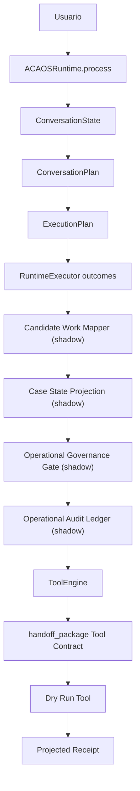
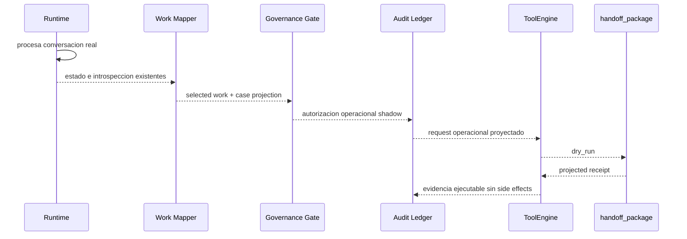

# ACA-016 - First Operational Integration

## Estado

Sprint 83 introduce la primera integracion operacional real de ACA en modo
`dry_run`. El objetivo no es mejorar respuestas ni modificar el Runtime
cognitivo. El objetivo es demostrar que la arquitectura validada en los Sprints
73-82 puede operar sobre un Tool Contract real sin producir efectos externos.

La operacion elegida es `prepare_handoff`, implementada por la herramienta
`handoff_package`.

## Decision de herramienta

Se eligio `prepare_handoff` por cuatro motivos:

| Criterio | Evaluacion |
| --- | --- |
| Riesgo | Nivel 1: preparacion interna, sin escrituras externas. |
| Valor arquitectonico | Obliga a atravesar Candidate Work, Case State Projection, Governance, Ledger y Tool Contract. |
| Compatibilidad | No requiere cambiar `ACAOSRuntime`, `RuntimeExecutor` ni respuestas visibles. |
| Evolucion futura | Es el primer paso natural antes de `execute_handoff`, que si tendria efectos reales. |

Operaciones como asociar documentacion, abrir tickets, modificar facturas o
programar visitas se descartaron para este Sprint porque requieren sistemas
externos, autorizacion mas estricta o manejo de compensacion real.

## Flujo validado



La respuesta visible sigue viniendo del Runtime moderno y del
`NarrativeResponseComposer`. La integracion operacional se ejecuta en el
benchmark y no cambia la conversacion.

## Nuevo Tool Contract

`handoff_package` declara:

| Campo | Valor |
| --- | --- |
| deterministic | `true` |
| has_side_effects | `false` |
| supports_dry_run | `true` |
| supports_replay | `true` |
| supports_shadow | `true` |
| idempotency | `idempotent` |

El adapter produce:

- request proyectado;
- response proyectada;
- receipt proyectado;
- paquete estructurado de handoff;
- copia del ledger proyectado;
- evidencia de que no hubo efectos externos.

No ejecuta APIs, no persiste datos y no modifica estado conversacional.

## Integracion con Governance

`Operational Governance Gate` ya clasifica `prepare_handoff` como una operacion
de preparacion de bajo riesgo. Por eso no exige una herramienta externa como
precondicion de seguridad.

Esto es correcto para el estado actual:

- la decision operacional es preparar un paquete;
- la herramienta concreta materializa esa preparacion en `dry_run`;
- el Tool Contract garantiza que la ejecucion seca no tiene efectos;
- el Ledger permite reconstruir que hubiera ocurrido si se habilitara ejecucion.

No se modifico Governance para forzar `required_tool = handoff_package`, porque
eso mezclaria una capacidad de preparacion interna con una obligacion de sistema
externo. La relacion entre `prepare_handoff` y `handoff_package` queda validada
por el benchmark de integracion, no por una regla nueva del Gate.

## Benchmark

Se agrego:

```text
benchmarks/operational/aca_operational_dry_run_benchmark_v1.json
```

Contiene 30 conversaciones realistas donde el trabajo operacional dominante es
preparar un handoff. Incluye:

- siniestros demorados;
- documentacion rechazada;
- facturacion;
- soporte tecnico;
- necesidades mixtas;
- usuarios frustrados;
- conversaciones de varios turnos;
- correcciones de dominio;
- consultas laterales antes del handoff.

### Metricas

| Metrica | Resultado |
| --- | ---: |
| End-to-end success | 100.0% |
| Candidate/tool coherence | 100.0% |
| Governance pass | 100.0% |
| Ledger completeness | 100.0% |
| Receipt generated | 100.0% |
| Side-effect free | 100.0% |
| Replay consistency | 100.0% |
| Idempotency coverage | 100.0% |
| Dry-run action | 100.0% |

El benchmark verifica que:

- el trabajo identificado sea `prepare_handoff`;
- la herramienta seleccionada sea `handoff_package`;
- Governance permita la operacion;
- el Ledger quede completo;
- el ToolEngine ejecute en modo `dry_run`;
- `executed = false`;
- el receipt exista;
- el replay devuelva la misma evidencia;
- no haya side effects.

## Auditoria de duplicaciones

### Governance vs Policy

No son duplicados.

`Policy` gobierna la ejecucion cognitiva: autoriza el plan decidido por ACA.
`Operational Governance Gate` gobierna la ejecutabilidad operacional: riesgo,
confirmacion, aprobacion humana, herramienta, idempotencia y evidencia minima.

Podrian compartir criterios en operaciones futuras de alto riesgo, pero hoy
responden preguntas distintas:

- Policy: "Esta permitido este plan cognitivo?"
- Governance: "Seria seguro ejecutar esta operacion real?"

### Ledger vs Runtime Outcomes

No son duplicados, aunque comparten trazabilidad.

`Runtime Outcomes` reconstruye que ocurrio dentro del turno cognitivo.
`Operational Audit Ledger` reconstruye que operacion se hubiera ejecutado sobre
un sistema real, con idempotencia, receipt, compensacion y auditoria operacional.

Si ACA pasa a produccion operacional, el Ledger necesitara persistencia durable.
Los Runtime Outcomes no alcanzan para eso.

### Candidate Work vs ExecutionPlan

No son duplicados.

`ExecutionPlan` representa como ACA ejecuta el flujo cognitivo.
`Candidate Work` representa que trabajo operativo aparece como consecuencia del
estado cognitivo. En este Sprint se confirmo que Candidate Work puede consumir
ExecutionPlan sin reemplazarlo.

### Componente excesivo

El componente mas cercano a quedar transicional es la proyeccion operacional
separada del benchmark. No justifica convertirse en runtime permanente. Debe
seguir como harness de validacion hasta que existan herramientas productivas.

## Resultado arquitectonico

La integracion valida que ACA puede pasar de razonamiento a trabajo seco sin
crear nuevas capas:



## Lo que falta para produccion

No falta otro planner ni otro engine.

Falta habilitacion operacional concreta:

| Area | Estado actual | Necesario para produccion |
| --- | --- | --- |
| Tool Contract | Suficiente para dry-run | Contratos reales por integracion |
| Secrets/autenticacion | No aplica | Gestion segura de credenciales |
| Ledger | Proyectado, no persistente | Persistencia durable |
| Receipts | Proyectados | Receipts reales de sistemas externos |
| Idempotencia | Validada conceptualmente | Idempotency keys obligatorias en writes |
| Compensacion | Proyectada | Estrategia real por herramienta |
| Observabilidad | Suficiente | Monitoreo operacional y alertas |

## Recomendacion

La fase de diseno e investigacion puede cerrarse para operaciones de bajo
riesgo. La siguiente fase deberia ser **Operational Production Integration**:
conectar una herramienta real por vez bajo Tool Contracts, empezando por
operaciones preparatorias o informativas, manteniendo intacto el nucleo
cognitivo.
