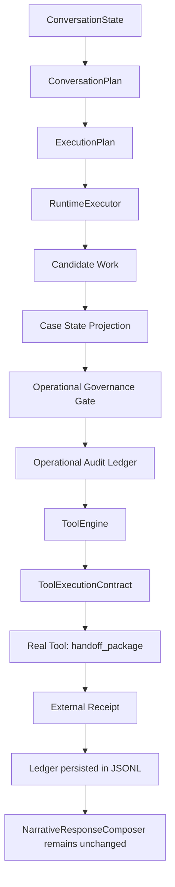

# ACA-017 - First Production Tool Integration

## Estado

Sprint 84 inicia la fase **Operational Production Integration**. La fase de
investigacion arquitectonica queda cerrada: no se agregaron planners, engines,
contratos cognitivos ni cambios en `ConversationState`, `ConversationPlan` o
`NarrativeResponseComposer`.

La primera herramienta real conectada es:

```text
handoff_package
```

La operacion operacional validada es:

```text
prepare_handoff
```

## Por que esta operacion

`prepare_handoff` es la mejor primera integracion productiva porque:

| Criterio | Resultado |
| --- | --- |
| Riesgo | Muy bajo. Prepara un paquete interno, no modifica facturacion ni estados externos criticos. |
| Reversibilidad | El paquete persistido puede anularse mediante `void_handoff_package`. |
| Valor operacional | Representa trabajo real: deja un caso listo para que una persona continue. |
| Trazabilidad | Tiene evidencia, selected work, governance, receipt e idempotency key. |
| Compatibilidad | Usa el Runtime existente; no requiere cambiar la cognicion ni la verbalizacion. |

Se evitaron operaciones financieras, cancelaciones, cambios de titularidad y
modificaciones irreversibles.

## Flujo real



El Runtime cognitivo produce los outputs oficiales. La integracion operacional
consume esa evidencia y ejecuta la herramienta mediante `ToolEngine` en modo
`official`. No se agrego una ruta paralela de conversacion.

## Tool Contract

`handoff_package` declara:

| Campo | Valor |
| --- | --- |
| deterministic | `false` |
| has_side_effects | `true` |
| supports_dry_run | `true` |
| supports_replay | `true` |
| supports_shadow | `false` |
| idempotency | `idempotent` |

La herramienta:

- persiste un paquete de handoff en JSONL;
- devuelve un receipt externo real;
- soporta replay;
- no se ejecuta en shadow;
- mantiene dry-run para benchmarks previos;
- evita doble escritura con idempotency key.

## Persistencia durable

Se eligio JSONL append-only por ser:

- simple;
- inspeccionable;
- robusto para el primer slice;
- facil de reemplazar por SQLite, Postgres o un servicio de auditoria;
- suficiente para probar idempotencia, replay y receipts reales.

Se persisten dos registros separados:

| Archivo | Responsabilidad |
| --- | --- |
| `handoff_packages.jsonl` | Registro real de la herramienta operacional. |
| `operational_ledger.jsonl` | Auditoria operacional durable. |

Los artefactos locales viven bajo `.aca/`, que queda ignorado por git.

## Ledger persistido

El ledger productivo registra:

- Ledger ID;
- Conversation ID;
- Timestamp;
- Selected Work;
- Governance Decision;
- Tool ejecutada;
- Request;
- Response;
- External Receipt;
- Idempotency Key;
- Execution Status;
- Audit Trail;
- Compensation Strategy.

El ledger shadow no se elimino. La misma estructura puede proyectar primero y
finalizarse luego con un resultado real de herramienta.

## Idempotencia

La herramienta recibe o deriva una idempotency key. Si una segunda ejecucion
llega con la misma key:

1. no crea otro paquete;
2. recupera el receipt existente;
3. responde `duplicate_replayed`;
4. persiste el intento en el ledger;
5. conserva trazabilidad de la doble ejecucion.

## Replay

Replay se garantiza por:

- `ToolExecutionContract.supports_replay = true`;
- receipt persistido;
- idempotency key estable;
- evidencia reutilizable desde `ToolEngine` en modo `replay`.

## Fallos cubiertos

El benchmark productivo cubre:

- exito;
- timeout;
- retry exitoso;
- herramienta caida;
- receipt invalido;
- doble ejecucion;
- replay;
- conversaciones multi-turn.

El receipt invalido no significa ledger incompleto. Significa que el ledger
registro correctamente una ejecucion fallida por receipt invalido.

## Benchmark

Se agrego:

```text
benchmarks/operational/aca_operational_production_benchmark_v1.json
```

Comando:

```text
python tools/aca_cli.py operational-production-benchmark --format markdown
```

Resultado actual:

| Metrica | Resultado |
| --- | ---: |
| Real execution | 100.0% |
| Ledger persistence | 100.0% |
| Receipt coverage | 100.0% |
| Replay consistency | 100.0% |
| Idempotency accuracy | 100.0% |
| Failure handling | 100.0% |
| Ledger consistency | 100.0% |

## Auditoria critica

### La persistencia introduce acoplamiento?

Minimo y controlado. La herramienta conoce su store JSONL y el benchmark conoce
el path del ledger. El Runtime cognitivo no conoce ninguno de esos detalles.

### El Runtime sigue siendo puro?

Si. `ACAOSRuntime.process`, `RuntimeExecutor`, `ConversationState`,
`ConversationPlan` y `NarrativeResponseComposer` no cambiaron para esta
integracion. La herramienta queda registrada en `ToolEngine`, pero no se ejecuta
durante la conversacion salvo que el flujo operacional la invoque explicitamente.

### ToolExecutionContract sigue siendo suficiente?

Si para este nivel de riesgo. Permite declarar side effects, shadow safety,
dry-run, replay e idempotencia. Para herramientas financieras o irreversibles se
necesitaran contratos concretos de autorizacion, pero no otro modelo cognitivo.

### El Ledger necesita evolucionar?

Solo en implementacion productiva:

- persistencia transaccional;
- indices por idempotency key;
- retencion y cifrado;
- versionado de schema;
- export de auditoria.

No necesita convertirse en un nuevo planner ni reemplazar Runtime Outcomes.

### Deuda tecnica nueva

El benchmark productivo contiene orquestacion de validacion que no debe
transformarse en pipeline paralelo. Es aceptable como harness; cuando se conecte
la primera herramienta externa real, conviene extraer solo utilidades mecanicas
si aparecen duplicadas.

## Conclusion

La arquitectura se mantuvo estable. El primer efecto real fue una escritura
reversible, auditable e idempotente fuera del nucleo cognitivo. La siguiente fase
puede continuar con integraciones productivas una por una, bajo Tool Contracts,
sin reabrir investigacion arquitectonica.
