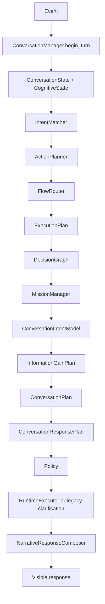
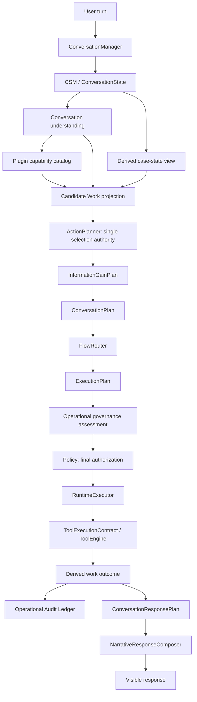

# ACA-019 - Operational Work Model Authority Reassessment

Status: Architecture review only  
Scope: Evidence-based reassessment of Sprint 73 against the current repository  
Runtime impact: none  
Code impact: none  

## 1. Executive Decision

The Work Model hypothesis is directionally correct, but its original shape is
too broad.

ACA does need to represent work explicitly. It does not need a new planner, a
new runtime, a Case Engine, or another persistent state model.

The repository already contains the missing operational representation:

- Candidate Work;
- Case State Projection;
- Operational Governance Assessment;
- Operational Audit Ledger;
- Tool execution contracts;
- a low-risk operational adapter.

The actual gap is authority and causality:

```text
Today:
Runtime decision -> response/execution -> post-hoc work mapping

Target:
conversation understanding -> work decision -> conversation/execution planning
```

The recommended architecture is therefore:

1. keep `ConversationState` and the CSM as the only source of truth;
2. keep `ActionPlanner` as the owner of action selection;
3. promote the existing Candidate Work logic into an upstream, pure operational
   decision projection consumed by `ActionPlanner`;
4. keep `ExecutionPlan` and `RuntimeExecutor` as execution authority;
5. keep Policy as the only final authorization authority;
6. keep `ConversationPlan` responsible only for dialogue continuity;
7. keep `NarrativeResponseComposer` responsible only for verbalization;
8. move domain operation definitions from Core rules into plugin capability
   metadata;
9. retire the post-hoc mapper as a second decision authority after parity is
   proven.

No additional operational planner is justified.

## 2. Evidence Reviewed

Foundational sources:

- ACA-000 through ACA-004 Markdown specifications outside the RC1 repository;
- ACA-005 Cognitive Runtime;
- ACA Conversational Philosophy;
- ACA Vision & Work Model research;
- `docs/architecture/ACA-006_Operational_Work_Model_Architecture.md`;
- operational evidence documents ACA-007 through ACA-017.

Runtime and implementation sources:

- `aca_os/runtime.py:408`;
- `aca_os/conversation_state.py:273`;
- `zero_cost/action_planner.py:9`;
- `zero_cost/flow_router.py:9`;
- `zero_cost/execution_plan.py:66`;
- `aca_os/policy_manager.py:39`;
- `aca_os/runtime_executor.py:68`;
- `aca_os/step_handlers.py:125`;
- `aca_os/step_handlers.py:292`;
- `aca_os/operational_work_mapper.py:22`;
- `aca_os/operational_governance_gate.py:148`;
- `aca_os/operational_audit_ledger.py:54`;
- `aca_os/operational_tools.py:56`;
- `aca_os/evaluation.py:1040`;
- `aca_os/plugin_manifest.py:46`;
- `aca_core/platform_plugins.py:126`;
- `sdk/factory.py:18`.

## 3. Foundational Invariants

The Work Model must preserve these invariants.

| Invariant | Architectural consequence |
| --- | --- |
| Understanding precedes response | Work cannot be inferred in the composer. |
| Language is not reasoning | No operation may be invented by an LLM or prompt. |
| CSM is the source of truth | No independent Case State store is allowed. |
| Every plan answers a goal | Operational work must reference current goal and evidence. |
| Every inference has evidence | Candidate ranking and work selection must be explainable. |
| Every turn has one immediate action | Multiple candidate works are allowed, but one immediate action owns execution. |
| Policy governs, cognition decides | Policy cannot discover a different operation. |
| Conversation is adaptive | Work selection is state-based, not a fixed BPM route. |
| Communication follows cognition | Narrative only communicates the selected work and actual outcome. |

The refined product principle is:

```text
ACA models service work under cognitive control.
Conversation is the interface, not the unit of value.
```

## 4. Current Real Pipeline

The official `ACAOSRuntime.process()` path currently performs:



This ordering exposes a relevant architectural fact: the current action and
execution plan are created before the richer conversation intent, information
gain, conversation plan, and response plan are built.

The official runtime does not call:

- `map_operational_work()`;
- `assess_operational_governance()`;
- `project_operational_audit_ledger()`.

Repository search shows those functions are invoked by `aca_os/evaluation.py`
and tests, not by `ACAOSRuntime.process()` or `RuntimeExecutor`.

## 5. What The Repository Already Implements

### 5.1 Candidate Work

`operational_work_mapper.py` already projects:

- candidate operations;
- ranking;
- primary, secondary, suspended, discarded, and completed work;
- required information;
- available tools;
- expected outcome;
- blockers;
- operational value;
- confidence;
- evidence;
- coherence with conversation plan, execution plan, and policy.

Observed benchmark evidence records:

| Metric | Result |
| --- | ---: |
| Candidate Work Recall | 100% |
| Candidate Work Precision | 92.02% |
| Original Work Ranking Accuracy | 98.91% |
| Case-State Projected Ranking Accuracy | 100% |
| Work Transition Accuracy | 100% |
| Secondary Work Detection | 100% |

This is strong evidence that the current CSM exposes enough information to
identify work. It is not evidence that the mapper is ready to become upstream
authority unchanged.

### 5.2 Case State Projection

The current case state is a reconstructable view derived from:

- conversation facts;
- mission;
- slots and pending questions;
- fulfillment;
- execution outcomes;
- candidate work.

It reaches 100% projected ranking in the existing benchmark without owning or
persisting state. This refutes the need for a `CaseState` owner or Case Engine
for the current scope.

### 5.3 Governance And Ledger

Governance already evaluates:

- risk;
- permission;
- tool availability;
- required evidence;
- confirmation;
- human approval;
- idempotency;
- reversibility;
- regulatory constraints.

The ledger already projects or persists:

- selected work;
- governance decision;
- request;
- response;
- receipt;
- idempotency;
- replay;
- compensation;
- execution status;
- audit trail.

These are operational boundaries, not cognitive planners.

### 5.4 Tool Execution

`ToolExecutionContract` already describes determinism, side effects, dry-run,
replay, shadow support, idempotency, and guarantee. `ToolEngine` already owns
mode selection and safe execution.

`HandoffPackageAdapter` demonstrates a reversible, idempotent operational
write. It is registered by the Galicia SDK factory.

### 5.5 Critical Qualification

The production benchmark does not execute the complete operational chain from
inside the runtime. `run_operational_production_benchmark()` first runs the
normal runtime and then directly orchestrates:

```text
map_operational_work
-> assess_operational_governance
-> project ledger
-> runtime.tool_engine.execute
-> finalize ledger
```

Therefore the repository validates the operational adapter and the external
orchestration contract. It does not yet validate an authoritative operational
decision inside `ACAOSRuntime.process()`.

This is the principal documentation/implementation discrepancy in ACA-017.

## 6. Hypothesis Evaluation

### 6.1 What Is Correct

The user-visible response should be a consequence of useful work, not the
primary objective of the system.

The current runtime cannot answer, before planning its response:

```text
What useful operation am I selecting now, from this role, for this case?
```

`ActionPlan` names a runtime action, but does not represent responsibility,
operational preconditions, work value, case transition, or expected work
outcome.

### 6.2 What Is Incorrect Or Incomplete

The missing concept is not a complete Work Model engine. Most of the model
already exists as projections and execution contracts.

Adding a new `OperationalPlanner` would create three decision authorities:

1. `ActionPlanner`;
2. Candidate Work selection;
3. Operational Planner.

That would violate the single-authority work completed around ExecutionPlan.

### 6.3 Final Hypothesis

The validated hypothesis is:

> ACA needs an explicit operational work decision in the cognitive loop, but
> that decision should evolve the current action-selection boundary and reuse
> existing operational projections. It should not introduce a new planner or
> runtime.

## 7. Current Ownership Map

| Concept | Current owner | Correct future owner | Change |
| --- | --- | --- | --- |
| Conversational facts and focus | `ConversationState` | `ConversationState` | No |
| Cognitive carrier and trace | `CognitiveState` | CSM projection | No new owner |
| Intent recognition | `IntentMatcher` + conversation intent model | Same | No conceptual change |
| Immediate action selection | `ActionPlanner` | `ActionPlanner`, work-aware | Major input evolution |
| Candidate work | `OperationalWorkMapper` after execution | Derived input to `ActionPlanner` | Promote and simplify |
| Case state | Shadow projection | Derived projection from CSM | No persistent owner |
| Dialogue continuity | `ConversationPlan` | `ConversationPlan` | No |
| Question value | `InformationGainPlan` | `InformationGainPlan` | Consume selected work blockers |
| Response ordering | `ConversationResponsePlan` | Same | Consume work decision/outcome |
| Execution authority | `ExecutionPlan` | `ExecutionPlan` | Compile selected work |
| Execution | `RuntimeExecutor` | `RuntimeExecutor` | No |
| Cognitive authorization | `PolicyManager` | `PolicyManager` | Include operational governance evidence |
| Operational risk assessment | Governance Gate shadow | Pure validation used by Policy | Change authority relationship |
| Tool safety | `ToolExecutionContract` + `ToolEngine` | Same | No |
| Work audit | Operational Ledger | Same | Invoke around real tool execution |
| Work verbalization | `NarrativeResponseComposer` | Same | Consume actual work outcome only |
| Role/capability catalog | Plugin handles, public actions, Core rules | Canonical plugin capability metadata | Consolidate |

## 8. Components To Reuse Without Moving Their Boundaries

### ConversationState And CSM

Use them for facts, mission, focus, slots, evidence, user signals, and derived
turn projections. Do not persist a second case model.

The operational decision may be stored in `derived_state` during the turn and
referenced by trace/ledger after execution. It is not a new source of truth.

### ConversationPlan

Keep it as the dialogue plan. It may decide how to ask, pause, resume, or
communicate work. It must not rank operations.

### InformationGainPlan

Keep it as the question cost/benefit mechanism. Its inputs should include the
preconditions and blockers of the selected work so it asks only what can alter
or unlock the operation.

### ExecutionPlan And RuntimeExecutor

Keep them unchanged as concepts. An operational selection must be compiled to
existing steps and handlers. No operation is executable unless represented in
the plan.

### NarrativeResponseComposer

Keep it read-only. It communicates:

- what ACA did;
- what it prepared;
- what is blocked and why;
- what minimal information is needed;
- what happens next.

It never selects or claims an operation.

## 9. Components That Must Not Become Operational Authorities

| Component | Why not |
| --- | --- |
| `IntentMatcher` | Intent is too early and too narrow to represent case work. |
| `ConversationPlan` | It owns dialogue continuity, not business operations. |
| `ConversationResponsePlan` | It orders communication after a decision. |
| `NarrativeResponseComposer` | Language generation must not invent work. |
| `PolicyManager` | Governance authorizes a selected operation; it does not select it. |
| `RuntimeExecutor` | Execution is not planning. |
| `PluginRuntime` | Domain plugins provide capabilities; they cannot create a second brain. |
| Public Product Layer | It is an adapter and must remain presentation-only. |

## 10. Components To Consolidate Or Retire

### 10.1 Post-Hoc Candidate Work Authority

The current mapper may remain as a comparator during migration. It must not
remain as a second selector after `ActionPlanner` becomes work-aware.

Final state:

- candidate generation and ranking occur once;
- `ActionPlan` records the selection;
- `ExecutionPlan` compiles it;
- the benchmark compares, but does not decide.

### 10.2 Hardcoded Domain Operations In Core

`operational_work_mapper.py` and `operational_governance_gate.py` currently
contain domain operation names and text heuristics. That is acceptable for
research, not for the definitive Core.

Operation definitions must move to plugin/domain metadata. Core may retain only
generic categories, scoring rules, risk semantics, and validation invariants.

### 10.3 Duplicate Plugin Manifest Models

The repository has runtime plugin contracts in `aca_os/plugin_manifest.py` and
product/domain plugin manifests in `aca_core/platform_plugins.py`.

Operational metadata must not be added to both. A later compatibility cleanup
must select one canonical manifest schema and make the other an adapter or
remove it after migration.

### 10.4 Governance And Policy Authority

Governance and Policy answer different questions, but only Policy should return
the final allow/block/interrupt decision to the Runtime.

Governance should become a deterministic assessment consumed and recorded by
Policy. Two independent gates would recreate authority duplication.

## 11. Responsibilities That Are Actually Missing

Only four responsibilities are missing from the official cognitive path:

1. enumerate available operational capabilities for the active role;
2. rank candidate work from current CSM evidence before response planning;
3. bind the selected work to an executable action/flow;
4. project the actual work outcome back into response planning and audit.

The repository already has partial implementations for all four. The missing
work is integration and ownership, not conceptual invention.

## 12. Recommended Architecture



The diagram is conceptual. It does not require separate classes for every box.

## 13. Updated Cognitive Flow

```text
Receive input
-> understand conversational act, facts, focus and user need
-> update CSM
-> derive current case view
-> enumerate role capabilities
-> rank candidate work
-> select one immediate operational action
-> determine information worth obtaining
-> plan conversation around that work
-> compile ExecutionPlan
-> authorize through Policy using governance assessment
-> execute through RuntimeExecutor and ToolEngine
-> derive actual work outcome
-> update audit and CSM projections
-> plan and compose the visible response
```

This preserves the ACA-005 rule: reasoning completes before language.

## 14. Integration By Boundary

### 14.1 CSM

Inputs:

- facts;
- evidence;
- active mission;
- goal;
- focus and topic;
- slots;
- current constraints;
- previous work receipts when relevant.

Output:

- one derived operational decision record for the turn.

No independent persistence is added.

### 14.2 Candidate Actions And ActionPlanner

`ActionPlanner` remains the action-selection owner. It evolves from:

```text
intent -> fixed action rule
```

to:

```text
intent + CSM + candidate capabilities + case projection
-> ranked candidate actions
-> selected immediate action
```

The existing deterministic intent rules remain as fallback for plugins that do
not yet declare operational metadata.

### 14.3 Plugins

Plugins own domain semantics:

- role mandate;
- responsibilities;
- operation identifiers;
- category;
- expected outcome;
- required facts/evidence;
- blockers;
- tool binding;
- permission names;
- risk hints;
- supported preparation/delegation alternatives;
- possible case transitions.

Plugins do not rank work globally and do not execute outside Runtime authority.

### 14.4 Policy And Governance

Candidate Work decides what is useful.

Governance assesses whether the selected operation is executable under current
risk, evidence, permission, tool, confirmation, and approval conditions.

Policy consumes that assessment and returns the authoritative runtime decision.

Every modification is explicit and traceable. No silent override is allowed.

### 14.5 ExecutionPlan And RuntimeExecutor

`FlowRouter` maps selected work to an existing flow or step sequence.
`ExecutionPlan` records:

- source operational action;
- selected capability;
- required steps;
- tool binding;
- expected work outcome;
- governance requirements as payload references.

`RuntimeExecutor` executes. It does not re-rank candidates.

### 14.6 Conversation Planning And Narrative

`InformationGainPlan` asks only for data that changes the selected operation,
its safety, or its expected outcome.

`ConversationPlan` organizes continuity around the selected work.

`ConversationResponsePlan` is best finalized using the actual execution outcome
where one exists. It must distinguish:

- completed;
- prepared;
- blocked;
- delegated;
- explained;
- waiting for user;
- waiting for system;
- no action required.

`NarrativeResponseComposer` verbalizes these facts without internal language.

## 15. Contract Strategy

No new contract family should be introduced. Existing experimental contracts
should be stabilized and narrowed.

### 15.1 Operational Capability Metadata

Extend the canonical plugin capability declaration. Do not create a separate
capability registry.

Minimum semantics:

- stable operation id;
- responsibility;
- operational category;
- expected outcome;
- required information and evidence;
- availability and blocker rules;
- tool binding;
- permission and risk metadata;
- possible state transition;
- safe fallback: prepare, explain, delegate, or block.

### 15.2 Operational Work Decision

Promote the current `operational_work_shadow.v1` shape after removing post-hoc
inputs. The stable decision record should contain:

- candidate work in priority order;
- selected immediate work;
- evidence and confidence;
- selection reason;
- expected outcome;
- blockers and missing preconditions;
- source capability;
- case-state projection reference.

This is a derived decision record, not persistent state.

### 15.3 Operational Work Outcome

Do not create an independent outcome engine. Project the outcome from:

- `ExecutionStepOutcome`;
- `PolicyResult`;
- `ToolResult` and receipt;
- ledger finalization;
- relevant case-state change.

The projection is what response planning and observability consume.

## 16. Causality Rule

The current mapper reads post-decision structures including response plan,
fulfillment, execution plan, and runtime outcomes. That is valid for audit but
invalid for upstream selection.

An authoritative work decision may read only information available before it
is created:

- current CSM and ConversationState;
- conversation understanding;
- mission and goals;
- prior persisted receipts/evidence;
- plugin capability metadata;
- current tool availability;
- declared permissions and constraints.

It must not read:

- current-turn response text;
- current-turn response plan;
- current-turn fulfillment;
- current-turn execution outcomes;
- current-turn ledger finalization.

This rule is the main acceptance boundary for implementation.

## 17. Migration Plan

### Phase 0 - Freeze And Baseline

- Keep the current runtime unchanged.
- Record current conversational and operational benchmark results.
- Mark ACA-017 as adapter/harness validation, not end-to-end Runtime authority.

### Phase 1 - Pre-Decision Shadow Projection

- Reuse `OperationalWorkMapper` behind its current API.
- Add a pre-decision input mode that excludes response, fulfillment, execution,
  and outcome signals.
- Compare pre-decision selection with the existing post-hoc projection.
- Do not change visible response or execution.

Exit criterion: parity and safety thresholds are met without post-hoc evidence.

### Phase 2 - Capability Metadata Consolidation

- Select one canonical plugin manifest model.
- Move operation definitions and domain rules from Core to plugin metadata.
- Keep Core ranking generic and deterministic.
- Preserve intent-only ActionPlanner rules as compatibility fallback.

Exit criterion: every selected operation has one declared capability owner.

### Phase 3 - ActionPlanner Controlled Adoption

- Let `ActionPlanner` consume the pre-decision Candidate Work projection for one
  low-risk operation.
- Keep the old intent-only plan in shadow comparison.
- Store the work decision as derived CSM state.

Recommended first slice: informative/protective work or `prepare_handoff` in
dry-run. Do not start with external writes.

### Phase 4 - Plan And Policy Alignment

- Compile selected work into `ExecutionPlan`.
- Pass governance assessment to Policy.
- Ensure Policy authorizes, blocks, or requires confirmation without selecting
  a replacement operation silently.

### Phase 5 - Outcome-Grounded Communication

- Project actual work outcome from existing execution and ledger records.
- Let `ConversationResponsePlan` and `NarrativeResponseComposer` communicate the
  real outcome.
- Reject optimistic statements unsupported by receipt/evidence.

### Phase 6 - Legacy Removal

- Remove post-hoc work selection as a runtime decision path.
- Remove duplicated Core domain rules.
- Remove the non-canonical plugin manifest implementation after adapters and
  compatibility tests are complete.
- Keep mapper comparison utilities only in evaluation if they still catch
  regressions.

## 18. Compatibility Strategy

| Surface | Compatibility rule |
| --- | --- |
| `ACAOSRuntime.process()` | Signature and return type unchanged. |
| Public endpoint | Same endpoint and visible payload; work trace is additive introspection. |
| Studio | Read-only projection of the same runtime decision. |
| Plugins without work metadata | Continue through existing intent/action rules. |
| Existing `ExecutionPlan` consumers | New payload fields optional and versioned. |
| Existing tools | Tool contracts unchanged. |
| Existing conversation contracts | Remain owners of their current responsibilities. |
| Benchmarks | Existing suites remain; new metrics are additive. |

Use one central adoption policy, not distributed feature flags:

```text
operational authority enabled for declared capability X
```

All other capabilities continue through the current ActionPlanner path.

## 19. Benchmarks Required Before Authority

Do not add another broad benchmark family. Extend the existing operational
benchmark with authority and causality metrics.

| Metric | Purpose | Minimum acceptance |
| --- | --- | ---: |
| Pre-decision Work Recall | Correct work exists without post-hoc signals | >= 98% |
| Pre-decision Primary Accuracy | Rank 1 work is correct | >= 99% |
| Candidate Precision | Avoid irrelevant extra work | >= 97% |
| Post-hoc Parity | Upstream decision matches validated shadow result | >= 99% |
| Impossible Work Rate | Unsupported operation selected | 0% |
| Unauthorized Selection Rate | Work outside role/permission selected | 0% |
| Capability Binding Coverage | Selected work maps to a declared plugin capability | 100% |
| ExecutionPlan Fidelity | Plan compiles selected work without reinterpretation | 100% |
| Outcome Evidence Coverage | Claimed work has outcome/receipt evidence | 100% |
| Question Utility | Questions unlock or alter work | >= 95% |
| Visible Response Regression | Existing behavior changes in shadow | 0 |
| Public/Runtime/Studio Parity | Same operational decision across surfaces | 100% |

Required scenario classes:

- multiple simultaneous needs;
- work that is useful but blocked;
- work outside the role mandate;
- operation available only as preparation;
- operation requiring confirmation;
- operation requiring human approval;
- tool unavailable;
- evidence incomplete;
- user correction invalidating prior work;
- topic change and resumed work;
- operation already completed;
- no operational work required;
- plugin without operational metadata;
- two plugins offering the same category under different permissions.

## 20. Architectural Risks

### Risk 1 - Circular Decision Making

If work selection reads `ConversationResponsePlan` or current-turn outcomes, it
cannot validly drive those same structures.

Mitigation: enforce the causality rule and benchmark input ablation.

### Risk 2 - A Domain Rule Monolith In Core

The current mapper and governance profiles hardcode operation names from
insurance, telecom, billing, and service management.

Mitigation: move domain operations to plugins; keep only generic evaluation
semantics in Core.

### Risk 3 - Duplicate Selection Authority

`ActionPlanner`, Candidate Work, and a future planner could disagree.

Mitigation: `ActionPlanner` remains the single selection authority; Candidate
Work is its evidence/projection, not another planner.

### Risk 4 - Duplicate Authorization Authority

Policy and Governance could independently allow or block work.

Mitigation: Governance produces an assessment; Policy returns the authoritative
decision.

### Risk 5 - False Confidence From Current Production Benchmark

The current benchmark validates direct evaluator orchestration, not end-to-end
Runtime ownership.

Mitigation: add an official low-risk slice only after pre-decision parity, then
prove the same chain through `ExecutionPlan` and `RuntimeExecutor`.

### Risk 6 - Case State Duplication

A persistent Case State would compete with ConversationState/CSM.

Mitigation: retain a reconstructable projection until an external system owns
case facts that cannot be derived from ACA state.

### Risk 7 - BPM Drift

Operational metadata can turn into fixed workflows and mandatory sequences.

Mitigation: capabilities declare possible work and constraints; state-based
selection remains adaptive and only the immediate action is committed.

### Risk 8 - Optimistic Verbalization

The response may claim work before a receipt or execution outcome exists.

Mitigation: separate expected outcome from actual outcome and let narrative use
the latter for completion claims.

## 21. What Should Be Created

No new engine or planner should be created.

The minimum implementation work is:

1. evolve the existing `OperationalWorkMapper` responsibility into a causal
   pre-decision projection;
2. enrich one canonical plugin capability schema;
3. evolve `ActionPlanner` to consume the projection;
4. compile selected work through existing `FlowRouter` and `ExecutionPlan`;
5. let Policy consume existing governance evidence;
6. derive outcomes from existing runtime/tool/ledger records.

These are changes to ownership and integration, not new conceptual components.

## 22. What Should Be Eliminated Eventually

- post-hoc work mapping as a second selector;
- domain operation text rules embedded in generic Core;
- duplicated plugin manifest ownership;
- independent allow/block authority in Governance once Policy consumes it;
- benchmark-only orchestration presented as official Runtime execution;
- any response-planning rule that selects operational work.

Nothing should be removed before shadow parity and compatibility gates pass.

## 23. Acceptance Criteria For The First Implementation

The first operational slice is accepted only if:

- `ConversationState` remains the sole conversational source of truth;
- no new persistent Case State exists;
- no new planner or runtime exists;
- selected work is available before response planning;
- selected work does not depend on current-turn response or outcomes;
- `ActionPlanner` is the only work-selection authority;
- `ExecutionPlan` exactly reflects the selected work;
- Policy is the only final authorization authority;
- tools execute only through `ToolEngine` and their contracts;
- narrative claims only actual outcomes;
- all existing tests and benchmarks remain green;
- operational authority metrics meet the thresholds in section 19.

## 24. Final Recommendation

Do not implement the Work Model described in the research as a new layer.

Implement the smallest valid evolution:

```text
existing CSM
-> causal Candidate Work projection
-> existing ActionPlanner authority
-> existing ConversationPlan / ExecutionPlan
-> existing Policy / RuntimeExecutor / ToolEngine
-> derived work outcome
-> existing NarrativeResponseComposer
```

The Work Model is justified as an explicit operational decision record. It is
not justified as a new planner, runtime, state owner, or workflow engine.

The immediate next engineering Sprint should be:

```text
Operational Work Causality Validation
```

Its sole purpose would be to prove that the current 100% projected ranking can
be reproduced from pre-decision state without reading response, fulfillment,
execution-plan, or runtime-outcome evidence. Only after that proof should ACA
promote operational selection into the official cognitive path.
