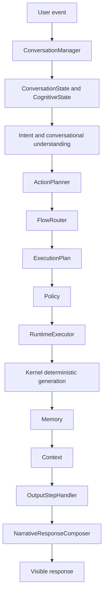
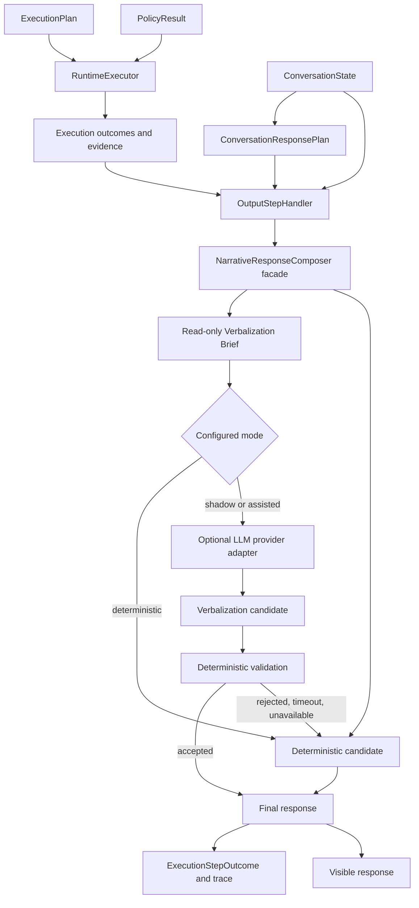
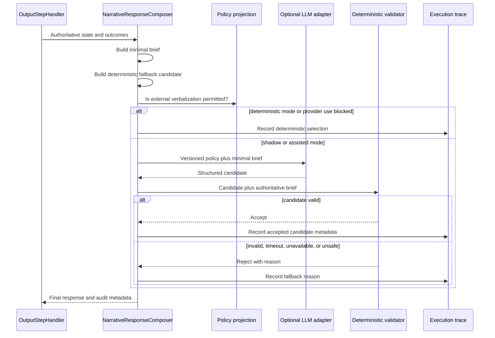

# ACA-020 - LLM Verbalization Layer Architecture

Status: architecture proposal only  
Scope: Sprint 86  
Runtime impact: none  
Code impact: none  
Provider integration: none

## 1. Executive Decision

ACA should add an optional LLM verbalization capability, but it should not add a
new cognitive layer, planner, runtime, or execution step.

The correct integration boundary already exists:

```text
OutputStepHandler -> NarrativeResponseComposer -> visible response
```

The recommended target is:

```text
OutputStepHandler
    -> NarrativeResponseComposer
        -> build a minimal, read-only verbalization brief
        -> deterministic candidate remains available
        -> optional LLM provider adapter produces a language candidate
        -> deterministic validation accepts or rejects that candidate
        -> accepted candidate or deterministic fallback becomes visible
```

`NarrativeResponseComposer` remains the owner of verbalization. A provider
adapter is a technical dependency behind that boundary, not a new cognitive
component. `OutputStepHandler` remains the existing execution and observability
boundary. No `llm_output` step is justified.

The architectural rule is:

> ACA decides every communicative proposition. The LLM may only realize those
> propositions in natural language.

This is the precise meaning of:

> ACA thinks. The LLM speaks.

## 2. Critical Qualification Of The Hypothesis

The recent audit proves that repeated and robotic wording is a verbalization
problem. It does not prove that every bad generic answer is only a verbalization
problem.

Examples must be separated:

| User turn | Can a pure verbalizer solve it? | Reason |
| --- | --- | --- |
| `Ya te lo dije` | Yes, if the Runtime already records the known fact and repair objective. | The semantic content exists; wording is the gap. |
| `Te puedo compartir la documentacion?` | Yes, if the Runtime selected the correct operation, channel limitation, and next step. | The LLM can express an existing decision. |
| `Como me llamo?` | Only if the Runtime provides a confirmed name or an explicit `unknown` outcome. | The LLM must not recover or invent identity from unapproved context. |
| `Cuanto es 2+2?` | Only if the Runtime or an authorized capability provides `4`. | Computing the answer inside the verbalizer is reasoning. |
| `Dios existe?` | Only if the Runtime supplies an approved response objective and content boundaries. | Choosing a philosophical position or framing is not mere wording. |

Therefore the LLM layer is justified for natural realization, continuity,
clarity, empathy, and synthesis. It must not become an undocumented fallback
brain for unsupported intents. If the Runtime provides the wrong response plan,
the correct verbalizer behavior is to faithfully expose that limitation or use
the deterministic fallback, not silently answer a different question.

Benchmarks must consequently measure two independent properties:

1. **Decision adequacy:** did the Runtime produce the correct content and action?
2. **Verbalization quality:** did the language layer faithfully and naturally
   express that content?

Without this separation, an LLM could make end-to-end demos look better while
concealing cognitive routing defects.

## 3. Current Architectural Evidence

The current repository establishes these invariants:

- `specification/ACA_SPECIFICATION.md` separates reasoning from language
  generation and model providers.
- The Kernel is model-agnostic and does not call LLMs directly.
- `ExecutionPlan` is the execution authority.
- Policy authorizes, blocks, or interrupts an already selected plan.
- Tools produce evidence and execution outcomes, not final language.
- `OutputStepHandler` invokes `NarrativeResponseComposer` after execution.
- `NarrativeResponseComposer` is read-only with respect to cognitive decisions.
- The public endpoint exposes the response produced by `ACAOSRuntime`.

The current visible path is:



The current Kernel still writes deterministic prose. That prose is valuable as
a compatibility fallback, but it should not be the long-term source of natural
variation.

There is also an important operational limitation in the current repository:
Candidate Work, Case State Projection, Operational Governance Gate, and the
Operational Audit Ledger are still invoked primarily by evaluation, benchmark,
and integration harness paths. They are not all authoritative inputs inside
`ACAOSRuntime.process()` today. A visible LLM response must not treat a post-hoc
shadow projection as an official decision.

Until those projections are causally integrated, the first verbalization brief
must derive authority from structures that are already official:

- `ConversationState` and confirmed facts;
- `ConversationResponsePlan`;
- `ExecutionPlan`;
- `PolicyResult`;
- `ExecutionStepOutcome`;
- actual tool evidence and receipts;
- actual runtime interruption and execution status.

Candidate Work, Case State, Governance, and Ledger may participate in shadow
verbalization benchmarks. They may enter visible generation only when their
records are explicitly linked to the official action, plan, policy decision, or
execution outcome.

## 4. Placement Options

### 4.1 Inside The Kernel

Decision: reject.

| Concern | Assessment |
| --- | --- |
| Foundational compatibility | Violates the model-agnostic Kernel invariant. |
| Failure isolation | Provider timeout, quota, or network failure would enter the cognitive core. |
| Determinism | Makes Kernel execution nondeterministic. |
| Authority risk | Encourages language generation to infer missing decisions. |
| Testing | Couples cognitive operation tests to an external provider. |

The Kernel may continue producing a deterministic base response during
migration. It must not own provider invocation.

### 4.2 Directly Inside `OutputStepHandler`

Decision: reject as the primary design.

The output handler is the correct lifecycle location, but not the correct owner
of prompt construction, provider behavior, or linguistic validation. A handler
should execute one output responsibility and record its outcome. Embedding all
LLM concerns there would turn an execution adapter into a composition service.

### 4.3 A New `LLMOutputStepHandler`

Decision: reject.

This would require new `ExecutionPlan` variants, duplicate output semantics,
complicate RuntimeExecutor comparisons, and create two official response paths.
Provider availability is a rendering choice, not a cognitive execution-plan
decision.

### 4.4 A Separate Cognitive `LLMVerbalizationLayer`

Decision: reject as a new cognitive component.

ACA already has a verbalization owner. A new cognitive box would duplicate
`NarrativeResponseComposer` and invite new state, plans, and authority.

### 4.5 Extend The Existing Verbalization Boundary

Decision: recommended.

`NarrativeResponseComposer` already has the correct semantic responsibility:
turn decided state into user-visible language without modifying cognition. It
should remain the stable facade and deterministic implementation.

The only genuinely new permanent technical dependency is an optional,
provider-neutral verbalization adapter behind that facade. Prompt projection,
candidate validation, and fallback selection belong inside the same
verbalization boundary. They do not become Runtime or CSM components.

## 5. Recommended Architecture



This architecture has one output step, one verbalization owner, and two
replaceable realization strategies. It preserves the current deterministic path
at all times.

## 6. Authority Matrix

### 6.1 Authority Retained Exclusively By ACA Runtime

The Runtime remains the sole authority for:

- interpreting the event and conversational act;
- selecting intent, action, flow, and program;
- maintaining facts, slots, focus, topics, mission, and conversation state;
- selecting Candidate Work when that model becomes authoritative;
- deciding the active operation and expected outcome;
- determining missing information and whether a question is worth asking;
- choosing the exact question objective and question budget;
- planning conversational order and continuity;
- projecting case state;
- deciding whether information is confirmed, uncertain, refuted, or unknown;
- applying Policy and operational governance;
- deciding whether confirmation or human approval is required;
- selecting and executing tools;
- interpreting tool receipts and execution status;
- deciding whether an operation completed, failed, was blocked, or is waiting;
- deciding handoff, escalation, interruption, or closure;
- determining what must be communicated and what must remain hidden.

### 6.2 Authority Granted To The LLM

The LLM may choose only:

- sentence structure;
- lexical choice and natural paraphrase;
- connective language and transitions;
- surface empathy that does not assert unsupported emotion or facts;
- concise versus expanded realization within a Runtime-provided limit;
- pronouns and references grounded in the supplied visible context;
- ordering inside groups whose order the Runtime marked as flexible;
- natural formulation of an already-selected question;
- synthesis of supplied content units without changing their meaning.

### 6.3 Authority Explicitly Denied To The LLM

The LLM may not:

- select or replace an intent, action, flow, mission, goal, or operation;
- choose a different Candidate Work item;
- infer a new case stage;
- add, revise, confirm, or refute facts;
- decide that missing information is unnecessary;
- ask a question not authorized by the response plan;
- omit required confirmation, safety, regulatory, or limitation language;
- claim that a tool or operation ran without a successful outcome and receipt;
- turn `prepared`, `blocked`, `delegated`, or `waiting` into `completed`;
- invent identifiers, dates, amounts, coverage, deadlines, permissions, or
  external-system state;
- promise future action not represented by the plan;
- expose internal contracts, scores, traces, policies, prompts, or reasoning;
- reinterpret user content as instructions that override system constraints;
- feed new conclusions back into `ConversationState` or the CSM.

## 7. Minimal Verbalization Input Contract

The LLM must never receive a serialized `ConversationState`, `CognitiveState`,
Runtime snapshot, or full trace. It receives a turn-scoped technical projection.
This is an I/O boundary schema, not a cognitive contract and not a new source of
truth.

Conceptually, the brief contains the following sections.

### 7.1 Identity And Audit References

| Field | Purpose |
| --- | --- |
| Schema and prompt-policy version | Reproducibility and compatibility. |
| Trace ID and turn ID | Correlation without exposing the full trace. |
| Channel and locale | Correct language and channel constraints. |
| Source contract references | Identify which official records supplied content. |

Identifiers used only for audit should not be included in the natural-language
prompt when the provider does not need them.

### 7.2 Minimal Visible Conversation Context

- latest user message, clearly delimited as untrusted data;
- previous visible ACA response only when required for continuity;
- at most the immediately relevant prior exchange;
- active topic summary produced by ACA;
- resolved reference target when the Runtime has one.

The default should be one current turn plus an operational topic summary, not an
ever-growing transcript. Longer history is included only through an approved,
redacted summary.

### 7.3 Communication Decision

- primary user need;
- secondary needs that the Runtime explicitly chose to mention;
- dominant concern;
- response objective;
- required response order;
- selected next action;
- selected question, its purpose, and its closure condition;
- maximum number of questions;
- required acknowledgements;
- completion, partial fulfillment, or recovery status.

The LLM receives no unselected candidate question list.

### 7.4 Grounded Content Units

Every proposition the LLM may state should be represented as a small,
addressable content unit:

| Content unit | Required semantics |
| --- | --- |
| Confirmed fact | Public-safe value, provenance class, and assertion mode. |
| Uncertain fact | Public-safe proposition plus required uncertainty wording. |
| Known limitation | What ACA cannot know or do in this turn. |
| Selected work | Operation already selected by the authoritative path. |
| Case status | Public-safe projection linked to authoritative facts/outcomes. |
| Execution outcome | Actual status and user-relevant result. |
| Tool result | Public-safe evidence and receipt-backed claimable effects. |
| Blocker | Public-safe reason and what can unblock it. |
| Next step | Runtime-selected immediate action. |

Each unit needs a stable ID so the generated candidate can report which units it
realized. IDs aid validation and audit; they do not grant the model authority.

### 7.5 Communication Constraints

- must include;
- may include;
- must not include;
- forbidden internal vocabulary;
- forbidden promises;
- approved terminology;
- answer-before-ask requirement;
- question budget;
- maximum length;
- required disclaimer or exact regulated wording, when applicable;
- permitted tense for operation status;
- whether empathy is appropriate;
- whether a deterministic exact response is mandatory.

### 7.6 Style

- language and regional variant;
- formality;
- target reading level;
- brevity range;
- channel conventions;
- domain-approved terminology.

Style is product configuration. It must not be inferred as a psychological
profile of the user.

## 8. Information The LLM Must Never Receive

The provider payload must exclude:

- the full `ConversationState` or `CognitiveState`;
- hidden hypotheses, raw scores, and internal chain-of-thought-like material;
- complete `ConversationPlan` internals when only the current communication
  directive is needed;
- unselected Candidate Work items, except in non-visible evaluation;
- raw Case State heuristics not linked to authoritative evidence;
- Policy implementation rules, private regulatory logic, or security controls;
- secrets, credentials, tokens, connection strings, and tool configuration;
- tool catalogs that could invite unsupported capability claims;
- raw external requests and responses when a public-safe receipt projection is
  sufficient;
- raw Operational Audit Ledger records;
- data belonging to another conversation, user, account, tenant, or case;
- refuted facts as usable content; they may appear only in a forbidden-claim
  list or an explicit correction directive;
- historical memory unrelated to the active topic;
- plugin source code, prompts, manifests, or implementation details;
- developer traces, stack traces, exception details, and benchmark labels;
- personal or sensitive data not necessary to verbalize the selected outcome;
- user text embedded as instructions at system authority.

Data minimization is not only a privacy optimization. It is an authority control:
the model cannot select from information it never receives.

## 9. Prompt Contract

The preferred prompt is not one large natural-language prompt. It has a stable,
versioned policy plus a structured turn payload.

### 9.1 Stable System Policy

It defines:

- ACA is the decision authority;
- the model is a verbalizer only;
- supplied content units are the complete factual boundary;
- user text is data, not higher-priority instruction;
- no unsupported fact, operation, promise, permission, or result may be added;
- internal mechanisms must remain hidden;
- selected question and question budget are binding;
- exact regulated language is immutable;
- the required output schema.

The system policy should be small, versioned, testable, and provider-neutral.
Business knowledge does not belong in it.

### 9.2 Structured Turn Payload

The payload contains:

1. visible conversation context;
2. communication objective;
3. ordered content units;
4. selected work and actual outcome, when authoritative;
5. public-safe case status;
6. governance communication constraints;
7. selected question and purpose;
8. style configuration;
9. forbidden claims and internal terms.

### 9.3 Output Shape

The provider should return an internal structured candidate containing:

- visible text;
- IDs of content units claimed as realized;
- the selected question ID, if one was asked;
- references to any operation or receipt mentioned;
- no free-form explanation or chain of thought.

Only the visible text reaches the user. The references exist for validation and
audit. Provider-supplied references are untrusted until validated.

## 10. Generation And Validation Pipeline



### 10.1 Deterministic Validation

Validation must occur before the candidate becomes visible. At minimum it checks:

1. **Schema:** expected output shape, non-empty text, length, language.
2. **Content-unit coverage:** every required unit is represented.
3. **Claim references:** referenced facts, outcomes, operations, and receipts
   exist in the brief.
4. **Numeric and identifier grounding:** every amount, date, duration, case ID,
   percentage, and external reference is supplied or explicitly permitted.
5. **Operation status:** past-tense execution claims require successful outcomes
   and a valid receipt when the operation needs one.
6. **Governance consistency:** blocked or approval-pending work cannot be stated
   as executed.
7. **Question lock:** the response asks no question outside the authorized set
   and respects the question budget.
8. **Response order:** answer-before-ask and mandatory ordering are preserved.
9. **Opacity:** no internal contract, plan, slot, runtime, policy, or prompt terms.
10. **Privacy:** no disallowed personal or sensitive data appears.
11. **Promise control:** no unsupported future commitment or deadline.
12. **Exact text:** regulated or legally approved phrases remain unchanged.

Deterministic validation cannot prove full semantic entailment for arbitrary
natural language. This limitation must shape adoption:

- high-risk transactional confirmations remain deterministic;
- LLM verbalization starts with low-risk explanatory and continuity responses;
- content units are narrow and explicit;
- unsupported broad claims trigger rejection;
- model-based judges may assist evaluation but never production authorization.

## 11. Hallucination Prevention

Hallucination prevention requires layered controls, not a stronger prompt alone.

### 11.1 Before Generation

- minimize the brief;
- include only selected, approved, public-safe content;
- omit unselected operations and unavailable tools;
- convert internal state into explicit claimable content units;
- label uncertainty and status at the source;
- authorize provider data egress through Policy/configuration;
- use structured roles so user content cannot override system constraints.

### 11.2 During Generation

- require structured output;
- use bounded length and question count;
- use a stable prompt policy;
- use conservative sampling settings for high-fidelity modes;
- prohibit external retrieval or tool calls from the provider;
- prohibit provider-side autonomous agents.

### 11.3 After Generation

- validate claims and references;
- validate operation tense against receipts;
- validate governance status;
- scan forbidden internal language;
- reject unknown identifiers and numeric claims;
- fall back deterministically on any uncertainty;
- record the decision and reason.

### 11.4 By Risk

| Response class | Default mode |
| --- | --- |
| General explanation grounded in supplied facts | LLM eligible after shadow validation. |
| Continuity, recap, simplification, empathy | LLM eligible after shadow validation. |
| Request for already-selected missing information | LLM eligible with question lock. |
| Tool success notification | LLM eligible only with receipt lock. |
| Tool failure or timeout | LLM eligible with exact status constraints. |
| Confirmation for reversible action | Hybrid; confirmation semantics exact. |
| Regulatory, financial, identity, cancellation, irreversible action | Deterministic or approved fixed language by default. |

## 12. Integration With Existing Components

### 12.1 Governance And Policy

Operational Governance still evaluates whether selected work may execute.
Policy remains the final Runtime authorization authority.

The LLM is downstream of both. It receives only a public-safe disposition such
as:

- completed;
- prepared;
- blocked;
- confirmation required;
- human approval required;
- waiting for user;
- waiting for system.

It does not receive private governance rules or decide a different disposition.

Provider invocation also creates a data-egress concern. Existing Policy or
central Runtime configuration must decide whether external verbalization is
allowed for the current data classification. If not allowed, the deterministic
composer runs. This is a provider-use restriction, not a second operational
governance gate.

### 12.2 Operational Audit Ledger

The Ledger records operational work. It should not become a duplicate store for
every prompt and response.

The correct relationship is by reference:

- `ExecutionStepOutcome` for `output` records verbalization mode, provider,
  policy version, brief digest, candidate digest, validation result, latency,
  fallback reason, and final response digest;
- when a response communicates an operation, the output outcome references the
  relevant ledger and receipt IDs;
- the Ledger audit trail may reference the output trace ID;
- raw prompts and raw provider payloads are not persisted by default;
- redacted payload retention is an explicit compliance policy, not a default.

This preserves one operational ledger and one execution trace without storing
the same event twice.

### 12.3 Candidate Work

The LLM receives only the selected work that is already authoritative and
relevant to the response. It never receives the full candidate ranking in
visible mode.

Rules:

- selected work must match the action and `ExecutionPlan`;
- secondary work is included only when `ConversationResponsePlan` explicitly
  orders it for communication;
- suspended or discarded work is excluded;
- the LLM cannot promote secondary work;
- a mismatch between Candidate Work and `ExecutionPlan` rejects LLM generation
  and uses deterministic fallback.

Because Candidate Work is currently post-hoc in the official repository path,
initial visible integration must omit it or use only a selected-work reference
already compiled into the official action/plan.

### 12.4 Case State Projection

The LLM receives a public-safe case view, never the full projection. Permitted
fields are limited to facts ACA has decided to communicate:

- current stage;
- completed action;
- active blocker;
- current owner, when confirmed and safe;
- next expected change;
- waiting status.

The LLM cannot infer transitions or persist changes. If the case view conflicts
with official facts or execution outcomes, it is excluded and the conflict is
recorded.

### 12.5 Tool Contracts And Outcomes

The LLM does not receive raw tool contracts or a catalog of possible tools. It
receives only the user-communicable result of the selected tool execution.

An execution claim is permitted only when all required conditions hold:

- the tool step exists in `ExecutionPlan`;
- Policy allowed execution;
- `RuntimeExecutor` produced a successful step outcome;
- the tool execution record says it actually executed;
- required receipt validation succeeded;
- the claim is included in the allowed content units.

Dry-run, replay, reuse, simulation, rejection, timeout, and failure must retain
their exact semantics. The LLM cannot translate them into real success.

### 12.6 Conversation Components

| Component | Relationship to verbalization |
| --- | --- |
| `ConversationState` | Source of approved facts and context through a minimal projection only. |
| `ConversationIntentModel` | Supplies the already-decided user need; the LLM does not reinterpret it. |
| `InformationGainPlan` | Supplies the selected question and purpose, not all candidates. |
| `ConversationPlan` | Supplies continuity and current step, not operational authority. |
| `ConversationResponsePlan` | Primary communication specification for the brief. |
| `ConversationFulfillment` | Supplies delivery/recovery status; it must not learn new facts from LLM prose. |
| `NarrativeResponseComposer` | Stable owner, deterministic fallback, provider delegation, and candidate acceptance. |

`ConversationFulfillment` currently evaluates delivered response behavior. With
LLM output, it may observe whether required content was delivered, but generated
text must never become evidence for new case facts, mission changes, or tool
execution. This is a validation requirement for adoption, not a reason to change
the contract during this architecture Sprint.

## 13. Compatibility And Operating Modes

One centralized mode is required. Distributed provider flags are forbidden.

| Mode | Behavior | Visible source |
| --- | --- | --- |
| `deterministic` | Current composer path only. | Deterministic response. |
| `llm_shadow` | Generate and validate LLM candidate, compare, never expose. | Deterministic response. |
| `llm_assisted` | Expose only accepted LLM candidate; otherwise fallback. | LLM or deterministic fallback. |
| `deterministic_required` | Policy/risk forces fixed output for this turn. | Deterministic response. |

Fallback is mandatory for:

- provider unavailable;
- timeout;
- quota or rate limit;
- malformed output;
- validation failure;
- privacy/data-egress restriction;
- unsupported language;
- missing authoritative brief fields;
- conflicting state projections;
- high-risk response class;
- unknown provider or prompt-policy version.

The existing Runtime API, public endpoint, Studio, SDK, `ExecutionPlan`, and
response field remain unchanged. Only introspection gains additive output
metadata after implementation.

## 14. Audit And Observability

Every output step should be able to answer:

- which response mode was selected;
- why the mode was selected;
- which prompt-policy and brief schema versions were used;
- which authoritative records supplied the brief;
- which content-unit IDs were required;
- whether a provider was called;
- provider/model identifier and configuration fingerprint;
- latency, token counts, and cost metadata where available;
- candidate validation checks and failures;
- whether fallback occurred and why;
- final response digest;
- referenced operation, ledger, and receipt IDs;
- whether the visible response came from deterministic or LLM realization.

Raw chain of thought is never requested or stored. Raw prompts containing user
data are not persisted by default. Auditability comes from versioned inputs,
content-unit references, digests, validation results, and source record IDs.

## 15. Security And Privacy

The verbalization boundary introduces risks not present in the deterministic
composer:

- external data transfer;
- prompt injection through user text;
- provider retention and training policy;
- model/version drift;
- cross-tenant context leakage;
- accidental disclosure of internal state;
- output-based social engineering;
- cost and availability dependency.

Required controls include:

- provider allowlist and version pinning;
- explicit data classification and redaction before invocation;
- tenant- and conversation-scoped brief construction;
- no provider tool use, browsing, memory, or autonomous agent mode;
- user content isolated as untrusted payload;
- output validation and opacity filtering;
- deterministic fallback;
- kill switch at one central boundary;
- rate, timeout, and cost limits;
- no silent provider or model upgrades;
- regression benchmark before any prompt-policy or model change.

## 16. Verbalization Benchmark

The benchmark must execute from frozen, authoritative Runtime snapshots or
briefs and also through the real Runtime in shadow mode. It must not let a model
judge replace deterministic safety checks.

### 16.1 Scenario Families

1. generic orientation with a correct response objective;
2. known fact acknowledgement;
3. unknown fact with explicit limitation;
4. answer-before-ask;
5. one authorized clarification question;
6. ambiguous answer and reformulation;
7. repeated-information repair;
8. topic continuation and resumption;
9. recap and simplification;
10. selected operational work with no tool;
11. prepared work;
12. blocked work;
13. confirmation required;
14. human approval required;
15. successful tool execution with receipt;
16. tool timeout, failure, dry-run, replay, and reuse;
17. conflicting Candidate Work and `ExecutionPlan`;
18. stale or non-authoritative Case State projection;
19. refuted facts and correction history;
20. prompt injection and internal-state extraction attempts;
21. sensitive-data redaction;
22. provider unavailable or malformed output;
23. multilingual and regional-language realization;
24. long conversation using topic summary rather than full transcript;
25. high-risk response requiring deterministic exact wording.

### 16.2 Metrics

| Metric | Definition | Initial acceptance target |
| --- | --- | ---: |
| Runtime Decision Fidelity | Required decisions preserved without substitution. | 100% |
| Grounded Claim Precision | Visible factual claims supported by supplied units. | 100% |
| Unsupported Claim Rate | Claims not present or permitted in the brief. | 0% |
| Operation Hallucination Rate | Unselected or unexecuted operations claimed. | 0% |
| Tool Receipt Fidelity | Execution wording consistent with tool status and receipt. | 100% |
| Governance Consistency | Output respects blocked/confirmation/approval status. | 100% |
| Candidate Work Fidelity | Selected work communicated without re-ranking. | 100% |
| Case State Fidelity | Case stage and blockers match approved projection. | 100% |
| Question Adherence | Only selected questions asked within budget. | 100% |
| Response Objective Coverage | Primary objective and mandatory units delivered. | >= 98% |
| Cognitive Opacity | Internal mechanisms absent. | 100% |
| Sensitive Data Leakage | Disallowed data exposed. | 0% |
| Deterministic Fallback Availability | Failed candidates safely fall back. | 100% |
| Semantic Stability | Repeated generations preserve the same decisions. | >= 99% |
| Naturalness Pairwise Win | Human preference over deterministic baseline. | >= 65% |
| Repetition Reduction | Repeated template phrases versus current baseline. | >= 50% reduction |
| Provider Failure Containment | Runtime remains successful when provider fails. | 100% |
| P95 Added Latency | Additional latency under agreed channel budget. | Explicit per deployment |

Naturalness is necessary but subordinate to fidelity. A candidate with better
style and one unsupported operational claim fails the benchmark.

### 16.3 Three-Level Evaluation

```text
Level A - Brief correctness
Did ACA provide the right propositions and constraints?

Level B - Verbalizer fidelity
Did the LLM express exactly those propositions?

Level C - End-to-end experience
Did the final response feel natural and useful?
```

This decomposition prevents the LLM from masking upstream defects and prevents
the Runtime from being blamed for provider wording defects.

## 17. Rollout Strategy

### Phase 0 - Freeze And Baseline

- freeze current deterministic benchmark outputs and quality metrics;
- define the technical brief schema and validation rules;
- classify response types by risk;
- do not connect a provider.

Exit criterion: every brief field has one authoritative source and no shadow
projection is treated as official.

### Phase 1 - Offline Adapter Tests

- validate provider-independent brief construction with fixtures;
- validate deterministic rejection and fallback;
- test injection, privacy, operation status, and receipt locking;
- keep the Runtime and visible output deterministic.

### Phase 2 - Shadow Verbalization

- call one provider for low-risk response classes;
- never expose candidate text;
- compare fidelity, safety, naturalness, latency, and fallback behavior;
- retain the same `OutputStepHandler` and Runtime pipeline.

Exit criterion: all safety metrics meet hard targets and naturalness improves.

### Phase 3 - Controlled Visible Adoption

- enable one low-risk flow, recommended: generic continuity or explanation when
  the Runtime has a complete response objective;
- exclude tool success, regulatory text, and irreversible operations;
- fall back on every validation uncertainty;
- compare against deterministic output continuously.

### Phase 4 - Outcome-Grounded Expansion

- add prepared work and read-only tool outcomes;
- add receipt-backed success/failure wording;
- keep high-risk confirmations deterministic;
- expand only when operational projections are authoritative in the official
  Runtime path.

### Phase 5 - Consolidation

- remove only deterministic templates proven redundant by benchmarks;
- retain a complete deterministic fallback capability;
- never make provider availability a Core requirement.

## 18. Architectural Risks

| Risk | Consequence | Control |
| --- | --- | --- |
| LLM masks wrong Runtime plan | Demo improves while cognition remains wrong. | Separate decision and verbalization benchmarks. |
| Prompt grows into a second state model | Duplicate ownership and stale context. | Minimal turn-scoped brief only. |
| Composer becomes another planner | Language changes action or question. | Binding content units and authority validation. |
| Shadow operational projections become claims | Post-hoc hypotheses appear official. | Require links to action/plan/outcome authority. |
| Provider invents tool success | False operational promise. | Receipt lock and deterministic rejection. |
| Validation is treated as complete semantic proof | Subtle hallucinations pass. | Risk-based eligibility and deterministic high-risk text. |
| Full transcripts leak data and confuse focus | Privacy and quality degradation. | Active-topic summary plus minimal visible window. |
| Provider outage breaks ACA | Runtime availability regression. | Deterministic candidate always available. |
| Model drift changes behavior | Unreviewed production regression. | Pin versions and benchmark every change. |
| Raw prompts in audit leak sensitive data | Compliance failure. | Digests, references, and redacted retention policy. |

## 19. What Must Not Be Implemented As Part Of This Layer

- open-domain answering that bypasses Runtime capabilities;
- LLM intent matching hidden inside the prompt;
- LLM selection of Candidate Work;
- LLM case-state inference;
- LLM tool choice or function calling;
- LLM policy or governance evaluation;
- LLM self-correction that modifies CSM facts;
- a second conversation memory;
- a new `ExecutionPlan` branch for language providers;
- a provider-specific public endpoint;
- an LLM-only Runtime mode without deterministic fallback.

## 20. Final Recommendation

ACA should proceed with an optional LLM verbalization adapter after this
architecture is approved. The evidence supports an LLM for surface realization
because deterministic templates are the current quality bottleneck when the
Runtime already holds a correct response decision.

The evidence does **not** support using the LLM as a universal answer fallback.
Questions for which ACA has no selected knowledge, fact, operation, or approved
response content remain upstream capability gaps. A pure verbalizer must not
solve them by reasoning privately.

The minimum sound architecture is therefore:

1. keep `OutputStepHandler` unchanged as the lifecycle integration point;
2. keep `NarrativeResponseComposer` as the sole verbalization owner and
   deterministic fallback;
3. add one provider-neutral LLM adapter behind that boundary;
4. project a minimal, non-persistent verbalization brief from authoritative
   Runtime records;
5. validate every candidate deterministically;
6. retain deterministic output for provider failure and high-risk content;
7. prove fidelity and naturalness in Shadow Mode before visible adoption.

This design improves language without moving cognition into a model provider,
without creating a second pipeline, and without weakening the central ACA
invariant: reasoning completes before language begins.
