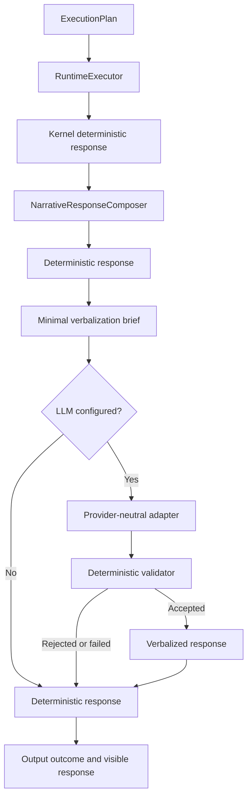

# ACA-021 - First LLM Verbalization Integration

Status: implemented  
Scope: Sprint 87  
Runtime authority impact: none  
Default mode: deterministic

## 1. Decision

ACA now supports optional LLM-based language realization at the existing output
boundary. The cognitive and operational pipeline remains unchanged.



The integration is implemented by `OutputStepHandler`, after
`NarrativeResponseComposer`. It does not introduce an execution step, planner,
state owner, or alternative response pipeline.

## 2. Authority

The Runtime remains the only authority for:

- intent, action, flow, program and `ExecutionPlan`;
- facts, slots, mission, topic and conversation state;
- selected operation and pending information;
- Policy and Governance decisions;
- tool selection, execution and outcomes;
- handoff, interruption and final response content.

The provider may change only wording, fluency, clarity, synthesis, empathy and
surface ordering. It receives an explicit instruction that the deterministic
response is the content authority and that the current user message is context,
not permission to answer independently.

## 3. Minimal Brief

`VerbalizationBrief` is a read-only output projection, not a cognitive contract.
It contains only:

| Field | Source | Purpose |
| --- | --- | --- |
| Deterministic response | Narrative composer | Authoritative propositions to realize. |
| Current user message | Event | References and conversational continuity. |
| Selected operation | ExecutionPlan | Prevent operation substitution. |
| Confirmed facts | ConversationState | Ground user-visible factual references. |
| Pending information | Information Gain / Response Plan | Preserve the selected question and its purpose. |
| Response directives | ConversationResponsePlan | Preserve primary need and next action. |
| Policy constraints | PolicyResult | Prevent verbal bypass of interruption or modification. |
| Executed tools | Runtime outcomes | Permit only actual execution claims. |
| Candidate Work, Case State, Governance | Official records only | Preserve operational meaning when those records are authoritative. |
| Language, tone and style | Environment configuration | Control surface realization. |

The complete `ConversationState`, memory snapshot, Runtime objects, traces,
plugin manifests, raw Tool Contracts and shadow-only operational projections are
not sent to the provider. Shadow Candidate Work or Case State cannot silently
become visible authority.

## 4. Provider Adapter

`LLMVerbalizationProvider` isolates the output boundary from vendor APIs. The
first implementation, `OpenAIResponsesAdapter`, calls OpenAI's Responses API
through server-side HTTP and extracts text from the response output. No OpenAI
type or client is exposed to the Runtime.

OpenAI documents the Responses API as the current text-generation interface and
requires API keys to be loaded securely on the server:

- <https://platform.openai.com/docs/quickstart/make-your-first-api-request>
- <https://platform.openai.com/docs/api-reference/backward-compatibility>

No model is hardcoded. Enabling the layer without both `LLM_MODEL` and
`OPENAI_API_KEY` produces a deterministic fallback.

## 5. Configuration

| Variable | Default | Behavior |
| --- | --- | --- |
| `LLM_ENABLED` | `false` | Enables provider invocation. |
| `LLM_PROVIDER` | `openai` | Selects the provider adapter. |
| `LLM_MODEL` | empty | Required when enabled. |
| `LLM_TIMEOUT` | `60` | Provider timeout in seconds. ACA-203 raised the default for local cold loads; an explicit value still takes precedence. |
| `LLM_TEMPERATURE` | `0.2` | Optional provider sampling value; `none` omits it. |
| `LLM_MAX_TOKENS` | `300` | Maximum generated output tokens. |
| `LLM_VALIDATION_MODE` | `strict` | `strict` or `standard`. Invalid values become strict. |
| `LLM_LANGUAGE` | `es-AR` | Output language. |
| `LLM_TONE` | `calm, direct and helpful` | Surface tone. |
| `LLM_STYLE` | `natural customer-service conversation` | Surface style. |
| `OPENAI_API_KEY` | empty | Server-side provider credential. Never exposed in traces. |
| `OPENAI_BASE_URL` | OpenAI v1 API | Optional compatible endpoint override. |

The public demo remains offline-capable. Missing configuration, missing key,
provider errors, timeouts and validation failures preserve current behavior.

## 6. Deterministic Validation

The validator rejects a provider candidate when it detects:

- empty or unbounded output;
- internal Runtime or cognitive-contract language;
- ungrounded numeric claims;
- ungrounded operational terms;
- claims that an operation or tool was executed without a Runtime outcome;
- invented authorization, approval or confirmed coverage;
- additional questions beyond the Runtime-selected question budget;
- replacement of the selected clarification question in strict mode.

Validation is conservative. It does not ask a second model to judge the first
model because that would transfer authority and failure behavior back to an
LLM. A rejected candidate is never partially repaired: ACA sends the complete
deterministic response.

## 7. Fallback Matrix

| Condition | Provider called | Visible response |
| --- | --- | --- |
| Disabled | No | Deterministic. |
| Missing model or API key | No | Deterministic. |
| Unsupported provider | No | Deterministic. |
| Timeout or network/provider error | Attempted | Deterministic. |
| Validation failed | Yes | Deterministic. |
| Validation passed | Yes | Provider candidate. |

The verbalizer maintains a bounded cache keyed by the complete minimal brief.
The official Runtime and legacy comparison therefore reuse the same candidate,
avoiding duplicate provider calls, cost and false response divergence.

## 8. Observability

The existing output `ExecutionStepOutcome` now records:

- deterministic response;
- provider candidate;
- every validation check and rejection reason;
- final response sent;
- provider/model/request identifier;
- fallback reason;
- provider-call and cache-hit flags;
- added latency.

The prompt, API key and full conversation state are not persisted. The visible
response contains none of this introspection.

## 9. Benchmark

The permanent benchmark is stored at:

```text
benchmarks/verbalization/aca_llm_verbalization_benchmark_v1.json
```

It measures:

- naturalness proxy for accepted variants;
- fidelity to Runtime decisions;
- fact, operation, Case State and Governance preservation;
- hallucination rejection;
- deterministic fallback correctness;
- added validation/provider-adapter latency.

It is provider-independent by design and uses controlled candidates so every
failure class is reproducible. It can be run with:

```powershell
python tools/run_llm_verbalization_benchmark.py --format markdown
```

Live provider quality must be evaluated separately with a pinned model and the
same acceptance checks. The local benchmark proves architecture and safety, not
the subjective quality of every external model response.

## 10. Known Limits

Deterministic lexical validation cannot prove full semantic equivalence. It is
effective for protected numbers, operations, permissions, execution claims and
question authority, but subtle paraphrase-level contradiction remains a
residual risk. The deterministic fallback, conservative prompt, bounded brief,
strict mode and benchmark reduce that risk without granting another model
decision authority.

The layer also cannot repair missing cognition. If the Runtime does not supply
an answer, operation, fact or authorized unknown outcome, the provider must not
invent one. Those cases remain visible as Runtime-quality issues rather than
being hidden by fluent language.
