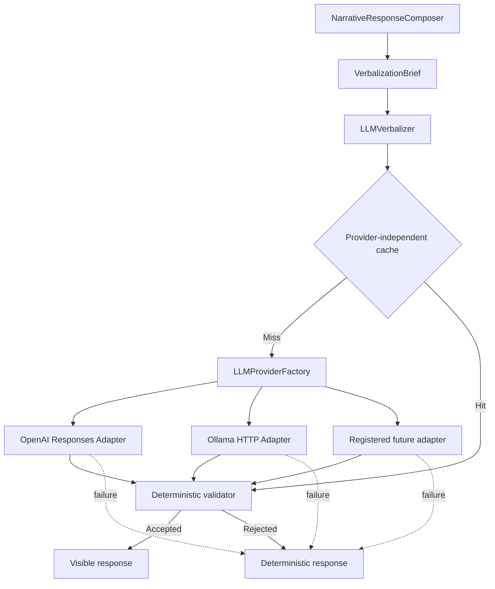

# ACA-022 - Local LLM Provider and Multi-Provider Architecture

Status: implemented  
Scope: Sprint 88  
Runtime authority impact: none  
Recommended development provider: Ollama  
Default behavior: deterministic fallback

## 1. Decision

ACA's verbalization boundary is provider-neutral. OpenAI and Ollama are adapters
behind the same provider protocol; the Runtime, the verbalization brief and the
deterministic validator do not branch by vendor.



This is infrastructure inside the output boundary. It is not a cognitive
component, planner, execution step or alternate response pipeline.

## 2. Provider Independence

`LLMProviderFactory` owns provider resolution. It maintains a small registry of
builders keyed by provider name and ships with two registrations:

| Provider | Adapter | Transport | Credential |
| --- | --- | --- | --- |
| OpenAI | `OpenAIResponsesAdapter` | HTTPS Responses API | `OPENAI_API_KEY` |
| Ollama | `OllamaAdapter` | Ollama native HTTP API | None |

The factory does not select models, validate responses or perform fallback. It
only constructs the configured adapter. This keeps provider APIs out of the
Runtime and avoids a vendor-specific conditional chain in `LLMVerbalizer`.

Provider discovery is explicit rather than import-time magic. A future adapter
must:

1. implement `LLMVerbalizationProvider.generate`;
2. translate `LLMProviderRequest` without changing its meaning;
3. return `LLMProviderResponse`;
4. normalize timeout, availability and provider failures as provider errors;
5. register one builder in `LLMProviderFactory`;
6. pass the same validator, fallback and benchmark suites.

No change to Runtime code, `VerbalizationBrief` or the validator is required.

## 3. Ollama Adapter

`OllamaAdapter` uses HTTP only. It does not invoke the Ollama CLI or spawn a
process.

For each uncached verbalization it:

1. calls `GET /api/tags` to confirm that the configured model is available;
2. calls `POST /api/generate` with streaming disabled;
3. supplies the provider-neutral instructions as `system` and the serialized
   brief as `prompt`;
4. maps `temperature` and the output limit into Ollama `options`;
5. returns only the generated response text and provider metadata.

Thinking output is disabled because ACA expects only the visible realization,
never provider reasoning. Model absence, local connection failure, malformed
responses and timeout all return the deterministic response.

Ollama documents the local API base as `http://localhost:11434/api`, the
generation route as `/api/generate`, and local model listing through
`/api/tags`:

- <https://docs.ollama.com/api/introduction>
- <https://docs.ollama.com/api/generate>
- <https://docs.ollama.com/api/tags>

## 4. Configuration

Shared settings remain unchanged:

| Variable | Default | Purpose |
| --- | --- | --- |
| `LLM_ENABLED` | `false` | Enables optional verbalization. |
| `LLM_PROVIDER` | `openai` | Registry key used by the factory. |
| `LLM_MODEL` | empty | Shared model override. |
| `LLM_TIMEOUT` | `60` | HTTP timeout in seconds. An explicit environment value takes precedence. |
| `LLM_TEMPERATURE` | `0.2` | Sampling value; `none` omits it. |
| `LLM_MAX_TOKENS` | `300` | Maximum generated output. |
| `LLM_VALIDATION_MODE` | `strict` | Deterministic validation mode. |
| `LLM_LANGUAGE` | `es-AR` | Requested visible language. |
| `LLM_TONE` | calm, direct and helpful | Surface tone. |
| `LLM_STYLE` | natural customer-service conversation | Surface style. |

Ollama-specific settings are:

| Variable | Default | Purpose |
| --- | --- | --- |
| `OLLAMA_HOST` | `http://localhost:11434` | Trusted Ollama HTTP host. A trailing `/api` is normalized. |
| `OLLAMA_MODEL` | `qwen3:8b` | Local model; takes precedence over `LLM_MODEL`. |
| `OLLAMA_KEEP_ALIVE` | `5m` | Retention requested from Ollama for generated responses and optional warmup. |
| `OLLAMA_WARMUP_ON_START` | `false` | Loads the configured model once at startup without creating a conversation. |

Offline development requires only:

```powershell
ollama serve
$env:LLM_ENABLED="true"
$env:LLM_PROVIDER="ollama"
$env:OLLAMA_MODEL="qwen3:8b"
```

The model must already be present in Ollama. ACA deliberately does not pull
models or manage the local service because those are deployment concerns.

OpenAI remains compatible:

```powershell
$env:LLM_ENABLED="true"
$env:LLM_PROVIDER="openai"
$env:LLM_MODEL="<configured-model>"
$env:OPENAI_API_KEY="<server-secret>"
```

## 5. Development and Production

| Concern | Local development | Production |
| --- | --- | --- |
| Recommended provider | Ollama | Deployment choice, currently OpenAI supported |
| Network dependency | Loopback only | External HTTPS when applicable |
| Credential | None | Server-side secret for credentialed providers |
| Failure behavior | Deterministic response | Deterministic response |
| Validation | Same deterministic validator | Same deterministic validator |
| Cache | Same bounded brief cache | Same bounded brief cache |
| Runtime authority | Unchanged | Unchanged |

`OLLAMA_HOST` is trusted deployment configuration. It is not accepted from a
conversation or public request. Production deployments should restrict it to a
known local or private endpoint.

## 6. Shared Validation and Cache

There is one validator and one fallback policy for every provider. The factory
cannot inject a provider-specific validator. Consequently Ollama cannot relax
fact, operation, tool, permission, Case State, Governance or selected-question
checks.

The cache belongs to `LLMVerbalizer`, not to an adapter. Its key is the complete
minimal brief. A cache hit avoids provider resolution and HTTP traffic and
records `provider_called=false` and `cache_hit=true`. It preserves the provider
and model that produced the cached candidate.

## 7. Failure Semantics

| Condition | Fallback reason | Provider called |
| --- | --- | --- |
| Layer disabled | `llm_disabled` | No |
| Empty model | `missing_model` | No |
| Unknown registry key | `unsupported_provider` | No |
| Missing OpenAI key | `missing_api_key` | No |
| Invalid Ollama host | `invalid_ollama_host` | No |
| Ollama service unavailable | `ollama_unavailable` | Attempted |
| Ollama model absent | `ollama_model_not_found` | Attempted |
| Any provider timeout | `provider_timeout` | Attempted |
| Provider response rejected | `validation_failed` | Yes |

Every condition preserves the deterministic response and is observable without
raising through the output step.

## 8. Telemetry

The output outcome records:

- `provider` and `model`;
- `latency_ms`;
- `cache_hit` and whether the provider was called;
- `fallback_reason`;
- provider candidate, validation checks and final response.

Volatile execution metrics live under `llm_execution`; semantic response data
lives under `llm_verbalization`. Prompts, API keys and complete conversation
state are never included.

## 9. Benchmark

The Sprint reuses the existing 14-scenario benchmark without changing its
dataset:

```powershell
python tools/run_llm_verbalization_benchmark.py --format markdown
python tools/run_llm_verbalization_benchmark.py --compare-providers --format markdown
```

The comparison executes fixed provider candidates through OpenAI, Ollama and
deterministic profiles. This proves adapter parity, validator parity, fallback,
authority preservation and provider-independent cache behavior without paid or
network calls. It does not claim that two live models have equal prose quality;
that comparison requires pinned local/remote models and deployment credentials.

Transport behavior is covered separately with mocked HTTP tests for successful
generation, unavailable service, timeout, missing model, invalid host and
malformed or unsafe output.

## 10. Architectural Result

ACA can verbalize completely offline while preserving the same cognitive and
operational authority. OpenAI remains available, Ollama becomes the recommended
development provider, and future providers can be registered without exposing
vendor details to the Runtime.
