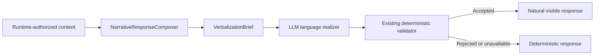

# ACA-023 - Language Realization Optimization

Status: implemented  
Scope: Sprint 90  
Runtime authority impact: none  
Behavioral boundary: verbalization only

## 1. Decision

The LLM verbalization boundary is now a language realizer rather than a
near-copy editor. ACA still decides the complete semantic content before the
provider is called. The provider may reorganize and restyle that content, but
it cannot create a new question, fact, operation, permission, result or tool
claim.



No Runtime, cognitive plan, operational projection, validator,
`OutputStepHandler` or execution-flow behavior changed in this Sprint.

## 2. Language Realizer Instructions

The provider instructions now distinguish semantic fidelity from surface-form
fidelity:

- preserve facts, numbers, uncertainty, actions, restrictions and outcomes;
- preserve explicit domain and case nouns instead of replacing them with vague
  references;
- preserve the selected question and exact question budget;
- reorganize clauses, connect ideas and remove repetition;
- replace bureaucratic phrasing with direct conversational language;
- use the configured regional language and voseo for `es-AR`;
- return only the visible response in at most two short sentences;
- never add knowledge, offers, promises, actions, tools or questions.

Few-shot examples cover the observed failure modes: prioritization,
documentation, claim delay, lateral questions with topic recovery, service
diagnosis and access limitations. They demonstrate changes in form while
keeping the authorized meaning unchanged.

## 3. Minimal Provider Payload

`VerbalizationBrief` remains the authority-preserving projection introduced in
ACA-021. Its provider payload now adds explicit output constraints:

| Constraint | Purpose |
| --- | --- |
| `question_count` | Prevents new questions and preserves required questions. |
| `maximum_sentences` | Keeps realization concise and bounded. |
| `source_is_content_authority` | Makes the deterministic response the semantic ceiling. |

The raw current user message is no longer sent to the provider. During live
validation, exposing it encouraged the model to answer or repeat the user
instead of realizing the already-authorized response. It remains part of the
cache fingerprint, so two turns with different user input cannot accidentally
share a cached realization.

The provider still receives only the deterministic response and the existing
minimal grounding projections. This does not add cognitive authority to the
brief.

## 4. Benchmark

The permanent benchmark is
`benchmarks/verbalization/aca_language_realization_benchmark_v1.json`. It
contains ten scenarios and measures:

- semantic preservation;
- reduction of repeated wording;
- reduction of bureaucratic language;
- syntactic variety;
- naturalness;
- validator acceptance;
- preservation of Runtime authority;
- visible-response improvement;
- provider latency.

The runner supports controlled candidates and the configured live provider:

```powershell
python tools\run_llm_verbalization_benchmark.py --language-realization --format markdown
python tools\run_llm_verbalization_benchmark.py --language-realization --live --format markdown
```

### Controlled Result

| Metric | Result |
| --- | ---: |
| Scenarios passed | 10/10 |
| Semantic preservation | 100% |
| Repetition reduction | 100% |
| Bureaucratic-language reduction | 100% |
| Syntactic variety | 100% |
| Naturalness | 100% |
| Validator acceptance | 100% |
| Runtime authority preservation | 100% |

### Live Ollama Result

Provider: Ollama `qwen3:8b` with an audit-only timeout of 60 seconds.

| Metric | Result |
| --- | ---: |
| Scenarios passed | 10/10 |
| Semantic preservation | 100% |
| Repetition reduction | 100% |
| Bureaucratic-language reduction | 100% |
| Syntactic variety | 100% |
| Naturalness | 100% |
| Validator acceptance | 100% |
| Runtime authority preservation | 100% |
| Average added latency | 13,715.817 ms |
| Maximum added latency | 19,609.782 ms |

The 60-second timeout was used to isolate language quality from local provider
performance. The production default remains unchanged. With the current
10-second default, this model can time out and correctly fall back to the
deterministic response.

## 5. Before and After

| Deterministic content | Live realization |
| --- | --- |
| `Que necesitas resolver primero? Asi puedo responder primero la preocupacion mas importante.` | `Hola. Que necesitas resolver primero? Empecemos por lo que mas te preocupa.` |
| `Tenes toda la documentacion?` | `Antes de seguir, ya tenes toda la documentacion que te pidieron?` |
| `Si ya paso una semana y la denuncia sigue en tramite, corresponde revisar la demora. Alguien te contacto?` | `Entiendo, como la denuncia sigue en tramite despues de una semana, conviene revisar que la esta demorando. Alguien llego a contactarte?` |
| `El plazo habitual depende de la revision. Respecto de la denuncia, falta confirmar si enviaron las fotos.` | `El tiempo puede variar segun la revision. Sobre la denuncia, todavia falta confirmar si enviaron las fotos.` |
| `Primero necesitamos revisar el estado del servicio. El servicio esta caido solo en tu domicilio?` | `Empecemos por revisar el servicio. El problema ocurre solamente en tu domicilio?` |

Accents in live output depend on the provider. Benchmark comparisons use the
framework's official text-normalization boundary and do not weaken semantic
requirements.

## 6. Authority and Fallback

The existing deterministic validator remains unchanged. The Runtime still
believes the deterministic and accepted verbalized responses express the same
authorized thought because:

1. the provider never receives decision authority;
2. the deterministic response remains the content authority;
3. question count and concise output shape are explicit;
4. the existing validator rejects unauthorized changes;
5. provider failure, timeout or rejection returns the deterministic response.

## 7. Residual Risk

Language realization is probabilistic. An intermediate live run reached 9/10
because a generated imperative omitted the required question mark; the
unchanged validator rejected it and used the deterministic fallback. Aligning
the few-shot example with the existing question-budget rule removed that
prompt contradiction and the final full run reached 10/10.

The remaining operational concern is local inference latency, not cognitive
fidelity. Provider performance should be evaluated separately from language
quality; it does not justify moving any decision into the LLM or weakening the
validator.

## 8. Verification

| Verification | Result |
| --- | --- |
| Language-realization benchmark, controlled | 10/10 passed |
| Language-realization benchmark, live Ollama | 10/10 passed |
| Existing LLM verbalization benchmark | 14/14 passed |
| Provider comparison benchmark | passed |
| Verbalization, handler and Shadow Runtime integration tests | 53 passed |
| Complete pytest suite | 625 passed |

The permanent cognitive benchmark also ran through the real Runtime for 24
conversations and 60 turns with zero repeated questions, zero unnecessary
questions and zero cognitive-opacity leaks. It reported three conversational
expectation mismatches while the LLM was disabled; those classifications are
outside this verbalization-only change.
