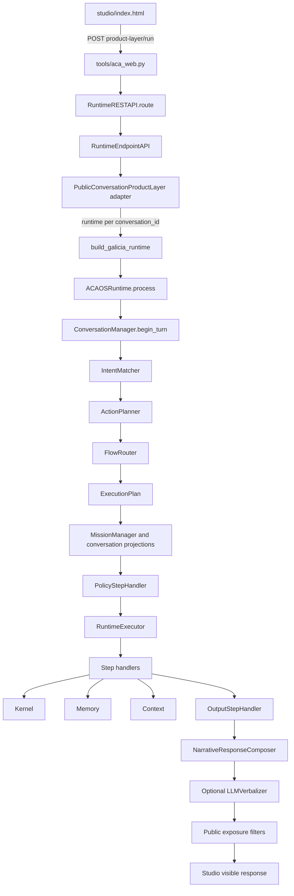
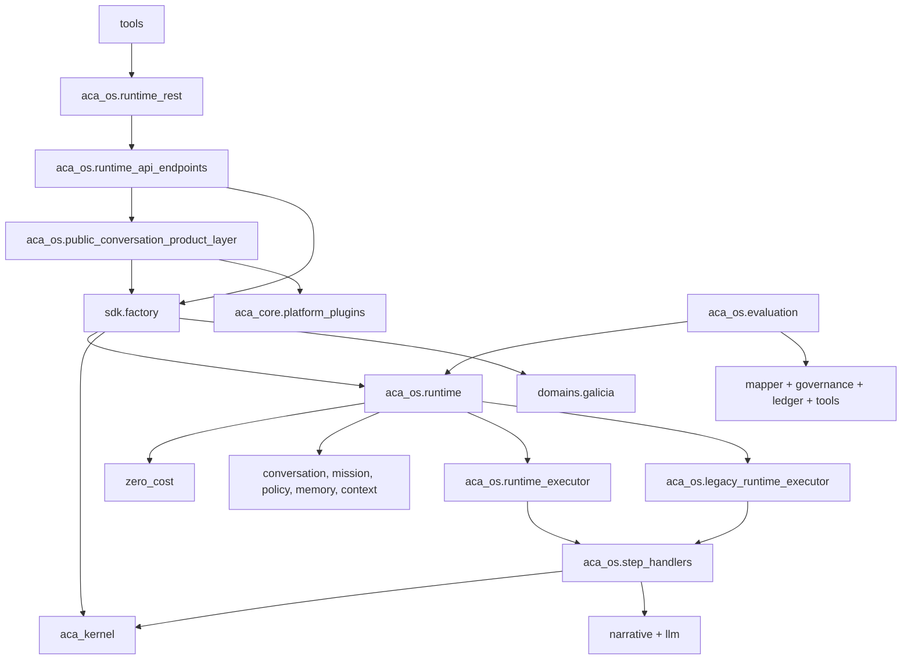

# ACA-024 - Repository Forensic Audit

Status: forensic audit only  
Scope: complete repository, no code changes  
Date: 2026-07-14  
Source inventory: 439 non-ignored files plus 59 ignored generated artifacts  

## 1. Executive Conclusion

ACA has a coherent official cognitive pipeline, but the repository is not a
minimal representation of that architecture.

The most important findings are:

1. The visible Studio conversation does use `ACAOSRuntime`,
   `RuntimeExecutor`, `NarrativeResponseComposer` and the optional
   `LLMVerbalizer`.
2. Every normal Studio turn also executes two non-visible compatibility paths:
   a `LegacyRuntimeExecutor` projection and the public `PluginRuntime` legacy
   conversation pipeline.
3. Candidate Work, Case State Projection, Operational Governance and the
   Operational Audit Ledger are not integrated into the official Runtime.
   Their only live callers are the evaluation harness and tests.
4. `HandoffPackageAdapter` is registered in the official `ToolEngine`, but no
   official `ExecutionPlan` selects `handoff_package`. The production operation
   documented in ACA-017 is therefore benchmark-reachable, not Studio-reachable.
5. Three conversation architectures remain in source: the official Runtime,
   the public product-layer legacy shadow, and the older public workflow used
   by `/demo/domain-flow`.
6. Two plugin architectures coexist: the metadata-only `aca_os` loader for
   `plugin.json`, and the executable `aca_core.platform_plugins` loader for
   `manifest.yaml`.
7. The repository contains 10 source-file deletion candidates and 5 files that
   duplicate an official responsibility. Four additional dead symbols live
   inside otherwise retained modules.
8. The largest debt is concentration and transition code, not missing
   architecture. `conversation_state.py`, `evaluation.py`, and the two public
   legacy stacks account for most accidental complexity.

### Classification result

| Category | Files | Python files | Python LOC | Meaning in this audit |
| --- | ---: | ---: | ---: | --- |
| ACTIVE | 260 | 191 | 38,031 | Official source, supported surface, current tests or current documentation. |
| SHADOW | 52 | 31 | 10,122 | Benchmark, comparison, passive projection or legacy validation. |
| HISTORICAL | 112 | 7 | 463 | Superseded implementation, old entrypoint, sprint record or obsolete guidance. |
| DEAD | 10 | 2 | 398 | No live source caller, test, benchmark or required runtime role. |
| DUPLICATED | 5 | 5 | 1,745 | Another implementation owns the same responsibility officially. |
| **Total** | **439** | **236** | **50,759** | Excludes ignored caches and 59 ignored `.aca` benchmark artifacts. |

`ACTIVE` includes 99 current test modules and 9,627 test LOC. Excluding tests,
28,404 of 39,415 Python LOC are active product or platform code: 72.1%.
The narrow cognitive Core is smaller because deployment, public-demo and Studio
surface code are active but not Core. A defensible Core-only estimate is
approximately 55% to 60% of non-test Python.

## 2. Method And Evidence Rules

The audit used:

- `git ls-files --cached --others --exclude-standard` for source inventory;
- recursive physical inspection of `.aca` for ignored generated artifacts;
- Python AST parsing for imports, definitions, calls and branch proxies;
- text reference searches for dynamically loaded plugins and data fixtures;
- entrypoint reconstruction from `render.yaml`, `tools/aca_web.py`, Studio
  JavaScript and REST routing;
- one read-only in-memory execution of `Hola`, with LLM disabled by default;
- `py -m pytest --collect-only -q -p no:cacheprovider`, with bytecode writes
  disabled, to identify the official 625-test collection.

No test body, benchmark, tool, network provider or persistence benchmark was
executed. This avoided creating or changing repository state.

Static import reachability was not treated as proof of execution. This matters
because `runtime_api_endpoints.py` imports many deployment helpers that are
reachable from the web process but not from the chat request, and because
plugin implementation modules are loaded through `importlib`.

### Category rules

Each source path in Appendix A appears in exactly one category.

- **ACTIVE**: participates in an official supported path or protects it with a
  current test. Mixed files are ACTIVE when any official behavior still
  depends on them.
- **SHADOW**: used only for benchmark, comparison, validation or non-visible
  projections.
- **HISTORICAL**: records or implements an older architecture and is not an
  authority for the current pipeline.
- **DEAD**: has no live caller, dynamic loader role, official test or benchmark
  consumer, and can disappear without changing official behavior.
- **DUPLICATED**: implements a responsibility now owned by another live
  component. It may still have compatibility callers.

## 3. Repository Shape

| Area | Files | Python files | Python LOC | Classes | Functions |
| --- | ---: | ---: | ---: | ---: | ---: |
| `aca_os` | 74 | 73 | 35,438 | 224 | 1,498 |
| `tests` | 118 | 118 | 11,344 | 14 | 740 |
| `docs` | 124 | 0 | 0 | 0 | 0 |
| `aca_core` | 3 | 3 | 1,070 | 21 | 86 |
| `kernel` | 13 | 12 | 754 | 18 | 42 |
| `zero_cost` | 6 | 6 | 738 | 13 | 30 |
| `tools` | 10 | 9 | 1,053 | 4 | 50 |
| `plugins` | 20 | 6 | 91 | 0 | 10 |
| `examples` | 23 | 5 | 103 | 0 | 7 |
| `sdk` | 3 | 2 | 88 | 0 | 2 |
| `domains` | 9 | 1 | 45 | 1 | 3 |
| Other | 26 | 1 | 35 | 0 | 0 |
| **Total** | **439** | **236** | **50,759** | **289** | **2,426** |

The repository also contains 60 physical files under `.aca`, totaling 711,863
bytes. One, `.aca/smoke_memory.json`, is tracked despite `.aca/` being ignored.
The other 59 are ignored `handoff_packages.jsonl` and
`operational_ledger.jsonl` outputs from six production-benchmark run IDs. They
are generated evidence, not source.

## 4. Official Studio Runtime

### 4.1 Exact visible path



### 4.2 Source evidence

| Transition | Evidence |
| --- | --- |
| Studio selects the public endpoint | `studio/index.html:344` posts `/public-conversation/product-layer/run`. |
| Web is transport-only | `tools/aca_web.py:51-54` delegates requests to `RuntimeRESTAPI`. |
| REST delegates public conversation | `aca_os/runtime_rest.py:304-312`. |
| Public layer uses the cognitive Runtime | `aca_os/public_conversation_product_layer.py:355-368`. |
| Session is retained by conversation | `aca_os/public_conversation_product_layer.py:434-437`. |
| Decision sequence | `aca_os/runtime.py:416-480`. |
| RuntimeExecutor selection | `aca_os/runtime.py:496-512`. |
| Plan-driven handler loop | `aca_os/runtime_executor.py:118-155`. |
| Narrative and optional LLM boundary | `aca_os/step_handlers.py:310-360`. |
| Visible response comes from Runtime | `aca_os/public_conversation_product_layer.py:369-402`. |

### 4.3 Dynamic evidence

An in-memory execution of `Hola` produced:

| Field | Observed value |
| --- | --- |
| Intent | `greeting`, confidence `0.25` |
| Flow | `static_response` |
| Official engine | `runtime_executor` |
| Validation engine | `legacy_runtime_validation` |
| Steps | `kernel`, `memory`, `context`, `output` |
| Output executor | `narrative_response_composer` |
| LLM provider called | `false` |
| LLM fallback reason | `llm_disabled` |
| Visible response | `Hola. Contame qué necesitás y te oriento.` |
| Runtime/legacy equivalence | `100%` |

This proves that the LLM layer is connected but optional. It also proves that
the official execution and a legacy validation execution both occur.

### 4.4 Default clarification caveat

`clarification` is the only flow absent from
`_runtime_executor_official_flows()` (`aca_os/runtime.py:764-772`). It uses
`LegacyRuntimeExecutor` officially when selected. However, the default
`IntentMatcher`/`ActionPlanner` configuration cannot currently produce a
below-threshold clarification: the test creates a custom planner with
`min_confidence=0.8` (`tests/test_runtime_executor_shadow.py:45-56`).

Therefore:

- `LegacyRuntimeExecutor` is a supported official compatibility path;
- it is not reached by the default Studio configuration as currently wired;
- it still executes as validation on every migrated flow.

## 5. Parallel Runtimes And Alternate Pipelines

```mermaid
flowchart LR
    Studio --> Official[ACAOSRuntime visible]
    Official -. comparison .-> LRE[LegacyRuntimeExecutor projection]
    Studio --> Product[Public Product Layer]
    Product -. legacy shadow .-> PR[PluginRuntime]
    PR --> DC[DeterministicDialogueController]
    DC --> Proj[_project_response]

    Demo[/demo/domain-flow] --> DDF[DemoDomainRuntimeFlowRunner]
    DDF --> RAC[RepresentativeAnswerComposer]
    RAC --> PCW[PublicConversationWorkflow]

    CLI[Benchmark CLI] --> Eval[evaluation.py]
    Eval --> CWM[Candidate Work]
    CWM --> CSP[Case State projection]
    CSP --> GOV[Governance]
    GOV --> LED[Ledger]
    LED --> OT[Operational tool]
```

| Pipeline | Visible to Studio chat | Caller | Why it exists | Classification |
| --- | --- | --- | --- | --- |
| `ACAOSRuntime -> RuntimeExecutor` | Yes | Public adapter and SDK | Official cognition/execution | ACTIVE |
| `LegacyRuntimeExecutor.project` | No | `ACAOSRuntime` | Runtime migration equivalence | SHADOW behavior inside ACTIVE module |
| `LegacyRuntimeExecutor.execute` | Only in custom clarification configurations | `ACAOSRuntime` | Last compatibility branch | ACTIVE legacy |
| `PluginRuntime -> dialogue controller -> _project_response` | No text, but affects projected plugin/capability and actions | Public product layer | Sprint 72B compatibility comparison | SHADOW with UI metadata coupling |
| `PublicConversationWorkflow` stack | Yes, only on old demo endpoint | `/demo/domain-flow` | Pre-unification public demo | DUPLICATED/HISTORICAL |
| Operational mapper/governance/ledger/tool chain | No | Evaluation runners/tests | Architecture validation | SHADOW |
| Direct verbalization benchmark | No | Verbalization runner/tests | Provider quality validation | SHADOW |

The public shadow is not perfectly passive. `_active_public_route()` accepts
`legacy_shadow` (`public_conversation_product_layer.py:383-387`) and can use its
capability (`:1363-1365`) to choose public action metadata. It does not replace
the visible Runtime response, but it can still influence the surrounding UI.

## 6. Dependency Graph

The AST graph contains 236 Python modules and 544 resolved internal import
edges. The web entrypoint has 73 import-reachable modules, but this includes
endpoint helpers never called by the chat route.

### 6.1 Package-level graph



### 6.2 Highest import centrality

| Module | Importers | Reading |
| --- | ---: | --- |
| `aca_os.execution_trace` | 27 | Shared observability contract. |
| `aca_os.conversation_state` | 23 | Central state and cognitive logic. |
| `aca_os.component_registry` | 18 | Runtime/platform control plane. |
| `aca_os.tool_engine` | 17 | Tool contract boundary. |
| `zero_cost.execution_plan` | 13 | Execution authority contract. |
| `aca_os.memory_engine` | 10 | Runtime and handlers. |
| `aca_os.policy_manager` | 10 | Runtime, executor and handlers. |
| `aca_os.evaluation` | 9 | CLI plus benchmark tests only. |
| `aca_os.event_bus` | 9 | Runtime observability. |

### 6.3 Modules with no non-test importer

These groups require different interpretations:

| Group | Paths | Finding |
| --- | --- | --- |
| Confirmed dead | `aca_os/explain.py`, `aca_os/public_conversation_policy.py` | No caller, test, benchmark or dynamic contract. |
| Executable entrypoints | `tools/aca_cli.py`, `aca_demo.py`, `aca_deploy.py`, `aca_public_demo.py`, `aca_rest.py`, `aca_smoke_url.py`, `aca_web.py`, `smoke_rc1.py`, `run_llm_verbalization_benchmark.py`, `examples/demo.py`, `examples/galicia_demo.py` | Expected to have no importer. |
| Public package facades | `aca_plugin_sdk/__init__.py`, `sdk/__init__.py`, `zero_cost/__init__.py` | Imported by consumers outside the repository or provide package APIs. |
| Test fixtures | `aca_os/domain_pack_examples.py`, `aca_os/plugin_examples.py` | Test-only helpers. |
| Dynamically loaded plugins | six `plugins/*/{semantic,planner,policy}.py` and three `examples/plugins/*/plugin.py` | Loaded through manifests or explicit plugin tests, not static imports. |

### 6.4 Components never instantiated or called

High-confidence dead symbols, after checking both name and attribute calls:

| Symbol | File | Evidence |
| --- | --- | --- |
| `explain_state` | `aca_os/explain.py:4` | Definition is the only reference. |
| `AdaptiveReplyPolicy` | `aca_os/public_conversation_policy.py:17` | Definition is the only reference. |
| `CLICommandResult` | `aca_os/runtime_cli.py:17` | Class has no construction or type reference. |
| `TraceBundle` | `aca_os/public_conversation_contracts.py:129` | Imported by legacy workflow but never used. |
| `reset_public_conversation_state` | `aca_os/public_conversation_state.py:123` | Definition is the only reference. |
| `run_pytest` | `aca_os/dx.py:192` | Imported by `tools/aca_cli.py`, never called or bound to a command. |

Plugin hook functions such as `create_plugin` and `on_activate` are not dead:
their invocation is intentionally reflective.

## 7. Operational Architecture Reality Check

The following source search returned no match in `runtime.py`,
`runtime_executor.py`, `step_handlers.py` or `conversation_state.py`:

- `map_operational_work`;
- `assess_operational_governance`;
- `project_operational_audit_ledger`;
- `case_state_projection`.

All non-test calls to those operations originate in `aca_os/evaluation.py`.
Likewise, there is no official route containing `tool_key=handoff_package` or
`prepare_handoff_package`. The adapter is registered in `sdk/factory.py:36`,
but official flow routes only provide knowledge keys and interruption steps.

Consequences:

1. Candidate Work is not an official decision input.
2. Case State is not projected during an official Studio turn.
3. Operational Governance does not authorize official execution.
4. The Operational Audit Ledger does not record official Runtime operations.
5. The handoff package real write is reachable from the production benchmark,
   not from the official conversation pipeline.

ACA-017 and parts of ACA-018 describe the benchmark chain as a real Runtime
integration. The code does not support that statement. These documents are
classified as superseded historical evidence.

## 8. Plugin Architecture Duplication

| Concern | `aca_os` plugin stack | `aca_core.platform_plugins` stack |
| --- | --- | --- |
| Manifest | `plugin.json` | `manifest.yaml/yml/json` |
| Loader behavior | Metadata-only, no entrypoint import | Dynamically imports semantic/planner/policy modules |
| Registry | `ComponentRegistry` | `PluginRegistry` + `CapabilityRegistry` |
| Runtime owner | `ACAOSRuntime` control plane | Public Product Layer legacy shadow |
| Bundled top-level plugins | None use `plugin.json` | Both use `manifest.yaml` |
| Official visible response | No plugin execution | No, shadow only |
| Current UI role | Runtime introspection/API | Public actions and projected active capability |

Both stacks are live enough that neither whole implementation is DEAD, but
they duplicate manifest, loader, registry, policy and lifecycle concepts. This
is the largest platform-level conceptual duplication after the conversation
stacks.

## 9. Code Duplication And Legacy Map

| Finding | Current official owner | Duplicate/legacy owner | Removal impact | Risk |
| --- | --- | --- | --- | --- |
| Conversation state | `ConversationState` | `PublicConversationState`, `ConversationProductMemory` | Old demo and shadow projections break | Medium |
| Conversation understanding/planning | Runtime + `ConversationState` | `PublicConversationWorkflow` | `/demo/domain-flow` breaks | Medium |
| Response composition | `NarrativeResponseComposer` + LLM | `RepresentativeAnswerComposer`, `_project_response` | Old demo/shadow text disappears | Medium |
| Execution orchestration | `RuntimeExecutor` | `LegacyRuntimeExecutor` | Custom clarification and comparison break | Medium |
| Plugin system | `aca_os.plugin_*` for Core metadata | `aca_core.platform_plugins` for public shadow | Public actions/shadow routing break | High until adapter data source changes |
| REST dispatch | `RuntimeRESTAPI.route` | `_local_requester` route chain in endpoint API | Demo/internal requester tests break | Medium |
| Dry-run adapter | `HandoffPackageAdapter` modes | Empty subclass `HandoffPackageDryRunAdapter` | Import compatibility only | Low |

### Code marked DUPLICATED

1. `aca_os/public_conversation_state.py`: replaced as owner by
   `ConversationState`.
2. `aca_os/public_conversation_contracts.py`: old semantic/planner/supervisor
   DTO family replaced by Runtime state and traces.
3. `aca_os/public_conversation_workflow.py`: full second conversation pipeline.
4. `aca_os/representative_answer_composer.py`: second response generator.
5. `aca_os/demo_domain_flow.py`: endpoint runner that assembles the duplicated
   public workflow.

### Code marked DEAD

| Path | What it does | Who uses it | If removed | Benefit | Risk |
| --- | --- | --- | --- | --- | --- |
| `.aca/smoke_memory.json` | Generated smoke memory | Recreated by smoke script | No source behavior change | Removes tracked runtime state | Very low |
| `aca_os/explain.py` | Old textual state explanation | Nobody | No behavior change | Removes orphan helper | Very low |
| `aca_os/public_conversation_policy.py` | Obsolete deterministic public reply policy | Nobody | No behavior change | Removes 364 LOC and old templates | Very low |
| Seven plugin `.gitkeep` files | Preserve empty declared folders | No runtime reads them | Empty dirs disappear from git | Removes placeholder files | Low, retain if package shape is intentional |

## 10. Benchmarks

All nine benchmark datasets have a loader, runner and test reference. No
benchmark file is currently unreferenced.

| Dataset | Size | Role | Status |
| --- | ---: | --- | --- |
| Cognitive conversation | 24 scenarios | Official conversation-quality regression gate | Current SHADOW harness |
| Operational work | 50 scenarios | Synthetic Candidate Work validation | SHADOW |
| Operational real-world | 56 conversations | Multi-turn Candidate Work validation | SHADOW |
| Operational governance | 16 scenarios | Governance projection validation | SHADOW |
| Operational ledger | 12 scenarios | Ledger projection validation | SHADOW |
| Operational dry run | 30 scenarios | Tool-chain simulation | SHADOW |
| Operational production | 10 scenarios | Filesystem handoff/ledger integration | SHADOW; can write generated artifacts |
| LLM verbalization | 14 scenarios | Provider/fallback fidelity | Current SHADOW harness |
| Language realization | 10 scenarios | Naturalness and semantic preservation | Current SHADOW harness |

No dataset is exactly redundant. The runner implementation is redundant:
`evaluation.py` contains seven benchmark loaders/runners/renderers and repeated
aggregation logic. Dry-run and production share most scenario plumbing, while
governance and ledger correctly measure different boundaries.

The GitHub workflow runs `pytest`, so benchmark behavior covered by tests is in
CI. It does not invoke every CLI benchmark command independently.

## 11. Tests

`pytest --collect-only` discovered 625 tests in 118 modules.

| Test category | Files | LOC | Reading |
| --- | ---: | ---: | --- |
| Official Runtime/current surfaces | 99 | 9,627 | ACTIVE |
| Shadow/operational/public legacy comparison | 13 | 1,292 | SHADOW |
| Old public workflow/demo pipeline | 6 | 425 | HISTORICAL |

### Historical test group

- `test_demo_domain_runtime_flow.py`
- `test_public_conversation_runtime.py`
- `test_public_conversation_runtime_rc7.py`
- `test_public_conversational_workflow_runtime_rc10.py`
- `test_public_studio_adaptive_conversation.py`
- `test_public_studio_runtime_interaction_qa.py`

### Redundant compatibility test group

The RC2-RC5 product-layer tests overlap the current product-layer suite and
primarily protect the legacy shadow brain:

- `test_public_demo_product_repair_rc2.py`
- `test_public_demo_routing_response_repair_rc3.py`
- `test_public_demo_memory_progression_rc4.py`
- `test_public_demo_dialogue_controller_rc5.py`

They are not useless while `_run_legacy_shadow()` remains, but they do not
protect the visible Runtime response authority.

No test imports `aca_os.explain` or `aca_os.public_conversation_policy`.

## 12. Documentation Audit

No single existing document accurately describes the complete current
architecture.

- `specification/ACA_SPECIFICATION.md` remains the best statement of invariant
  principles, but omits most post-RC1 components.
- ACA-021, ACA-022 and ACA-023 accurately describe the current verbalization
  boundary.
- `docs/ARCHITECTURE.md`, README, Roadmap and Next Phases are materially stale.
- ACA-006 through ACA-017 document a Shadow research program, not the official
  Runtime.
- ACA-017 incorrectly presents the operational benchmark chain as a Runtime
  production flow.
- ACA-019 is an unimplemented proposal that correctly identifies the missing
  authority transition.

| Document group | Documentation status | Source classification |
| --- | --- | --- |
| `specification/ACA_SPECIFICATION.md`, RFC-0001, current architectural ADRs | Current but incomplete | ACTIVE |
| ACA-021 through ACA-023 | Current implementation docs | ACTIVE |
| Cognitive benchmark and deployment guides | Current | ACTIVE |
| Sprint 2 through 72B records | Historical | HISTORICAL |
| ACA-018 prior audit | Historical snapshot, partly contradicted by this audit | HISTORICAL |
| ACA-019 | Draft proposal, not implemented | HISTORICAL |
| ACA-006 through ACA-017, ACA-020 | Superseded research/proposal | HISTORICAL |
| README, ARCHITECTURE, ROADMAP, NEXT_PHASES, PHASE_2, RC1 docs | Superseded | HISTORICAL |
| `runtime/README.md`, `sdk/README.md`, `aca_os/README.md` | Superseded placeholders/incomplete | HISTORICAL |

The current architectural authority is therefore the executable source plus
the specification invariants and ACA-021/022/023. This is a documentation
governance gap.

## 13. Complexity Hotspots

Branch count is an AST structural proxy, not formal cyclomatic complexity.

| File | LOC | Definitions | Branch proxy | Responsibilities | Recommendation |
| --- | ---: | ---: | ---: | --- | --- |
| `conversation_state.py` | 6,698 | 10 classes, 239 top-level functions | 1,057 | Ownership, acts, slots, facts, missions, topics, intent decomposition, information gain, plans, response plans, fulfillment | Keep behavior; highest-risk future mechanical split candidate |
| `evaluation.py` | 4,303 | 2 classes, 111 functions | 735 | Cognitive, public, operational, governance, ledger, dry-run and production benchmarks | Largest low-risk structural split candidate |
| `operational_work_mapper.py` | 1,745 | 58 functions | 347 | Candidate detection, ranking, Case State projection, comparison | Shadow-only complexity; freeze until authority decision |
| `public_conversation_product_layer.py` | 1,680 | 6 classes, 71 functions | 380 | Public adapter, session store, actions, filters, legacy classifier, legacy memory, response templates, comparison | Main mixed-authority cleanup target |
| `runtime_api_endpoints.py` | 1,114 | 66 methods | 229 | Runtime, Studio, deploy, demo, hosting, public and plugin endpoints | Broad facade; active but not cohesive |
| `llm_verbalization.py` | 1,111 | 18 classes, 37 functions | 155 | Config, brief, two providers, factory, cache, validation, telemetry | Active technical boundary; monitor growth |
| `platform_plugins.py` | 967 | 21 classes, 6 functions | 145 | YAML parser, manifests, loader, registries, routing, policy, state, traces, runtime | Entire second plugin platform in one file |
| `runtime.py` | 846 | 1 class, 48 methods/functions | 94 | Wiring, decision chain, official/legacy execution, traces, APIs | Stable authority, still carries migration comparison |
| `operational_audit_ledger.py` | 773 | 1 class, 26 functions | 116 | Shadow projection plus durable store and production finalization | Mixed research/production semantics, currently Shadow |

## 14. Runtime Component Registry Gap

Dynamic introspection reported 17 components:

`action_planner`, `context_manager`, `conversation_manager`,
`decision_graph_engine`, `domain_pack_loader`, `domain_pack_runtime`,
`domain_pack_validator`, `event_bus`, `flow_router`, `intent_matcher`,
`memory_engine`, `metrics_engine`, `plugin_lifecycle`, `plugin_loader`,
`plugin_validator`, `policy_manager`, `tool_engine`.

It did not report:

- `ACAKernel` or `GraphCompiler`;
- `RuntimeExecutor` or `LegacyRuntimeExecutor`;
- `StepHandlerRegistry` or individual handlers;
- `NarrativeResponseComposer`;
- `LLMVerbalizer`, provider factory or provider adapter.

This explains why Studio Runtime Components does not show verbalization. It is
an observability registration gap, not evidence that the verbalizer is absent.

## 15. Prioritized Simplification Candidates

No change is performed by this audit.

| Priority | Candidate | Classification | Benefit | Removal prerequisite | Risk |
| ---: | --- | --- | --- | --- | --- |
| 1 | `public_conversation_policy.py` | Safe deletion | Removes dead 364 LOC/template authority | None beyond one focused regression check | Very low |
| 2 | `explain.py`, tracked smoke memory, dead symbols | Safe deletion | Removes clear orphans/generated state | Confirm no external import contract | Very low |
| 3 | Old `/demo/domain-flow` stack | Probable deletion | Removes 1,745 duplicate LOC and six historical tests | Decide endpoint support | Medium |
| 4 | Product-layer legacy shadow brain | Requires validation | Removes largest remaining conversation duplication | Replace public action/capability projection source | Medium |
| 5 | `LegacyRuntimeExecutor` comparison | Requires validation | Ends double execution and old orchestration | Migrate/retire clarification and end parity period | Medium |
| 6 | Dual plugin architectures | Requires architectural decision | One manifest/loader/registry model | Preserve public actions and external SDK compatibility | High |
| 7 | Operational Shadow stack | Conserve or explicitly productize | Avoid pretending benchmark code is Runtime code | Decide whether operational integration resumes | High |
| 8 | Benchmark monolith | Structural simplification | Lower coupling without behavior loss | Mechanical split with full suite | Low to medium |
| 9 | Historical docs/tests | Archive | Removes misleading authority and navigation noise | Publish one current architecture index | Low |

## 16. Debt Map

| Debt type | Main evidence | Severity |
| --- | --- | --- |
| Authority duplication | Official Runtime plus two legacy comparison paths | High |
| Documentation drift | ACA-017/018 claims exceed executable integration | High |
| State duplication | ConversationState, PublicConversationState, ConversationProductMemory | High |
| Plugin duplication | Two manifests, loaders, registries and policies | High |
| Concentration | 6,698-line ConversationState and 4,303-line evaluation module | High |
| Experimental footprint | 8,830 non-test Python LOC classified SHADOW | Medium-high |
| Observability incompleteness | Core executors/verbalizer absent from Component Registry | Medium |
| Generated artifacts | 60 `.aca` files, one tracked | Low |
| Metadata drift | `pyproject.toml` still reports `0.4.0-sprint72b-rc5` | Low |

## 17. Final Assessment

### Is the architecture Core stable?

**Partially.**

The cognitive authority chain and visible Studio pipeline are stable. The
repository-level Core is not frozen because compatibility execution, public
conversation duplication and plugin duplication remain live.

### How many important components could be removed?

Five duplicated source modules, two dead Python modules, one compatibility
executor after clarification/parity closure, one public legacy shadow subsystem
and one of the two plugin-platform implementations are credible simplification
targets. Only the first two dead modules are currently low-risk deletions.

### Largest technical debt

The largest debt is the coexistence of official and historical authorities in
the same live process, especially `PublicConversationProductLayer` and the two
plugin systems. File size is secondary to that authority ambiguity.

### Definitive Core percentage

- 72.1% of non-test Python is ACTIVE supported code.
- Approximately 55% to 60% is narrow definitive Core after excluding active
  deployment, public-demo and Studio product surfaces.
- 27.9% is Shadow, duplicated, historical Python or dead Python.

### What remains experimental?

Candidate Work, Case State Projection, Operational Governance, Operational
Audit Ledger integration and the handoff production chain remain experimental
with respect to the official Runtime. Verbalization is active, optional and
official.

### Is any conceptual component no longer justified?

The standalone `PublicConversationWorkflow` family no longer has a justified
architectural role. It survives only through an older demo endpoint. The public
legacy dialogue controller has the same problem once its UI metadata coupling
is removed. `LegacyRuntimeExecutor` remains justified only as temporary
compatibility/validation.

### Freeze ACA Core 1.0?

**No.**

The cognitive design can be frozen, but the repository should not be labeled a
clean Core 1.0 while:

- a default Studio turn executes multiple conversation engines;
- operational production claims are not reachable from the official Runtime;
- two plugin architectures coexist;
- no current document describes the whole executable architecture.

A cleanup release can preserve all user-visible behavior and benchmarks. The
audit does not recommend adding capabilities or architecture before that
cleanup decision.

## Appendix A - Exhaustive Source Inventory

The inventory below covers every path returned by
`git ls-files --cached --others --exclude-standard` at audit time. Each path is
listed exactly once in one classification.

### ACTIVE (260)

- `aca_os/llm_verbalization.py`
- `docs/architecture/ACA-021_First_LLM_Verbalization_Integration.md`
- `docs/architecture/ACA-022_Local_LLM_Multi_Provider_Architecture.md`
- `docs/architecture/ACA-023_Language_Realization_Optimization.md`
- `tests/test_llm_verbalization.py`
- `.github/workflows/tests.yml`
- `.gitignore`
- `CODE_OF_CONDUCT.md`
- `CONTRIBUTING.md`
- `GOVERNANCE.md`
- `LICENSE`
- `SECURITY.md`
- `VERSIONING.md`
- `aca_core/__init__.py`
- `aca_core/platform_plugins.py`
- `aca_core/text.py`
- `aca_os/component_registry.py`
- `aca_os/context_manager.py`
- `aca_os/conversation_manager.py`
- `aca_os/conversation_state.py`
- `aca_os/deployable_web_package.py`
- `aca_os/deployment_smoke_tests.py`
- `aca_os/domain_pack_loader.py`
- `aca_os/domain_pack_manifest.py`
- `aca_os/domain_pack_runtime.py`
- `aca_os/domain_pack_validator.py`
- `aca_os/dx.py`
- `aca_os/event_bus.py`
- `aca_os/execution_authority.py`
- `aca_os/execution_trace.py`
- `aca_os/first_public_hosted_demo.py`
- `aca_os/hosted_runtime_hardening.py`
- `aca_os/hosted_runtime_healthcheck.py`
- `aca_os/hosted_studio_assets.py`
- `aca_os/hosting_target_contract.py`
- `aca_os/human_demo.py`
- `aca_os/introspection.py`
- `aca_os/legacy_runtime_executor.py`
- `aca_os/memory_engine.py`
- `aca_os/memory_store.py`
- `aca_os/metrics_engine.py`
- `aca_os/mission_manager.py`
- `aca_os/narrative_response_composer.py`
- `aca_os/output.py`
- `aca_os/plugin_lifecycle.py`
- `aca_os/plugin_loader.py`
- `aca_os/plugin_manifest.py`
- `aca_os/plugin_validator.py`
- `aca_os/policy_manager.py`
- `aca_os/public_conversation_product_layer.py`
- `aca_os/public_demo_polish.py`
- `aca_os/public_demo_release_candidate.py`
- `aca_os/public_demo_runtime_adapter.py`
- `aca_os/public_demo_usability.py`
- `aca_os/public_demo_ux_qa.py`
- `aca_os/public_url_smoke_test.py`
- `aca_os/public_web_demo.py`
- `aca_os/render_deployment_config.py`
- `aca_os/runtime.py`
- `aca_os/runtime_api_endpoints.py`
- `aca_os/runtime_cli.py`
- `aca_os/runtime_executor.py`
- `aca_os/runtime_rest.py`
- `aca_os/runtime_timeline.py`
- `aca_os/session.py`
- `aca_os/step_handlers.py`
- `aca_os/studio.py`
- `aca_os/studio_api.py`
- `aca_os/studio_runtime_binding.py`
- `aca_os/studio_ux_structure.py`
- `aca_os/studio_visual_design.py`
- `aca_os/tool_engine.py`
- `aca_os/web_runtime_launcher.py`
- `aca_plugin_sdk/__init__.py`
- `deploy/aca-web-package.json`
- `deploy/deployment-smoke-tests.json`
- `deploy/first-public-hosted-demo.json`
- `deploy/hosted-runtime-hardening.json`
- `deploy/hosting-target-contract.json`
- `deploy/public-demo-release-candidate.json`
- `deploy/public-url-smoke-test.json`
- `deploy/public-web-demo.json`
- `deploy/render-deployment.json`
- `docs/COGNITIVE_EVALUATION_BENCHMARK.md`
- `docs/RENDER_DEPLOYMENT.md`
- `docs/WEB_DEMO_DEPLOYMENT.md`
- `docs/adr/ADR-0001-remove-planner.md`
- `docs/adr/ADR-0002-kernel-os-separation.md`
- `docs/adr/ADR-0003-tools-produce-evidence.md`
- `docs/adr/ADR-0004-conversation-manager-os.md`
- `docs/adr/ADR-0005-tool-engine-context-manager.md`
- `docs/adr/ADR-0006-runtime-integrates-policy-tools-context.md`
- `docs/adr/ADR-0007-business-agnostic-core-principle.md`
- `docs/adr/ADR-0008-domain-policy-influences-os.md`
- `docs/adr/ADR-0009-text-normalization-is-an-os-utility.md`
- `docs/adr/ADR-0010-conversation-state-lives-in-os.md`
- `docs/adr/ADR-0011-memory-consolidation-in-os.md`
- `docs/adr/ADR-0012-json-memory-store-reference-implementation.md`
- `docs/adr/ADR-0013-output-event-boundary.md`
- `docs/adr/ADR-0014-sdk-and-cli-are-devex-boundaries.md`
- `docs/adr/ADR-0016-policy-escalation-short-circuits-kernel.md`
- `docs/adr/ADR-0019-normalization-tests-assert-behavior-not-rendering.md`
- `docs/adr/ADR-0023-zero-cost-intent-matching.md`
- `docs/rfc/RFC-0001-cognitive-state-model.md`
- `domains/galicia/README.md`
- `domains/galicia/concepts/cleas.json`
- `domains/galicia/concepts/denuncia_administrativa.json`
- `domains/galicia/concepts/franquicia.json`
- `domains/galicia/concepts/siniestros.md`
- `domains/galicia/domain_pack.py`
- `domains/galicia/policies/informational_limits.json`
- `domains/galicia/policies/limits.md`
- `domains/galicia/scenarios/auto_claim_guidance.json`
- `examples/demo.py`
- `examples/domain_packs/README.md`
- `examples/domain_packs/customer_support/domain_pack.json`
- `examples/domain_packs/customer_support/examples.json`
- `examples/domain_packs/customer_support/flows.json`
- `examples/domain_packs/customer_support/intents.json`
- `examples/domain_packs/customer_support/policies.md`
- `examples/domain_packs/operations_basic/domain_pack.json`
- `examples/domain_packs/operations_basic/flows.json`
- `examples/domain_packs/operations_basic/glossary.md`
- `examples/domain_packs/operations_basic/intents.json`
- `examples/domain_packs/operations_basic/metrics.json`
- `examples/galicia_demo.py`
- `kernel/README.md`
- `kernel/aca_kernel/compiler/compiler.py`
- `kernel/aca_kernel/compiler/programs.py`
- `kernel/aca_kernel/core/compliance.py`
- `kernel/aca_kernel/core/contract.py`
- `kernel/aca_kernel/core/events.py`
- `kernel/aca_kernel/core/graph.py`
- `kernel/aca_kernel/core/kernel.py`
- `kernel/aca_kernel/core/operation.py`
- `kernel/aca_kernel/core/registry.py`
- `kernel/aca_kernel/core/state.py`
- `kernel/aca_kernel/operations/basic.py`
- `kernel/aca_kernel/plugins/rules/default_registry.py`
- `plugins/galicia.insurance/manifest.yaml`
- `plugins/generic.open_chat/manifest.yaml`
- `pyproject.toml`
- `render.yaml`
- `sdk/__init__.py`
- `sdk/factory.py`
- `specification/ACA_SPECIFICATION.md`
- `studio/README.md`
- `studio/index.html`
- `tests/test_action_planner.py`
- `tests/test_cli_introspection.py`
- `tests/test_cli_session.py`
- `tests/test_cli_smoke.py`
- `tests/test_cli_stable.py`
- `tests/test_cli_studio.py`
- `tests/test_cognitive_evaluation_harness.py`
- `tests/test_component_registry.py`
- `tests/test_conversation_fulfillment.py`
- `tests/test_conversation_manager.py`
- `tests/test_conversation_quality_improvements.py`
- `tests/test_conversation_state_contract.py`
- `tests/test_conversational_act_recognition.py`
- `tests/test_conversational_fact_assimilation.py`
- `tests/test_conversational_fact_revision.py`
- `tests/test_conversational_goal_strategy.py`
- `tests/test_conversational_intent_decomposition.py`
- `tests/test_conversational_response_quality.py`
- `tests/test_decision_graph.py`
- `tests/test_deployable_web_package.py`
- `tests/test_deployment_smoke_tests.py`
- `tests/test_domain_pack_loader.py`
- `tests/test_domain_pack_manifest.py`
- `tests/test_domain_pack_runtime_integration.py`
- `tests/test_domain_pack_validator.py`
- `tests/test_domain_policy_integration.py`
- `tests/test_dx_commands.py`
- `tests/test_dynamic_conversation_planning.py`
- `tests/test_event_bus.py`
- `tests/test_example_domain_packs.py`
- `tests/test_execution_plan.py`
- `tests/test_execution_session.py`
- `tests/test_execution_trace.py`
- `tests/test_first_public_hosted_demo.py`
- `tests/test_flow_router.py`
- `tests/test_galicia_domain_pack.py`
- `tests/test_hosted_runtime_hardening.py`
- `tests/test_hosted_runtime_healthcheck.py`
- `tests/test_hosted_studio_assets.py`
- `tests/test_hosting_target_contract.py`
- `tests/test_human_demo.py`
- `tests/test_information_gain_planning.py`
- `tests/test_intent_matcher.py`
- `tests/test_kernel.py`
- `tests/test_memory_engine.py`
- `tests/test_memory_persistence.py`
- `tests/test_metrics_engine.py`
- `tests/test_narrative_response_composer.py`
- `tests/test_output_event.py`
- `tests/test_platform_plugin_architecture.py`
- `tests/test_plugin_examples.py`
- `tests/test_plugin_lifecycle.py`
- `tests/test_plugin_loader.py`
- `tests/test_plugin_manifest.py`
- `tests/test_plugin_validator.py`
- `tests/test_policy_manager.py`
- `tests/test_public_conversation_product_layer.py`
- `tests/test_public_demo_polish.py`
- `tests/test_public_demo_release_candidate.py`
- `tests/test_public_demo_runtime_adapter.py`
- `tests/test_public_demo_usability_fix.py`
- `tests/test_public_demo_ux_qa.py`
- `tests/test_public_url_smoke_test.py`
- `tests/test_public_web_demo_prep.py`
- `tests/test_render_deployment_config.py`
- `tests/test_rest_runtime_endpoints.py`
- `tests/test_rest_server.py`
- `tests/test_runtime_action_plan_integration.py`
- `tests/test_runtime_api_endpoints.py`
- `tests/test_runtime_cli.py`
- `tests/test_runtime_conversation_integration.py`
- `tests/test_runtime_decision_graph_integration.py`
- `tests/test_runtime_domain_pack_endpoints.py`
- `tests/test_runtime_execution_plan_integration.py`
- `tests/test_runtime_executor_shadow.py`
- `tests/test_runtime_flow_router_integration.py`
- `tests/test_runtime_integration.py`
- `tests/test_runtime_intent_integration.py`
- `tests/test_runtime_introspection.py`
- `tests/test_runtime_memory_integration.py`
- `tests/test_runtime_observability.py`
- `tests/test_runtime_rest.py`
- `tests/test_runtime_timeline.py`
- `tests/test_sdk_factory.py`
- `tests/test_slot_lifecycle.py`
- `tests/test_step_handlers.py`
- `tests/test_studio_api_integration.py`
- `tests/test_studio_mvp.py`
- `tests/test_studio_runtime_binding.py`
- `tests/test_studio_ux_structure.py`
- `tests/test_studio_visual_design_system.py`
- `tests/test_text_normalization.py`
- `tests/test_tool_context.py`
- `tests/test_tool_execution_contracts.py`
- `tests/test_topic_stack_operationalization.py`
- `tests/test_trace_export.py`
- `tests/test_web_demo_deployment_guide.py`
- `tests/test_web_runtime_launcher.py`
- `tools/aca_cli.py`
- `tools/aca_deploy.py`
- `tools/aca_public_demo.py`
- `tools/aca_rest.py`
- `tools/aca_smoke_url.py`
- `tools/aca_web.py`
- `tools/run_tests.ps1`
- `tools/smoke_rc1.py`
- `zero_cost/__init__.py`
- `zero_cost/action_planner.py`
- `zero_cost/decision_graph.py`
- `zero_cost/execution_plan.py`
- `zero_cost/flow_router.py`
- `zero_cost/intent_matcher.py`

### SHADOW (52)

- `aca_os/verbalization_evaluation.py`
- `benchmarks/verbalization/aca_language_realization_benchmark_v1.json`
- `benchmarks/verbalization/aca_llm_verbalization_benchmark_v1.json`
- `tools/run_llm_verbalization_benchmark.py`
- `aca_os/domain_pack_examples.py`
- `aca_os/evaluation.py`
- `aca_os/operational_audit_ledger.py`
- `aca_os/operational_governance_gate.py`
- `aca_os/operational_tools.py`
- `aca_os/operational_work_mapper.py`
- `aca_os/plugin_examples.py`
- `benchmarks/conversations/aca_cognitive_benchmark_v1.json`
- `benchmarks/operational/aca_operational_audit_ledger_benchmark_v1.json`
- `benchmarks/operational/aca_operational_benchmark_v1.json`
- `benchmarks/operational/aca_operational_dry_run_benchmark_v1.json`
- `benchmarks/operational/aca_operational_governance_benchmark_v1.json`
- `benchmarks/operational/aca_operational_production_benchmark_v1.json`
- `benchmarks/operational/aca_operational_real_world_benchmark_v1.json`
- `examples/plugins/README.md`
- `examples/plugins/context_snapshot/README.md`
- `examples/plugins/context_snapshot/plugin.json`
- `examples/plugins/context_snapshot/plugin.py`
- `examples/plugins/decision_audit/README.md`
- `examples/plugins/decision_audit/plugin.json`
- `examples/plugins/decision_audit/plugin.py`
- `examples/plugins/echo_tool/README.md`
- `examples/plugins/echo_tool/plugin.json`
- `examples/plugins/echo_tool/plugin.py`
- `plugins/galicia.insurance/evals/evals.json`
- `plugins/galicia.insurance/knowledge/claims.md`
- `plugins/galicia.insurance/planner.py`
- `plugins/galicia.insurance/policy.py`
- `plugins/galicia.insurance/prompts/system.md`
- `plugins/galicia.insurance/semantic.py`
- `plugins/generic.open_chat/evals/evals.json`
- `plugins/generic.open_chat/planner.py`
- `plugins/generic.open_chat/policy.py`
- `plugins/generic.open_chat/prompts/system.md`
- `plugins/generic.open_chat/semantic.py`
- `tests/test_operational_audit_ledger.py`
- `tests/test_operational_audit_ledger_benchmark.py`
- `tests/test_operational_dry_run_tool.py`
- `tests/test_operational_governance_benchmark.py`
- `tests/test_operational_governance_gate.py`
- `tests/test_operational_production_tool.py`
- `tests/test_operational_real_world_benchmark.py`
- `tests/test_operational_work_benchmark.py`
- `tests/test_operational_work_mapper.py`
- `tests/test_public_demo_dialogue_controller_rc5.py`
- `tests/test_public_demo_memory_progression_rc4.py`
- `tests/test_public_demo_product_repair_rc2.py`
- `tests/test_public_demo_routing_response_repair_rc3.py`

### HISTORICAL (112)

- `docs/SPRINT_10.md`
- `docs/SPRINT_11.md`
- `docs/SPRINT_12.md`
- `docs/SPRINT_13.md`
- `docs/SPRINT_14.md`
- `docs/SPRINT_15.md`
- `docs/SPRINT_16.md`
- `docs/SPRINT_17.md`
- `docs/SPRINT_18.md`
- `docs/SPRINT_2.md`
- `docs/SPRINT_20.md`
- `docs/SPRINT_21.md`
- `docs/SPRINT_22.md`
- `docs/SPRINT_23.md`
- `docs/SPRINT_24.md`
- `docs/SPRINT_25.md`
- `docs/SPRINT_26.md`
- `docs/SPRINT_27.md`
- `docs/SPRINT_28.md`
- `docs/SPRINT_29.md`
- `docs/SPRINT_3.md`
- `docs/SPRINT_30.md`
- `docs/SPRINT_31.md`
- `docs/SPRINT_32.md`
- `docs/SPRINT_33.md`
- `docs/SPRINT_34.md`
- `docs/SPRINT_35.md`
- `docs/SPRINT_36.md`
- `docs/SPRINT_37.md`
- `docs/SPRINT_38.md`
- `docs/SPRINT_39.md`
- `docs/SPRINT_4.md`
- `docs/SPRINT_40.md`
- `docs/SPRINT_41.md`
- `docs/SPRINT_42.md`
- `docs/SPRINT_43.md`
- `docs/SPRINT_44.md`
- `docs/SPRINT_45.md`
- `docs/SPRINT_46.md`
- `docs/SPRINT_47.md`
- `docs/SPRINT_48.md`
- `docs/SPRINT_49.md`
- `docs/SPRINT_5.md`
- `docs/SPRINT_50.md`
- `docs/SPRINT_51.md`
- `docs/SPRINT_52.md`
- `docs/SPRINT_53.md`
- `docs/SPRINT_54.md`
- `docs/SPRINT_55.md`
- `docs/SPRINT_56.md`
- `docs/SPRINT_57.md`
- `docs/SPRINT_58.md`
- `docs/SPRINT_59.md`
- `docs/SPRINT_6.md`
- `docs/SPRINT_60.md`
- `docs/SPRINT_61.md`
- `docs/SPRINT_62.md`
- `docs/SPRINT_63.md`
- `docs/SPRINT_64.md`
- `docs/SPRINT_65.md`
- `docs/SPRINT_66.md`
- `docs/SPRINT_67.md`
- `docs/SPRINT_68.md`
- `docs/SPRINT_69.md`
- `docs/SPRINT_7.md`
- `docs/SPRINT_70.md`
- `docs/SPRINT_71.md`
- `docs/SPRINT_72A.md`
- `docs/SPRINT_72B.md`
- `docs/SPRINT_8.md`
- `docs/SPRINT_9.md`
- `docs/architecture/ACA-018_Final_Core_Audit_Simplification_Legacy_Cleanup.md`
- `docs/architecture/ACA-019_Operational_Work_Model_Authority_Reassessment.md`
- `docs/architecture/ACA-020_LLM_Verbalization_Layer_Architecture.md`
- `CHANGELOG.md`
- `README.md`
- `aca_os/README.md`
- `docs/ARCHITECTURE.md`
- `docs/NEXT_PHASES.md`
- `docs/PHASE_2_ZERO_COST_AGENT_RUNTIME.md`
- `docs/PUBLIC_DEMO_RELEASE_CANDIDATE.md`
- `docs/RC1_CLOSURE_CHECKLIST.md`
- `docs/RC1_CORE_CLOSED.md`
- `docs/RC1_STATUS.md`
- `docs/RC1_VALIDATION.md`
- `docs/ROADMAP.md`
- `docs/adr/ADR-0015-rc1-validation-gate.md`
- `docs/adr/ADR-0017-test-fixtures-must-be-encoding-safe.md`
- `docs/adr/ADR-0018-byte-fixtures-for-cross-platform-unicode-tests.md`
- `docs/adr/ADR-0020-unicode-edge-tests-moved-out-of-rc1-gate.md`
- `docs/adr/ADR-0021-rc1-core-is-closed.md`
- `docs/architecture/ACA-006_Operational_Work_Model_Architecture.md`
- `docs/architecture/ACA-007_Operational_Benchmark.md`
- `docs/architecture/ACA-008_Operational_Work_Mapping_Shadow.md`
- `docs/architecture/ACA-009_Operational_Validation_Real_World.md`
- `docs/architecture/ACA-010_Candidate_Work_Model.md`
- `docs/architecture/ACA-011_Case_State_Discovery.md`
- `docs/architecture/ACA-012_Case_State_Projection.md`
- `docs/architecture/ACA-013_Operational_Readiness_Review.md`
- `docs/architecture/ACA-014_Operational_Governance_Gate.md`
- `docs/architecture/ACA-015_Operational_Audit_Ledger.md`
- `docs/architecture/ACA-016_First_Operational_Integration.md`
- `docs/architecture/ACA-017_First_Production_Tool_Integration.md`
- `runtime/README.md`
- `sdk/README.md`
- `tests/test_demo_domain_runtime_flow.py`
- `tests/test_public_conversation_runtime.py`
- `tests/test_public_conversation_runtime_rc7.py`
- `tests/test_public_conversational_workflow_runtime_rc10.py`
- `tests/test_public_studio_adaptive_conversation.py`
- `tests/test_public_studio_runtime_interaction_qa.py`
- `tools/aca_demo.py`

### DEAD (10)

- `.aca/smoke_memory.json`
- `aca_os/explain.py`
- `aca_os/public_conversation_policy.py`
- `plugins/galicia.insurance/developer_assets/.gitkeep`
- `plugins/galicia.insurance/public_assets/.gitkeep`
- `plugins/galicia.insurance/tools/.gitkeep`
- `plugins/generic.open_chat/developer_assets/.gitkeep`
- `plugins/generic.open_chat/knowledge/.gitkeep`
- `plugins/generic.open_chat/public_assets/.gitkeep`
- `plugins/generic.open_chat/tools/.gitkeep`

### DUPLICATED (5)

- `aca_os/demo_domain_flow.py`
- `aca_os/public_conversation_contracts.py`
- `aca_os/public_conversation_state.py`
- `aca_os/public_conversation_workflow.py`
- `aca_os/representative_answer_composer.py`

The audit document itself, `ACA-024_Repository_Forensic_Audit.md`, is the sole
write produced by this Sprint and therefore was not part of the 439-file source
snapshot classified above.
