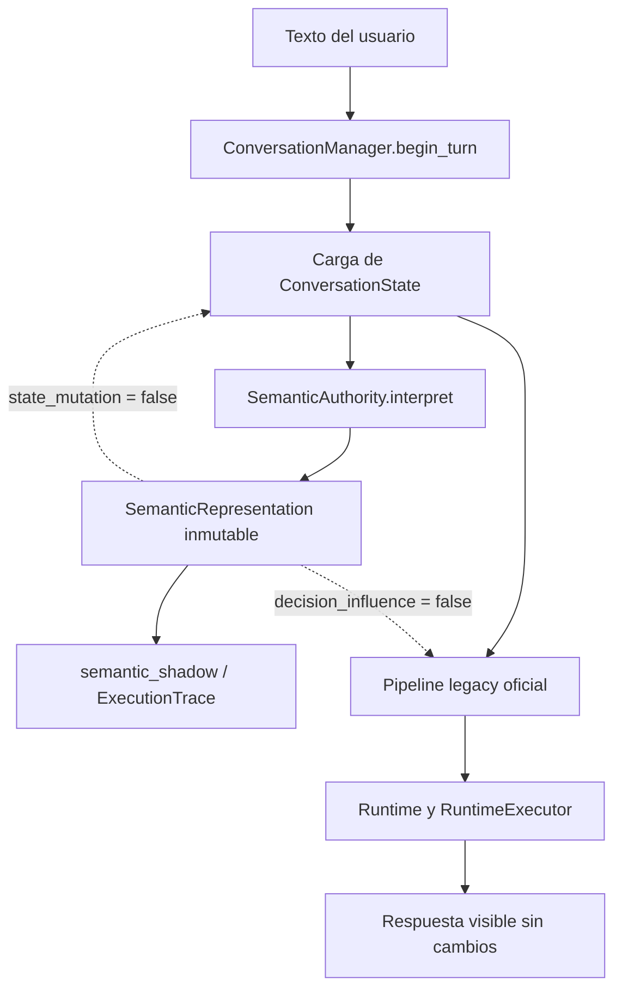
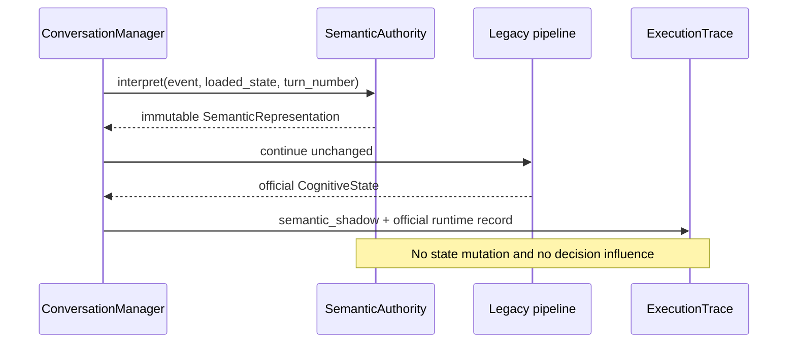

# ACA-027 - Semantic Authority RC1 Shadow Implementation

## Estado

- RC: SA-1
- Modo: Shadow
- Contrato: `semantic_representation.v1`
- Versión semántica: `1`
- Versión de autoridad: `sa-1`
- Autoridad efectiva del Runtime: pipeline legacy
- Influencia sobre decisiones: ninguna
- Mutación de `ConversationState`: ninguna

## Propósito

SA-1 incorpora una interpretación semántica única por turno sin promoverla todavía
como fuente de decisiones. Su objetivo es crear evidencia comparable para la futura
migración definida por ACA-025 y ACA-026, conservando literalmente el comportamiento
observable actual.

Esta RC no reemplaza `IntentMatcher`, `MissionManager`, `ActionPlanner`,
`FlowRouter`, `RuntimeExecutor`, Kernel ni ningún otro consumidor legacy. Tampoco
mejora respuestas. La representación se construye, se serializa y se publica en el
trace; después, el pipeline vigente continúa sin leerla.

## Arquitectura implementada



La línea punteada representa explícitamente una no-integración: ningún dato de la
representación semántica gobierna el camino oficial en SA-1.

## Componentes agregados

### SemanticAuthority

`SemanticAuthority` es el único componente nuevo autorizado a construir
`SemanticRepresentation`. En SA-1 utiliza analizadores determinísticos locales y no
invoca LLM, plugins, tools ni servicios externos.

Responsabilidades:

- recibir el evento original y una vista de solo lectura del estado cargado;
- segmentar el turno;
- proyectar entidades, eventos, assertions, actos, intents, goals y topics;
- identificar incertidumbre, correcciones y contradicciones observables;
- registrar grounding y provenance;
- proponer, sin aplicar, un posible delta de estado;
- medir costo, tamaño y cardinalidad;
- emitir exactamente una representación por invocación.

No tiene autoridad para:

- modificar `ConversationState`;
- seleccionar misión, intent, action, flow, work o tool;
- alterar Policy, Governance o Ledger;
- modificar planes;
- construir o reformular la respuesta visible.

### SemanticRepresentation

`SemanticRepresentation` es un artefacto acotado al turno, profundamente inmutable y
serializable. Sus colecciones internas se congelan como tuplas y mappings de solo
lectura; `to_dict()` produce una proyección JSON independiente.

| Campo | Responsabilidad en SA-1 |
| --- | --- |
| `contract` | Identifica `semantic_representation.v1`. |
| `representation_id` | UUID único de la interpretación. |
| `version` | Versión del contrato semántico. |
| `turn_id` | Correlación con el evento fuente. |
| `language` | Idioma proyectado del turno. |
| `metadata` | Autoridad, modo, conversación, turno y timestamps. |
| `semantic_segments` | Segmentos textuales con offsets y topics observados. |
| `entities` | Entidades normalizadas con evidencia y confianza. |
| `events` | Eventos observados en el turno. |
| `assertions` | Hechos o afirmaciones proyectadas, todavía no persistidas. |
| `conversational_act` | Acto conversacional dominante y evidencia. |
| `intents` | Intents semánticos candidatos, sin autoridad de routing. |
| `goals` | Objetivos inferidos del turno, sin autoridad de planning. |
| `constraints` | Restricciones expresadas por el usuario. |
| `uncertainty` | Señales explícitas de incertidumbre. |
| `corrections` | Correcciones y retractaciones detectadas. |
| `contradictions` | Conflictos internos o contra facts activos conocidos. |
| `topic_structure` | Topics detectados, dominante y simultáneos. |
| `grounding` | Referencias a estado previo utilizadas para interpretar. |
| `proposed_state_delta` | Cambio hipotético con `applied = false`. |
| `provenance` | Evento, hash del payload, evidencia y analizadores. |

La representación expone además `semantic_projection_hash`, SHA-256 de la proyección
semántica canónica. IDs y timestamps no participan del hash; dos interpretaciones
semánticamente equivalentes pueden compararse sin confundir identidad con contenido.

## Integración con ConversationManager

El punto de integración está en `ConversationManager.begin_turn`, inmediatamente
después de obtener el `ConversationState` inicial y antes de cualquier reconocimiento
o mutación legacy.

Orden real:

1. cargar o proyectar el estado inicial;
2. invocar una vez `SemanticAuthority.interpret`;
3. conservar la representación en la sesión y en el contexto del turno;
4. continuar el pipeline legacy sin consumirla;
5. publicar el artefacto Shadow dentro del registro de runtime;
6. proyectarlo posteriormente en `ExecutionTrace` e introspección.

`ConversationSession.semantic_representation_count` permite verificar la cardinalidad
acumulada. `ConversationTurnContext.semantic_representation` transporta el artefacto
solo hasta la frontera de observabilidad; no lo conecta con decisiones.

## Observabilidad

El bloque `semantic_authority` de `ExecutionTrace` permite inspeccionar:

- `authority_mode`: `legacy`, indicando quién conserva la autoridad efectiva;
- `semantic_authority_mode`: `shadow`;
- `semantic_representation_id`;
- `semantic_version`;
- `semantic_latency_ms`;
- `semantic_projection_hash`;
- representación completa bajo `semantic_trace`;
- timestamps de inicio y finalización;
- métricas de tamaño y cardinalidad;
- `decision_influence: false`;
- `state_mutation: false`.

También se agrega un evento de trace con operación
`SEMANTIC_REPRESENTATION_SHADOW`. El resumen de introspección reutiliza ese mismo
bloque; no construye una interpretación paralela.



## Métricas

Cada turno registra:

| Métrica | Definición |
| --- | --- |
| `construction_time_ms` | Tiempo total medido con reloj monotónico. |
| `representation_size_bytes` | Tamaño UTF-8 de la representación serializada. |
| `entity_count` | Entidades proyectadas. |
| `event_count` | Eventos proyectados. |
| `assertion_count` | Assertions proyectadas. |
| `topic_count` | Topics distintos detectados. |
| `segment_count` | Segmentos semánticos producidos. |

Los timestamps UTC registran el intervalo de construcción. La latencia no altera
decisiones ni contenido visible; solo añade el costo de observación de SA-1.

## Compatibilidad

SA-1 preserva las fronteras existentes:

- `ConversationState` continúa siendo la única fuente de verdad persistente;
- el pipeline legacy conserva toda autoridad visible;
- `event.payload` permanece intacto;
- matching textual, plugins y Shadow Mode existentes permanecen activos;
- Governance, Ledger y Tool Contracts no reciben la representación;
- `RuntimeExecutor` ejecuta el mismo `ExecutionPlan` que antes;
- Kernel, `NarrativeResponseComposer`, LLM Verbalizer y Validator no cambian;
- Studio y Public Conversation Product Layer observan la misma respuesta oficial.

La integración es aditiva. Consumidores que ignoran los campos nuevos continúan
operando con el contrato previo de trace.

## Invariantes verificables

1. Por cada `begin_turn` existe exactamente una llamada a `SemanticAuthority`.
2. Cada representación posee un `representation_id` único.
3. La representación es profundamente inmutable.
4. La serialización no comparte referencias mutables con el contrato interno.
5. `proposed_state_delta.applied` siempre es `false` en SA-1.
6. `decision_influence` y `state_mutation` siempre son `false`.
7. Ningún componente decisor importa o consume `SemanticRepresentation`.
8. La respuesta, intent, action y plan oficiales permanecen idénticos.

## Limitaciones actuales

- Los extractores son deliberadamente determinísticos y de cobertura inicial; SA-1
  evalúa representación y observabilidad, no calidad semántica definitiva.
- Los intents y goals son candidatos Shadow, no reemplazos de la clasificación actual.
- `proposed_state_delta` no valida reglas de persistencia porque nunca se aplica.
- El grounding usa únicamente estado ya disponible y no introduce memoria nueva.
- No existe comparación automática Legacy vs SemanticAuthority para decisiones; esa
  actividad pertenece a una RC posterior.
- El costo de construcción se paga por turno aunque el resultado sea pasivo; queda
  medido para establecer el presupuesto de promoción.

## Criterios para comenzar SA-2

La existencia de la representación no habilita por sí sola SA-2. Antes de promover
cualquier consumidor deben cumplirse simultáneamente:

1. suite completa y benchmarks vigentes sin regresiones visibles;
2. cardinalidad demostrada de una representación por turno;
3. cobertura suficiente de entidades, assertions, correcciones, contradicciones y
   múltiples topics sobre conversaciones reales;
4. latencia y tamaño dentro de presupuestos acordados;
5. estabilidad del `semantic_projection_hash` para inputs equivalentes;
6. divergencias Legacy/SemanticAuthority observadas y clasificadas;
7. un consumidor Shadow acotado, con rollback explícito, aprobado por separado;
8. ninguna promoción simultánea de múltiples autoridades.

Hasta entonces, `SemanticAuthority` es una autoridad de construcción nominal en
Shadow, no una autoridad efectiva sobre el Runtime.

## Evidencia de aceptación de SA-1

La validación automatizada cubre:

- construcción de todos los campos obligatorios;
- correcciones y contradicciones contra estado previo;
- inmutabilidad profunda;
- IDs únicos y serialización;
- hash semántico estable;
- una invocación por turno;
- trace completo y métricas de latencia;
- ausencia de mutación de `ConversationState`;
- equivalencia de respuesta, intent, action y plan con el pipeline vigente.

El flujo validado es:

```text
Texto
  -> SemanticAuthority
  -> SemanticRepresentation
  -> ExecutionTrace (Shadow)
  -> Runtime legacy oficial
  -> respuesta visible idéntica
```

SA-1 queda limitada a producir evidencia. No adelanta SA-2 ni cambia la autoridad
cognitiva efectiva de ACA.
