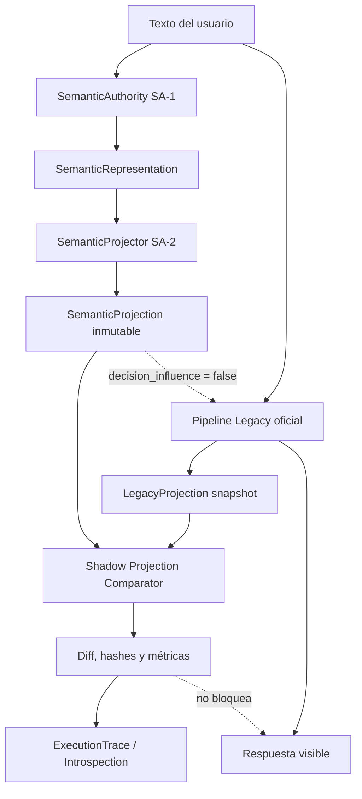
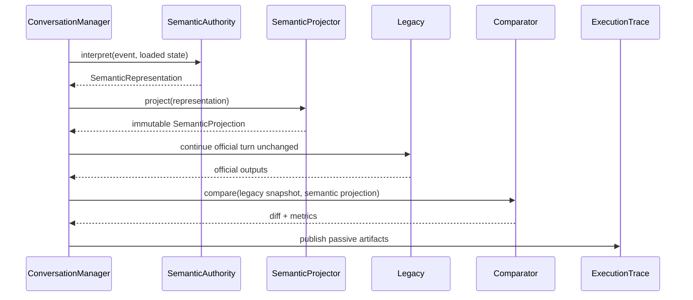

# ACA-028 - Semantic Authority RC2 Shadow Projection

## Estado

- RC: SA-2
- Modo: Shadow
- Contrato principal: `semantic_projection.v1`
- Contrato de comparación: `semantic_projection_comparison.v1`
- Autoridad efectiva: Legacy
- Influencia sobre decisiones: ninguna
- Mutación de `ConversationState`: ninguna
- Promoción vertical: no implementada

## Objetivo

SA-2 demuestra que `SemanticRepresentation` puede proyectarse hacia las vistas
estructuradas que hoy consume o produce el pipeline legacy. Las proyecciones se
construyen antes de las decisiones oficiales, se comparan cuando Legacy termina el
turno y se publican exclusivamente para observabilidad.

La RC no cambia clasificación, misión, planning, routing, ejecución ni respuesta.
Una divergencia nunca bloquea ni modifica el turno. Legacy conserva toda autoridad.

## Arquitectura implementada



El orden operativo real es:

1. `ConversationManager` carga `ConversationState`.
2. SA-1 genera una `SemanticRepresentation`.
3. SA-2 genera una `SemanticProjection` usando únicamente esa representación.
4. Legacy ejecuta sin leer ninguno de esos artefactos.
5. Al cerrar el turno se captura lo que Legacy produjo.
6. El comparador normaliza significado y registra todas las diferencias.
7. `ExecutionTrace` e introspección exponen representación, proyecciones y diff.
8. La respuesta oficial sigue siendo exclusivamente la producida por Legacy.

## Componentes

### SemanticProjector

`SemanticProjector` recibe solamente `SemanticRepresentation`. No recibe texto libre,
`ConversationState`, resultados legacy, Runtime ni servicios. Por lo tanto no puede
reutilizar matching textual ni copiar reglas de los componentes oficiales.

Produce ocho subproyecciones siempre presentes:

| Proyección | Contrato | Fuente semántica |
| --- | --- | --- |
| Conversational Act | `conversational_act.v1` | `conversational_act`, corrections |
| Conversation Intent Model | `conversational_intent_model.v1` | segments, intents, goals, constraints, uncertainty |
| Intent Projection | `intent_projection.v1` | intents ordenados por prioridad y confianza |
| Entity Projection | `entity_projection.v1` | entities |
| Fact Projection | `fact_projection.v1` | assertions estructuradas, corrections |
| Slot Projection | `slot_projection.v1` | assertions, uncertainty, grounding |
| Topic Projection | `topic_projection.v1` | topic structure y relaciones |
| Goal Projection | `goal_projection.v1` | goals |

### SemanticProjection

`SemanticProjection` es profundamente inmutable. Contiene:

- `projection_id` único;
- referencia al `representation_id` fuente;
- versión;
- timestamp;
- los ocho contratos proyectados;
- metadata de modo y origen;
- `projection_hash` SHA-256 del contenido semántico.

IDs y timestamps no participan del hash. Proyecciones equivalentes conservan el
mismo hash aunque provengan de turnos o instancias diferentes.

### Legacy Projection Snapshot

El snapshot Legacy no vuelve a ejecutar reglas. Solo captura outputs ya producidos:

- acto seleccionado;
- modelo de intención conversacional;
- `intent_match` oficial;
- entidades de `CognitiveState`;
- facts asimilados o revisados durante el turno;
- slots resueltos o afectados por esos facts;
- transición/topic stack;
- conversational goal.

El snapshot es turn-scoped para evitar comparar facts históricos acumulados contra
assertions del mensaje actual.

### Shadow Projection Comparator

Los contratos Legacy y semánticos no tienen la misma forma física. Una comparación
directa de diccionarios confundiría diferencias de serialización con diferencias de
significado. El comparador conserva ambos payloads completos, pero compara vistas
canónicas:

- acto y confianza;
- preguntas, preocupación, goal e información faltante;
- intent seleccionado y candidatos;
- entidades por tipo, rol y valor;
- facts por tipo y valor;
- slots por nombre y valor;
- topics por tipo y foco;
- goals por tipo y target.

Cada estructura recibe exactamente uno de estos estados:

| Estado | Significado |
| --- | --- |
| `MATCH` | La vista canónica es equivalente. |
| `DIFFERENT` | Ambos lados existen pero difieren. |
| `MISSING` | Legacy produjo información que Semantic Projection no contiene. |
| `EXTRA` | Semantic Projection conserva información ausente en Legacy. |

El reporte por turno incluye:

- `legacy_projection`;
- `semantic_projection`;
- `projection_diff` por estructura;
- `field_diff` detallado;
- `missing_fields`;
- `extra_fields`;
- confidence agregada;
- hash de la comparación;
- métricas;
- timestamps;
- flags explícitos de no influencia y no mutación.

## Métricas

SA-2 registra automáticamente valores entre `0.0` y `1.0`:

| Métrica | Definición |
| --- | --- |
| Entity Recall | Entidades Legacy presentes en Semantic Projection / entidades Legacy. |
| Entity Precision | Entidades compartidas / entidades semánticas proyectadas. |
| Fact Recall | Facts Legacy presentes semánticamente / facts Legacy. |
| Fact Precision | Facts compartidos / facts semánticos proyectados. |
| Slot Recall | Slots Legacy presentes semánticamente / slots Legacy. |
| Slot Precision | Slots compartidos / slots semánticos proyectados. |
| Topic Agreement | Jaccard entre topics Legacy y semánticos. |
| Intent Agreement | Igualdad del intent dominante normalizado. |
| Goal Agreement | Jaccard entre goals normalizados. |

Cuando Legacy no representa una categoría y Semantic Projection sí lo hace, recall
no penaliza información inexistente del lado Legacy, pero precision revela el extra.
Esto evita presentar como pérdida semántica lo que en realidad es mayor amplitud.

## Observabilidad

`conversation_state_runtime.semantic_projection_shadow` expone:

- Semantic Representation ID;
- Semantic Projection ID, versión y hash;
- Semantic Projection completa;
- Legacy Projection completa;
- comparación completa;
- diff por contrato y por campo;
- métricas;
- timestamps;
- `authority_mode: legacy`;
- `semantic_authority_mode: shadow`;
- `decision_influence: false`;
- `state_mutation: false`.

`ExecutionTrace` agrega `SEMANTIC_PROJECTION_SHADOW` inmediatamente después de
`SEMANTIC_REPRESENTATION_SHADOW`. El bloque top-level `semantic_projection` conserva
el artefacto completo aunque la versión acotada del evento de trace sea sanitizada.



## Casos especiales

El benchmark verifica explícitamente:

- negación: `No hubo heridos.` proyecta `injuries = false`;
- corrección: `Perdon, me equivoque` proyecta acto y reemplazo propuesto;
- retractación: `Olvidate de eso` proyecta `retract`;
- cambio de tema: `Ahora quiero hablar de internet` activa connectivity;
- memoria inmediata: `Me llamo Nicolas` proyecta entidad, fact y slot;
- múltiples temas: choque e internet permanecen simultáneamente representados;
- turno rico: nombre, mascota, choque, lesiones, retractación y cambio de dominio no
  se colapsan en una única etiqueta.

Estos artefactos son observaciones. Ninguno corrige todavía los errores Legacy que
el diff deja expuestos.

## Benchmark

Dataset:

`benchmarks/semantic/aca_semantic_projection_shadow_benchmark_v1.json`

Cobertura actual:

- 10 conversaciones;
- 15 turnos ejecutados contra el Runtime real;
- 15 proyecciones completas;
- 0 fallos de observación;
- 0 violaciones de autoridad;
- 0 influencias decisionales;
- 0 mutaciones de estado.

Resultado de referencia de SA-2:

| Métrica | Resultado |
| --- | ---: |
| Entity Recall | 80.00% |
| Entity Precision | 33.33% |
| Fact Recall | 86.67% |
| Fact Precision | 60.00% |
| Slot Recall | 80.00% |
| Slot Precision | 16.67% |
| Topic Agreement | 0.00% |
| Intent Agreement | 0.00% |
| Goal Agreement | 0.00% |

Distribución de 120 comparaciones de contrato:

- `MATCH`: 16;
- `DIFFERENT`: 81;
- `MISSING`: 3;
- `EXTRA`: 20.

Estos valores no son un criterio de aprobación semántica. Son el baseline que SA-2
debía hacer visible. Los agreements de intent/topic/goal en cero muestran una
divergencia sistemática de ontologías: Legacy usa con frecuencia
`fallback/general_orientation`, mientras Semantic Projection conserva dominios como
connectivity, billing, identity e insurance claim. Promover esa diferencia sin una RC
vertical sería un cambio de comportamiento prohibido.

Ejecución:

```powershell
$env:LLM_ENABLED="false"
py tools/run_semantic_projection_benchmark.py --format markdown
```

## Compatibilidad

SA-2 no modifica:

- `ConversationState`;
- `ACAOSRuntime`;
- `IntentMatcher`;
- `MissionManager`;
- `ActionPlanner`;
- `FlowRouter`;
- `RuntimeExecutor`;
- Candidate Work;
- Kernel;
- `NarrativeResponseComposer`;
- LLM Verbalizer o Validator;
- Governance, Ledger, Policy o Tool Contracts.

La integración reside únicamente en la lifecycle boundary de `ConversationManager`
y en observabilidad. Consumers antiguos pueden ignorar los campos aditivos.

## Limitaciones

1. Las ontologías de intent, topic y goal todavía no están alineadas.
2. Legacy carece de una entidad central equivalente; precision baja cuando SA-2
   observa entidades que Legacy no estructura.
3. Slot Projection solo puede derivar slots contenidos en assertions o grounding;
   no debe inventar requisitos de misión ausentes en Semantic Representation.
4. La comparación es turn-scoped y no intenta sustituir el estado acumulado.
5. Las reglas determinísticas de SA-1 mantienen cobertura limitada de lenguaje.
6. Confidence es descriptiva; no bloquea ejecución.
7. Ninguna métrica posee todavía umbral de promoción.

## Criterios para comenzar SA-3

SA-3 no queda autorizado automáticamente. Antes de reemplazar un consumidor vertical
deben cumplirse simultáneamente:

1. seleccionar un único contrato de bajo riesgo;
2. definir mapping ontológico explícito entre Legacy y Semantic Projection;
3. establecer umbrales objetivos y corpus de promoción;
4. clasificar cada `MISSING`, `EXTRA` y `DIFFERENT` relevante;
5. demostrar equivalencia visible o aprobar conscientemente el cambio esperado;
6. mantener comparación Shadow y rollback inmediato;
7. no promover dos autoridades en la misma RC;
8. conservar Governance, Ledger, RuntimeExecutor y verbalización intactos;
9. obtener autorización expresa para SA-3.

## Conclusión

SA-2 deja preparada la arquitectura para evaluar reemplazos verticales, pero no los
realiza. Legacy sigue siendo la única autoridad efectiva. La principal evidencia de
esta RC no es un porcentaje alto de equivalencia: es la capacidad de reconstruir,
medir y auditar exactamente dónde las dos interpretaciones coinciden y dónde no,
sin que una sola diferencia alcance al usuario.
