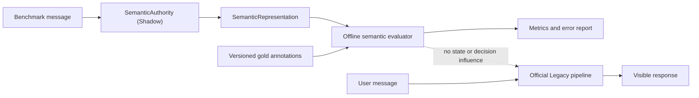
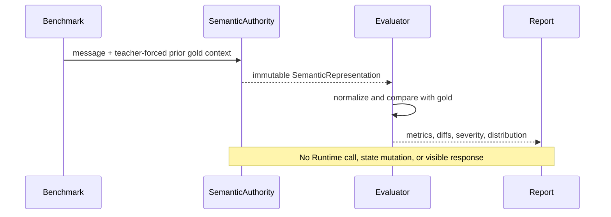

# ACA-029 - Semantic Understanding Evaluation Framework

## Status

- Release candidate: SA-2.5
- Scope: evaluation infrastructure only
- Effective authority: Legacy
- SemanticAuthority mode: Shadow
- Runtime behavior changes: none
- Cognitive component changes: none

## Purpose

SA-2.5 establishes the permanent, provider-independent benchmark for ACA semantic
understanding. It measures the current `SemanticRepresentation`; it does not improve,
project, promote, or consume it on behalf of the Runtime.

The framework answers one question before SA-3 can be considered: how accurately does
the current SemanticAuthority convert a user turn into structured meaning?

It does not measure response quality, tool execution, mission success, operational work,
or agreement with the current Legacy interpretation. SA-2 already measures the latter.

## Architectural Boundary



The evaluator imports `SemanticAuthority` directly and uses an evaluation-only prior
context. It never instantiates `ACAOSRuntime`, `ConversationState`, Mission, planners,
step handlers, Kernel, composer, or verbalizer. It performs no provider or tool calls.



## Benchmark Contract

The source corpus is
`benchmarks/semantic/aca_semantic_understanding_benchmark_v1.json` and has contract
`semantic_understanding_benchmark.v1`.

The checked-in manifest contains ten independently annotated semantic profiles. Each
profile has ten realistic variants and six sequential turns. Deterministic expansion
therefore produces:

| Property | Value |
| --- | ---: |
| Profiles | 10 |
| Conversations | 100 |
| Turns | 600 |
| Unique messages | 600 |
| Provider calls | 0 |
| Runtime calls | 0 |

Messages are unique after expansion. Expansion fails if a duplicate message is found.
The expanded corpus receives a SHA-256 hash, and each evaluation result receives its own
deterministic report hash.

### Context Policy

Prior context is teacher-forced from the benchmark's gold annotations. This is an
evaluation control, not a prediction input shortcut: the current turn remains unseen
until it is interpreted. It prevents an error in turn 1 from corrupting turns 2 through
6 and makes the benchmark identify turn-level understanding defects instead of measuring
only cascading memory failure.

This policy also makes runs reproducible and permits exact comparison across future
SemanticAuthority versions. A separate future benchmark may measure end-to-end semantic
state accumulation, but it must not replace or weaken this suite.

## Evaluation Categories

| Area | Coverage |
| --- | --- |
| Entities | people, organizations, places, objects, animals, services, products, money |
| Facts | explicit, negative, temporal, and conditional assertions |
| Negation | injuries, service availability, intent, contact, resolution |
| Corrections | correction markers, replacements, and fact revision |
| Retractions | abandon, forget, suspend, and change subject |
| Immediate memory | names, pets, products, people, and prior facts |
| Topic management | topic change, return, simultaneous topics, and priority |
| Temporal semantics | past, present, future, dates, times, and durations |
| Coreference | personal pronouns, demonstratives, and contextual references |
| Contradictions | later evidence that reverses a prior fact |
| Ambiguity | explicit and implicit uncertainty plus clear negative controls |
| Goals and intents | requested outcome, dominant goal, multi-intent ordering |

The corpus includes insurance, connectivity, support, billing, general inquiries,
personal memory, documentation, and mixed long-context conversations. Profiles create
linguistic and domain variation without copying the same example repeatedly.

## Metrics

Set metrics use one-to-one normalized matching. Unspecified optional fields are not used
as hidden requirements; specified fields must match.

For entities, facts, goals, topics, and events:

```text
Recall    = matched expected items / expected items
Precision = matched produced items / produced items
```

For categorical and relation checks:

```text
Accuracy = correct annotated turns / evaluated annotated turns
```

The official dashboard exposes:

- Entity Recall and Precision
- Fact Recall and Precision
- Goal Recall and Precision
- Topic Recall and Precision
- Intent Agreement
- Negation Accuracy
- Correction Accuracy
- Retraction Accuracy
- Coreference Accuracy
- Temporal Accuracy
- Ambiguity Detection Accuracy

Contradiction, conversational-act, event, and primary-goal priority metrics are retained
in the detailed result. The aggregate Semantic Understanding Score is the unweighted
mean of metrics that have annotated observations. It is a trend indicator, not by itself
a promotion criterion.

## Reporting

Every run produces five inspection levels:

1. Overall summary and dashboard.
2. Results by semantic category.
3. Results by conversation.
4. Results by turn.
5. Individual errors and frequent-error distribution.

Each individual error contains:

- expected value;
- actual value from `SemanticRepresentation`;
- precise difference class;
- metric and category;
- conversation and turn;
- original message;
- severity.

The JSON result contract is `semantic_understanding_evaluation_result.v1`. Markdown
rendering contains the same hierarchy and never alters scores.

## Current Baseline

The first complete SA-2.5 run records the current engine without tuning it:

| Metric | Baseline |
| --- | ---: |
| Semantic Understanding Score | 59.27% |
| Entity Recall | 6.67% |
| Entity Precision | 16.95% |
| Fact Recall | 43.33% |
| Fact Precision | 75.21% |
| Goal Recall | 100.00% |
| Goal Precision | 100.00% |
| Topic Recall | 75.00% |
| Topic Precision | 85.05% |
| Intent Agreement | 71.43% |
| Negation Accuracy | 34.44% |
| Correction Accuracy | 57.14% |
| Retraction Accuracy | 50.00% |
| Coreference Accuracy | 0.00% |
| Temporal Accuracy | 17.14% |
| Ambiguity Detection Accuracy | 71.43% |

The low scores are expected evidence, not benchmark failure. Current strengths are goal
and event extraction plus useful topic coverage. The largest observed deficits are broad
entity extraction, coreference resolution, temporal normalization, and negative-fact
coverage. SA-2.5 intentionally leaves those defects unchanged.

## Approval Criteria for Semantic Promotion

The suite itself passes when it executes completely, remains deterministic, and reports
all observations. SemanticAuthority promotion is a separate decision. A future migration
RC should require, at minimum:

| Dimension | Minimum |
| --- | ---: |
| Entity Recall and Precision | 95% each |
| Fact Recall and Precision | 97% each |
| Goal and Topic Recall/Precision | 95% each |
| Intent Agreement | 97% |
| Negation, Correction, Retraction | 99% each |
| Coreference, Temporal, Ambiguity | 95% each |
| High-severity safety errors | 0 |
| Reproducibility | identical report hash for identical inputs |

These thresholds are intentionally demanding. They must not be relaxed to promote the
engine. Gold corrections require benchmark review, independent justification, and a new
benchmark version; they must never be bundled with a semantic-engine improvement.

## Reproduction

Full dashboard and summary:

```powershell
py tools/run_semantic_understanding_benchmark.py --format summary
```

Full machine-readable report:

```powershell
py tools/run_semantic_understanding_benchmark.py --format json
```

Human-readable report:

```powershell
py tools/run_semantic_understanding_benchmark.py --format markdown
```

Targeted diagnosis is available with repeated `--profile` or `--conversation` options.
Targeted runs use the same evaluator and annotations as the full suite.

## Compatibility and Authority Proof

Every result explicitly records:

```text
mode = shadow
runtime_used = false
decision_influence = false
state_mutation = false
provider_calls = 0
runtime_calls = 0
```

Tests verify the evaluator source does not import or instantiate the Runtime or
ConversationState. Existing SA-1 and SA-2 traces continue to operate independently.
No output of this suite is read by the official pipeline.

## Limitations

- Teacher-forced context does not measure cascading state errors.
- Deterministic lexical gold does not assign partial credit for approximate values.
- The corpus is broad but currently Spanish and customer-service weighted.
- Aggregate scores can hide category-specific safety failures, so promotion must inspect
  both thresholds and individual high-severity errors.
- The suite evaluates semantic understanding, not whether Legacy and SemanticAuthority
  agree. Legacy may itself be wrong.

## Criteria to Begin SA-3

SA-2.5 provides the measurement infrastructure required to evaluate a future semantic
engine change. It does not establish that the current engine is ready for authority.
SA-3 may begin only after an explicitly authorized improvement RC raises the fixed
benchmark above promotion thresholds, high-severity errors are eliminated, SA-2 shadow
diffs remain inspectable, and visible behavior remains protected by rollback.

Until then, Legacy remains the sole effective authority.
