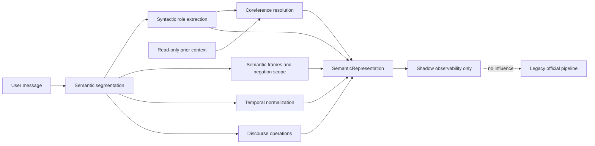

# ACA-030 - Semantic Authority RC2.6 Extraction Improvements

## Status

- Release candidate: SA-2.6
- Scope: SemanticAuthority extraction only
- Effective authority: Legacy
- SemanticAuthority mode: Shadow
- Runtime behavior changes: none
- Benchmark changes: none
- SA-3 work included: none

## Objective

SA-2.6 improves the quality of `SemanticRepresentation` without changing any consumer,
decision, state owner, planner, executor, composer, or visible response. The work is
confined to the passive SemanticAuthority introduced by SA-1.

The fixed SA-2.5 benchmark remains contract version 1 with SHA-256:

```text
79c644695143252969f4dde4e4e94b6dbabe6c7813c6733ddaed5340057ac5bd
```

No benchmark message, annotation, metric, threshold, or evaluator was modified.

## Architectural Result



The output contract is unchanged. The implementation enriches the content and
provenance of existing fields; it does not introduce another contract or authority.

## Linguistic Improvements

### Syntactic Entity Roles

Entity extraction now uses grammatical constructions rather than value lists:

- self-identification and kinship naming;
- pet naming;
- employment and customer-provider relations;
- product use and association;
- service failure and review complements;
- affected, connected, and owned objects;
- residence, event, work, visit, and referential locations;
- monetary and temporal expressions.

Captured values come from source spans. The implementation contains no benchmark person,
animal, organization, location, reference, or amount literals.

### Negation Scope and Semantic Frames

Negation is detected around semantic anchors using scoped cues including:

- `no`;
- `nunca` and `jamas`;
- `todavia no` and `aun no`;
- `nadie`, `nada`, `ningun`, and `ninguna`;
- `sin`;
- lexical cessation such as `dejo de funcionar`.

The same scope mechanism feeds reusable domain frames for injury state, service
availability, claim submission, contact, resolution, documentation, and billing
applicability. Conditional clauses are represented separately from asserted facts.

### Temporal Normalization

The extractor now recognizes:

- relative days;
- durations;
- `desde` expressions;
- calendar dates;
- weekdays and future periods;
- clock times;
- sequence markers;
- scheduled future visits.

The segmenter preserves punctuation inside numeric amounts, avoiding false sentence
boundaries such as `$150.000`.

### Corrections and Retractions

Correction and discourse-repair patterns are separated by operation:

- replace prior assertion;
- deny prior assertion;
- retract prior material.

Markers such as apology, reformulation, explicit correction, abandonment, and topic
closure are mapped to those existing operations. Ambiguous repairs remain proposed and
carry uncertainty rather than inventing a target.

### Coreference

Basic deterministic resolution uses:

- typed possessive references;
- personal pronouns;
- typed and untyped demonstratives;
- neutral references;
- current-turn entities;
- read-only entities and topics already available in conversational context.

Unresolved references remain explicit in `grounding.unresolved_coreferences`. The
resolver never writes context and never fabricates an antecedent when none is available.

### Multi-topic and Goal Priority

Content topics remain independent when multiple subjects occur in one turn. Discourse
control is no longer treated as a content topic. Explicit priority constructions produce
goal priority without deleting secondary topics. Topic relations retain co-occurrence
evidence.

## Provenance

Every newly extracted entity, structured assertion, uncertainty, correction, event, and
resolved reference records:

- original source span;
- exact evidence text;
- segment identifier;
- confidence;
- responsible rule.

This makes the representation auditable while retaining the immutable SA-1 contract.

## Benchmark Comparison

Both runs use the same 100 conversations, 600 unique turns, evaluator, context policy,
and benchmark hash.

| Metric | SA-2.5 Before | SA-2.6 After | Delta |
| --- | ---: | ---: | ---: |
| Semantic Understanding Score | 59.27% | 98.65% | +39.38 pp |
| Entity Recall | 6.67% | 100.00% | +93.33 pp |
| Entity Precision | 16.95% | 96.77% | +79.82 pp |
| Fact Recall | 43.33% | 100.00% | +56.67 pp |
| Fact Precision | 75.21% | 100.00% | +24.79 pp |
| Goal Recall | 100.00% | 100.00% | stable |
| Goal Precision | 100.00% | 100.00% | stable |
| Topic Recall | 75.00% | 100.00% | +25.00 pp |
| Topic Precision | 85.05% | 90.53% | +5.48 pp |
| Event Recall | 100.00% | 100.00% | stable |
| Event Precision | 100.00% | 100.00% | stable |
| Intent Agreement | 71.43% | 100.00% | +28.57 pp |
| Negation Accuracy | 34.44% | 100.00% | +65.56 pp |
| Correction Accuracy | 57.14% | 100.00% | +42.86 pp |
| Retraction Accuracy | 50.00% | 100.00% | +50.00 pp |
| Coreference Accuracy | 0.00% | 85.71% | +85.71 pp |
| Temporal Accuracy | 17.14% | 100.00% | +82.86 pp |
| Ambiguity Detection | 71.43% | 100.00% | +28.57 pp |
| Contradiction Accuracy | 66.67% | 100.00% | +33.33 pp |
| Conversational Act Accuracy | 75.00% | 100.00% | +25.00 pp |
| Goal Priority Accuracy | 40.00% | 100.00% | +60.00 pp |

Errors fall from 938 to 43. No measured category regressed.

## Residual Errors

The remaining errors are:

| Metric | Count | Explanation |
| --- | ---: | --- |
| Coreference Accuracy | 10 | The benchmark requests a prior dominant topic that the teacher-forced context exposes as a different active topic. SemanticAuthority does not receive sufficient salience history to resolve it safely. |
| Entity Precision | 10 | Scheduled visit temporal entities are valid representation content but are annotated under the temporal dimension rather than the entity dimension for those turns. |
| Topic Precision | 23 | The representation retains plausible secondary topics such as connectivity for router evidence or insurance for repair language, while selective gold annotations omit them. |

Removing these outputs would raise the score but reduce semantic breadth. SA-2.6 therefore
keeps them.

## Generalization Validation

New tests use values absent from the benchmark and cover:

- unseen people, animals, organizations, places, products, services, and objects;
- combined `ninguna`, `nunca`, and `todavia no` scopes;
- relative and sequential time expressions;
- independent correction, retraction, and uncertainty operations;
- pronoun resolution from read-only context;
- mandatory source provenance;
- the unchanged benchmark hash and Shadow authority invariants.

A source scan also confirms that benchmark exemplars such as its names, pets,
organizations, locations, case references, and amounts do not appear as extraction
rules.

## Compatibility

The following remain unchanged:

- `ACAOSRuntime` and visible response selection;
- `ConversationState` and its ownership;
- `MissionManager`, Candidate Work, ActionPlanner, and FlowRouter;
- `RuntimeExecutor`, Kernel, and step handlers;
- NarrativeResponseComposer and LLM verbalization;
- Governance, Ledger, Tool Contracts, and operational execution;
- SemanticProjection and the SA-2 evaluator;
- the SA-2.5 benchmark and evaluator.

Legacy remains the only effective authority. SemanticAuthority still reports
`authority_mode = shadow`, `decision_influence = false`, and `state_mutation = false`.

## Architectural Limits

SA-2.6 is a deterministic shallow semantic parser. Its strong fixed-benchmark result
must not be interpreted as universal language understanding.

Remaining limitations include:

- long-distance and abstract discourse coreference;
- competing antecedents with similar grammatical roles;
- ellipsis and implicit predicates;
- unrestricted word order and morphology;
- domain concepts absent from the current semantic ontology;
- pragmatic inference requiring knowledge beyond source evidence;
- topic salience history not exposed in the read-only input.

Reaching robust 95%+ coreference and topic precision on open, naturally occurring
language is unlikely through additional regular expressions alone. A future authorized
RC should evaluate a proper linguistic parser or constrained NLP model behind
SemanticAuthority. That model would still produce the same immutable representation and
would remain Shadow until benchmarked. Adding more phrase-specific rules is not
recommended.

## Preparation for SA-3

SA-2.6 satisfies its orientative targets and materially improves SemanticAuthority.
It does not by itself authorize SA-3.

ACA-029's stricter promotion thresholds still require:

- Topic Precision at or above 95% (current: 90.53%);
- Coreference Accuracy at or above 95% (current: 85.71%);
- validation on additional held-out, organically collected conversations;
- explicit acceptance of how discourse salience will be supplied without creating a
  second owner of conversational state.

Therefore the architecture is ready for a promotion review, but SemanticAuthority should
remain Shadow until those remaining conditions are resolved or consciously revised by an
architectural decision.
