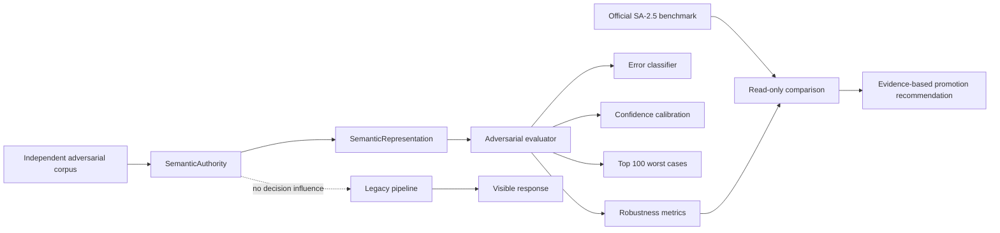

# ACA-031 - Semantic Authority Adversarial Validation

Status: Implemented in Shadow Mode  
Scope: Semantic Authority RC2.9  
Effective authority: Legacy  
Decision influence: None

## 1. Purpose

SA-2.9 is a red-team evaluation of `SemanticAuthority`. It does not improve the
semantic engine and it does not promote it. The objective is to find evidence
that would make an authority migration unsafe, while preserving the option of a
small and reversible SA-3 pilot if the evidence supports one.

This RC adds an independent corpus, an offline runner, robustness metrics,
confidence calibration, automatic error classification, and a ranked list of
the 100 worst conversations. It does not call Runtime and cannot alter a visible
response.



## 2. Isolation guarantees

| Property | Result |
| --- | --- |
| Runtime invoked | No |
| ConversationState instantiated | No |
| Runtime decisions changed | No |
| Visible responses changed | No |
| SemanticAuthority changed | No |
| SemanticRepresentation changed | No |
| SemanticProjection changed | No |
| Official benchmark changed | No |
| Provider or LLM calls | 0 |
| Effective authority | Legacy |

The evaluator invokes `SemanticAuthority.interpret()` directly with a read-only,
evaluation-only context. Prior gold facts and topics are projected into that
context solely to test grounding. They do not enter Runtime.

## 3. Adversarial corpus

The corpus is stored at:

`benchmarks/semantic/aca_semantic_adversarial_benchmark_v1.json`

It is independent of the permanent SA-2.5 benchmark. The loader normalizes every
message in both corpora and refuses to run if any exact normalized overlap is
found.

| Corpus property | Value |
| --- | ---: |
| Conversations | 100 |
| Turns | 1,230 |
| Unique messages | 924 |
| Exact overlap with SA-2.5 | 0 |
| Messages over 2,000 words | 10 |
| Maximum message length | 2,511 words |
| Conversations over 50 turns | 10 |
| Maximum conversation length | 55 turns |
| Corpus hash | `69bbc81a2cd107a936f63e6b122c110380f31b6916595cba978e50650cb61a47` |

### 3.1 Profiles

| Profile | Primary pressure |
| --- | --- |
| `pragmatic_noise` | Irony, sarcasm, humor, emoji, minimal replies |
| `nested_negation_and_revision` | Double/triple negation, repeated corrections |
| `ambiguous_cross_reference` | Ambiguous pronouns and cross references |
| `rapid_context_jumps` | Insurance, connectivity, pet, billing, insurance |
| `noisy_whatsapp_audio` | Misspellings, abbreviations, emoji, speech transcripts |
| `distributed_information` | Facts distributed across turns and later revisions |
| `distant_memory_stress` | 55 turns, topic churn, distant recall |
| `conflicting_priorities_and_speakers` | Multiple speakers and conflicting goals |
| `real_ambiguity_and_successive_retraction` | No unique answer, successive withdrawals |
| `extreme_long_form` | More than 2,000 words plus later reference |

Ten lexical variants are expanded per profile. Variants change people,
organizations, places, products, services, objects, cases, amounts, and time
expressions. This tests structural stability without hard-coding a single name
or domain phrase.

## 4. Evaluation model

Each annotated turn evaluates only the semantics asserted by its gold record.
Set-valued dimensions use one-to-one matching and F1:

`F1 = 2 * matched / (expected + actual)`

The turn score is the arithmetic mean of its annotated checks plus provenance.
The adversarial robustness score is a weighted aggregate:

| Metric | Weight |
| --- | ---: |
| Semantic accuracy | 30.0% |
| Semantic stability | 10.0% |
| Consistency | 10.0% |
| Recovery | 10.0% |
| Context retention | 10.0% |
| Long conversation accuracy | 10.0% |
| Noise resistance | 7.5% |
| Ambiguity robustness | 7.5% |
| Confidence calibration | 5.0% |

Stability groups equivalent turn positions across the ten lexical variants and
measures the share assigned the modal structural signature. A high stability
score means deterministic consistency; it does not imply correctness.

Confidence calibration uses the mean absolute difference between published
semantic confidence and measured turn quality. A turn is marked overconfident
when confidence is at least 0.80 and quality is below 0.50.

## 5. Reproducible results

Command:

```powershell
py tools/run_semantic_adversarial_benchmark.py --format summary
```

Result hashes:

- Official benchmark: `79c644695143252969f4dde4e4e94b6dbabe6c7813c6733ddaed5340057ac5bd`
- Adversarial benchmark: `69bbc81a2cd107a936f63e6b122c110380f31b6916595cba978e50650cb61a47`
- Full evaluation report: `82221920d20febe84b88abb3030262b440ba7057ff4a30bdeb6f7e11bdccf899`

### 5.1 Official versus adversarial

| Metric | Result |
| --- | ---: |
| Official semantic understanding | 98.65% |
| Adversarial semantic accuracy | 70.72% |
| Adversarial robustness | 73.71% |
| Difference | -27.93 points |

These scores use different evaluation surfaces. SA-2.5 measures the established
semantic contract. The red team additionally scores speaker attribution,
provenance completeness, hard ambiguity, hostile noise, distant references, and
stress behavior. The difference is evidence of uncovered robustness risk, not a
regression in the official suite.

### 5.2 Robustness dashboard

| Metric | Result |
| --- | ---: |
| Semantic accuracy | 70.72% |
| Semantic stability | 97.80% |
| Consistency score | 66.48% |
| Recovery score | 73.17% |
| Context retention | 66.94% |
| Long conversation accuracy | 75.83% |
| Noise resistance | 62.27% |
| Ambiguity robustness | 73.71% |
| Confidence calibration score | 85.44% |
| Overall robustness | 73.71% |
| Critical error rate | 5.69% |

### 5.3 Confidence calibration

| Metric | Result |
| --- | ---: |
| Mean published confidence | 76.27% |
| Mean measured turn score | 70.72% |
| Mean absolute calibration error | 14.56% |
| Overconfident turns | 61 / 1,230 |
| Overconfident error rate | 4.96% |

Confidence is directionally useful but not yet a safe promotion gate by itself.
Sixty-one turns published high confidence despite measured quality below 50%.

## 6. Errors found

| Classification | Count | Interpretation |
| --- | ---: | --- |
| Provenance Failure | 532 | Items, especially topics, lack uniform item-level evidence |
| Multi-topic Failure | 220 | Relevant concurrent topics are omitted or collapsed |
| Retraction Failure | 140 | Withdrawals, especially successive ones, are not fully represented |
| Ambiguity Failure | 90 | Real ambiguity is sometimes treated as resolved or vice versa |
| Semantic Consistency Failure | 90 | Explicit facts are lost outside known extraction forms |
| Negation Failure | 70 | Nested and noisy negations produce missing or wrong facts |
| Entity Failure | 60 | Noisy and multi-entity spans are incomplete or overcaptured |
| Coreference Failure | 50 | Ambiguous and cross-topic references are weak |
| Correction Failure | 40 | Non-canonical correction forms are missed |
| Priority Failure | 40 | Goal ownership and explicit priority are not preserved |
| Memory Failure | 30 | Distant identity or pet references are not grounded reliably |
| Temporal Failure | 20 | Some relative/ordered expressions produce extras or misses |
| Event Failure | 20 | Misspelled or self-corrected collision events are missed |
| Speaker Attribution Failure | 10 | Conflicting facts are collapsed into `user_case` |

There were 1,412 classified failures. Seventy were critical under the red-team
severity model: distant-memory grounding, speaker attribution, and nested
negation/contradiction failures.

### 6.1 Systematic patterns

The repeated failure families are:

1. Item-level provenance is not uniform across every semantic structure.
2. Multiple topics and multiple speakers are flattened too early.
3. Retraction extraction is marker-based and undercounts successive targets.
4. Ambiguity confidence is not consistently aligned with actual resolvability.
5. Negation is strong on canonical forms but weak on pragmatic, nested, or noisy forms.
6. Coreference depends heavily on close lexical anchors and degrades with distance.
7. Priority goals do not preserve an explicit owner in multi-party turns.

No failure family was isolated to fewer than five occurrences. That is itself a
red-team result: the observed weaknesses are systematic across lexical variants,
not single-example accidents.

## 7. Strengths

The red team also found meaningful resilience:

- Structural stability is 97.80% across ten lexical variants.
- Messages above 2,000 words score 85.49% as a category.
- Billing topics score 88.18% despite changes in amount and organization.
- Real ambiguity and no-unique-answer cases score 79.17%.
- Fifty-five-turn conversations remain at 75.83%, rather than collapsing.
- The official benchmark remains at 98.65% and its hash is unchanged.

These results show that SemanticAuthority is not generally fragile. Its risk is
concentrated in semantic phenomena that matter disproportionately when authority
is transferred: negation, ownership, correction history, concurrent topics, and
grounding.

## 8. Worst cases

The runner generates and ranks exactly 100 worst conversations in the full JSON
result. The ten lowest are all variants of `noisy_whatsapp_audio`, each at 55.90%.
The next ten are variants of `conflicting_priorities_and_speakers`, each at
61.11%.

This ranking demonstrates two different risks:

- Input degradation: spelling errors, abbreviations, speech disfluency, and emoji.
- Representation loss: correct surface extraction without preserving who believes
  what or whose priority governs the turn.

The ranked result includes, for each conversation, its five worst turns, error
classifications, score, error count, and overconfidence count.

## 9. Promotion gates

Two distinct decisions are evaluated.

### 9.1 Broad controlled migration

Requires all of:

- Official score at least 95%.
- Adversarial robustness at least 85%.
- Context retention at least 85%.
- Ambiguity robustness at least 85%.
- Calibration at least 80%.
- Critical error rate at most 2%.

Only official quality and calibration pass. Broad promotion is rejected.

### 9.2 One low-risk vertical pilot

Requires all of:

- Official score at least 95%.
- Adversarial robustness at least 70%.
- Context retention at least 65%.
- Critical error rate at most 10%.

All four gates pass.

## 10. Recommendation for SA-3

**LOW_RISK_VERTICAL_PILOT_ONLY**

SA-3 may begin, but only for one low-risk semantic consumer that does not govern
irreversible operations, safety decisions, speaker-sensitive facts, nested
negation, or distant-memory resolution. Every promoted turn must retain:

- Legacy comparison.
- Instant rollback to Legacy.
- Field-level semantic diff.
- Critical-error blocking.
- No broad authority promotion.

SA-3 should not promote multi-party attribution, retractions, contradiction
resolution, distant coreference, or mixed-topic priority until those categories
are independently revalidated.

This is deliberately not a recommendation to run another unrestricted benchmark
before any migration. The evidence is sufficient to distinguish a safe pilot
from an unsafe broad promotion.

## 11. Limitations of this audit

1. Gold context is teacher-forced and read-only. It isolates extraction and
   grounding quality but does not measure errors caused by state-writing policy.
2. Stability can reward stable mistakes; it must be read beside accuracy.
3. The corpus is adversarial by construction and is not a production-frequency
   estimate.
4. Provenance is scored more strictly than SA-2.5 and contributes substantially
   to the result.
5. No visible response, Runtime decision, or operational action is evaluated.

## 12. Files

| File | Responsibility |
| --- | --- |
| `benchmarks/semantic/aca_semantic_adversarial_benchmark_v1.json` | Independent red-team corpus |
| `aca_os/semantic_adversarial_evaluation.py` | Passive evaluator, metrics, classifier, report |
| `tools/run_semantic_adversarial_benchmark.py` | Reproducible CLI runner |
| `tests/test_semantic_adversarial_evaluation.py` | Corpus, isolation, metrics, reproducibility tests |
| `docs/architecture/ACA-031_Semantic_Authority_Adversarial_Validation.md` | This evidence record |

## 13. Acceptance conclusion

- SemanticAuthority remains Shadow: yes.
- Legacy remains the only effective authority: yes.
- Official benchmark is intact: yes.
- Independent adversarial benchmark exists: yes.
- Weaknesses are objectively classified: yes.
- SA-3 recommendation is evidence-driven: yes.

SA-2.9 therefore satisfies its architectural objective without modifying any
cognitive component or visible behavior.
