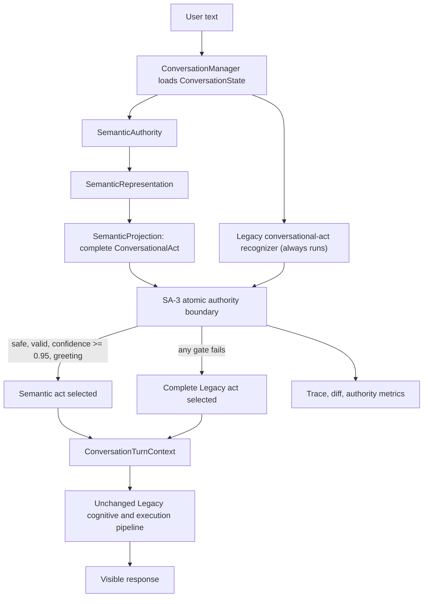

# ACA-032 - First Semantic Authority Vertical Pilot

Status: Implemented  
Scope: Semantic Authority RC3  
Promoted consumer: `ConversationalAct`  
Global authority: Legacy  
Promotion mode: Per-turn, low-risk, reversible

## 1. Decision

SA-3 promotes one consumer only: conversational-act recognition for an isolated,
high-confidence greeting. Every other consumer and every other act remains under
Legacy authority.

The requested candidate, `ConversationIntentModel`, was not promoted. Runtime
inspection showed that `ACAOSRuntime.process()` reconstructs a
`ConversationState` after mission preparation and invokes
`model_conversational_intent(event.payload)` again. A semantic value selected by
`ConversationManager` would therefore be overwritten by a later Legacy text
interpretation before execution. Making that promotion real would require a
change to either Runtime or ConversationState, both outside SA-3's allowed
boundary.

`ConversationalAct` is the lower-risk vertical boundary supported by the code:

* it already has a complete SA-2 projection;
* it is turn-scoped and has no independent persistence lifecycle;
* Runtime does not reinterpret it after `ConversationManager.begin_turn()`;
* the whole value can be selected atomically;
* Legacy can remain available for comparison and immediate rollback;
* a greeting can be promoted without changing mission, planning, routing, tool,
  policy, governance, ledger, or execution authority.

This is a deliberate scope correction, not an implicit expansion of SA-3.

## 2. Implemented architecture

Only the `ConversationalAct` edge is promoted. The following remain Legacy:

* `ConversationIntentModel`;
* intent matching;
* mission selection;
* Candidate Work;
* ActionPlanner and FlowRouter;
* ConversationPlan and response planning;
* RuntimeExecutor and all step handlers;
* Kernel, NarrativeResponseComposer, and LLM verbalization;
* Policy, Governance, Ledger, and Tool Contracts.

## 3. Authority boundary

The selection record uses
`semantic_authority_pilot_decision.v1`. It contains both complete candidate
values, their field diff and hashes, the selected authority, the selected value,
confidence, validation findings, rollback reason, and explicit atomicity flags.

The selector has three observable modes:

| `authority_mode` | Effective source | Meaning |
| --- | --- | --- |
| `semantic` | Semantic projection | All promotion gates passed |
| `rollback` | Legacy | Pilot enabled, but at least one safety gate failed |
| `legacy` | Legacy | Pilot disabled by configuration |

`authority_selected` is always either `semantic` or `legacy`. There is no merge
operation. The selected value hash must equal the hash of exactly one complete
candidate. Trace metadata publishes `atomic_selection=true` and
`mixed_authority=false`.

The environment switch `SEMANTIC_AUTHORITY_PILOT_ENABLED` provides immediate
process-level rollback. It defaults to enabled, but its enabled scope remains the
single low-risk act below.

## 4. Promotion gates

The only currently promotable semantic act is `greeting`. Promotion requires all
of the following:

1. SemanticAuthority and SemanticProjector complete without exception.
2. The projection has the expected `conversational_act.v1` contract.
3. Act, confidence, evidence, and impact are present and valid.
4. Confidence is at least `0.95`.
5. The act is in the explicit SA-3 low-risk scope.
6. The representation has no critical semantic-risk marker.

Critical risk forces rollback when any of these are present:

* unresolved coreference;
* correction or retraction;
* contradiction;
* semantic uncertainty;
* multiple topics;
* multiple people;
* disagreement between greeting act and greeting intent.

An exception in semantic interpretation, projection, comparison, or authority
evaluation also selects the complete Legacy value for that turn. It does not
interrupt Runtime execution.

## 5. Legacy comparison

Legacy recognition always runs before selection. Its original value is retained
separately as `last_legacy_conversational_act` and is used in the existing SA-2
Legacy-versus-Semantic projection diff. Selecting the semantic act does not
rewrite the Legacy side of that comparison.

The turn record exposes:

* `legacy_value`;
* `semantic_value`;
* `selected_value`;
* `field_diff`;
* `confidence`;
* `authority_mode` and `authority_selected`;
* `authority_reason` and `rollback_reason`;
* validation, critical-risk, and scope findings;
* source and selected hashes.

## 6. Telemetry and introspection

Each turn adds `SEMANTIC_AUTHORITY_VERTICAL_PILOT` to the execution trace. The
runtime conversation record and introspection summary expose the latest pilot
decision.

Session aggregation uses `semantic_authority_pilot_metrics.v1` and reports:

* `promotion_rate`;
* `rollback_rate`;
* `agreement_rate`;
* `semantic_authority_usage`;
* `legacy_usage`;
* `confidence_distribution`;
* `failure_distribution`;
* `atomic_selection_violations`.

These metrics are diagnostic. They do not block or modify Runtime decisions.

## 7. Instrumented execution evidence

The pilot was executed with deterministic verbalization and compared against a
fresh Runtime with the pilot disabled. Five representative turns produced:

| Message | Authority | Reason | Confidence | Legacy act | Semantic act | Visible response equal | Core plan equal |
| --- | --- | --- | ---: | --- | --- | --- | --- |
| `Hola` | semantic | low-risk promotion | 0.99 | new_information | greeting | Yes | Yes |
| `No hubo heridos.` | rollback | confidence below threshold | 0.75 | negation | new_information | Yes | Yes |
| `Eso.` | rollback | critical semantic risk | 0.75 | new_information | new_information | Yes | Yes |
| `Hola. Me llamo Maia.` | rollback | confidence below threshold | 0.75 | new_information | new_information | Yes | Yes |
| `Necesito ayuda con una denuncia.` | rollback | confidence below threshold | 0.75 | new_information | new_information | Yes | Yes |

For every row, the following remained equal with the pilot on and off:

* visible response;
* IntentMatcher result;
* zero-cost ActionPlan;
* execution flow;
* ExecutionPlan.

For `Hola`, the visible response remained exactly:

`Hola. Contame qué necesitás y te oriento.`

The selected conversational act changed from the Legacy
`new_information` value to the complete semantic `greeting` value, demonstrating
real authority without a visible or downstream planning change.

## 8. Benchmark comparison

SA-3 does not alter SemanticAuthority, SemanticRepresentation, SemanticProjection,
or either evaluation corpus. Both benchmarks were rerun after implementation.

| Benchmark | Before SA-3 | After SA-3 | Delta | Corpus hash |
| --- | ---: | ---: | ---: | --- |
| Official semantic understanding | 98.65% | 98.65% | 0.00 pp | `79c644695143252969f4dde4e4e94b6dbabe6c7813c6733ddaed5340057ac5bd` |
| Adversarial semantic accuracy | 70.72% | 70.72% | 0.00 pp | `69bbc81a2cd107a936f63e6b122c110380f31b6916595cba978e50650cb61a47` |
| Adversarial robustness | 73.71% | 73.71% | 0.00 pp | same adversarial corpus |
| Adversarial critical error rate | 5.69% | 5.69% | 0.00 pp | same adversarial corpus |

The official report hash after SA-3 is
`be7207dee98c0f05ac37362e396c84eaf727a3740219af4fac52ec0ce43b3d70`.
The adversarial report hash remains
`82221920d20febe84b88abb3030262b440ba7057ff4a30bdeb6f7e11bdccf899`.
The adversarial recommendation remains `LOW_RISK_VERTICAL_PILOT_ONLY`.

The benchmark runners invoke SemanticAuthority independently of Runtime, so
their unchanged scores prove extraction stability. Runtime integration stability
is covered separately by on/off execution comparisons and the full test suite.

## 9. Compatibility and rollback

No change was made to:

* `ACAOSRuntime`;
* `ConversationState`;
* MissionManager, Candidate Work, ActionPlanner, or FlowRouter;
* RuntimeExecutor, Kernel, Composer, or Verbalizer;
* Policy, Governance, Ledger, Tool Contracts, or tool execution.

The pilot is fully reversible by setting:

`SEMANTIC_AUTHORITY_PILOT_ENABLED=false`

That mode still executes SemanticAuthority and SA-2 Shadow comparison, but the
effective conversational-act authority is Legacy for every turn. This preserves
the existing observability path while restoring the pre-SA-3 authority boundary.

## 10. Test coverage

SA-3 adds focused coverage for:

* complete semantic promotion;
* atomic out-of-scope rollback;
* critical-risk rollback;
* process-level pilot disable;
* semantic exception fallback;
* invalid projection rejection;
* promotion, rollback, agreement, confidence, and failure metrics;
* trace and introspection visibility;
* visible response and downstream plan equality.

The test asserts zero mixed-authority selections and verifies that the selected
hash belongs to one complete source value.

Verification results:

| Suite | Result |
| --- | ---: |
| SA-3 plus semantic/runtime integration focus | 29 passed |
| Complete repository suite | 668 passed in 692.89 seconds |

The previous complete baseline was 660 tests. SA-3 adds eight tests and the full
increase is accounted for by the new vertical-pilot coverage.

## 11. Limitations

SA-3 does not establish that broad semantic authority is safe. The adversarial
benchmark still shows material weaknesses in multi-topic handling, retractions,
ambiguity, provenance, and context retention. The deliberately narrow greeting
scope avoids those dimensions rather than claiming they are solved.

`ConversationIntentModel` remains a future migration boundary. Before it can be
promoted, the duplicate call to `model_conversational_intent(event.payload)` in
Runtime must be removed or replaced by an explicit structured-input boundary.
That is SA-4 work because it changes a prohibited component and a higher-impact
consumer.

## 12. Conditions for SA-4

SA-4 should not begin merely because SA-3 passes. It requires:

1. zero atomic-selection violations across sustained Runtime traffic;
2. no visible, routing, mission, planning, policy, or tool regression attributable
   to promoted greetings;
3. rollback and semantic exception paths exercised in deployment telemetry;
4. a documented single-read path for the next consumer so semantic output cannot
   be silently overwritten by Legacy;
5. consumer-specific forbidden differences and confidence gates;
6. per-turn rollback retained;
7. Legacy comparison retained until objective promotion criteria pass.

The next migration must remain vertical. SA-3 provides no evidence for global
promotion and does not authorize removal of any Legacy path.
