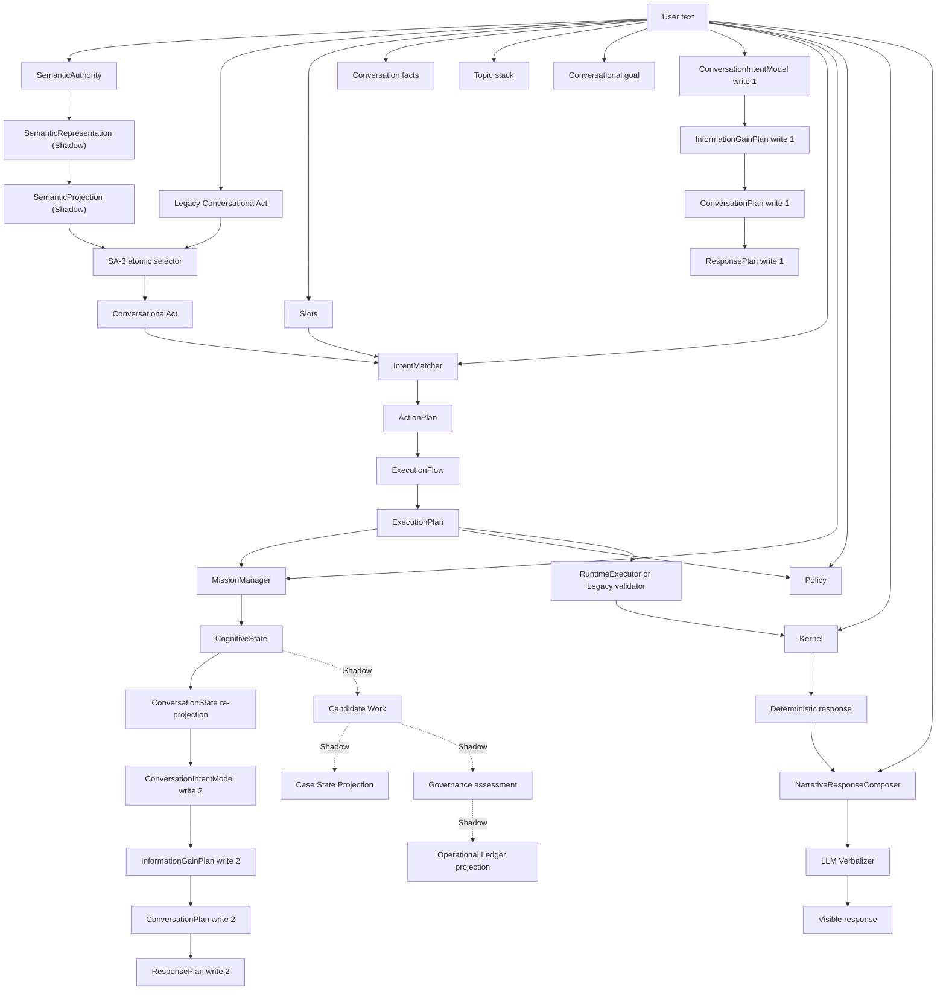
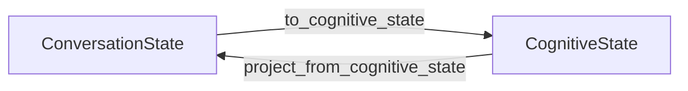

# ACA-033 - Authority Dependency Graph

Status: Implemented as passive introspection  
Scope: Semantic Authority RC3.1  
Global authority: Legacy  
Promoted authority: SA-3 `ConversationalAct` greeting pilot only  
Decision influence: None

## 1. Purpose

SA-3.1 replaces roadmap assumptions with a source-backed authority map. It does
not promote another consumer and it does not change any Runtime decision. Its
only job is to answer, from current code:

* which component produces each cognitive or operational artifact;
* which components consume it;
* where it is mutable;
* where it is recomputed or overwritten;
* which code still reads free text after SemanticAuthority;
* how difficult per-turn rollback would be;
* which vertical boundary is actually eligible for future promotion.

The result challenges the expected roadmap. `ConversationIntentModel` remains
blocked, and no second semantic consumer is currently `READY` or `LOW_RISK`.

## 2. Isolation guarantees

| Property | SA-3.1 result |
| --- | --- |
| Runtime modified | No |
| ConversationState modified | No |
| SemanticAuthority or SemanticProjection modified | No |
| Mission, Candidate Work, Planner, FlowRouter modified | No |
| RuntimeExecutor, Kernel, Composer, Verbalizer modified | No |
| Policy, Governance, Ledger, tools modified | No |
| Benchmarks modified | No |
| Visible response changed | No |
| Effective authority changed | No |
| New consumer promoted | No |

The only existing module changed is the read-only introspection API. The graph
builder is not imported by Runtime and is constructed only when explicitly
requested.

## 3. Method

The implementation has two evidence sources.

### 3.1 Static source evidence

An AST scanner inspects the 30 Python modules that define the official cognitive,
execution, output, plugin-semantic, and operational-shadow boundaries. It records:

* call sites and function definitions;
* exact file, function, and line evidence;
* direct `event.payload` reads;
* `last_raw_payload` reads;
* recognized free-text parameters;
* repeated writers and post-write recomputation;
* producer/consumer edges.

An edge is emitted only when its source locator exists in current code. The
controlled artifact vocabulary prevents arbitrary local variables from being
mistaken for architectural authority. Dependencies and locations are discovered
from AST, not copied line numbers.

### 3.2 Dynamic trace overlay

The graph can receive an existing `ExecutionTrace`. It maps observed operations
onto artifacts and exposes the semantic authority events already recorded by
Runtime. It does not add trace events, intercept calls, or mutate state.

Both layers are reproducible:

| Fingerprint | Value |
| --- | --- |
| Authority source hash | `40537b5337d57744f75c72d1d46dc24025ef4dc2b7b3e799cf1138efcfac1bba` |
| Graph hash | `1badf176690b39b2342e22ddd6fc3312da90368535e1fec0a596ff7d4f0959ce` |

## 4. Current authority flow



The complete machine-readable graph contains 36 nodes and 73 evidence-backed
edges. It is generated with:

```powershell
py tools/run_authority_dependency_graph.py --format json
py tools/run_authority_dependency_graph.py --format mermaid
```

## 5. Artifact inventory

Every node has an owner, one or more required classifications, effective
authority, mutability, authority score, coupling, rollback profile, and promotion
readiness.

| Artifact | Owner | Classification summary | Effective authority | Readiness | Rollback |
| --- | --- | --- | --- | --- | --- |
| User text | transport | primary, text-dependent | source | blocked | moderate |
| SemanticRepresentation | SemanticAuthority | derived, shadow | shadow | blocked | easy |
| SemanticProjection | SemanticProjector | derived, shadow | shadow | blocked | easy |
| ConversationState | ConversationManager | primary, state-dependent | primary state owner | blocked | moderate |
| ConversationalAct | semantic pilot or Legacy | primary, derived, shared, text-dependent | gated semantic or Legacy | ready | easy |
| Slots | ConversationState | primary, state/text-dependent | Legacy | high risk | moderate |
| Conversation facts | ConversationState | primary, state/text-dependent | Legacy | high risk | moderate |
| Topic stack | ConversationState | primary, state/text-dependent | Legacy | high risk | moderate |
| Conversational goal | ConversationState | primary, state/text-dependent | Legacy | high risk | moderate |
| ConversationIntentModel | ConversationState | derived, recomputed, text-dependent | Legacy recomputed | blocked | moderate |
| InformationGainPlan | ConversationState | derived, recomputed, text-dependent | Legacy recomputed | blocked | moderate |
| ConversationPlan | ConversationState | derived, recomputed, text-dependent | Legacy recomputed | blocked | moderate |
| ConversationResponsePlan | ConversationState | derived, recomputed, text-dependent | Legacy recomputed | blocked | moderate |
| CognitiveState | Runtime | primary, state-dependent, multiple writers | Runtime state owner | blocked | moderate |
| IntentMatch | IntentMatcher and Runtime overrides | primary, recomputed, text-dependent | Legacy | blocked | moderate |
| ActionPlan | ActionPlanner | derived | inherited | blocked | easy |
| ExecutionFlow | FlowRouter | derived | inherited | blocked | easy |
| ExecutionPlan | ExecutionPlan compiler | derived | inherited | blocked | moderate |
| DecisionGraph | DecisionGraphEngine | derived | inherited | blocked | easy |
| Mission | MissionManager | primary, state/text-dependent | Legacy | blocked | moderate |
| PolicyResult | PolicyManager | primary, state/text-dependent | independent operational authority | blocked | hard |
| Kernel program | GraphCompiler | derived, text-dependent | Legacy | blocked | easy |
| Kernel entities | Kernel Extract and plugin semantics | derived, state/text-dependent | Legacy | high risk | moderate |
| Kernel hypotheses | Kernel Infer | derived, state-dependent | inherited | blocked | moderate |
| Kernel plan | Kernel Plan | derived, state-dependent | inherited | blocked | moderate |
| ContextBundle | ContextManager | derived view | inherited | blocked | easy |
| Runtime outcomes | RuntimeExecutor and Legacy validator | derived, multiple writers | independent execution authority | blocked | hard |
| Tool execution | ToolEngine | primary operational state | independent execution authority | blocked | hard |
| Deterministic response | Kernel Generate | derived, output-only | inherited | blocked | easy |
| Narrative response | NarrativeResponseComposer | derived, output/text-dependent | output transform | blocked | easy |
| Verbalized response | LLMVerbalizer | derived, output-only | output transform | blocked | easy |
| ConversationFulfillment | ConversationState | derived, state-dependent | inherited | blocked | moderate |
| Candidate Work | OperationalWorkMapper | derived, shadow, text-dependent | shadow | blocked | easy |
| Case State Projection | OperationalWorkMapper | derived, shadow | shadow | blocked | easy |
| Governance assessment | Governance Gate | independent shadow gate | shadow | blocked | hard |
| Operational Audit Ledger | Ledger projector | derived, shadow audit | shadow | blocked | hard |

`BLOCKED` does not mean defective. For safety, execution, planning, and output
artifacts it often means that direct semantic promotion would violate ownership.

## 6. Semantic Firewall Audit

The scanner found 36 post-SemanticAuthority free-text reads and five allowed
accesses. Allowed accesses are the single SemanticAuthority interpretation,
pre-semantic turn capture, and trace/session serialization.

| Severity | Count |
| --- | ---: |
| Critical | 16 |
| High | 15 |
| Medium | 4 |
| Low | 1 |

| Component | Violations | Impact |
| --- | ---: | --- |
| ConversationManager | 9 | turn state and plans |
| ConversationState implementation | 9 | legacy extraction and planning |
| Runtime | 5 | routing plus post-mission replanning |
| Kernel | 3 | raw capture, program selection, entity extraction |
| OperationalWorkMapper | 3 | Shadow work selection |
| Plugin semantic analyzers | 2 | parallel semantic parsing |
| IntentMatcher | 1 | routing |
| MissionManager | 1 | mission selection |
| PolicyManager | 1 | safety decision |
| NarrativeResponseComposer | 1 | output-only realization |
| LLMVerbalizer | 1 | output-only grounding |

### 6.1 Critical violations

| Artifact | File | Function | Line | Purpose |
| --- | --- | --- | ---: | --- |
| ConversationIntentModel | `aca_os/conversation_manager.py` | `ConversationManager.begin_turn` | 200 | first Legacy construction |
| InformationGainPlan | `aca_os/conversation_manager.py` | `ConversationManager.begin_turn` | 201 | first Legacy clarification plan |
| ConversationPlan | `aca_os/conversation_manager.py` | `ConversationManager.begin_turn` | 202 | first Legacy conversation plan |
| ConversationResponsePlan | `aca_os/conversation_manager.py` | `ConversationManager.begin_turn` | 203 | first Legacy response plan |
| ConversationIntentModel | `aca_os/conversation_state.py` | `model_conversational_intent` | 1212 | free-text implementation |
| InformationGainPlan | `aca_os/conversation_state.py` | `plan_information_gain` | 1243 | free-text implementation |
| ConversationPlan | `aca_os/conversation_state.py` | `plan_conversation` | 1274 | free-text implementation |
| ConversationResponsePlan | `aca_os/conversation_state.py` | `plan_conversational_response` | 1345 | free-text implementation |
| Mission | `aca_os/mission_manager.py` | `MissionManager.before_kernel` | 46 | mission selection |
| PolicyResult | `aca_os/policy_manager.py` | `PolicyManager.evaluate` | 51 | safety evaluation |
| IntentMatch | `aca_os/runtime.py` | `ACAOSRuntime.process` | 419 | lexical classification |
| ConversationIntentModel | `aca_os/runtime.py` | `ACAOSRuntime.process` | 473 | second Legacy construction |
| InformationGainPlan | `aca_os/runtime.py` | `ACAOSRuntime.process` | 474 | second Legacy clarification plan |
| ConversationPlan | `aca_os/runtime.py` | `ACAOSRuntime.process` | 475 | second Legacy conversation plan |
| ConversationResponsePlan | `aca_os/runtime.py` | `ACAOSRuntime.process` | 476 | second Legacy response plan |
| IntentMatch | `zero_cost/intent_matcher.py` | `IntentMatcher.match` | 36 | lexical classification implementation |

Output-only reads remain firewall violations because they still inspect original
text after SemanticAuthority, but their severity is lower: they cannot change
mission, routing, policy, execution, or state authority.

Shadow violations are also retained. They do not affect visible behavior today,
but they would become blockers if Candidate Work or operational projections were
ever promoted.

## 7. Recomputation Audit

Eight multi-writer or recomputation structures were found.

| Artifact | Type | Writes/evidence | Result |
| --- | --- | ---: | --- |
| ConversationIntentModel | recomputed and overwritten | 2 | Runtime replaces the ConversationManager value |
| InformationGainPlan | recomputed and overwritten | 2 | Runtime replaces the ConversationManager value |
| ConversationPlan | recomputed and overwritten | 2 | Runtime replaces the ConversationManager value |
| ConversationResponsePlan | recomputed and overwritten | 2 | Runtime replaces the ConversationManager value |
| ConversationalAct | guarded multi-authority | 4 evidence sites | SA-3 selects one complete value atomically |
| IntentMatch | multiple writers | 5 evidence sites | matcher result can be replaced by act or slot overrides |
| CognitiveState | multiple writers | 4 evidence sites | expected state projection/execution lifecycle |
| Runtime outcomes | multiple writers | 3 evidence sites | official engine plus validation engine |

The first four are actual authority overwrite risks. The latter four are not all
bugs: some are deliberate orchestration. The graph distinguishes the guarded
SA-3 selector from unguarded recomputation.

## 8. Dependency cycles

One structural cycle exists:



This cycle is intentional for operational ownership, but it means that a value
promoted before the Runtime projection can be overwritten when CognitiveState is
projected back. Every future vertical pilot must identify which side of this
cycle owns the selected artifact.

## 9. Authority score

Each artifact receives four normalized dimensions derived from incoming edge
types:

* `own_authority` for independent primary producers;
* `inherited_authority` for derived projections;
* `shared_authority` for guarded or validation authority;
* `overwritten_authority` for explicit recomputation.

The dimensions sum to `1.0`. This is a structural score, not a quality score. It
answers how authority reaches a node, not whether the resulting value is correct.

## 10. Promotion readiness and real order

| Position | Artifact | Readiness | Rollback | Code-derived reason |
| ---: | --- | --- | --- | --- |
| 1 | ConversationalAct | ready | easy | existing gated greeting pilot |
| 2 | ConversationalGoal | high risk | moderate | mutable and still reads raw text |
| 3 | Topic stack | high risk | moderate | persistent focus state still reads raw text |
| 4 | Slots | high risk | moderate | persistent lifecycle and raw-text resolution |
| 5 | Conversation facts | high risk | moderate | persistent facts and multiple downstream consumers |
| 6 | Kernel entities | high risk | moderate | Kernel and plugin analyzers still parse text independently |
| 7 | ConversationIntentModel | blocked | moderate | overwritten after MissionManager |
| 8 | IntentMatch | blocked | moderate | direct lexical matcher plus two Runtime overrides |

This table is an order of relative feasibility, not an authorization list.
`ConversationalGoal` is the next candidate only because its code coupling is
smaller than the other unpromoted candidates. It is still `HIGH_RISK`; SA-4 must
not promote it until a consumer-specific Shadow comparison, structured input,
and atomic rollback boundary exist.

Most importantly, `ConversationIntentModel` is not next. Its current position is
blocked by concrete overwrite evidence, not benchmark quality.

## 11. Components that must never receive semantic authority directly

The following remain derived or independently governed:

* InformationGainPlan, ConversationPlan, ConversationResponsePlan;
* ActionPlan, ExecutionFlow, ExecutionPlan, DecisionGraph;
* MissionManager's mission ownership;
* PolicyResult and Governance assessment;
* Kernel program, hypotheses, and plan;
* ContextBundle;
* Runtime outcomes and Tool execution;
* deterministic, narrative, and verbalized responses;
* ConversationFulfillment;
* Candidate Work and Case State Projection;
* Operational Audit Ledger.

They may consume promoted semantics in the future. They must not become semantic
authorities themselves.

## 12. Introspection

The graph is available without changing the regular Runtime snapshot:

```python
api = RuntimeIntrospectionAPI(runtime)
complete = api.inspect_authority_graph()
intent_only = api.inspect_authority_graph("conversation_intent_model")
```

An artifact inspection returns:

* the node and its authority score;
* all producers;
* all consumers;
* recomputation evidence;
* firewall violations;
* readiness and rollback assessment.

The standalone runner supports `summary`, `json`, and `mermaid` formats and can
write a generated artifact to a caller-selected path.

## 13. Instrumented validation

A real deterministic Runtime turn with `Hola` produced the unchanged response:

`Hola. Contame qué necesitás y te oriento.`

The pre-existing trace contained 37 operations. The passive overlay observed:

* SemanticRepresentation;
* SemanticProjection;
* the SA-3 ConversationalAct pilot;
* IntentMatch;
* ActionPlan;
* ExecutionFlow;
* ExecutionPlan;
* Mission;
* PolicyResult.

Authority events were exactly:

1. `SEMANTIC_REPRESENTATION_SHADOW`;
2. `SEMANTIC_PROJECTION_SHADOW`;
3. `SEMANTIC_AUTHORITY_VERTICAL_PILOT`.

Building and querying the graph occurred after response generation and did not
alter the trace, state, response, or authority selection.

## 14. Limits of the audit

The graph is exhaustive for its controlled 30-module authority scope and all
edges include source evidence. Static AST cannot prove dependencies created only
through dynamic import, reflection, monkeypatching, or external plugin code.
Those require a Runtime trace overlay or an explicit addition to the controlled
scope.

Line numbers are evidence from the current source hash. A future source change
creates a new hash and regenerates all locations; ACA-033 should not be treated as
a manually maintained line-number registry.

## 15. SA-4 recommendation

Do not promote another consumer merely because SA-3 is stable. The graph finds no
second low-risk boundary today.

The first future experiment should target `ConversationalGoal` only after a
dedicated Shadow projection proves complete-value equivalence and the current
raw-text call can be bypassed atomically. If that prerequisite is not met, the
correct next step is a firewall-enablement RC, not authority promotion.

`ConversationIntentModel` must wait until the post-Mission calls at Runtime lines
473-476 have a structured single-source replacement. Policy, execution,
Governance, tools, output realization, and Ledger are permanently outside the
semantic-promotion sequence.

## 16. Verification results

| Verification | Result |
| --- | ---: |
| Authority graph tests | 10 passed |
| Focused Runtime, introspection, SA-3, projection, trace, and Shadow tests | 51 passed |
| Complete repository suite | 678 passed in 693.40 seconds |
| Official semantic benchmark | 98.65%, unchanged |
| Adversarial semantic accuracy | 70.72%, unchanged |
| Adversarial robustness | 73.71%, unchanged |
| Adversarial recommendation | `LOW_RISK_VERTICAL_PILOT_ONLY`, unchanged |

The official and adversarial benchmark corpus and report hashes are unchanged.
SA-3.1 adds ten tests to the previous 668-test baseline; the complete increase is
fully accounted for by passive graph, audit, visualization, and introspection
coverage.
