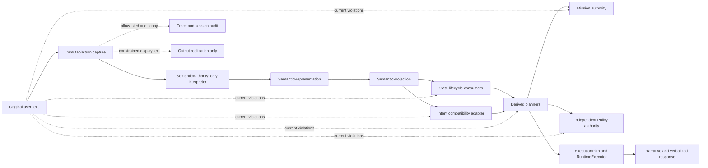
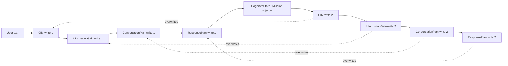
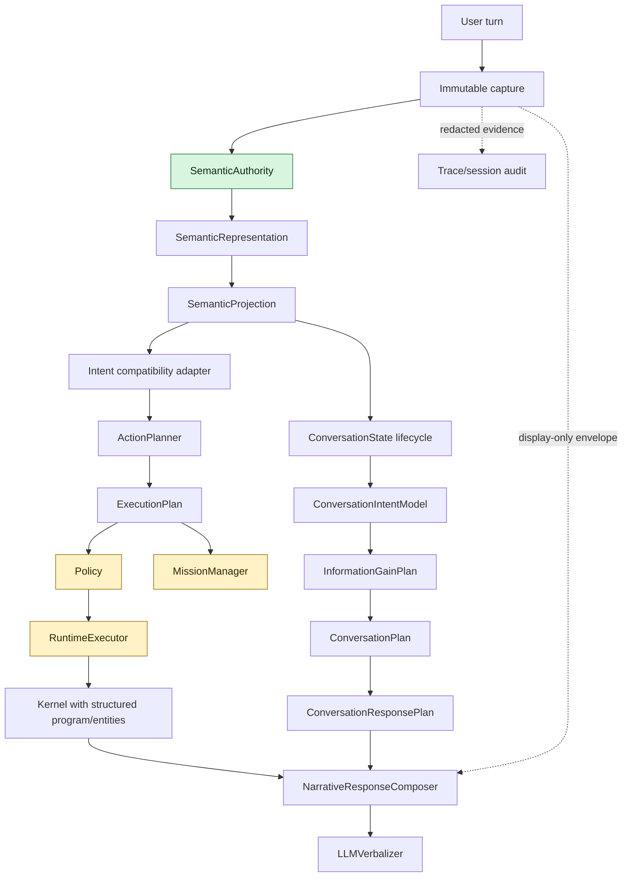

# ACA-100 - Semantic Firewall Refactoring Masterplan

Status: FW-1 baseline; FW-4, FW-3, and FW-5 migration packages implemented  
Effective authority: Legacy  
Runtime influence: None  
Visible response influence: None  
Source baseline: ACA-033 Authority Dependency Graph

## 1. Decision

The current blocker is not SemanticAuthority quality. It is the continued use of
original user text by downstream components after SemanticAuthority has already
created `SemanticRepresentation`.

FW-1 does not change that behavior. It converts the ACA-033 evidence into an
executable migration plan. The plan is source-backed, reproducible, and passive:

* 37 raw-text accesses remain inventoried after FW-3 and FW-5;
* 5 are legal non-cognitive accesses;
* 30 violate the intended firewall;
* 16 violations can affect routing, planning, mission, or Policy and are blockers;
* 8 recomputation/multi-writer structures exist;
* 4 of those structures are actual overwrite chains;
* every access has one replacement, disposition, migration package, risk, and rollback;
* 6 components or code paths are conditional collapse candidates;
* no consumer is removed by FW-1.

The target is not "no text anywhere." The target is:

> Original text may cross the firewall once for semantic interpretation. It may
> remain in transport, redacted audit, and a constrained output-only envelope,
> but it must never again determine cognitive or operational meaning.

## 2. Reproducibility

The plan is built from `aca_os/authority_dependency_graph.py`; it is not imported
by Runtime and is only evaluated when explicitly requested.

| Fingerprint | Value |
| --- | --- |
| Authority source hash | `d94731c63dadbb19406920b1e6d1f6823abc838ca30a1941ae1b919c18d68e9e` |
| Authority graph hash | `ac0bb04c30ef0ed435192ae826a5fa5d185c2fdc15a4cdd563d0abfa7658d19c` |
| FW-1 plan hash | `03fe760bc58851737a8bc164c0531b9deccd2421c1f9830f9012a2ba2e11085e` |
| Replacement coverage | `100%` |

Machine-readable reports:

```powershell
python tools/run_semantic_firewall_plan.py --format summary
python tools/run_semantic_firewall_plan.py --format inventory
python tools/run_semantic_firewall_plan.py --format matrix
python tools/run_semantic_firewall_plan.py --format packages
python tools/run_semantic_firewall_plan.py --format recomputation
python tools/run_semantic_firewall_plan.py --format forecast
python tools/run_semantic_firewall_plan.py --format mermaid
python tools/run_semantic_firewall_plan.py --format json --output fw1-plan.json
```

The JSON report is the normative operational inventory. This document explains
the decisions represented by that report.

### 2.1 Inventory scope

The 37-access inventory is the official `ACAOSRuntime`/ACA Studio authority
graph. A repository-wide direct-source search produced the same set for
`event.payload`, `last_raw_payload`, `raw_text`, and `original_text`.

The duplicated `/demo/domain-flow` route accepts a separate `message` argument
and runs `DemoDomainRuntimeFlowRunner`, `PublicConversationWorkflow`,
`PublicConversationState`, and `RepresentativeAnswerComposer`. ACA-024 already
classifies that family as duplicated. It is therefore recorded as one complete
dependency-collapse candidate, not as consumers to migrate one by one. Doing the
latter would preserve a second semantic authority rather than enforce the Core
firewall.

## 3. Firewall model



### 3.1 Allowed access

An access is legal only when it has no authority to derive an intent, fact,
entity, topic, goal, mission, plan, policy decision, operation, or state delta.

| Boundary | Access | Reason |
| --- | --- | --- |
| `ConversationSession.add_turn` | write | Captures the immutable turn before semantic interpretation. |
| `SemanticAuthority.interpret` | read | The single authorized interpretation. |
| `RuntimeTimeline.from_state` | audit | Serializes evidence without deriving decisions. |
| `event_to_dict` | audit | Serializes session evidence without deriving decisions. |
| Composer and Verbalizer | constrained read | May acknowledge or quote wording; cannot derive cognition. |

Composer and Verbalizer are not part of the raw-text allowlist yet. FW-2 must
make their output-only restriction enforceable before they can be treated as a
legal constrained boundary.

### 3.2 Access classification

Each access has one primary mode and may have additional roles. The current
role counts are:

| Role | Count | Meaning |
| --- | ---: | --- |
| Read | 37 | Reads or forwards original text. |
| Write | 7 | Persists or replaces a value derived from text. |
| Recomputation | 16 | Reinterprets text after the firewall. |
| Fallback | 2 | Retains Legacy or raw-text fallback behavior. |
| Audit | 2 | Stores trace/session evidence only. |
| Debug | 0 | No debug-only access was found. |
| Comparison | 4 | Computes a parallel value for plugin/Legacy comparison. |

## 4. Firewall baseline inventory

The table preserves the original FW-1 identifiers for migration traceability.
`TXT-024` through `TXT-026` were retired by FW-3 and `TXT-007` was retired by
FW-5. The generated `--format inventory` report is the normative live inventory
and currently contains 37 accesses, 30 of which are violations.

Severity is based on decision impact, not implementation size:

* `BLOCKER`: routing, planning, mission, or safety authority can change;
* `HIGH`: persistent state or cognitive execution can change;
* `MEDIUM`: Shadow or output realization dependency;
* `LOW`: output-only grounding;
* `ALLOWED`: transport, semantic ingress, or audit with no interpretation.

| ID | Mode | Severity | Artifact | Location | Package | Disposition |
| --- | --- | --- | --- | --- | --- | --- |
| TXT-001 | write | ALLOWED | user text | `conversation_manager.py:60` | FW-A0 | keep allowed |
| TXT-002 | write | ALLOWED | user text | `conversation_manager.py:61` | FW-A0 | keep allowed |
| TXT-003 | read/fallback/comparison | HIGH | ConversationalAct | `conversation_manager.py:162` | FW-4 | semantic replacement |
| TXT-004 | read | HIGH | SlotState | `conversation_manager.py:195` | FW-7 | semantic replacement |
| TXT-005 | read | HIGH | ConversationFacts | `conversation_manager.py:197` | FW-8 | semantic replacement |
| TXT-006 | read | HIGH | TopicState | `conversation_manager.py:198` | FW-6 | semantic replacement |
| TXT-007 | read | HIGH | ConversationalGoal | `conversation_manager.py:199` | FW-5 | semantic replacement |
| TXT-008 | read | BLOCKER | ConversationIntentModel | `conversation_manager.py:200` | FW-10 | semantic replacement |
| TXT-009 | read | BLOCKER | InformationGainPlan | `conversation_manager.py:201` | FW-11 | structured input |
| TXT-010 | read | BLOCKER | ConversationPlan | `conversation_manager.py:202` | FW-11 | structured input |
| TXT-011 | read | BLOCKER | ConversationResponsePlan | `conversation_manager.py:203` | FW-11 | structured input |
| TXT-012 | recomputation | HIGH | SlotState | `conversation_state.py:922` | FW-7 | semantic replacement |
| TXT-013 | recomputation | BLOCKER | ConversationIntentModel | `conversation_state.py:1212` | FW-10 | semantic replacement |
| TXT-014 | recomputation | BLOCKER | InformationGainPlan | `conversation_state.py:1243` | FW-11 | structured input |
| TXT-015 | recomputation | BLOCKER | ConversationPlan | `conversation_state.py:1274` | FW-11 | structured input |
| TXT-016 | recomputation | BLOCKER | ConversationResponsePlan | `conversation_state.py:1345` | FW-11 | structured input |
| TXT-017 | recomputation | HIGH | TopicState | `conversation_state.py:3253` | FW-6 | semantic replacement |
| TXT-018 | recomputation | HIGH | ConversationalAct | `conversation_state.py:3802` | FW-4 | semantic replacement |
| TXT-019 | recomputation | HIGH | unresolved topic | `conversation_state.py:4461` | FW-6 | semantic replacement |
| TXT-020 | recomputation | HIGH | ConversationFacts | `conversation_state.py:4744` | FW-8 | semantic replacement |
| TXT-021 | read | LOW | verbalized response | `llm_verbalization.py:148` | FW-2 | keep constrained |
| TXT-022 | read | BLOCKER | Mission | `mission_manager.py:46` | FW-14 | structured input |
| TXT-023 | read | MEDIUM | narrative response | `narrative_response_composer.py:49` | FW-2 | keep constrained |
| TXT-024 | fallback | MEDIUM | Candidate Work | `operational_work_mapper.py:278` | FW-3 | structured input |
| TXT-025 | fallback | MEDIUM | Candidate Work | `operational_work_mapper.py:279` | FW-3 | structured input |
| TXT-026 | fallback | MEDIUM | Candidate Work | `operational_work_mapper.py:284` | FW-3 | structured input |
| TXT-027 | read | BLOCKER | PolicyResult | `policy_manager.py:51` | FW-15 | structured input |
| TXT-028 | read | BLOCKER | IntentMatch | `runtime.py:419` | FW-12 | semantic replacement |
| TXT-029 | recomputation | BLOCKER | ConversationIntentModel | `runtime.py:473` | FW-10 | semantic replacement |
| TXT-030 | recomputation | BLOCKER | InformationGainPlan | `runtime.py:474` | FW-11 | structured input |
| TXT-031 | recomputation | BLOCKER | ConversationPlan | `runtime.py:475` | FW-11 | structured input |
| TXT-032 | recomputation | BLOCKER | ConversationResponsePlan | `runtime.py:476` | FW-11 | structured input |
| TXT-033 | audit | ALLOWED | user text | `runtime_timeline.py:70` | FW-A0 | keep allowed |
| TXT-034 | read | ALLOWED | user text | `semantic_authority.py:170` | FW-A0 | keep allowed |
| TXT-035 | audit | ALLOWED | user text | `session.py:20` | FW-A0 | keep allowed |
| TXT-036 | read | HIGH | Kernel program | `kernel/compiler/compiler.py:14` | FW-13 | structured input |
| TXT-037 | write/recomputation | HIGH | ConversationFacts | `kernel/operations/basic.py:17` | FW-8 | semantic replacement |
| TXT-038 | read | HIGH | KernelEntities | `kernel/operations/basic.py:26` | FW-9 | semantic replacement |
| TXT-039 | recomputation/comparison | HIGH | KernelEntities | `plugins/galicia.insurance/semantic.py:17` | FW-9 | semantic replacement |
| TXT-040 | recomputation/comparison | HIGH | KernelEntities | `plugins/generic.open_chat/semantic.py:5` | FW-9 | semantic replacement |
| TXT-041 | recomputation | BLOCKER | IntentMatch | `zero_cost/intent_matcher.py:36` | FW-12 | semantic replacement |

Exact function names, source expressions, source lines, costs, functional and
cognitive risks, rollback instructions, and promotion impacts are available in
the `--format inventory` report. Each ID is stable while the source baseline is
unchanged.

## 5. Semantic replacement matrix

The replacement is not always a direct SemanticProjection field. Planners,
MissionManager, Policy, and Kernel compilation must consume structured inputs
while retaining their own authority.

| Current artifact/use | Required information | Replacement | Status | Owner after migration |
| --- | --- | --- | --- | --- |
| ConversationalAct | turn function and confidence | `SemanticProjection.conversational_act` | ready with rollback | semantic pilot selector |
| SlotState | answer, value, negation, confidence, evidence | slot projection, state delta, assertions, provenance | projected | ConversationState slot lifecycle |
| ConversationFacts | assertion, correction, retraction, temporal scope | fact projection, assertions, corrections, contradictions, provenance | projected | ConversationState fact lifecycle |
| TopicState | boundaries, transitions, reference, priority | topic projection, topic structure, semantic segments | projected | ConversationState topic lifecycle |
| ConversationalGoal | goals, priority, active-topic relation | goal projection, goals, topic structure | FW-5 implemented; atomic rollback retained | ConversationState goal lifecycle |
| ConversationIntentModel | questions, needs, concern, goals, assumptions | `SemanticProjection.conversation_intent_model` | blocked by duplicate writer | selected per-turn authority |
| InformationGainPlan | uncertainty, missing data, affected decisions | authoritative CIM plus semantic uncertainty/goals/constraints | derive after firewall | InformationGain planner |
| ConversationPlan | goal, clarification, progress, topic continuity | CIM, InformationGainPlan, ConversationState | derive after firewall | Conversation planner |
| ResponsePlan | need, priority, next action, justified questions | ConversationPlan plus CIM | derive after firewall | response planner |
| IntentMatch | domain intent, confidence, evidence, ambiguity | intent projection, intents, grounding, uncertainty | blocked by routing coupling | Intent compatibility adapter |
| Mission | operational goal, event, case facts, current mission | semantic goals/events/intents/assertions plus ExecutionPlan/state | structured consumer only | MissionManager |
| PolicyResult | constraints, risk, uncertainty, operation, evidence | semantic constraints/grounding/uncertainty plus ExecutionPlan | exact safety parity required | PolicyManager |
| Kernel program | selected action, flow, executable steps | ExecutionPlan | derive from execution plan | GraphCompiler |
| KernelEntities | entities, relations, confidence, evidence | entity projection, entities, relations, provenance | projected | Kernel state projection |
| Candidate Work | need, facts, topic, mission, plan | semantic/state/plan/execution projections | Shadow safe | OperationalWorkMapper |
| Narrative response | exact wording for acknowledgement | output-only utterance envelope | constrained only | NarrativeResponseComposer |
| Verbalized response | exact wording for realization/fidelity | output-only utterance envelope | constrained only | LLMVerbalizer |
| Unresolved topic label | topic identity and segment | topic projection/structure/segments | projected | topic lifecycle |

### 5.1 What never becomes semantic authority

* `InformationGainPlan`, `ConversationPlan`, and `ConversationResponsePlan` remain planner outputs.
* `MissionManager` retains authority over mission lifecycle.
* `PolicyManager` retains independent veto authority and fail-closed behavior.
* `ExecutionPlan`, `RuntimeExecutor`, tools, Governance, and Ledger retain current ownership.
* Narrative and LLM components remain output transforms.
* Audit records remain evidence, not cognitive state.

## 6. Elimination order

The order is calculated by a topological sort over package dependencies, choosing
the lowest-risk deployable package at each step. It is not copied from ACA-026 or
ACA-033.

| Order | Package | Scope | Risk | Reads | Dependencies |
| ---: | --- | --- | --- | ---: | --- |
| 1 | FW-A0 | authorized raw-text allowlist | LOW | 5 | - |
| 2 | FW-2 | output-only utterance boundary | LOW | 2 | FW-A0 |
| 3 | FW-3 | Shadow Candidate Work fallback | LOW | 0 | FW-A0 |
| 4 | FW-4 | ConversationalAct Legacy retirement | MEDIUM | 2 | FW-A0 |
| 5 | FW-5 | ConversationalGoal semantic input | MEDIUM | 0 | FW-4 |
| 6 | FW-6 | topic lifecycle semantic input | MEDIUM | 3 | FW-5 |
| 7 | FW-7 | pending slot semantic resolution | MEDIUM | 2 | FW-4 |
| 8 | FW-8 | fact assimilation/raw fact removal | HIGH | 3 | FW-6, FW-7 |
| 9 | FW-9 | entity extraction consolidation | HIGH | 3 | FW-8 |
| 10 | FW-10 | CIM semantic construction | HIGH | 3 | FW-5 through FW-9 |
| 11 | FW-11 | structured planning/duplicate writes | HIGH | 9 | FW-10 |
| 12 | FW-12 | intent routing semantic projection | BLOCKER | 2 | FW-10, FW-11 |
| 13 | FW-13 | Kernel compiler structured input | HIGH | 1 | FW-12 |
| 14 | FW-14 | MissionManager structured input | BLOCKER | 1 | FW-11, FW-12 |
| 15 | FW-15 | Policy constrained semantic input | BLOCKER | 1 | FW-12, FW-14 |
| 16 | FW-16 | firewall enforcement/quarantine | MEDIUM | 0 | all prior packages |

Routing, mission, and Policy appear late even when their code change may be
small. Their functional blast radius, not line count, determines order.

## 7. Migration package contracts

Every package is independently deployable and must retain Legacy rollback until
its acceptance condition is met.

### FW-A0 - Authorized boundary allowlist

* Goal: freeze legal capture, semantic ingress, and audit reads.
* Rollback: remove enforcement only; no runtime values change.
* Accept: every allowed read has a declared non-cognitive purpose.

### FW-2 - Output-only utterance boundary

* Goal: constrain Composer/LLM exact-text access to surface realization.
* Rollback: restore the current output envelope; state is untouched.
* Accept: output equivalence and proof that output components write no cognitive artifact.

### FW-3 - Shadow Candidate Work fallback removal

* Goal: remove three `last_raw_payload` fallbacks.
* Rollback: restore Shadow fallback; official behavior is unaffected.
* Accept: synthetic and real-world operational benchmark parity.

### FW-4 - ConversationalAct Legacy retirement

* Goal: retire post-firewall act recognition after the existing pilot proves parity.
* Rollback: existing complete per-turn Legacy act selection.
* Accept: official/adversarial thresholds and zero mixed-authority turns.

### FW-5 - ConversationalGoal semantic input

* Goal: replace low-coupling goal text matching.
* Rollback: discard semantic mutation and restore complete Legacy goal.
* Accept: goal and state-delta parity without response regressions.
* Status: implemented by ACA-103; no live raw-text consumer remains in this package.

### FW-6 - Topic lifecycle semantic input

* Goal: use topic projection for creation, transition, and unresolved topics.
* Rollback: restore the complete pre-turn topic stack.
* Accept: topic and long-conversation benchmarks preserve active/suspended topics.

### FW-7 - Pending slot semantic resolution

* Goal: resolve slots from typed assertions and act projections.
* Rollback: restore complete pre-turn slots and pending questions.
* Accept: lifecycle, ambiguity, out-of-order, and repeated-question parity.

### FW-8 - Fact assimilation and raw fact removal

* Goal: assimilate typed assertions and remove `last_raw_payload` as a fact.
* Rollback: restore fact history and mission snapshot atomically.
* Accept: fact, negation, correction, retraction, mission, and provenance parity.

### FW-9 - Entity extraction consolidation

* Goal: replace Kernel and plugin-local parsers with the entity projection.
* Rollback: select complete Legacy entities; never merge sets.
* Accept: per-plugin entity and provenance parity.

### FW-10 - ConversationIntentModel semantic construction

* Goal: construct one complete CIM without reading text.
* Rollback: select complete Legacy CIM before downstream planning.
* Accept: field parity, confidence gates, atomic rollback, and no CIM text read.

This package only removes semantic reinterpretation. CIM remains blocked because
the Runtime still writes it again after Mission projection.

### FW-11 - Structured planning and duplicate writer collapse

* Goal: derive plans once from structured inputs and remove the second Runtime writes.
* Rollback: run the complete Legacy planning chain before execution.
* Accept: exactly one writer for CIM, InformationGainPlan, ConversationPlan, and ResponsePlan.

### FW-12 - Intent routing semantic projection

* Goal: replace lexical routing with an atomic IntentProjection adapter.
* Rollback: complete Legacy routing before ActionPlanner.
* Accept: intent, flow, mission, and ExecutionPlan parity at routing thresholds.

### FW-13 - Kernel compiler structured input

* Goal: compile from ExecutionPlan rather than reclassifying text.
* Rollback: complete Legacy compiler result for the turn.
* Accept: program and handler parity in both execution engines.

### FW-14 - MissionManager structured input

* Goal: eliminate free-text mission selection while preserving mission authority.
* Rollback: restore pre-turn mission and run Legacy selection.
* Accept: mission selection, advancement, suspension, and resumption parity.

### FW-15 - Policy constrained semantic input

* Goal: remove Policy text parsing without weakening its independent veto.
* Rollback: fail closed or use complete Legacy Policy; never merge outcomes.
* Accept: exact safety parity and 100% unsafe-action detection in adversarial coverage.

### FW-16 - Enforcement and compatibility quarantine

* Goal: make any new unallowlisted downstream read fail static validation.
* Rollback: disable enforcement while retaining the inventory.
* Accept: zero cognitive reads; only capture, SemanticAuthority, audit, and constrained output remain.

## 8. Recomputation graph

Eight structures have multiple writers. Only four are actual post-Mission
overwrites; the others include valid state/execution lifecycle writers.

| Artifact | Type | Current result | Package/action |
| --- | --- | --- | --- |
| ConversationIntentModel | recomputed/overwritten | Runtime replaces the first value | FW-11: one writer |
| InformationGainPlan | recomputed/overwritten | Runtime replaces the first value | FW-11: one writer |
| ConversationPlan | recomputed/overwritten | Runtime replaces the first value | FW-11: one writer |
| ResponsePlan | recomputed/overwritten | Runtime replaces the first value | FW-11: one writer |
| ConversationalAct | guarded multi-authority | SA-3 atomic selector | FW-4: retain until retirement |
| IntentMatch | multiple writers | matcher plus act/slot overrides | FW-12: one complete result |
| CognitiveState | multiple writers | expected state/kernel/memory lifecycle | preserve |
| Runtime outcomes | multiple writers | official execution plus validation | preserve |



FW-11 cannot simply delete the second block. It must first establish which side
of the `ConversationState`/`CognitiveState` projection owns each artifact.

## 9. Conditional dependency collapse

These are candidates, not approved deletions.

| Candidate | Current purpose | Replacement | Removal condition | Risk |
| --- | --- | --- | --- | --- |
| Runtime post-Mission planning block | recomputes four plans | one structured planning chain | exactly one writer and full parity | HIGH |
| `OperationalWorkMapper._source_text` | three raw fallback sources | existing structured projections | operational benchmark parity | LOW |
| plugin semantic analyzers | domain-local text parsing | shared entity projection; vocabulary upstream | per-plugin entity/routing parity | HIGH |
| Kernel `Extract` parser | execution-time entity parsing | semantic entity projection | entity/provenance parity | HIGH |
| lexical `IntentMatcher` implementation | classifies text for routing | compatibility adapter over IntentProjection | intent/action/flow/mission parity | BLOCKER |
| Kernel `last_raw_payload` fact | stores original text in cognition | typed assertions plus external audit reference | no live cognitive consumer | HIGH |
| duplicated `/demo/domain-flow` pipeline | separate public/demo interpretation and response stack | official Runtime plus public adapter | endpoint/API/test parity | MEDIUM |

Components not listed here should remain and receive structured inputs. In
particular MissionManager and Policy are not removal candidates.

## 10. Risk map

| Area | Functional impact | Cognitive impact | Rollback difficulty | Principal risk |
| --- | --- | --- | --- | --- |
| capture/audit | low | none | easy | losing replay evidence |
| output realization | low | low | easy | degrading continuity or quoting |
| Shadow Candidate Work | none visible | low | easy | hidden benchmark drift |
| act/goal/topic/slot | medium/high | high | moderate | partial state mutation |
| facts/entities | high | high | moderate | history/provenance divergence |
| CIM/planning | high | blocker | moderate/high | mixed authority and overwritten plans |
| intent routing | critical | blocker | high | wrong flow, mission, or tool path |
| Kernel compiler | high | high | moderate | execution-program divergence |
| mission | critical | blocker | high | wrong persistent mission state |
| Policy | critical | blocker | hard | safety regression or unauthorized execution |

Universal rollback rule:

> A turn selects one complete authority for an artifact. Field-level merging of
> Legacy and Semantic results is forbidden.

## 11. Promotion forecast

| After | Artifact affected | Forecast | Meaning |
| --- | --- | --- | --- |
| FW-A0 | - | no change | legal boundaries defined |
| FW-2 | - | no change | output remains non-authoritative |
| FW-3 | Candidate Work | firewall-clean Shadow | no cognitive promotion |
| FW-4 | ConversationalAct | full promotion eligible | existing pilot may retire Legacy |
| FW-5 | ConversationalGoal | implemented; LOW_RISK | structured goal input with complete Legacy rollback |
| FW-6 | TopicState | pilot eligible | full-stack rollback required |
| FW-7 | SlotState | pilot eligible | slot/question rollback required |
| FW-8 | ConversationFacts | pilot eligible | fact/mission rollback required |
| FW-9 | KernelEntities | pilot eligible | plugin parity required |
| FW-10 | CIM | unblocked, not ready | duplicate Runtime writer remains |
| FW-11 | CIM | pilot eligible | one structured writer exists |
| FW-12 | IntentMatch | high-risk pilot eligible | rollback before ActionPlanner |
| FW-13 | Kernel program | firewall-clean derived | never semantic authority |
| FW-14 | Mission | firewall-clean independent | MissionManager retains authority |
| FW-15 | PolicyResult | firewall-clean independent | Policy retains veto authority |
| FW-16 | - | SA-4 entry criteria met | zero unallowlisted cognitive reads |

This forecast deliberately does not call a planner, mission, Policy, execution,
or output component "promoted." Firewall compliance and semantic authority are
different properties.

## 12. Blockers to SA-4

The current blocker set is:

* `ConversationIntentModel`;
* `InformationGainPlan`;
* `ConversationPlan`;
* `ConversationResponsePlan`;
* `IntentMatch`;
* Mission selection;
* Policy evaluation.

`ConversationIntentModel` is blocked twice: direct text construction and a later
Runtime overwrite. Removing only one access would create the appearance of
promotion while leaving Legacy as the effective authority.

SA-4 must not begin globally until FW-11 has established one planning writer and
FW-12 has a complete per-turn routing rollback boundary. Lower-risk vertical
pilots may proceed package by package under their own acceptance criteria.

## 13. Validation gates for every future package

Each package must provide all of the following before promotion or deletion:

1. Static inventory delta: intended reads disappear and no new read appears.
2. Authority trace: exactly one effective authority per artifact and turn.
3. Legacy comparison: field-level diff remains available in Shadow.
4. Atomic rollback: complete artifact/state snapshot, never field mixing.
5. Official semantic benchmark: no category regression beyond its declared gate.
6. Adversarial benchmark: no critical regression.
7. Conversation benchmark: no visible regression unless the package explicitly targets output.
8. Operational benchmark: Candidate Work/Governance/Ledger remain unchanged when applicable.
9. Full test suite: green.
10. Source hash and plan refresh: ACA-100 inventory is regenerated from current code.

## 14. Final target



The firewall does not make SemanticAuthority the owner of all decisions. It
makes SemanticAuthority the sole owner of interpretation, while every downstream
component keeps the authority appropriate to its domain.

## 15. FW-1 acceptance result

| Criterion | Result |
| --- | --- |
| Complete free-text inventory | Met: 41 accesses, 36 violations, 5 allowed |
| Replacement for every consumer | Met: 100% machine-validated coverage |
| Optimal elimination order | Met: dependency-aware, lowest-risk-first topological order |
| SA-4 blockers identified | Met: seven blocker artifacts/areas |
| Runtime decisions changed | No |
| Semantic authority promoted | No |
| Legacy removed | No |
| Benchmarks modified | No |
| Visible response changed | No |

FW-1 is a planning and observability artifact only. Implementation starts with a
separately authorized package; this document does not authorize FW-2 or any later
package.

## 16. Current graph after FW-3

The original inventory and package order above remain the FW-1 baseline. FW-3
objectively changes the live graph without changing the remaining roadmap.

| Metric | After FW-4 | After FW-3 | Delta |
| --- | ---: | ---: | ---: |
| inventoried text accesses | 41 | 38 | -3 |
| downstream firewall violations | 34 | 31 | -3 |
| MEDIUM violations | 4 | 1 | -3 |
| critical violations | 16 | 16 | 0 |
| fallback accesses | 5 | 2 | -3 |
| dependency-collapse candidates | 7 | 6 | -1 |

FW-3 now has `consumer_count=0` and forecast
`FIREWALL_CLEAN_SHADOW`. Candidate Work reads the existing conversation planning
projections, uses `SemanticProjection` as the structured fallback, and retains
the Legacy output candidate for turn-scoped rollback. It remains passive and
does not influence Runtime decisions or visible responses.

Current fingerprints:

| Artifact | Hash |
| --- | --- |
| Authority source | `903e29b1c452273b26a7b542bd05caa2245788cadc6aa4c4d2b1041357c5b94a` |
| Authority graph | `1c1700e418dfea813b167ab34597f093ec1a4560e79e54ad087468290818b1aa` |
| Masterplan | `dc201b3317c9d1c1b456358d8d8cbb59b20ec111eb619008e92a02663862f023` |

The known package selector limitation remains intentionally unchanged: it does
not yet model package completion as a selection state. That infrastructure debt
is outside FW-3.
