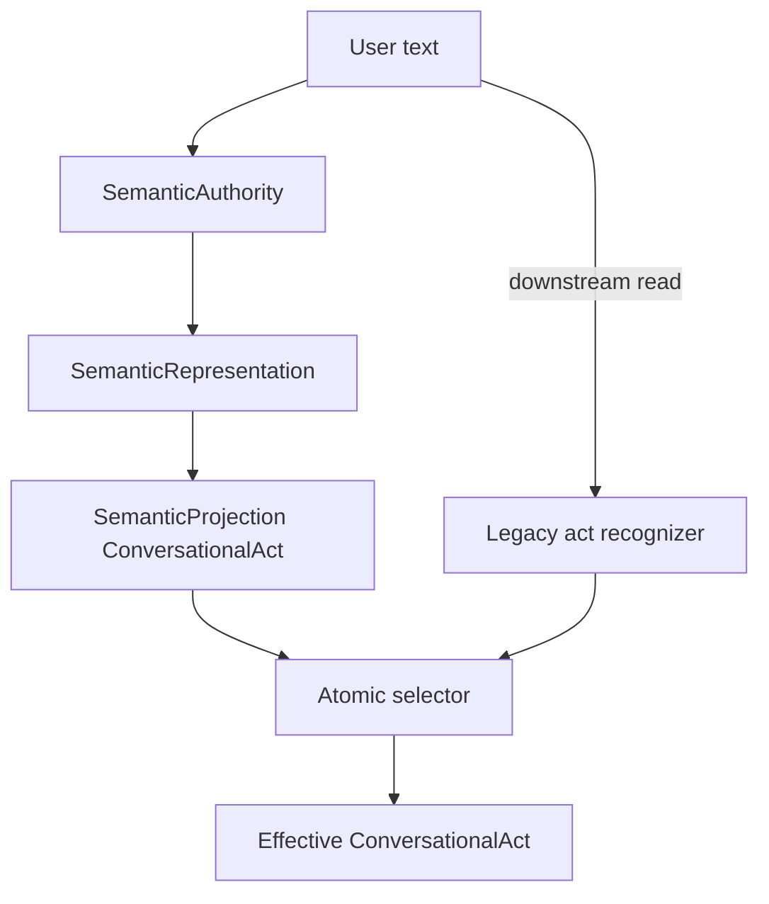
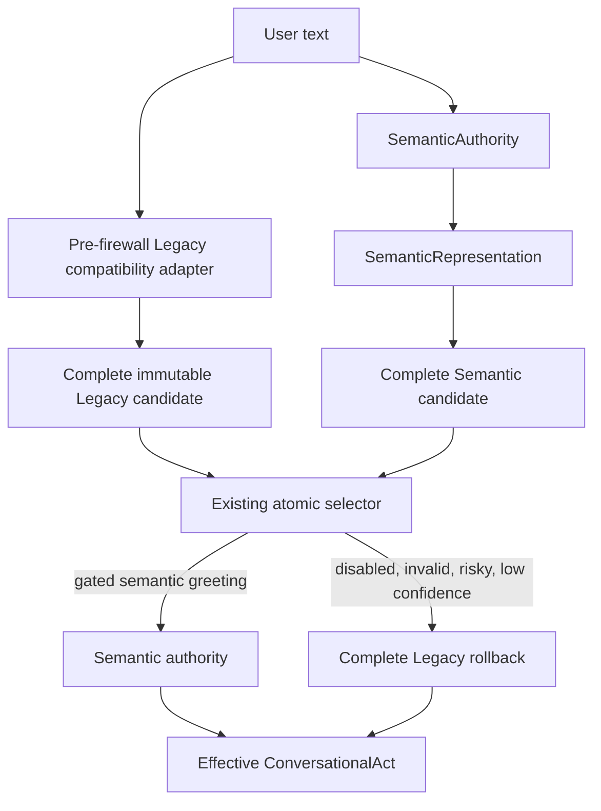

# ACA-101 - FW-2 ConversationalAct Legacy retirement

Status: Implemented  
Selected masterplan package: `FW-4`  
Package name: `ConversationalAct Legacy retirement`  
Selection source: ACA-033 and ACA-100  
Global authority: Legacy  
Changed authority scope: None beyond the existing SA-3 greeting pilot

## 1. Automatic package selection

The Sprint number and the package identifier are intentionally different. FW-2
is the implementation RC; `FW-4` is the package identifier generated by the
ACA-100 masterplan.

Selection used the masterplan order, source-derived authority readiness, package
risk, disposition, and the components prohibited by this RC. It did not use an
earlier conversational roadmap.

| Order | Package | Masterplan result | RC result | Reason |
| ---: | --- | --- | --- | --- |
| 1 | FW-A0, Authorized raw-text boundary allowlist | LOW / NO_CHANGE | skipped | allowlist baseline, not a migration |
| 2 | FW-2, Output-only utterance boundary | LOW / NO_CHANGE | skipped | Composer and LLM Verbalizer are prohibited |
| 3 | FW-3, Shadow Candidate Work fallback removal | LOW_RISK | skipped | Candidate Work is prohibited |
| 4 | FW-4, ConversationalAct Legacy retirement | READY / FULL_PROMOTION_ELIGIBLE | selected | first deployable package |

The selected name and documentation filename are produced by
`select_first_eligible_migration_package()`:

```text
ACA-101_FW2_ConversationalAct_Legacy_retirement.md
```

The selection can be reproduced with the existing passive CLI and repeated
`--prohibit-component` arguments. The selection policy is:

```text
masterplan_order_then_ready_or_low_risk_then_rc_component_constraints
```

## 2. Scope correction

ACA-100 calls the package "Legacy retirement," but this RC also requires Legacy
to continue executing for comparison and rollback. Therefore retirement means:

* retire Legacy free-text access from the downstream ConversationalAct consumer;
* retain a temporary pre-firewall Legacy compatibility lane;
* expose only one complete immutable Legacy candidate after the firewall;
* never merge Legacy and Semantic fields;
* do not broaden semantic promotion beyond the existing safe greeting scope.

Removing Legacy entirely would violate the RC. Promoting every act would exceed
the evidence from ACA-033 and the adversarial benchmark. The implementation
therefore changes placement, not cognitive behavior.

## 3. Before



Legacy recognition was invoked after `SemanticAuthority.interpret()`. Both the
call site and the recognizer implementation were classified as post-firewall
violations.

## 4. After



After the firewall, ConversationalAct sees structured candidate values only.
The compatibility lane is explicitly typed as:

```text
LEGACY_PREFIREWALL_COMPARISON_ACCESS
```

It may interpret text only before SemanticAuthority and may publish only a
complete candidate for comparison or rollback.

## 5. Behavioral invariants

The following were intentionally unchanged:

* `LOW_RISK_SEMANTIC_ACTS` remains `{greeting}`;
* minimum semantic confidence remains `0.95`;
* critical-risk checks remain unchanged;
* process-level pilot disable remains available;
* Legacy recognition still runs on every turn;
* semantic and Legacy values remain separately observable;
* `field_diff` remains available;
* selected value equals exactly one complete candidate;
* Runtime, planning, mission, Policy, execution, Kernel, output, Governance, and Ledger are unchanged.

## 6. Rollback

Rollback remains immediate and turn-scoped.

| Condition | Effective authority |
| --- | --- |
| pilot disabled | Legacy |
| semantic exception | Legacy |
| projection unavailable or invalid | Legacy |
| critical semantic risk | Legacy |
| confidence below threshold | Legacy |
| act outside the existing greeting scope | Legacy |
| all gates pass for greeting | Semantic |

The selector keeps:

* `legacy_value`;
* `semantic_value`;
* `selected_value`;
* hashes for all complete candidates;
* `field_diff`;
* `authority_mode`, `authority_reason`, and `authority_selected`;
* `rollback_reason`;
* `atomic_selection=true`;
* `mixed_authority=false`.

## 7. Telemetry

No new telemetry subsystem was created. The existing SA-3 pilot decision and
execution trace now add only the fields needed for FW-4:

| Field | Value |
| --- | --- |
| `firewall_package` | `FW-4` |
| `legacy_capture_phase` | `pre_semantic_compatibility` |
| `downstream_text_access` | `false` |
| `firewall_compliant_turns` | session count of compliant candidate selections |

The existing trace still contains Legacy result, Semantic result, field diff,
rollback reason, confidence, and effective authority.

## 8. Firewall delta

| Metric | ACA-100 baseline | After FW-4 | Delta |
| --- | ---: | ---: | ---: |
| text accesses inventoried | 41 | 41 | 0 |
| legal non-cognitive accesses | 5 | 5 | 0 |
| pre-firewall Legacy compatibility accesses | 0 | 2 | +2 |
| post-firewall violations | 36 | 34 | -2 |
| HIGH violations | 15 | 13 | -2 |
| BLOCKER violations | 16 | 16 | 0 |
| ConversationalAct downstream text violations | 2 | 0 | -2 |

No other package changed classification. The remaining 34 violations and all 16
blockers retain their previous owner, package, and migration order.

Post-migration fingerprints:

| Artifact | Hash |
| --- | --- |
| authority source | `f81e54e3d0b963958018ce8c9bf80aae2005aa423f7614b68c06b69c1f741149` |
| authority graph | `de20170a427dffec1e126493993641719554c7daabbe2bcf054df60674d9b1f1` |
| firewall plan | `d8c7345b58b2b57c51a6948cd79ec8d93aa81959506a3a1ba27d994c96ecf96d` |

## 9. Files changed

Behavioral boundary:

* `aca_os/conversation_manager.py`: captures Legacy candidate before SemanticAuthority.
* `aca_os/semantic_authority_pilot.py`: adds FW-4 metadata to the existing selector record.
* `aca_os/execution_trace.py`: projects FW-4 metadata into the existing trace.

Passive analysis:

* `aca_os/authority_dependency_graph.py`: detects call ordering and classifies the compatibility lane.
* `aca_os/semantic_firewall_plan.py`: exposes source-derived package readiness and automatic selection.
* `tools/run_semantic_firewall_plan.py`: exposes generic package selection from the existing CLI.

Validation and documentation:

* `tests/test_semantic_firewall_first_migration.py`;
* `tests/test_semantic_firewall_plan.py`;
* this document.

No prohibited component was changed.

## 10. Validation

Focused verification covers:

* source-derived selection of exactly FW-4;
* explicit reasons for skipping FW-A0, FW-2, and FW-3;
* Legacy capture occurring before SemanticAuthority;
* zero downstream ConversationalAct text violations;
* Legacy comparison on semantic turns;
* complete rollback on non-promoted turns;
* no mixed-authority result;
* trace and session telemetry;
* visible response and downstream plan equality;
* no classification changes outside FW-4.

Initial focused result:

```text
36 passed
```

Instrumented on/off comparison:

| Message | Selected authority | Reason | Response | Intent | ExecutionPlan | Downstream text |
| --- | --- | --- | --- | --- | --- | --- |
| `Hola` | Semantic | low-risk greeting promotion | equal | equal | equal | false |
| `No hubo heridos.` | Legacy rollback | confidence below threshold | equal | equal | equal | false |
| `Eso.` | Legacy rollback | critical semantic risk | equal | equal | equal | false |
| `Hola. Me llamo Maia.` | Legacy rollback | confidence below threshold | equal | equal | equal | false |
| `Necesito ayuda con una denuncia.` | Legacy rollback | confidence below threshold | equal | equal | equal | false |

Benchmark comparison:

| Benchmark | Before | After | Delta | Corpus hash |
| --- | ---: | ---: | ---: | --- |
| official semantic understanding | 98.65% | 98.65% | 0.00 pp | `79c644695143252969f4dde4e4e94b6dbabe6c7813c6733ddaed5340057ac5bd` |
| official conversational act | 100% | 100% | 0.00 pp | same official corpus |
| adversarial semantic accuracy | 70.72% | 70.72% | 0.00 pp | `69bbc81a2cd107a936f63e6b122c110380f31b6916595cba978e50650cb61a47` |
| adversarial robustness | 73.71% | 73.71% | 0.00 pp | same adversarial corpus |
| adversarial critical error rate | 5.69% | 5.69% | 0.00 pp | same adversarial corpus |

Final verification:

| Suite | Result |
| --- | ---: |
| FW-2 focused selection/firewall/authority tests | 36 passed |
| complete repository | 696 passed in 674.96 seconds |

The FW-1 complete baseline contained 688 tests. FW-2 adds eight tests; the full
increase is accounted for by this package's coverage.

## 11. Acceptance assessment

| Criterion | Result |
| --- | --- |
| exactly one package migrated | met: FW-4 only |
| no high-risk package implemented | met |
| Legacy remains available and executes | met |
| immediate per-turn rollback | met |
| no mixed authority | met |
| package downstream consumer detached from text | met |
| prohibited components unchanged | met |
| visible response changed | no |
| other packages advanced | no |

This RC does not authorize FW-5 or any later package.
