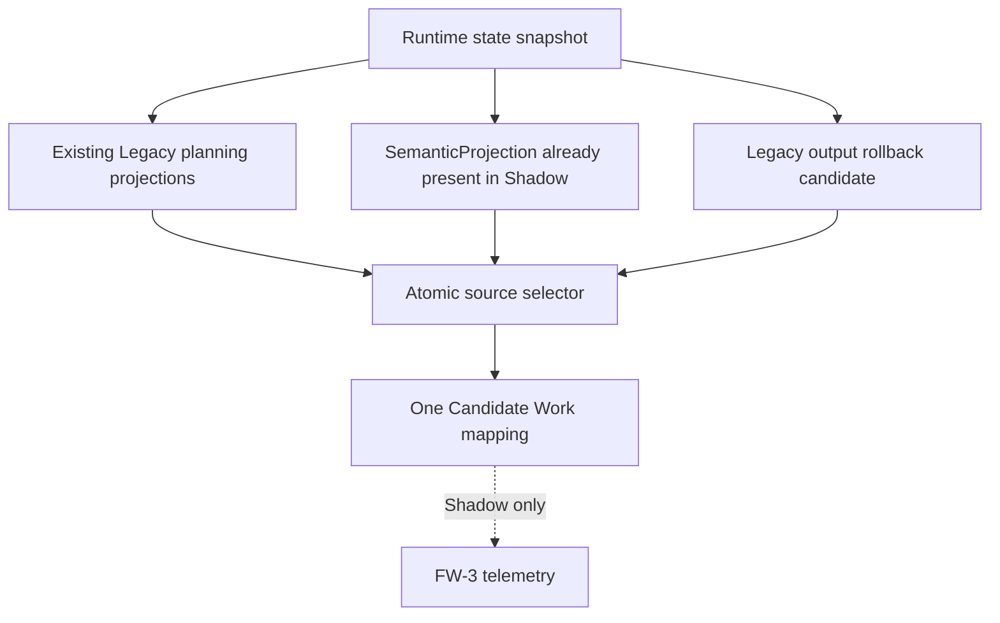

# ACA-102 - FW-3 Shadow Candidate Work Fallback Removal

Status: Implemented  
Masterplan package: `FW-3`  
Authority: Shadow only  
Runtime influence: None  
Visible response influence: None

## 1. Scope

FW-3 removes exactly the three Candidate Work accesses identified by ACA-100:

* `ConversationState.confirmed_facts.last_raw_payload`;
* top-level cognitive facts `last_raw_payload`;
* `conversation_state_runtime.last_raw_payload`.

No other Semantic Firewall package is implemented by this change.

## 2. Source selection

Candidate Work is still produced once per evaluation. It does not run parallel
Legacy and Semantic mappers and does not merge fields.

Selection order preserves the previous behavior:

1. current-turn evidence already carried by `ConversationIntentModel` and
   `ConversationResponsePlan`;
2. canonical signals from the existing `SemanticProjection`;
3. complete Legacy output rollback when the semantic projection is absent;
4. an empty, explicit rollback result when neither source exists.

The semantic fallback consumes only projected intent, topic, goal, fact, and
entity fields. It does not invoke SemanticAuthority again and does not read the
original user payload.

## 3. Rollback and observability

`operational_work_shadow.v1` now exposes `semantic_firewall` metadata:

| Field | Meaning |
| --- | --- |
| `authority_mode` | `legacy`, `semantic`, or `rollback` for the complete source candidate |
| `semantic_usage` / `legacy_usage` | selected candidate family |
| `rollback` | whether the complete Legacy output candidate was selected |
| `legacy_available` / `semantic_available` | comparison availability |
| `agreement_rate` | token-level signal overlap, never a decision input |
| `confidence` | selected source confidence |
| `failure_reason` | semantic fallback failure, when present |
| `mixed_authority` | always `false` |
| `downstream_raw_payload_access` | always `false` |

Candidate Work remains passive: no state mutation, tool call, Runtime decision,
or user-visible response depends on this metadata.

## 4. Graph delta

| Metric | Before FW-3 | After FW-3 | Delta |
| --- | ---: | ---: | ---: |
| inventoried text accesses | 41 | 38 | -3 |
| firewall violations | 34 | 31 | -3 |
| FW-3 violations | 3 | 0 | -3 |
| critical violations | 16 | 16 | 0 |
| graph edges | 71 | 70 | -1 |
| collapse candidates | 7 | 6 | -1 |

The three removed reads no longer appear in the source-derived inventory.
FW-3 is retained in the Masterplan with `consumer_count=0` so dependencies and
historical package identity remain inspectable.

## 5. Compatibility

Unchanged components include Runtime, ConversationState, SemanticAuthority,
MissionManager, Candidate Work ranking rules, ActionPlanner, FlowRouter,
RuntimeExecutor, Kernel, Composer, Verbalizer, Policy, Governance, and Ledger.

The Masterplan builder received one passive compatibility adjustment: completed
packages remain represented with zero consumers. The known selector issue that
can reselect an already completed package is not changed by FW-3.

## 6. Validation

Focused coverage verifies:

* existing structured Legacy evidence preserves Candidate Work behavior;
* `SemanticProjection` is used when Legacy planning evidence is unavailable;
* Legacy output rollback is complete and turn-scoped;
* raw payload values no longer affect Candidate Work;
* no mixed-authority mapping is possible;
* the mapper remains side-effect free;
* FW-3 has zero live firewall violations.

Validation result:

| Suite | Before FW-3 | After FW-3 | Result |
| --- | ---: | ---: | --- |
| focused FW/operational tests | - | 42 passed | green |
| complete repository | 696 passed | 700 passed | green; four FW-3 tests added |
| official semantic score | 98.65% | 98.65% | unchanged |
| adversarial semantic accuracy | 70.72% | 70.72% | unchanged |
| adversarial robustness | 73.71% | 73.71% | unchanged |
| synthetic operation selection | 50/50 | 50/50 | unchanged |
| synthetic category/outcome | 100% / 100% | 100% / 100% | unchanged |
| real-world operation selection | 98.91% | 98.91% | unchanged |
| real-world transition accuracy | 100% | 100% | unchanged |
| real-world candidate recall | 100% | 100% | unchanged |
| real-world original ranking | 98.91% | 98.91% | unchanged |
| case-state projected ranking | 100% | 100% | unchanged |
| real-world candidate precision | 92.02% | 92.59% | one raw-fallback false positive removed |
| Runtime mutations | 0 | 0 | unchanged |
| visible response changes | 0 | 0 | unchanged |

The before value for the real-world comparison was reproduced against the same
92-turn corpus by injecting the retired source order in process memory only. No
fixture or benchmark file was changed.

Stable benchmark fingerprints:

| Artifact | Hash |
| --- | --- |
| official corpus | `79c644695143252969f4dde4e4e94b6dbabe6c7813c6733ddaed5340057ac5bd` |
| official report | `be7207dee98c0f05ac37362e396c84eaf727a3740219af4fac52ec0ce43b3d70` |
| adversarial corpus | `69bbc81a2cd107a936f63e6b122c110380f31b6916595cba978e50650cb61a47` |
| adversarial report | `82221920d20febe84b88abb3030262b440ba7057ff4a30bdeb6f7e11bdccf899` |

Complete repository result: `700 passed in 649.86s`.

## 7. Result

FW-3 is complete. Operational, official semantic, adversarial, and repository
test runs remain stable. The package does not authorize FW-5 or any other
migration.
