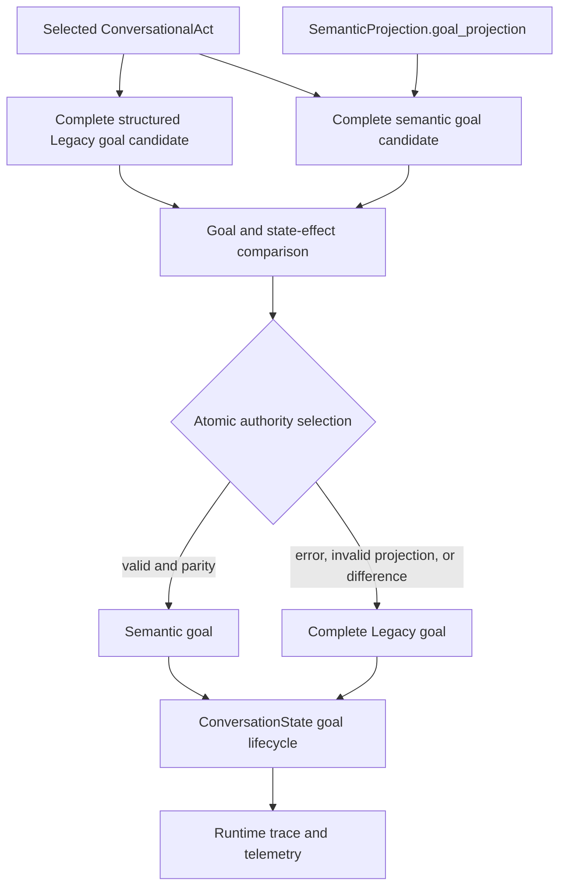

# ACA-103 - FW-5 ConversationalGoal Semantic Input

Status: Implemented  
Masterplan package: `FW-5`  
Effective scope: `ConversationalGoal` only  
Visible response influence: None by parity gate

## 1. Automatic package selection

The repository did not expose another uncompleted `READY` artifact. ACA-033 and
the regenerated authority graph ranked `ConversationalGoal` immediately after
the already migrated `ConversationalAct`; ACA-100 assigned it one remaining
consumer and only two downstream couplings.

The source audit reduced its effective risk further. The former call was:

```text
ConversationManager
    -> ConversationState.apply_conversational_goal(event.payload)
```

Inside `ConversationState`, the payload did not select the act, strategy,
intention, priority, success criteria, mission impact, response plan, or state
transition. It was copied only to `goal.evidence.message`. All decision fields
already came from the selected `ConversationalAct` and structured
`ConversationState`. FW-5 was therefore the smallest package that could remove
a live violation without changing behavior.

FW-6, FW-7, FW-8, and FW-9 remain higher-risk because they mutate persistent
topic, slot, fact, or entity state from text. FW-10 and later packages remain
blocked by duplicate writers or routing coupling.

## 2. Implemented boundary



`ConversationState` now exposes two separate responsibilities:

* project a complete conversational goal from a structured source;
* apply one already selected complete goal to strategy, topic snapshot, and
  turn-scoped derived state.

The official pipeline no longer passes `event.payload` into either operation.
The semantic candidate consumes the existing `goal_projection`; the Legacy
candidate consumes the already selected structured act and state. Neither
candidate reinterprets text.

## 3. Authority and rollback

The selector compares complete candidates but evaluates parity over decision
fields. Provenance is intentionally allowed to differ: the semantic candidate
records projection and representation IDs while the Legacy candidate records
its structured compatibility source.

The state-effect comparison covers:

* the complete decision-bearing goal;
* `conversational_strategy`;
* every topic goal snapshot updated by the lifecycle.

Selection is atomic. A turn receives either the complete semantic candidate or
the complete Legacy candidate. It never merges fields. Semantic failure,
invalid projection, insufficient confidence, a forbidden goal difference, or a
state-effect difference immediately selects Legacy for that turn.

The existing `SEMANTIC_AUTHORITY_PILOT_ENABLED` switch also disables semantic
goal selection, preserving deterministic rollback for the vertical pilot.

## 4. Telemetry

`conversation_state_runtime.v1` and `ExecutionTrace` now expose:

| Field | Meaning |
| --- | --- |
| `authority_mode` | `semantic`, `legacy`, or `rollback` |
| `authority_selected` | the one complete candidate applied |
| `legacy_value` / `semantic_value` | comparison candidates |
| `field_diff` | complete top-level comparison |
| `agreement` | decision-field parity |
| `state_delta_parity` | parity of lifecycle state effects |
| `confidence` | confidence of the semantic primary goal |
| `rollback_reason` / `failure_reason` | exact fallback cause |
| `semantic_usage` / `legacy_usage` | aggregate selection rates |
| `rollback_rate` / `agreement_rate` | aggregate package metrics |
| `atomic_selection` / `mixed_authority` | authority invariant |
| `downstream_text_access` | always `false` |

The execution operation is
`SEMANTIC_FIREWALL_CONVERSATIONAL_GOAL`. This telemetry is observational and
does not affect response generation.

## 5. Graph delta

| Metric | Before FW-5 | After FW-5 | Delta |
| --- | ---: | ---: | ---: |
| inventoried text accesses | 38 | 37 | -1 |
| firewall violations | 31 | 30 | -1 |
| critical violations | 16 | 16 | 0 |
| graph edges | 70 | 69 | -1 |
| `ConversationalGoal` coupling | 2 | 1 | -1 |
| `ConversationalGoal` readiness | HIGH_RISK | LOW_RISK | improved |

Current fingerprints:

| Artifact | Hash |
| --- | --- |
| authority source | `d94731c63dadbb19406920b1e6d1f6823abc838ca30a1941ae1b919c18d68e9e` |
| authority graph | `ac0bb04c30ef0ed435192ae826a5fa5d185c2fdc15a4cdd563d0abfa7658d19c` |
| firewall plan | `03fe760bc58851737a8bc164c0531b9deccd2421c1f9830f9012a2ba2e11085e` |

## 6. Compatibility and tests

No response template, planner, mission rule, slot lifecycle, topic lifecycle,
fact lifecycle, RuntimeExecutor path, Kernel path, Policy, Governance, Ledger,
Composer, Verbalizer, plugin, or benchmark fixture changed.

Focused coverage verifies:

* the FW-5 raw-text violation no longer exists;
* one complete semantic candidate is selected when valid;
* semantic failure restores the complete Legacy candidate;
* goal and state-effect parity are both required;
* no candidate contains the former duplicated `evidence.message` field;
* visible response, intent, action plan, flow, and ExecutionPlan remain stable;
* telemetry is available in Runtime records and exported execution traces.

Validation:

| Check | Result |
| --- | ---: |
| focused FW-5 and adjacent suites | 33 passed |
| official semantic benchmark | 98.65%, unchanged |
| adversarial semantic accuracy | 70.72%, unchanged |
| adversarial robustness | 73.71%, unchanged |
| complete repository suite | 706 passed in 804.58s |

Stable benchmark report hashes:

* official: `be7207dee98c0f05ac37362e396c84eaf727a3740219af4fac52ec0ce43b3d70`;
* adversarial: `82221920d20febe84b88abb3030262b440ba7057ff4a30bdeb6f7e11bdccf899`.

## 7. Remaining blockers and next candidate

Thirty violations remain. Sixteen are still critical and concern
`ConversationIntentModel`, planning, routing, Mission, and Policy. FW-5 does not
claim to unblock them.

The next package must be recalculated from the post-FW-5 graph. The current
dependency order makes FW-6 Topic lifecycle the nominal successor, but it
retains three HIGH text dependencies and requires full topic-stack rollback.
FW-7 has two HIGH dependencies and no FW-5 dependency, so a new effective-risk
comparison is required before choosing either package. No automatic promotion
is authorized by this document.

The project should perform the requested full Core audit once the live
violation count enters the 15-20 range; at 30, that threshold has not yet been
reached.
