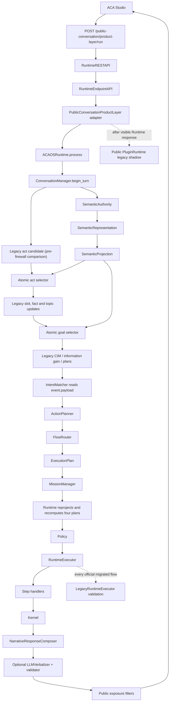
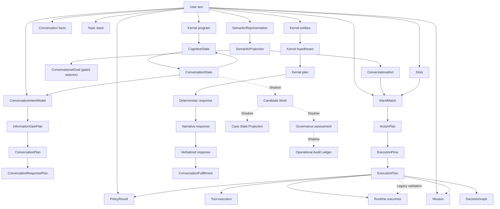

# ACA-200 - Core Readiness Audit

Status: decision audit only  
Date: 2026-07-15  
Repository: `ACA_Framework_RC1_Core`  
Branch and HEAD: `main` / `0a637b5c6c40d938c014c58fb779264aa56c7077`  
Visible behavior changed by this audit: no  

## 1. Decision

ACA is **partially ready** for its next stage.

The execution shell is stable enough to preserve while the system is tested:

* `ActionPlanner` and `FlowRouter` consume structured values;
* `RuntimeExecutor` is the official plan-driven executor;
* the output boundary reaches `NarrativeResponseComposer` and the optional
  `LLMVerbalizer`;
* per-turn Semantic rollback and Legacy comparison are operational;
* the current authority and firewall graphs are reproducible.

The semantic/state Core is not ready for another broad migration or a
`ConversationState` refactor:

* 30 post-firewall text violations remain;
* all 16 critical violations found by ACA-033 remain;
* four planning artifacts are still constructed twice and overwritten;
* `ConversationState` is 6,787 lines and still contains parsing, state
  transitions, planning and response heuristics;
* SemanticAuthority scores 98.65% on the official corpus but only 70.72% on the
  adversarial corpus;
* the next firewall candidates mutate persistent topic, slot or fact state and
  are no longer low-risk packages.

The correct next movement is therefore:

```text
START_REAL_WORLD_TESTING
```

This means instrumented, non-production conversational validation against the
current Runtime. It does not mean promoting SemanticAuthority globally or
starting a structural split of `ConversationState`. Real conversations should
now determine which remaining high-risk semantic boundary produces the most
user-visible harm.

## 2. Evidence And Scope

This audit used only the current working tree and read-only verification:

* source inspection of the official Studio and Runtime entrypoints;
* regenerated Authority Graph and Semantic Firewall reports to stdout;
* AST-based source size and hotspot measurement;
* one in-memory two-turn Runtime execution with LLM disabled and no tool side
  effects;
* current Git status and file inventory;
* ACA-024, ACA-030, ACA-031, ACA-033 and ACA-100 through ACA-103 as historical
  comparison evidence.

No benchmark was rerun. The current authority source hash is identical to the
post-FW-5 hash recorded by ACA-103, so the last complete validation remains the
relevant result:

| Evidence | Current applicable result |
| --- | --- |
| Complete suite | 706 passed |
| Official semantic benchmark | 98.65% |
| Adversarial semantic accuracy | 70.72% |
| Adversarial robustness | 73.71% |
| Adversarial recommendation | `LOW_RISK_VERTICAL_PILOT_ONLY` |
| Authority source hash | `d94731c63dadbb19406920b1e6d1f6823abc838ca30a1941ae1b919c18d68e9e` |
| Authority graph hash | `ac0bb04c30ef0ed435192ae826a5fa5d185c2fdc15a4cdd563d0abfa7658d19c` |
| Firewall plan hash | `03fe760bc58851737a8bc164c0531b9deccd2421c1f9830f9012a2ba2e11085e` |

### 2.1 Working-tree qualification

The architecture audited here is the working-tree architecture, not the Git
HEAD architecture. At audit start Git reported:

| State | Count |
| --- | ---: |
| Modified tracked files | 6 |
| Untracked files | 52 |
| Untracked semantic/FW files | 36 |

SemanticAuthority, SemanticProjection, the authority/firewall generators,
their benchmarks and their tests are among the untracked files. This does not
invalidate execution evidence, but it prevents declaring a reproducible Core
release from `main` at the current HEAD.

## 3. Architecture Real

### 3.1 Official Studio pipeline

The visible Studio request still enters through the public endpoint, but the
public layer delegates response generation to one retained `ACAOSRuntime` per
`conversation_id`.



Source anchors:

* `aca_os/public_conversation_product_layer.py:355-402` owns the public adapter
  call and visible response projection.
* `aca_os/conversation_manager.py:147-253` builds Legacy and Semantic
  candidates, selects act/goal authority, then continues Legacy state work.
* `aca_os/runtime.py:416-480` performs intent matching, routing, mission work
  and the second planning pass.
* `aca_os/runtime.py:496-525` selects the official or compatibility executor.
* `aca_os/step_handlers.py:310-371` composes, verbalizes, validates and records
  the visible output.

### 3.2 Legacy and alternate pipelines

| Pipeline | Visible | Current role | Classification |
| --- | --- | --- | --- |
| `LegacyRuntimeExecutor.project` | No | Executes beside official Runtime for equivalence | LEGACY |
| `LegacyRuntimeExecutor.execute` | Only custom clarification configurations | Compatibility executor | LEGACY |
| Public `PluginRuntime -> DeterministicDialogueController` | Response hidden | Public capability/action metadata and comparison | LEGACY |
| `PublicConversationWorkflow` via `/demo/domain-flow` | Only old demo endpoint | Older complete conversation stack | DEPRECATED |
| Candidate Work -> Case projection -> Governance -> Ledger | No | Evaluation and Shadow validation only | TRANSITIONAL |

The public legacy shadow is not fully inert. At
`public_conversation_product_layer.py:383-387` it still participates in active
public route selection, and at lines 1363-1365 its capability may determine UI
metadata. It no longer owns visible text.

### 3.3 Plugins

Two plugin models still coexist:

* `aca_os.plugin_*` loads Core metadata from `plugin.json`;
* `aca_core.platform_plugins` powers executable public plugins from
  `manifest.yaml`.

Kernel plugin semantic analyzers also remain downstream text consumers. The
Firewall attributes two violations to `plugin_semantic`; they are scheduled
under FW-9, not yet migrated.

## 4. Evolution Since ACA-024

ACA-024 described a coherent Runtime with no SemanticAuthority in the official
turn. The current Core adds a real semantic ingress and two controlled vertical
selectors, but it has not removed the older interpretation chain.

| Dimension | ACA-024 | Current | Change |
| --- | ---: | ---: | ---: |
| Parseable Python modules | 236 | 256 | +20 |
| Python LOC | 50,759 | 61,038 | +10,279 |
| Non-test Python LOC | 39,415 | 47,933 | +8,518 |
| Test Python LOC | 11,344 | 13,105 | +1,761 |
| Authority graph nodes | Not present | 36 | New |
| Authority graph edges | Not present | 69 | New |
| Semantic Firewall violations | Not measured | 30 | New governed metric |
| Semantic representation per turn | No | Yes | Improvement |
| Semantic decision consumers | 0 | 2 gated consumers | Improvement |

Eight semantic/authority/evaluation modules alone account for 8,355 non-test
LOC. This investment produced measurable authority controls and evaluation,
but also created a new observability/evaluation subsystem that now requires
its own consistency management.

The main ACA-024 architectural debts remain:

* official plus Legacy validation execution;
* public legacy shadow and old demo workflow;
* dual plugin systems;
* operational Shadow components outside the official Runtime;
* the `ConversationState` and evaluation monoliths;
* incomplete Runtime component registration.

## 5. Component Classification

The classification describes the component's current architectural role, not
its code quality.

| Component | Status | Evidence and justification |
| --- | --- | --- |
| `ACAOSRuntime` | EVOLVING | Official orchestrator, but still reads text at five sites and performs duplicate planning at lines 473-476. |
| `ConversationManager` | EVOLVING | Owns sessions and turn state, but now also orchestrates Semantic shadow, two selectors, Legacy state updates, diffs and telemetry. |
| `ConversationState` | EVOLVING | Canonical state owner, but includes lexical interpretation, lifecycle logic and four planners in 6,787 lines. |
| `SemanticAuthority` | EVOLVING | Runs once per turn and has strong official quality; adversarial quality and downstream adoption remain limited. |
| `SemanticProjection` | TRANSITIONAL | Produces complete Shadow projections, but only act and goal have gated decision consumers. |
| Semantic authority pilot | TRANSITIONAL | Provides atomic selection and rollback; it is deliberately not global authority. |
| `ConversationIntentModel` | TRANSITIONAL | Effective authority is `legacy_recomputed`; three producers and a later overwrite block promotion. |
| `IntentMatcher` | TRANSITIONAL | Still derives routing intent directly from `event.payload`; this is a critical FW-12 violation. |
| `ActionPlanner` | STABLE | Consumes a structured `IntentMatch`, has no text access and no state mutation. |
| `FlowRouter` | STABLE | Consumes a structured `ActionPlan`; no semantic authority or text parsing. |
| `ExecutionPlan` contract | STABLE | Immutable derived execution description with three downstream consumers. |
| `MissionManager` | TRANSITIONAL | Correctly owns missions, but still selects claim/general missions by lexical matching at line 46. |
| `PolicyManager` | TRANSITIONAL | Independent veto authority is correct; direct text input remains a critical FW-15 boundary violation. |
| `RuntimeExecutor` | STABLE | Official plan-driven step executor; no direct semantic interpretation. Legacy validation is external debt. |
| Step-handler registry | STABLE | Explicit execution boundary used by both official and validation paths. |
| Kernel execution loop | STABLE | Operation contracts and execution order remain coherent. |
| Kernel compiler/extraction | TRANSITIONAL | Compiler, `Observe`, `Extract` and plugin semantics still consume raw text independently. |
| `NarrativeResponseComposer` | STABLE | Output-only transform; its remaining text read is non-cognitive but not yet formally allowlisted. |
| `LLMVerbalizer` and provider adapters | STABLE | Optional output-only layer with deterministic validation and fallback; never an authority. |
| Candidate Work | TRANSITIONAL | Firewall-clean after FW-3, but still a passive Shadow projection and not a Runtime input. |
| Case State Projection | TRANSITIONAL | Derived only from Shadow Candidate Work; no state ownership. |
| Governance Gate | TRANSITIONAL | Validated independent Shadow gate, absent from official chat execution. |
| Operational Audit Ledger | TRANSITIONAL | Validated/audited in evaluation paths; not the official Runtime ledger. |
| ToolEngine and Tool contracts | STABLE | Independent operational boundary already consumed by RuntimeExecutor. |
| Public product adapter | EVOLVING | Visible text comes from Runtime, but legacy capability metadata still leaks into route projection. |
| Public legacy PluginRuntime | LEGACY | Executes only for comparison/metadata and duplicates conversation logic. |
| `LegacyRuntimeExecutor` | LEGACY | Required for parity and compatibility, not the target execution architecture. |
| `PublicConversationWorkflow` | DEPRECATED | Replaced for Studio; survives only through the old demo endpoint. |
| `PublicConversationState` | CANDIDATE_FOR_REMOVAL | Duplicates canonical conversation ownership and serves historical/public compatibility. |
| `aca_core.platform_plugins` | TRANSITIONAL | Still executable and externally relevant, but duplicates the Core plugin model. |

No component is classified `CANDIDATE_FOR_REMOVAL` solely because it is large.
Removal requires zero live compatibility consumers; this audit does not perform
that validation or removal.

## 6. ConversationState Audit

### 6.1 Current shape

| Property | Evidence |
| --- | --- |
| Size | 6,787 LOC |
| Contract classes | 10 |
| Top-level functions | 241 |
| State fields | 22 |
| Production importers | 9 |
| Total importers including tests | 25 |
| Dataclass mutability | `frozen=True`, but fields contain mutable dicts/lists |
| Outward imports | `normalize_text` and `CognitiveState` only |

The module has low package-level outward coupling but very high conceptual and
inward coupling. It owns or implements:

* canonical state and field ownership metadata;
* CognitiveState/public/context compatibility projections;
* slot resolution and question closure;
* fact assimilation, correction and mission advancement;
* conversational acts and goals;
* topic lifecycle and focus;
* intent decomposition;
* information-gain planning;
* conversation and response planning;
* fulfillment and recovery evaluation;
* more than one hundred lexical helper rules.

This is not cohesive as one implementation module even though the ownership
model itself remains coherent.

### 6.2 Ownership

`ConversationState` remains the correct single source of truth for durable
conversation state. The Authority Graph labels it
`primary_state_owner`; the Runtime still projects to and from `CognitiveState`,
creating one intentional structural cycle.

The class docstring at lines 274-278 is now stale: it still describes the type
as a passive projection that does not affect Runtime behavior. In current code,
slot/fact/topic lifecycle, semantic act selection and semantic goal selection
all affect the official turn through this state.

### 6.3 Mutability

The dataclass is frozen, and lifecycle functions generally create copies and
return replacements. That protects field reassignment. It is not deep
immutability: `focus`, `topic_stack`, `slots`, facts and other fields are mutable
containers. Correctness currently depends on callers respecting copy-on-write
conventions.

### 6.4 Responsibilities that should remain

* conversation identity and turn lifecycle;
* canonical topic, slot, fact and goal snapshots;
* deterministic application of already interpreted state transitions;
* state ownership metadata;
* serialization and explicit projection boundaries;
* history needed for rollback, correction and fulfillment.

### 6.5 Responsibilities that should leave later

No change is authorized by this audit. Future migration should remove these
responsibilities from the module implementation while preserving state
ownership:

1. lexical parsing and `_mentions_*`, `_match_*` interpretation;
2. construction of Semantic-equivalent entities, facts, acts and topics from
   raw text;
3. `ConversationIntentModel` construction;
4. information-gain, conversation and response-plan computation;
5. public/CognitiveState compatibility assembly that can live at projection
   boundaries;
6. user-need and response-quality lexical heuristics;
7. generic `derived_state` duplication once every derived artifact has one
   explicit writer.

The correct target is a smaller state owner that applies structured deltas. It
is not a second state object.

## 7. SemanticAuthority Readiness

### 7.1 Coverage

SemanticAuthority is instantiated by `ConversationManager` and invoked exactly
once for each successful turn. It produces an immutable
`SemanticRepresentation`; `SemanticProjector` then produces the complete
projection family.

Current measured quality:

| Measure | Result | Interpretation |
| --- | ---: | --- |
| Official semantic score | 98.65% | Strong on the curated permanent suite |
| Adversarial semantic accuracy | 70.72% | Material weakness outside canonical phrasing |
| Adversarial robustness | 73.71% | Not suitable for broad promotion |
| Adversarial critical error rate | 5.69% | Gating and rollback remain necessary |

Systematic adversarial weaknesses recorded by ACA-031 include successive
retractions, ambiguity calibration, nested/noisy negation, distant
coreference, corrections and multi-topic priority.

### 7.2 Effective consumers

| Consumer | Effective use |
| --- | --- |
| ConversationalAct | Semantic only for gated high-confidence `greeting`; otherwise complete Legacy rollback |
| ConversationalGoal | Semantic complete value only when validation, confidence, decision parity and state-effect parity pass |
| Candidate Work | Shadow-only structured input after FW-3 |
| Trace and introspection | Observational only |
| All other projections | Diff/benchmark only |

No other official consumer is semantically authoritative.

### 7.3 Blocked consumers

* topics, slots, facts and Kernel entities remain `HIGH_RISK` because they are
  persistent/mutable and still have text-derived writers;
* `ConversationIntentModel` and `IntentMatch` remain blocked by duplicate
  writers and routing impact;
* Mission and Policy must consume semantics eventually but retain independent
  domain/safety authority;
* execution, tools, Governance, Ledger and output realization must never become
  semantic-authority targets.

## 8. Semantic Firewall State

### 8.1 Current inventory

| Metric | ACA-033 | Current | Delta |
| --- | ---: | ---: | ---: |
| Inventoried raw-text accesses | 41 | 37 | -4 |
| Allowed non-cognitive accesses | 5 | 5 | 0 |
| Pre-firewall Legacy comparisons | 0 | 2 | +2 |
| Post-firewall violations | 36 | 30 | -6 |
| Critical/BLOCKER violations | 16 | 16 | 0 |
| HIGH violations | 15 | 12 | -3 |
| MEDIUM violations | 4 | 1 | -3 |
| LOW violations | 1 | 1 | 0 |

Completed migration packages:

* FW-4: ConversationalAct Legacy retirement boundary (`36 -> 34`);
* FW-3: Candidate Work raw-text fallback removal (`34 -> 31`);
* FW-5: ConversationalGoal semantic input (`31 -> 30`).

The five allowed accesses are ingress or audit boundaries. The two Legacy act
reads occur before SemanticAuthority and remain only for complete comparison
and rollback.

### 8.2 Remaining violations by component

| Component | Violations |
| --- | ---: |
| ConversationState | 8 |
| ConversationManager | 7 |
| Runtime | 5 |
| Kernel | 3 |
| Plugin semantic analyzers | 2 |
| IntentMatcher | 1 |
| MissionManager | 1 |
| PolicyManager | 1 |
| NarrativeResponseComposer | 1 |
| LLMVerbalizer | 1 |

### 8.3 Remaining violations by package

| Package | Scope | Violations | Current risk |
| --- | --- | ---: | --- |
| FW-6 | Topic lifecycle | 3 | Persistent state / high effective risk |
| FW-7 | Pending slots | 2 | Persistent state / high effective risk |
| FW-8 | Fact assimilation | 3 | HIGH |
| FW-9 | Entity consolidation | 3 | HIGH |
| FW-10 | ConversationIntentModel | 3 | BLOCKED by writers |
| FW-11 | Structured plans / writer collapse | 9 | BLOCKED dependency chain |
| FW-12 | Intent routing | 2 | BLOCKER |
| FW-13 | Kernel compiler | 1 | HIGH |
| FW-14 | Mission | 1 | BLOCKER |
| FW-15 | Policy | 1 | BLOCKER |
| FW-2 | Output-only boundary | 2 | Non-cognitive |

The counter improved, but the risk profile did not: every one of ACA-033's 16
critical decision violations is still present. Continuing FW now would cross
from isolated low-risk consumers into persistent state or routing.

## 9. Authority Graph

### 9.1 Regenerated summary

| Metric | ACA-033 | Current |
| --- | ---: | ---: |
| Nodes | 36 | 36 |
| Edges | 73 | 69 |
| Recomputation structures | 8 | 8 |
| Dependency cycles | 1 | 1 |
| READY | 1 | 1 |
| LOW_RISK | 0 | 1 |
| HIGH_RISK | 5 | 4 |
| BLOCKED | 30 | 30 |

What changed:

* four text-dependency edges disappeared across FW-3/FW-5 and related
  selector cleanup;
* Candidate Work no longer depends on `last_raw_payload`;
* ConversationalGoal moved from `HIGH_RISK` to `LOW_RISK` structural readiness;
* no node, cycle, critical blocker or recomputation disappeared;
* no new authority domain appeared.

### 9.2 Current complete graph



The machine-readable generator contains all 36 nodes and 69 edges. The diagram
above groups duplicate text edges so the authority structure remains readable.

### 9.3 Graph-model inconsistency

The generator still defines
`apply_conversational_goal` as a `user_text -> conversational_goal` Legacy
transition at `authority_dependency_graph.py:291`, and the regenerated node
reports effective authority `legacy`. Current runtime code at
`semantic_authority_pilot.py:239-243` can select the complete semantic goal, and
the dynamic audit observed that selection on both turns.

Therefore the graph hash is reproducible but its ConversationalGoal authority
label is stale. This is observability debt, not a Runtime decision failure.

## 10. Critical Component Readiness

| Component | Effective authority | Key dependencies | Risk | Readiness and remaining debt |
| --- | --- | --- | --- | --- |
| ConversationIntentModel | Legacy recomputed | text, ConversationState, Runtime | Critical | BLOCKED; 3 producers and later overwrite |
| ConversationState | Primary state owner | ConversationManager, CognitiveState projection | High | Keep ownership; remove interpretation/planning later |
| MissionManager | Independent mission owner with Legacy input | ExecutionPlan, ConversationState, text | High | Input migration needed; ownership must remain |
| Candidate Work | Shadow | ConversationState, SemanticProjection | Low while Shadow | Firewall-clean; not an official decision input |
| ActionPlanner | Derived | IntentMatch | Low | Ready to freeze; correctness inherits IntentMatch |
| FlowRouter | Derived | ActionPlan | Low | Ready to freeze; correctness inherits ActionPlan |
| RuntimeExecutor | Independent execution owner | ExecutionPlan, Policy, handlers | Low in Core | Ready to freeze; remove external Legacy comparison later |
| Kernel | Mixed | ExecutionPlan plus raw text | High | Execution stable; compiler/entity semantics not firewall-clean |
| NarrativeResponseComposer | Output transform | state, response plan, current utterance | Low | Architecture stable; one output-only boundary remains |
| LLMVerbalizer | Output transform only | VerbalizationBrief, provider, validator | Low | Architecture stable; optional and auditable |

## 11. Hotspots

### 11.1 Current ranking

| File | LOC | Top-level classes/functions | State versus ACA-024 |
| --- | ---: | ---: | --- |
| `conversation_state.py` | 6,787 | 10 / 241 | Worse: +89 LOC, still #1 |
| `evaluation.py` | 4,303 | 2 / 111 | Unchanged size, still #2 |
| `operational_work_mapper.py` | 1,882 | 0 / 63 | Worse: +137 LOC |
| `public_conversation_product_layer.py` | 1,680 | 6 / 71 | Unchanged size |
| `semantic_authority.py` | 1,607 | 2 / 28 | New hotspot |
| `authority_dependency_graph.py` | 1,384 | 7 / 31 | New hotspot |
| `semantic_adversarial_evaluation.py` | 1,381 | 2 / 32 | New evaluation hotspot |
| `semantic_firewall_plan.py` | 1,139 | 1 / 24 | New planning-infrastructure hotspot |
| `runtime_api_endpoints.py` | 1,114 | 2 / 0 | Unchanged size |
| `llm_verbalization.py` | 1,111 | 18 / 37 | Unchanged size |
| `semantic_understanding_evaluation.py` | 1,015 | 3 / 25 | New evaluation hotspot |
| `semantic_projection.py` | 1,011 | 2 / 43 | New hotspot |
| `runtime.py` | 846 | 1 / 9 | Unchanged size; authority debt remains |
| `conversation_manager.py` | 834 | 4 / 7 | Newly concentrated orchestration hotspot |

### 11.2 Interpretation

The old hotspots did not improve structurally. Semantic work mostly added
adjacent modules and orchestration:

* `ConversationState` remains the dominant risk;
* `ConversationManager` absorbed Shadow execution, comparison and selector
  responsibilities;
* evaluation infrastructure is now distributed across several large modules,
  but the original 4,303-line benchmark module remains intact;
* the public legacy stack remains unchanged.

The new modules are justified by measurable evaluation and rollback value, but
their size shows that the Core is not yet in a simplification phase.

## 12. Technical Debt

### 12.1 Debt eliminated

* six downstream text violations removed;
* four authority edges removed;
* Candidate Work no longer reads `last_raw_payload`;
* ConversationalAct has an atomic low-risk semantic path;
* ConversationalGoal consumes structured candidates with atomic rollback;
* every normal turn produces one SemanticRepresentation and one
  SemanticProjection;
* official/adversarial evaluation and authority observability now exist.

### 12.2 Debt remaining

* 30 firewall violations and 16 critical blockers;
* four duplicate planning writers;
* raw-text IntentMatcher, Mission, Policy, Kernel and plugins;
* official/Legacy Runtime double execution;
* public legacy shadow metadata coupling;
* old public workflow and duplicate state model;
* dual plugin architectures;
* one `ConversationState <-> CognitiveState` ownership cycle;
* operational stack still outside the official Runtime;
* incomplete component registry.

### 12.3 New debt

* 8,355 LOC across semantic authority, projection, pilots, graph/firewall and
  evaluation modules;
* `ConversationManager` now combines session ownership, state orchestration,
  semantic execution, comparisons, selectors and telemetry;
* the Authority Graph contains a stale ConversationalGoal authority model;
* the Core's current architecture exists mainly in untracked working-tree
  files rather than a reproducible Git revision.

### 12.4 Hidden debt made visible

Runtime introspection still reports only 17 registered components. It omits
SemanticAuthority, SemanticProjector, both authority selectors,
RuntimeExecutor, LegacyRuntimeExecutor, step handlers, Kernel, Composer and LLM
providers. This is the same registry gap identified by ACA-024, now enlarged by
the semantic subsystem.

The dynamic turn also demonstrates a behavioral consequence of hidden Legacy
authority: SemanticRepresentation is present, but downstream routing can still
produce a generic fallback and an unrelated documentation question.

## 13. Core Readiness Matrix

| Question | Answer | Evidence |
| --- | --- | --- |
| Continue FW now? | **No** | No uncompleted low-risk package remains; FW-6/FW-7 mutate persistent state and all 16 critical blockers remain. |
| Begin ConversationState restructuring? | **No** | It is the highest-risk hotspot and still hosts active Legacy interpretation and duplicate planners. |
| Begin real-world testing? | **Yes** | Official execution, rollback and trace are stable; a basic live turn already exposed a meaningful integration failure that static semantic scores did not. |
| Freeze components? | **Partially** | Freeze ActionPlanner, FlowRouter, ExecutionPlan, RuntimeExecutor, handler contracts, Tool contracts and output boundaries. Do not freeze state/semantic/routing inputs. |
| Stabilize interfaces? | **Partially** | Execution, tools and output interfaces are stable; semantic/state authority interfaces are still transitional. |

### 13.1 Dynamic evidence

The read-only execution used one Runtime, one conversation and two turns with
`LLM_ENABLED=false` and the semantic pilot enabled.

| Turn | Visible result | Act authority | Goal authority | Runtime |
| --- | --- | --- | --- | --- |
| `Hola` | `Hola. Contame qué necesitás y te oriento.` | Semantic (`greeting`) | Semantic | RuntimeExecutor, 100% Legacy parity |
| `No funciona internet` | Asked whether all documentation was available | Legacy rollback (`confidence_below_threshold`) | Semantic | RuntimeExecutor, 100% Legacy parity |

Each turn produced exactly one representation and one projection. The second
turn was still matched as `fallback`. This proves all of the following at once:

1. SemanticAuthority is connected and active.
2. Its output does not yet govern general intent/routing.
3. Legacy parity can be perfect while user-visible quality is wrong.
4. More parity-only migration is not enough evidence for choosing the next
   high-risk state boundary.

## 14. Concrete Risks

Only code-backed risks are included.

| Risk | Evidence | Consequence |
| --- | --- | --- |
| Non-reproducible current Core | 6 modified and 52 untracked files | `main` HEAD does not describe the audited architecture |
| Duplicate cognitive authority | 30 violations, 16 critical | Semantic understanding can be ignored downstream |
| Plan overwrite | Runtime lines 473-476 repeat ConversationManager work | Early promoted values can be replaced silently |
| State concentration | 6,787 LOC and 241 top-level functions | Any state migration has broad regression radius |
| Adversarial semantic weakness | 70.72% accuracy, 5.69% critical errors | Broad promotion would be unsafe without rollback |
| Graph drift | Goal selector is Semantic dynamically; graph labels it Legacy | Promotion decisions can be made from stale metadata |
| Runtime observability gap | 17 registered components omit semantic/output/executor internals | Studio status cannot prove which authority executed |
| Legacy execution overhead | RuntimeExecutor plus Legacy validation on official flows | Duplicate cost and two result authorities remain |
| Public shadow coupling | Legacy capability can affect public route metadata | Public layer is not a pure presentation adapter |
| Operational claim mismatch | Candidate Work/Governance/Ledger callers remain evaluation/tests | Operational architecture is not official chat behavior |

## 15. Recommendation

```text
START_REAL_WORLD_TESTING
```

The next stage should establish a permanent set of real, messy, multi-turn
conversations executed through the official Studio/Public Runtime and measure
where SemanticRepresentation is correct but the final decision is wrong.

Why this option, and not the alternatives:

* `CONTINUE_FIREWALL` would now enter stateful/high-risk packages without fresh
  evidence about which one matters most to users.
* `START_CONVERSATIONSTATE` would refactor the largest hotspot while it still
  owns active Legacy interpretation and duplicate planning.
* `ARCHITECTURE_REVIEW_REQUIRED` would repeat work already completed here: the
  architecture and blockers are now explicit. The missing evidence is runtime
  behavior on real conversations, not another conceptual map.

The real-world phase should preserve all current rollback and tracing. Its
output should be evidence for choosing exactly one later migration boundary.
No new cognitive contract is justified by this audit.

## 16. Acceptance

| Criterion | Result |
| --- | --- |
| No functional file modified | Met |
| Current repository state used | Met |
| Objective comparison against ACA-024 | Met |
| Semantic Firewall regenerated | Met |
| Authority Graph regenerated | Met, with documented model drift |
| One recommendation only | Met: `START_REAL_WORLD_TESTING` |
| Existing benchmark hashes reused when applicable | Met |

