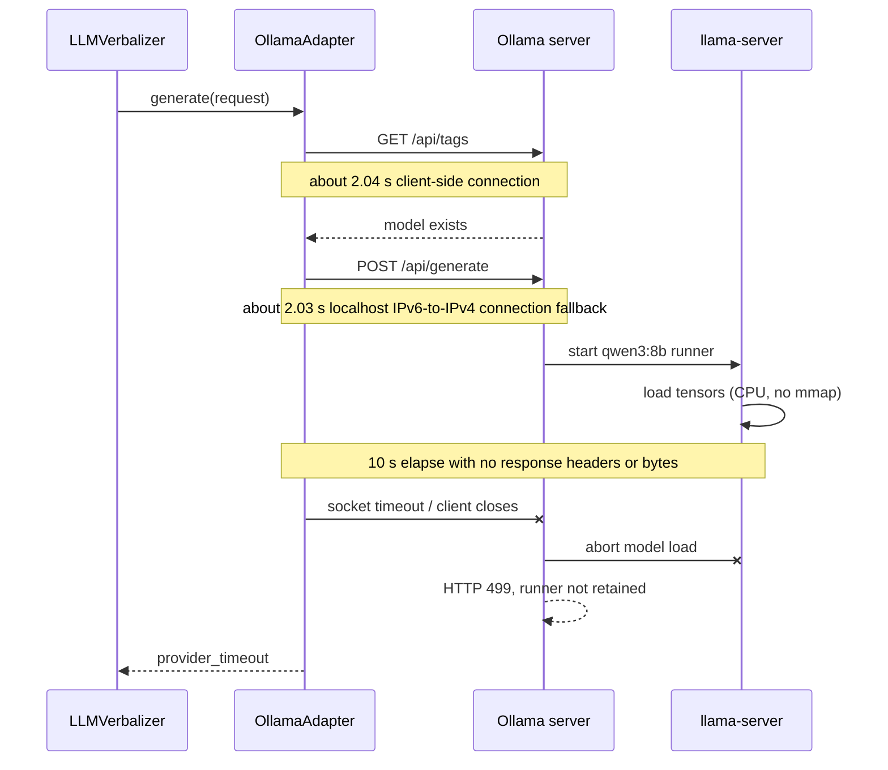

# ACA-202 - LLM Runtime Performance Audit

## 1. Scope and invariants

This audit is passive. It did not change the Runtime, `SemanticAuthority`, conversational contracts, Kernel, Composer, Validator, prompts, benchmarks, tests, provider, model, timeout, fallback behavior, or visible responses.

Temporary in-process instrumentation was limited to timing `VerbalizationBrief` construction, prompt serialization, and HTTP behavior equivalent to `OllamaAdapter`. The repository implementation was not patched for measurement.

Audit configuration:

| Parameter | Effective value |
| --- | --- |
| Provider | `ollama` |
| Host | `http://localhost:11434` |
| Model | `qwen3:8b` (`8.2B`, `Q4_K_M`, 5,225,388,164 bytes) |
| Timeout | `10.0 s` |
| Temperature | `0.2` |
| `num_predict` | `300` |
| `think` | `false` |
| `stream` | `false` |
| `keep_alive` request field | omitted |
| Ollama server default keep-alive | `5m0s` |
| Effective context window used by runner | `4096` (`llama-server -c 4096`) |
| Machine | Ryzen 7 5700G, 8C/16T, 15.4 GiB RAM, integrated Radeon |

## 2. Measurement method

The current prompt was captured from the real public Runtime boundary while replacing only the provider call in memory with an audit-only fallback. This preserved the exact `VerbalizationBrief` and serialized provider request without performing an extra generation.

The HTTP harness then reproduced the adapter protocol:

1. `GET /api/tags`.
2. A new connection to `localhost:11434`.
3. `POST /api/generate` with the exact current body.
4. A 10-second socket timeout, matching `LLMProviderRequest.timeout_seconds`.
5. Measurement of connection, send, response headers/first byte, body read, byte count, and total duration.

Each message was measured five consecutive times. The LLM cache was bypassed only in the external measurement harness so Ollama itself could be measured five times; no Runtime cache behavior was changed.

Raw evidence:

| Artifact | Location |
| --- | --- |
| Exact prompts and preparation timings | `%LOCALAPPDATA%\Temp\ACA-202_Prompt_Captures.json` |
| Ten-run series | `%LOCALAPPDATA%\Temp\ACA-202_Main_Series.json` |
| Prompt variants | `%LOCALAPPDATA%\Temp\ACA-202_Prompt_Variants.json` |
| Process sampling | `%LOCALAPPDATA%\Temp\ACA-202_Process_Sampling.json` |
| Native server evidence | `%LOCALAPPDATA%\Ollama\server.log` and `server-1.log` |

## 3. Preparation

| Message | Brief | Payload projection | JSON serialization | Prompt characters | Prompt bytes | Estimated tokens | HTTP body |
| --- | ---: | ---: | ---: | ---: | ---: | ---: | ---: |
| `Hola` | 0.353 ms | 0.024 ms | 0.038 ms | 3,492 | 3,494 | 873 | 3,741 bytes |
| `No funciona internet.` | 0.358 ms | 0.020 ms | 0.032 ms | 3,537 | 3,537 | 884 | 3,784 bytes |

Token values are explicit estimates using four characters per token. Ollama did not reach prompt evaluation, so it returned no `prompt_eval_count` from which to obtain an actual tokenizer count.

Conclusion: local preparation consumes less than 0.5 ms and is not material to the observed latency.

## 4. HTTP timeline



The host name resolves first to `::1`, where Ollama is not listening. Five direct connection measurements to `localhost` took 2,018-2,098 ms before falling back to `127.0.0.1`. Direct TCP connection to `127.0.0.1` took 0.3-18 ms. This adds visible latency but is not the event that prevents generation: after connection, the server still receives the request and begins loading the model.

## 5. Five consecutive runs per message

All ten requests timed out before response headers or the first byte. All received zero bytes and left `/api/ps` with no loaded model.

| Message | Run | `/api/tags` | POST connect | Send | POST total | First byte | Bytes | Result |
| --- | ---: | ---: | ---: | ---: | ---: | --- | ---: | --- |
| `Hola` | 1 | 2,048.868 ms | 2,031.723 ms | 0.178 ms | 12,032.793 ms | none | 0 | timeout |
| `Hola` | 2 | 2,047.792 ms | 2,028.314 ms | 0.138 ms | 12,027.862 ms | none | 0 | timeout |
| `Hola` | 3 | 2,032.120 ms | 2,018.848 ms | 1.092 ms | 12,029.680 ms | none | 0 | timeout |
| `Hola` | 4 | 2,018.453 ms | 2,020.033 ms | 0.737 ms | 12,028.986 ms | none | 0 | timeout |
| `Hola` | 5 | 2,040.559 ms | 2,009.883 ms | 0.165 ms | 12,012.758 ms | none | 0 | timeout |
| `No funciona internet.` | 1 | 2,043.735 ms | 2,045.980 ms | 0.184 ms | 12,055.262 ms | none | 0 | timeout |
| `No funciona internet.` | 2 | 2,036.255 ms | 2,066.466 ms | 0.294 ms | 12,080.511 ms | none | 0 | timeout |
| `No funciona internet.` | 3 | 2,049.208 ms | 2,030.232 ms | 0.154 ms | 12,047.288 ms | none | 0 | timeout |
| `No funciona internet.` | 4 | 2,047.718 ms | 2,045.535 ms | 0.199 ms | 12,046.773 ms | none | 0 | timeout |
| `No funciona internet.` | 5 | 2,033.639 ms | 2,016.718 ms | 0.540 ms | 12,031.640 ms | none | 0 | timeout |

Summary:

| Message | Mean tag check | Mean POST connection | Mean POST | Approx. adapter total | Success | Warm-up |
| --- | ---: | ---: | ---: | ---: | ---: | --- |
| `Hola` | 2,037.558 ms | 2,021.760 ms | 12,026.416 ms | 14,063.974 ms | 0/5 | none |
| `No funciona internet.` | 2,042.111 ms | 2,040.986 ms | 12,052.295 ms | 14,094.406 ms | 0/5 | none |

There is no warm-up because every timeout cancels the load and removes the runner before it becomes available. The next request is another cold start rather than a warm inference.

## 6. Ollama stage evidence

The server log records the exact failure:

```text
waiting for llama-server to become available status="llm server loading model"
load_tensors: loading model tensors, this can take a while...
CPU model buffer size = 1818.63 MiB
CPU_REPACK model buffer size = 3159.00 MiB
client connection closed before llama-server finished loading, aborting load
Load failed ... error="timed out waiting for llama-server to start: context canceled"
POST "/api/generate" -> 499
```

For every measured request, the failure occurred during model loading. It occurred before prompt evaluation and before token generation. Therefore:

| Response measurement | Observed value |
| --- | --- |
| Response headers | none |
| Time to first byte | not reached within timeout |
| Time to first token | not reached |
| Bytes before timeout | 0 |
| Output tokens | 0 observed |
| Output characters | 0 |
| Transfer time | not started |
| Generation speed | not measurable; generation never started |
| Ollama completion metrics | absent |

## 7. Prompt-size experiment

Only the temporary diagnostic request body was varied. Model, provider, host, timeout, temperature, `num_predict`, `think`, and `stream` remained unchanged.

| Variant | System characters | Estimated total tokens | Body | POST total | Bytes | Stage |
| --- | ---: | ---: | ---: | ---: | ---: | --- |
| Current full prompt | 2,306 | 873 | 3,741 bytes | 12,067.278 ms | 0 | model load / before first byte |
| Current prompt without examples | 1,224 | 602 | 2,659 bytes | 12,034.026 ms | 0 | model load / before first byte |
| Minimal equivalent prompt | 255 | 360 | 1,690 bytes | 12,044.011 ms | 0 | model load / before first byte |

Reducing the request body by 54.8% and the estimated prompt tokens by 58.8% changed total duration by less than 34 ms and did not change the failure stage. The prompt is not the cause of this timeout.

## 8. Expected versus observed

Expected values below are grounded in local direct measurements and historical successful Ollama runs on the same machine, not external estimates.

| Stage | Reasonable local range | Observed | Assessment |
| --- | ---: | ---: | --- |
| Brief construction | under 1 ms | 0.353-0.358 ms | normal |
| Prompt serialization | under 1 ms | 0.032-0.038 ms | normal |
| Local TCP connection | under 20 ms on direct IPv4 | 2,010-2,066 ms through `localhost` | abnormal IPv6 fallback, secondary |
| Request send | under 5 ms | 0.138-1.092 ms | normal |
| Cold model load | historical 8.07-19.85 s; median 12.86 s | still loading at 10 s, then canceled | exceeds timeout |
| Warm complete generation | historical 4.88-15.54 s through p90; median 10.37 s | never reached | unavailable because no successful load |
| Response transfer | milliseconds for this response size | never started | no response existed |

Historical evidence also contains a successful cold request where the runner loaded in 12.62 seconds and the complete request took 30.38 seconds; the next warm request completed in 5.10 seconds. This is the warm-up behavior the current 10-second client timeout prevents.

## 9. Root cause

The single bottleneck is **cold loading `qwen3:8b` on CPU takes longer than the 10-second provider timeout**.

When the timeout expires, `OllamaAdapter` closes the connection. Ollama interprets the disconnect as cancellation, aborts `llama-server` while tensors are still loading, records HTTP 499, and retains no loaded model. Every subsequent request therefore repeats the same cold load. The LLM never reaches prompt evaluation, generation, first token, or transfer.

The two-second IPv6-to-IPv4 connection fallback explains part of the user-visible 10-17 second delay, but it does not explain the fallback itself. Prompt preparation and prompt size are also disproven as primary causes.

## 10. Answers

1. **Where is time consumed?** About two seconds per new `localhost` connection, then the full ten-second response wait while Ollama loads model tensors.
2. **Where does timeout occur?** During model loading, before prompt evaluation and generation.
3. **Is the prompt disproportionately large?** No. It is about 3.5 KB and 873-884 estimated tokens; a 360-token diagnostic failed identically.
4. **Does Qwen3:8B begin responding?** No. It produces neither headers nor first token before cancellation.
5. **Is there warm-up?** No. All 10 attempts cancel loading and leave no resident runner.
6. **How long should stages take?** Local preparation is sub-millisecond; cold loading historically needs 8-20 seconds, and a complete cold request can need about 30 seconds. Warm requests historically center around 10 seconds.
7. **Unique bottleneck:** the timeout is shorter than cold model initialization on this machine, and cancellation prevents warm state from ever being established.

## 11. Single recommendation

**INCREASE_TIMEOUT**

No configuration was changed during this audit. The recommendation is singular because the evidence shows the current deadline cannot accommodate even the model-load stage. Prompt optimization cannot affect a failure that occurs before prompt evaluation, and provider transfer optimization cannot affect a response that is never generated.
