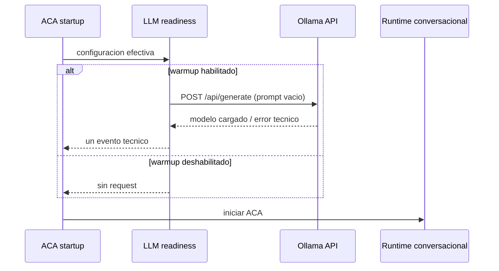

# ACA-203 - LLM Warmup & Runtime Readiness

## 1. Objetivo

ACA-202 demostro que `qwen3:8b` no alcanzaba a completar su carga en frio antes del timeout de 10 segundos. El cliente cerraba la conexion, Ollama abortaba la carga y cada intento siguiente volvia a empezar en frio.

ACA-203 modifica exclusivamente la infraestructura del proveedor LLM local. No cambia razonamiento, decisiones, prompts, validacion, fallback ni respuesta deterministica.

## 2. Cambios

| Cambio | Implementacion |
| --- | --- |
| Timeout por defecto | `LLM_TIMEOUT=60` cuando la variable no existe o es invalida |
| Override | Un `LLM_TIMEOUT` explicito conserva prioridad |
| Keep-alive | `OLLAMA_KEEP_ALIVE`, default `5m` |
| Request conversacional | Agrega solamente `keep_alive` al payload oficial de Ollama |
| Warmup | `OLLAMA_WARMUP_ON_START`, default `false` |
| Protocolo de warmup | `POST /api/generate` con `prompt=""`, `stream=false` y el keep-alive configurado |
| Resiliencia | Cualquier error de warmup se registra y no bloquea el arranque |
| Idempotencia de proceso | Un warmup como maximo por combinacion host/modelo/keep-alive |

No se modificaron `SemanticAuthority`, `ConversationState`, Runtime, Mission, planners, FlowRouter, Kernel, Composer, Validator, Semantic Firewall, Policy, Governance, Ledger, ConversationPlan ni ResponsePlan.

## 3. Configuracion

```powershell
$env:LLM_ENABLED="true"
$env:LLM_PROVIDER="ollama"
$env:OLLAMA_MODEL="qwen3:8b"
$env:OLLAMA_HOST="http://localhost:11434"

# Opcionales
$env:LLM_TIMEOUT="60"
$env:OLLAMA_KEEP_ALIVE="5m"
$env:OLLAMA_WARMUP_ON_START="true"
```

Valores efectivos:

| Variable | Default | Compatibilidad |
| --- | --- | --- |
| `LLM_TIMEOUT` | `60` | Los valores explicitos, por ejemplo `4.5` o `75`, se respetan |
| `OLLAMA_KEEP_ALIVE` | `5m` | Cualquier valor no vacio se envia sin reinterpretarlo |
| `OLLAMA_WARMUP_ON_START` | `false` | Sin opt-in no existe request de warmup ni dependencia de Ollama al arrancar |

## 4. Warmup y frontera cognitiva



El warmup no crea `Event`, no registra mensajes de usuario, no construye `ConversationState`, no ejecuta el pipeline y no produce texto. `tools/aca_web.py` lo solicita antes de abrir el servidor; `build_default_llm_verbalizer` conserva la misma garantia para otros entrypoints. El registro global impide duplicarlo.

Evento tecnico:

```text
llm_runtime_readiness_event.v1
provider
model
timeout_seconds
keep_alive
warmup_requested
warmup_executed
duration_ms
model_loaded
status
failure_reason
timestamp
```

## 5. Evidencia real

### 5.1 Antes: ACA-202

| Medicion | Resultado |
| --- | --- |
| Timeout | 10 s |
| Ejecuciones | 10 |
| Respuestas Ollama | 0 |
| Bytes recibidos | 0 |
| Primer token | nunca |
| Resultado visible | fallback deterministico |
| Causa | carga cancelada antes de completar |

### 5.2 Primer request frio, warmup deshabilitado

Se verifico `/api/ps` vacio antes de ejecutar el turno.

| Campo | Resultado |
| --- | --- |
| Mensaje | `Hola` |
| Timeout efectivo | 60 s |
| Warmup | deshabilitado |
| Latencia del turno | 42,077.861 ms |
| Provider llamado | si |
| Respuesta Ollama | recibida |
| Validator ejecutado | si |
| Checks aprobados | 11/11 |
| Respuesta aceptada | si |
| `fallback_reason` | `null` |
| Programa cognitivo | `greeting`, sin cambios |

Esta prueba demuestra que el nuevo default permite completar carga fria, generacion y validacion sin warmup.

### 5.3 Warmup habilitado

| Campo | Resultado |
| --- | --- |
| Warmup solicitado | si |
| Warmup ejecutado | si, una vez |
| Duracion | 18,804.273 ms |
| Modelo cargado | si |
| Estado | `success` |
| Turno posterior `Hola` | 24,722.353 ms |
| Validator ejecutado | si |
| Checks aprobados | 11/11 |
| Respuesta aceptada | si |
| `fallback_reason` | `null` |

El warmup traslada la carga del modelo al arranque. No pretende optimizar la inferencia posterior; esa latencia queda fuera del alcance de ACA-203.

Artefactos reproducibles:

| Evidencia | Ruta |
| --- | --- |
| Warmup y turno posterior | `%LOCALAPPDATA%\Temp\ACA-203_Real_Ollama_Readiness.json` |
| Primer turno frio sin warmup | `%LOCALAPPDATA%\Temp\ACA-203_Cold_First_Request.json` |

## 6. Tests y benchmarks

| Validacion | Resultado |
| --- | --- |
| Tests focalizados LLM | 32 passed en 1.80 s |
| Suite completa | 710 passed en 849.95 s |
| Benchmark oficial | 98.65%, hash `be7207dee98c0f05ac37362e396c84eaf727a3740219af4fac52ec0ce43b3d70` |
| Benchmark adversarial | accuracy 70.72%, robustness 73.71%, hash `82221920d20febe84b88abb3030262b440ba7057ff4a30bdeb6f7e11bdccf899` |

Los hashes y resultados semanticos permanecen iguales a los anteriores. Los corpus y runners no fueron modificados.

Cobertura agregada:

- default de 60 segundos y override por entorno;
- defaults y overrides de keep-alive y warmup;
- presencia de `keep_alive` en el request conversacional;
- payload de warmup con prompt vacio;
- warmup unico por proceso;
- evento tecnico de readiness;
- fallo de warmup no bloqueante.

## 7. Compatibilidad y conclusion

El modo deterministico continua siendo el default porque `LLM_ENABLED=false` y `OLLAMA_WARMUP_ON_START=false`. OpenAI y providers registrados conservan el mismo contrato. El fallback y el Validator no cambiaron.

ACA puede ahora completar su primer request local en frio con la configuracion por defecto de timeout, y puede opcionalmente precargar Ollama al iniciar. Por primera vez en esta configuracion, la respuesta del provider llega al Validator y puede convertirse en la respuesta visible sin caer en `provider_timeout`.
