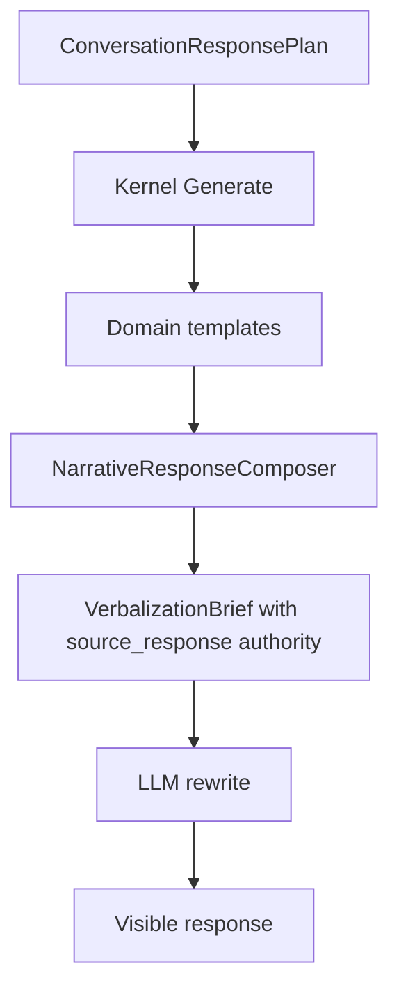
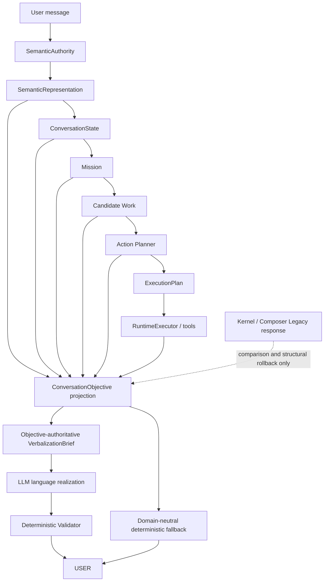

# ACA-300 - Conversational First Architecture

Status: controlled implementation with complete Legacy rollback  
Date: 2026-07-15  
Visible behavior by default: unchanged  
Activation: `ACA_CONVERSATIONAL_FIRST_ENABLED=true`

## 1. Decision

ACA adopts **Conversational First** as its target output architecture:

> ACA understands and decides through structured Runtime contracts. The LLM is
> the only component authorized to write the visible natural-language response.

This decision does not make the LLM a cognitive or operational authority. The
LLM cannot select an intent, mission, work item, operation, tool, permission,
case state, policy result or execution result.

The first implementation is deliberately reversible. The existing Kernel and
Composer response remains available as a complete Legacy candidate, but it is
not the content authority when Conversational First mode is active. Physical
removal of the Legacy templates is deferred until production comparison proves
that rollback is no longer needed.

The mode is opt-in in this release. ACA-200 found 30 post-firewall text reads,
16 critical reads and only partial SemanticAuthority promotion. A live Galicia
Runtime probe also projected `Quiero dar de baja internet` as
`restore_connectivity`, although the semantic goal preserved the explicit user
outcome. Making the new path the unconditional default would therefore promote
more semantic authority than the current evidence permits.

## 2. Problem Confirmed

Before ACA-300, the visible response had this content-authority chain:



The LLM could change form but not content. A wrong Kernel template was therefore
preserved faithfully. The failure was not transport, Studio, Provider or
Validator replacement; the response content was already contaminated before
the LLM boundary.

## 3. Target Architecture



The current implementation places `ConversationObjective` at the output
boundary because all upstream decisions already exist there. It does not add a
planner and does not recalculate meaning.

## 4. ConversationObjective Contract

`ConversationObjective` is immutable and contains no response text, template,
question or user-message excerpt.

```yaml
contract: conversation_objective.v1
goal:
  type: cancel_service
  priority: 1
  confidence: 0.95
  source: semantic_authority
missing_information:
  - account_holder
next_step:
  action: request_information
  target: account_holder
  operation: null
  question_budget: 1
empathy: light
tone: friendly_professional
urgency: normal
constraints:
  - no_unverified_facts
  - no_unapproved_operations
  - no_unexecuted_tool_claims
  - respect_policy
  - preserve_cognitive_opacity
conversation_mode: natural
emoji: allowed
```

The contract is a projection, not a new source of truth. It consumes:

* SemanticRepresentation and SemanticProjection;
* ConversationalGoal and ConversationResponsePlan;
* ConversationPlan and current ConversationState lifecycle;
* ExecutionPlan and authoritative Candidate Work, when available;
* Policy and Governance constraints;
* Runtime tool outcomes.

It never receives `event.payload` and never performs lexical matching.

## 5. Authority Boundaries

| Decision | Authority after ACA-300 |
| --- | --- |
| Semantic meaning | SemanticAuthority, subject to the existing controlled promotion state |
| Persistent conversation lifecycle | ConversationState |
| Mission | MissionManager |
| Operational work | Candidate Work producer / operational contracts |
| Action and flow | ActionPlanner and FlowRouter |
| Execution | RuntimeExecutor |
| Safety veto | Policy and Governance |
| Tool effects | ToolExecutionContract and Tool implementation |
| What the response must accomplish | ConversationObjective projection |
| Visible wording | LLMVerbalizer |
| Output safety validation | DeterministicVerbalizationValidator |
| Provider failure fallback | ObjectiveDeterministicRealizer |

### Candidate Work clarification

Candidate Work must **not** be derived from `ConversationObjective`. Doing so
would make a conversational projection the parent of an operational decision
and create the cycle `Candidate Work -> ConversationObjective -> Candidate
Work`. Candidate Work should derive from authorized semantic goals, mission,
case evidence and available capabilities. ConversationObjective then expresses
the already-selected work in language-realization terms.

## 6. Runtime Integration

The Runtime change is transport-only. The turn-scoped SemanticRepresentation
and SemanticProjection are passed through `runtime_context` to the output
handler. They are not persisted into ConversationState and do not change intent,
mission, planning, policy, execution or tools.

In Conversational First mode the output handler performs this atomic selection:

1. Produce the complete Legacy narrative candidate for comparison.
2. Project one immutable ConversationObjective from structured contracts.
3. Validate that the objective has a goal and supported next-step action.
4. Select the objective as the sole output-content authority.
5. Build a brief without `source_response`.
6. Ask the LLM to realize the objective.
7. Validate the candidate deterministically.
8. Use the objective-derived deterministic fallback on provider or validation
   failure.
9. Roll back to the complete Legacy candidate only when objective construction
   itself fails.

No field-level merge between Legacy and objective authority is allowed.

## 7. LLM Brief

The objective-authoritative prompt contains:

* ConversationObjective;
* bounded SemanticRepresentation evidence;
* summarized conversation context;
* authoritative Candidate Work and Case State, when available;
* selected operation and execution evidence;
* Policy and Governance constraints;
* confirmed facts and information keys still missing;
* language, tone and style;
* a deterministic question budget.

It does not contain `source_response`, a domain template or a hardcoded
question. The deterministic response remains private fallback material used by
the Validator, not prompt authority.

The LLM may choose wording, order, empathy, transitions, greeting, closing and
syntactic form. It cannot add facts, operations, tools, permissions, results or
questions outside the objective.

## 8. Deterministic Fallback

`ObjectiveDeterministicRealizer` is provider-independent and domain-neutral. It
uses only goal type, next-step action, missing-information identifiers and
constraints. It contains no insurance, telecom, billing or claim templates.

Provider unavailable, timeout, network failure or Validator rejection returns
this objective-derived fallback. A malformed objective is the only condition
that triggers complete Legacy rollback.

## 9. Legacy Comparison And Rollback

Each output trace records:

* objective and projection hash;
* Legacy response;
* objective-derived fallback;
* selected authority mode;
* authority reason;
* rollback reason;
* selected visible response;
* response equality;
* LLM candidate, validation and fallback reason.

The relevant modes are:

* `legacy_response`: existing output path;
* `conversation_objective`: new content authority;
* `legacy_response` with rollback reason: atomic objective-construction failure.

Rollback requires only disabling `ACA_CONVERSATIONAL_FIRST_ENABLED`; no Runtime,
plugin, policy, tool or state migration is required.

## 10. Kernel And Composer Status

When Conversational First mode is active:

* Kernel output is a Legacy comparison candidate, not visible-content authority;
* NarrativeResponseComposer may transform that Legacy candidate for comparison,
  but it does not feed the objective-authoritative prompt;
* no domain template reaches the LLM brief;
* no downstream component reinterprets the user message for output.

The domain templates remain physically present solely to satisfy complete
rollback and before/after comparison. Their deletion is a retirement step, not
part of the authority cutover. Deleting them in this release would contradict
the requested rollback guarantee.

## 11. Compatibility

Unchanged components:

* ConversationState;
* MissionManager;
* Candidate Work;
* ActionPlanner and FlowRouter;
* RuntimeExecutor behavior;
* Policy and Governance decisions;
* Ledger and Tool Contracts;
* SemanticAuthority extraction;
* NarrativeResponseComposer rules;
* DeterministicVerbalizationValidator;
* provider adapters;
* public endpoint and Studio contracts.

Legacy mode remains the default until promotion gates are met. Existing tests
and visible responses therefore remain stable without configuration changes.

## 12. Benchmark

`aca_conversational_first_benchmark_v1.json` covers:

* free greeting;
* casual conversation;
* emotional acknowledgement;
* service cancellation;
* invoice explanation;
* connectivity failure;
* justified information request;
* document sharing;
* natural closing.

Every scenario compares the Legacy response, structured objective,
objective-derived fallback, acceptable natural candidate and forbidden domain
contamination. Metrics include objective validity, Validator acceptance,
contamination absence, Legacy replacement and question-budget accuracy.

Initial controlled result:

| Metric | Result |
| --- | ---: |
| Scenarios | 9 |
| Objective validity | 100% |
| Candidate acceptance | 100% |
| Domain contamination absence | 100% |
| Legacy replacement | 100% |
| Question-budget accuracy | 100% |

## 13. Before And After

| Turn | Legacy candidate | Conversational First candidate |
| --- | --- | --- |
| `Hola` | `Hola. Contame qué necesitás y te oriento.` | `¡Hola! ¿Cómo puedo ayudarte hoy?` |
| `Quiero dar de baja internet.` | `Qué punto querés resolver primero: el arreglo, la denuncia, la documentación o los tiempos?` | `Entiendo, querés dar de baja el servicio de internet. Puedo ayudarte a revisar cómo seguir.` |
| `No funciona internet.` | `¿Tenés toda la documentación?` | `Entiendo, te quedaste sin internet. Veamos qué está pasando con el servicio.` |
| `Gracias por ayudarme ❤️` | `Avancemos con el trámite.` | `¡De nada! Me alegra haberte ayudado ❤️` |

These are benchmark candidates, not hardcoded production responses.

## 14. Incremental Migration Plan

### Stage 1 - Output authority pilot (implemented)

* immutable ConversationObjective;
* objective-authoritative LLM brief;
* domain-neutral fallback;
* semantic context transport;
* Legacy comparison and atomic rollback;
* opt-in activation and benchmark.

Promotion gate: real Studio conversations show no critical semantic or safety
regression and objective construction succeeds on at least 99.5% of turns.

### Stage 2 - Structured objective quality

* measure objective agreement against human-labelled conversation goals;
* measure question selection and no-question behavior;
* resolve only evidenced SemanticAuthority/mission mismatches;
* keep Kernel and Composer Legacy comparison active.

Promotion gate: no HIGH/CRITICAL objective-authority divergence and no Policy,
Governance or Tool outcome mismatch.

### Stage 3 - Default promotion

* enable Conversational First by default;
* retain per-turn structural rollback;
* monitor provider fallback and objective fallback separately;
* keep deterministic operation and safety layers unchanged.

Promotion gate: conversation benchmark, official semantic benchmark,
adversarial benchmark and full suite remain within declared thresholds.

### Stage 4 - Legacy retirement

* remove Kernel domain-response templates;
* reduce NarrativeResponseComposer to structured result organization;
* remove Legacy response comparison only after its rollback window expires;
* update the Semantic Firewall and Authority Graph from current code.

This final stage is the point at which physical template deletion becomes safe.

## 15. Risks And Limits

1. SemanticAuthority is not yet the sole effective authority for every upstream
   consumer. Conversational First must not silently hide incorrect intent,
   mission or work selection.
2. A natural LLM can still produce an unsafe candidate; deterministic validation
   remains mandatory and cannot be bypassed.
3. Semantic segments contain source spans. They are authorized grounding, not a
   license for the LLM to select a new goal.
4. Legacy and official validation executions currently share the output-handler
   registry. Provider cache and comparison telemetry must be watched during
   production promotion.
5. The generic deterministic fallback is intentionally less expressive than an
   LLM response. Reliability takes precedence over domain improvisation.

## 16. Acceptance Assessment

The architecture and first reversible integration are complete. The global
cutover is **not** declared complete because current repository evidence does
not support unconditional SemanticAuthority promotion. ACA-300 establishes the
correct authority boundary without pretending that the remaining Semantic
Firewall work has already happened.

This is the smallest implementation that simultaneously:

* removes Kernel/Composer templates from the new official prompt path;
* gives the LLM sole wording authority;
* preserves Runtime, Governance, Policy, tools and Ledger;
* provides a domain-neutral deterministic fallback;
* supports exact Legacy comparison and one-switch rollback;
* avoids adding a planner or a second cognitive authority.

## 17. Verification

| Verification | Result |
| --- | ---: |
| Conversational First focused tests | 8 passed |
| Runtime/output integration selection | passed |
| Conversational First benchmark | 9/9 scenarios, all metrics 100% |
| Official semantic benchmark | 98.65%, unchanged |
| Adversarial semantic accuracy | 70.72%, unchanged |
| Adversarial semantic robustness | 73.71%, unchanged |
| Complete repository suite | 720 passed in 913.82 seconds |

No provider network call is required by the new regression suite. LLM behavior
is exercised through the existing provider adapter boundary with deterministic
fixtures; provider availability and timeout continue to use the validated
fallback path.

## 18. Implementation Map

| File | Responsibility |
| --- | --- |
| `aca_os/conversation_objective.py` | immutable objective, structured projector, context summaries and deterministic fallback |
| `aca_os/step_handlers.py` | atomic output-authority selection, comparison, rollback and telemetry |
| `aca_os/llm_verbalization.py` | objective-authoritative brief and provider instructions without `source_response` |
| `aca_os/runtime.py` | turn-scoped, read-only semantic context transport to the output boundary |
| `aca_os/conversational_first_evaluation.py` | permanent controlled benchmark runner |
| `benchmarks/conversations/aca_conversational_first_benchmark_v1.json` | nine free-conversation and service scenarios |
| `tools/run_conversational_first_benchmark.py` | reproducible CLI runner |
| `tests/test_conversational_first_architecture.py` | objective, authority, fallback, rollback, Runtime transport and benchmark regression coverage |
