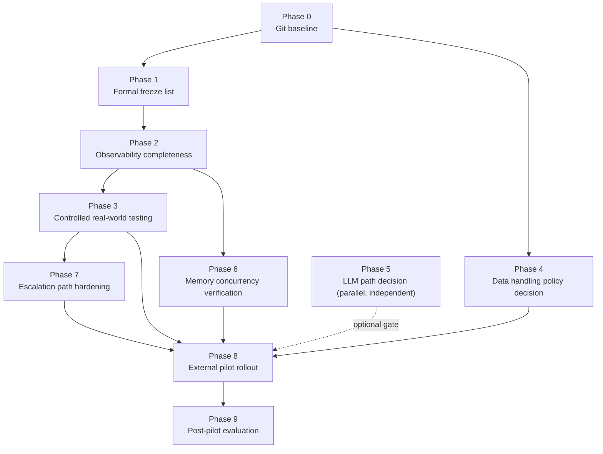

# ACA-302 - Real-World Testing Roadmap

Status: Architecture review only
Scope: Phase-by-phase technical roadmap from the current Runtime to a first version usable by real external users, executing ACA-200's `START_REAL_WORLD_TESTING` recommendation
Runtime impact: none
Code impact: none
Depends on: ACA-200 (Core Readiness Audit), ACA-104 (FW-11 resolution), ACA-301 (Operational Work Model second reassessment), ACA-202 through ACA-207 (LLM readiness and Composer decision audits), ACA-300 (Conversational-First)

## 0. Mandate and Constraint

The requester has accepted ACA-200's recommendation (`START_REAL_WORLD_TESTING`)
over reopening the Operational Work Model (ACA-301). This document designs the
path to that goal without inventing new architecture. Every phase below reuses
an existing component unless explicitly marked **NEW** with a justification
for why nothing existing can serve the purpose. No code is proposed or
written here.

## 1. Current Real State of the Runtime

This section restates ACA-200's classification, re-verified where this
session did its own independent work (FW-11), and does not re-litigate it.
Nothing material has changed since ACA-200 except the FW-11 collapse
(ACA-104), which removed one duplicate writer without touching decision
authority.

### 1.1 What is live and stable (safe to build a pilot on top of)

| Component | Status | Why it can be trusted for a pilot |
| --- | --- | --- |
| Kernel execution loop | STABLE | Operation contracts and execution order coherent (ACA-200 §5) |
| `ActionPlanner`, `FlowRouter`, `ExecutionPlan` | STABLE | No text access, no state mutation, structured input only |
| `RuntimeExecutor` + step handlers | STABLE | Official plan-driven executor; Legacy validation runs alongside, not instead |
| `PolicyManager` | Independent veto authority (TRANSITIONAL input, STABLE authority role) | Escalates rather than invents; the one mechanism already proven to stop unsafe claims (`plugins/galicia.insurance` blocks claim-status lookup, document upload, rep transfer) |
| `NarrativeResponseComposer` | STABLE | Output-only transform; the ACA-206/207 defect (slot reinterpretation) is already fixed and regression-tested |
| `LLMVerbalizer` + validator | STABLE architecture, NOT latency-ready | Never an authority (ACA-204 proved no silent replacement either direction); see §1.3 for why it should stay off by default |
| `ToolExecutionContract` / `ToolEngine` | STABLE | Independent safety boundary already used by `RuntimeExecutor`; `HandoffPackageAdapter` is the one proven real-effect, reversible, idempotent write |
| Semantic Authority pilot (`ConversationalAct` greeting only, `ConversationalGoal` with parity gate) | TRANSITIONAL, but atomic and rollback-proven | Deliberately narrow; does not need to widen for a pilot |

### 1.2 What is explicitly frozen (do not touch for this roadmap)

Per ACA-200 §13 and reaffirmed by ACA-301: do not continue the Semantic
Firewall, do not begin a `ConversationState` restructuring, do not reopen the
Operational Work Model. Reasons, restated because they bound every phase
below:

- 26 firewall violations remain (post-FW-11), 12 still `BLOCKER` severity, and
  every one of ACA-033's originally-flagged critical violations is still
  present (ACA-200 §8, verified consistent after ACA-104).
- `ConversationState` is 6,787 LOC, is still the highest-risk hotspot, and
  still hosts active Legacy interpretation and (for the artifacts FW-11 did
  not touch) duplicate planning.
- SemanticAuthority scores 98.65% official / 70.72% adversarial — not safe to
  broaden.

### 1.3 What is shadow-only (must not be promoted by this roadmap)

| Component | Live caller today | Status |
| --- | --- | --- |
| `operational_work_mapper.py` (Candidate Work) | `evaluation.py` only | SHADOW |
| `operational_governance_gate.py` | `evaluation.py` only | SHADOW |
| `operational_audit_ledger.py` | `evaluation.py` only | SHADOW |
| Conversational-First (`ACA_CONVERSATIONAL_FIRST_ENABLED`) | opt-in, off by default | Deliberately reversible per ACA-300 |

This roadmap does not change any of these. Real-world testing is explicitly
about validating the *current official path*, not about promoting shadow
components early because a pilot creates pressure to show more capability.

### 1.4 What ACA-205/206/207 already proved about the actual quality problem

This is the single most load-bearing piece of evidence for this roadmap's
sequencing. A black-box audit compared `SOURCE_RESPONSE` (deterministic,
pre-LLM) against `VISIBLE_RESPONSE` (post-LLM) across a real multi-turn
conversation and found:

- the LLM never invents content — it only restyles;
- when the visible response was wrong (asking about insurance-claim
  documentation after the user asked to cancel an internet service), the
  error was already present in `SOURCE_RESPONSE`, before the LLM boundary;
- the root cause (a lexical fallback rule in
  `NarrativeResponseComposer` matching the word "documentacion" inside an
  unrelated question) was found and fixed in one session (ACA-206/207), with
  a regression test added.

A second, independent probe (ACA-300 §1) found the live Galicia Runtime
projecting `"Quiero dar de baja internet"` as intent `restore_connectivity`
— the wrong domain branch entirely.

**Conclusion this roadmap acts on:** the defects blocking real conversations
today live in the deterministic routing/composition layer, not in the LLM.
Fixing them does not require LLM latency work, and LLM latency work would not
fix them. These are independent tracks and must not be scheduled as if one
blocks the other.

## 2. Dependencies That Block Production Today

| Dependency | Current state | Blocks what |
| --- | --- | --- |
| Git reproducibility | 8 modified, 52+ untracked files in the working tree (unchanged in kind since ACA-200, growing since ACA-104/301/302) | Cannot roll forward or back to a known-good state; cannot say what shipped |
| Component registry completeness | 17 registered components; omits `SemanticAuthority`, `SemanticProjector`, both selectors, `RuntimeExecutor`, `LegacyRuntimeExecutor`, step handlers, Kernel, Composer, LLM providers (ACA-200 §12.4) | Studio/introspection cannot prove which authority produced a given real-world response — makes real-world defect triage unreliable |
| Authority Graph label drift | Generator still labels `ConversationalGoal` authority as `legacy`; runtime dynamically selects `semantic` (ACA-200 §9.3) | Same class of problem: promotion/rollback decisions read from stale metadata |
| LLM latency | 60s timeout now succeeds (ACA-203), but cold load measured 12-42s and historical warm p90 ≈ 10s on local CPU Ollama | Any user-facing latency budget under ~10-40s; blocks LLM-on-by-default for a pilot, does not block a deterministic-only pilot |
| Memory persistence concurrency | `JsonMemoryStore` does whole-file read-modify-write with no visible locking | Concurrent writers to the *same* conversation (double submit, multi-tab) risk silent data loss; not yet verified against the actual hosting process/thread model |
| Data handling policy | RC1 explicitly excludes "authentication / authorization" and does not address PII/retention anywhere in the documentation set read for this roadmap | Real users means real personal data (vehicle damage, injury, personal identifying information in a live insurance-adjacent domain); this is an organizational decision, not a missing component, but it gates opening any real external surface |
| Public exposure surface | The only hosted target (Render) is documented as a demo: `"External AI dependency: none"`, `"Non-goals: ... production SLA"` (`docs/PUBLIC_DEMO_RELEASE_CANDIDATE.md`) | There is currently no distinction between "the public demo URL" and "a real pilot surface"; opening the existing public URL to real users conflates the two |
| Legacy double execution | `RuntimeExecutor` + `LegacyRuntimeExecutor` run in parallel on every official flow for validation | Roughly doubles compute cost per turn; acceptable at pilot volume, a real scaling concern beyond it |

## 3. Roadmap

Each phase states: goal, what it reuses, what (if anything) is new,
prerequisites, acceptance criteria, risks, and complexity (`XS`/`S`/`M`/`L`,
relative to this codebase's own recent work — `S` ≈ the FW-11 collapse,
`M` ≈ the ACA-104-plus-test-suite-repair scope, `L` ≈ a multi-week effort).

### Phase 0 — Git Reproducibility Baseline

**Goal:** make the audited architecture match a real, committable Git state.

**Reuses:** nothing technical; this is a source-control housekeeping step.
**New:** nothing.

**Prerequisites:** none. This is the first thing to do.

**Acceptance criteria:**
- The working tree's intended state (or a deliberate subset) is committed.
- `git status` is clean, or every remaining diff is a conscious, documented
  exception.

**Risks:** none technical. The only risk is *not* doing this — it is the
single risk independently flagged three times in this repository's own
history (the original repository audit, ACA-200 §14, and implicitly by
ACA-104/301/302 adding to the same untracked pile).

**Complexity:** XS. This is a decision and a commit, not engineering.

**Dependencies:** blocks every later phase's ability to say "this is what we
tested" and "this is what we can roll back to."

### Phase 1 — Formal Freeze List

**Goal:** turn ACA-200 §13's partial freeze into an explicit, checkable rule
so real-world testing does not accidentally motivate touching a frozen
component under time pressure.

**Reuses:** the existing `PROHIBITED_COMPONENTS` pattern already used by
`select_first_eligible_migration_package` (`aca_os/semantic_firewall_plan.py`,
exercised by `tests/test_semantic_firewall_first_migration.py`) — this
repository already has a working mechanism for "these components may not be
selected for migration," it only needs to be pointed at this roadmap's scope.

**New:** nothing structural. Possibly a short, explicit list document (not a
new component) naming: frozen-stable (§1.1), frozen-do-not-touch (§1.2),
frozen-shadow (§1.3).

**Prerequisites:** Phase 0 (so the freeze applies to a committed baseline).

**Acceptance criteria:** the three lists in §1.1-1.3 of this document are the
agreed scope; any deviation requires a new, explicit ADR (matching this
project's own established discipline, e.g. ACA-104, ACA-301).

**Risks:** low. The main risk is the list becoming stale if not revisited
after Phase 3 produces findings — mitigate by treating it as versioned with
this document, not permanent.

**Complexity:** XS.

**Dependencies:** gates nothing technically, but is the governance backbone
for Phases 3 and 8, where the temptation to "just widen Semantic Authority a
little" or "just wire in Candidate Work" will be highest.

### Phase 2 — Observability Completeness

**Goal:** close the two concrete observability gaps ACA-200 identified before
using observability to judge real conversations, otherwise Phase 3's findings
will be exactly as unreliable as ACA-017/018's overclaimed status was before
ACA-024 corrected it.

**Reuses:** `component_registry.py` (`ComponentRegistry`,
`build_registry_from_runtime`), `authority_dependency_graph.py`, existing
`MetricsEngine`/`ExecutionTrace`/`RuntimeIntrospectionAPI`. All the
primitives needed already exist; they are simply incomplete or stale.

**New:** nothing. This is registration and a metadata correction, not new
architecture.

**Concrete targets (from ACA-200, re-verified applicable):**
1. Register `SemanticAuthority`, `SemanticProjector`, both authority
   selectors, `RuntimeExecutor`, `LegacyRuntimeExecutor`, step handlers,
   Kernel, Composer, and LLM providers in the component registry (currently
   17 components registered, omitting all of these).
2. Correct the Authority Graph generator's stale `ConversationalGoal`
   authority label (`legacy` in the static generator vs. `semantic` observed
   dynamically at `semantic_authority_pilot.py:239-243`).

**Prerequisites:** Phase 0, Phase 1.

**Acceptance criteria:**
- `RuntimeIntrospectionAPI`'s component inventory reflects every component
  that can execute in an official turn.
- The Authority Graph's static labels match dynamically observed authority
  for at least `ConversationalAct` and `ConversationalGoal`.
- No visible response, benchmark score, or test changes as a result (this
  phase is pure observability, matching the "audit-only, no behavior change"
  discipline used throughout ACA-1xx/2xx).

**Risks:** low; the main risk is scope creep into "fix what the registry
reveals" instead of "make the registry accurate." Keep those separate.

**Complexity:** S.

**Dependencies:** blocks Phase 3 — running real conversations before this is
done means findings cannot be reliably attributed to a specific authority.

### Phase 3 — Controlled Real-World Testing (ACA-200's core recommendation)

**Goal:** execute `START_REAL_WORLD_TESTING` as ACA-200 defined it: real,
messy, multi-turn conversations through the official Studio/Runtime path,
instrumented, to find where `SemanticRepresentation` is correct but the final
decision is wrong.

**Reuses:** the official Studio/Runtime path exactly as it exists; `Execution
Trace`; the exact methodology ACA-205/206/207 already used once, manually,
successfully (probe a real conversation → diff source vs. LLM vs. visible →
find root cause → fix narrowly → add a regression test). This phase
industrializes that methodology rather than inventing a new one.

**New:** nothing architectural. Operationally, this phase needs a
non-production surface to run real conversations against — see Phase 8 for
why that should not be the existing public demo URL. Running Phase 3
internally (team + trusted testers, not yet "real external users") does not
require any new surface at all; it can run against Studio locally or on the
existing Render demo target used as an internal testing environment.

**Process (not new tooling, a discipline):**
1. Collect real, unscripted, multi-turn conversations (not synthetic
   benchmark scenarios) from a small internal/trusted group.
2. Capture full `ExecutionTrace` per conversation via already-existing
   introspection.
3. Review each conversation for cases where the visible response is wrong,
   using the ACA-205 method: is `SemanticRepresentation` correct? Is the
   deterministic decision correct? Is `VISIBLE_RESPONSE` faithful to the
   decision? This localizes each defect to exactly one layer.
4. Fix each confirmed defect with the narrowest possible change (ACA-207 is
   the template: one wrong condition, one line removed, one regression test
   added) — never a broad refactor, never a Semantic Firewall promotion,
   never a `ConversationState` restructuring (Phase 1's freeze list applies
   here specifically).
5. Re-run the full suite and relevant benchmarks after each fix (the standard
   already established by every ACA-1xx/2xx document, including this
   session's own ACA-104 work).

**Prerequisites:** Phase 0, Phase 1, Phase 2.

**Acceptance criteria:**
- A defined minimum volume of real conversations reviewed (a number should be
  set by whoever runs this phase; ACA-200's own dynamic evidence used only 2
  turns and still found a routing failure, so even a modest volume is likely
  to be informative).
- Every confirmed defect is triaged, fixed narrowly, and regression-tested,
  or explicitly deferred with a documented reason.
- Zero unsafe responses observed (false claims of completed real-world
  action, policy bypass, invented case status) — this is a hard gate, not a
  target.
- Full test suite and existing benchmarks remain green after each fix batch.

**Risks:**
- **Scope creep into a Semantic Firewall package or ConversationState
  change** — the most likely failure mode, because several real defects
  (like the `restore_connectivity` misrouting) will look like they call for
  broader semantic promotion. Mitigation: Phase 1's freeze list, enforced
  explicitly per fix.
- **False confidence from a small sample** — ACA-200 itself notes that two
  turns already exposed a meaningful failure static benchmarks missed; the
  inverse risk is declaring readiness from too few reviewed conversations.
  Mitigation: define the minimum volume before starting, not after seeing
  encouraging early results.

**Complexity:** M-L, mostly in reviewer time rather than engineering; each
individual fix should be S (matching the ACA-207 precedent), but the volume
of conversations to review is the real cost driver.

**Dependencies:** the direct implementation of ACA-200's recommendation; feeds
Phase 7 (which defects should escalate rather than be fixed) and Phase 8
(go/no-go evidence).

### Phase 4 — Data Handling and Access Policy Decision

**Goal:** make an explicit decision about what real users' data means for
this system before any real external user is exposed to it. This is a
decision phase, not an engineering phase — it exists in this roadmap because
skipping it silently is itself a decision, and the wrong one.

**Reuses:** nothing technical yet; this phase produces a policy, which later
phases (6, 8) then implement narrowly.

**New:** a written data-handling decision (retention period for `.aca/*`
conversation files, who can access Studio and under what auth, whether real
conversations collected in Phase 3/8 are themselves retained and for how
long). This is documentation and a decision, not a component.

**Why this belongs in the roadmap:** the domain (Galicia, auto/property
insurance) means real conversations will contain vehicle damage descriptions,
injury information, and personal identifying data. RC1 explicitly excludes
authentication/authorization and no document reviewed for this roadmap
addresses retention or access control for `.aca/` state. Silence on this is
not neutral once real external users are involved.

**Prerequisites:** Phase 0.

**Acceptance criteria:** an explicit, written answer exists for: what is
logged, how long it is kept, who can read Studio/trace output, and whether
that matches whatever legal/compliance constraints apply to the pilot's
jurisdiction and domain. This roadmap does not attempt to answer these
questions itself — they are organizational, not architectural.

**Risks:** treating this as optional or deferrable is the risk. It is
schedulable in parallel with Phases 1-3 (it does not block internal testing)
but must complete before Phase 8.

**Complexity:** XS technically, but potentially L organizationally — outside
this document's scope to estimate.

**Dependencies:** hard-blocks Phase 8. Does not block Phases 1-3, 5-7.

### Phase 5 — LLM Verbalization Path Decision (parallel, independent track)

**Goal:** decide, separately from response-quality work, whether and how LLM
verbalization participates in the first real-user release.

**Reuses:** `LLMVerbalizer`, the provider adapter architecture, the
already-implemented timeout/warmup fix (ACA-203).

**New:** nothing architectural. Possibly a different LLM hosting choice
(cloud/GPU-backed provider instead of local CPU Ollama), which is an
infrastructure decision using the existing pluggable provider architecture
(`LLMProviderFactory`), not a new component.

**Recommendation carried into Phase 8:** ship the first real-user release
with `LLM_ENABLED=false` (deterministic Composer output only). Justification:

1. §1.4 already established the LLM is not the source of the quality
   problems found so far — fixing routing/composition (Phase 3) improves the
   response whether or not the LLM is on.
2. Local CPU cold-load latency (12-42s measured, historical warm p90 ≈ 10s)
   is not acceptable for a live user waiting for a reply, and no work in this
   roadmap changes that number — it requires different hosting, which is an
   infrastructure decision independent of this roadmap's scope.
3. The deterministic-only path is exactly what is already validated by the
   RC1 smoke gate and the existing hosted public demo (`"External AI
   dependency: none"`), so choosing it for the first release adds zero new
   failure surface.
4. This does not abandon Conversational-First (ACA-300) — it stays exactly
   what ACA-300 already designed it to be: opt-in, reversible, promoted later
   once its own real-world evidence and a viable latency budget both exist.

**Prerequisites:** none technically; can run in parallel with Phases 1-3.

**Acceptance criteria:** an explicit decision recorded (this document
recommends `LLM_ENABLED=false` for Phase 8's first release) rather than
defaulting into whatever the environment happens to have configured.

**Risks:** the risk is not technical, it is process — silently shipping with
`LLM_ENABLED=true` because it happens to be set in some environment, without
this decision having been made deliberately.

**Complexity:** XS for the decision as scoped here; a future faster-LLM
migration is out of scope for this roadmap and would be its own ADR.

**Dependencies:** optionally gates Phase 8 (a stricter reading of this
roadmap would make the Phase 5 decision a hard prerequisite for Phase 8,
since shipping without deciding is itself the risk being mitigated).

### Phase 6 — Memory and Concurrency Verification

**Goal:** confirm the existing `JsonMemoryStore` is safe for the pilot's
actual concurrency profile, without building new persistence.

**Reuses:** `JsonMemoryStore`, `MemoryEngine`, the existing per-conversation
file model.

**New:** nothing, unless verification finds a real problem at the pilot's
expected scale — in which case the minimal fix (e.g., a file lock around
read-modify-write, or serializing writes per `conversation_id`) should be
scoped as its own follow-up, not pre-built speculatively here.

**Prerequisites:** Phase 2 (so any concurrency issue found is measured with
working observability).

**Acceptance criteria:**
- The hosting process/thread model for the pilot surface is confirmed (single
  process/thread vs. multiple workers).
- If single-writer-per-conversation is not naturally guaranteed by that
  model, either a documented low-concurrency constraint is accepted for the
  first pilot, or a minimal, scoped fix is identified (not built by this
  roadmap).

**Risks:** silent data loss or corrupted conversation state under concurrent
access to the same conversation (double-submit, multiple tabs) if left
unverified.

**Complexity:** XS to verify; S if a minimal fix turns out to be needed.

**Dependencies:** blocks Phase 8 only if verification finds a real gap at
expected pilot scale.

### Phase 7 — Escalation Path Hardening

**Goal:** make the existing handoff mechanism the pilot's explicit safety
valve for anything ACA should not answer deterministically.

**Reuses:** `prepare_handoff` → `handoff_package` (already the one proven
real-effect, reversible, idempotent operation in the system), the existing
`blocked_capabilities` pattern already declared in
`plugins/galicia.insurance/manifest.yaml`, `PolicyManager`'s escalation
short-circuit (ADR-0016).

**New:** nothing architectural — this phase is validation and possibly
extending existing operational/handoff benchmark scenarios to cover cases
Phase 3 surfaces, not new capability.

**Prerequisites:** Phase 3 (to know what real conversations actually need to
escalate on, rather than guessing).

**Acceptance criteria:**
- Every category of request the pilot cannot safely handle (per Phase 3
  findings and the domain's already-declared `blocked_capabilities`) routes
  to `prepare_handoff` or an equivalent existing escalation, not to a
  best-effort deterministic guess.
- No response claims a real-world outcome (claim status, approval,
  completion) without a corresponding real receipt — already the codebase's
  own stated principle, being verified here rather than re-invented.

**Risks:** under-escalating (ACA answers something it shouldn't) is a safety
risk; over-escalating (ACA hands off things it could safely answer) degrades
the pilot's usefulness. Both are tuning questions to resolve with Phase 3
evidence, not architecture questions.

**Complexity:** S.

**Dependencies:** blocks Phase 8 (the pilot should not open without a working
safety valve).

### Phase 8 — Controlled External Pilot Rollout

**Goal:** the first real conversations with real external users.

**Reuses:** the environment-variable-gated rollout pattern already proven
three times in this codebase (`SEMANTIC_AUTHORITY_PILOT_ENABLED`,
`ACA_CONVERSATIONAL_FIRST_ENABLED`, `LLM_ENABLED`), and ACA-019's own
explicit recommendation: *"Use one central adoption policy, not distributed
feature flags."*

**New:** a single, explicit pilot-surface switch (naming deferred — this is
an implementation detail, not an architecture decision) distinct from the
existing public demo URL, so that opening the pilot to real users is a
deliberate, reversible act and not a side effect of the demo already being
public. This is the smallest new "thing" in this entire roadmap, and it is a
configuration/routing decision, not a new component.

**Rollout staging (reusing the existing conversation_id/session model, no new
identity system):**
1. Internal team only.
2. Small, explicitly invited external group, size-limited.
3. Gradual widening, gated on Phase 9's evaluation of each stage.

**Rollback strategy:** because Phase 8 ships with `LLM_ENABLED=false` (Phase
5) and touches no frozen component (Phase 1), rollback is primarily *"stop
routing pilot traffic"* — flipping the single pilot switch back off — not a
code or data rollback. This mirrors the atomic, rollback-capable pattern
already proven for Semantic Authority (one flag, immediate reversion, no
merged/partial state). If a Phase 3/7 fix needs reverting, standard git
revert applies, made possible by Phase 0.

**Metrics required before launch** (reusing `MetricsEngine`/`ExecutionTrace`,
adding thresholds, not new instrumentation):

| Metric | Source | Why it matters |
| --- | --- | --- |
| Response latency (p50/p95/p99) | `MetricsEngine` histogram (already tracks per-component duration) | Should be near-zero extra since LLM is off; regression here means something else broke |
| Policy escalation rate | `PolicyResult` trace | Sanity-check against Phase 7's expected escalation categories |
| Fallback / "no entiendo" rate | `IntentMatch` / `ActionPlan` reason codes | Direct proxy for routing quality, the exact defect class Phase 3 targets |
| Unsafe response count | manual review of flagged sessions | Hard gate: must be zero |
| False-completion claim count | manual review, cross-checked against `handoff_package`/tool receipts | Hard gate: must be zero |
| Session count and completion | `ConversationFulfillment` | Basic usefulness signal |

**Prerequisites:** Phases 0, 1, 2, 3 (exit criteria met), 4, 5 (decision
made), 6 (verified), 7.

**Acceptance criteria:**
- All hard-gate metrics (unsafe responses, false-completion claims) are zero
  across the internal and first external stage.
- Latency and fallback-rate metrics are within a threshold set before launch
  (this document does not set that number — it is a product decision informed
  by Phase 3's baseline).
- The pilot switch can be flipped off with no code change and no data
  migration.

**Risks:** this is the highest-stakes phase in the roadmap by definition (real
users). Every risk named in Phases 0-7 converges here if any prerequisite was
skipped. No new risk is introduced by this phase itself if its prerequisites
actually held.

**Complexity:** S technically (mostly a routing/config decision reusing
proven patterns); the real cost is everything that had to be true before it
(Phases 0-7).

### Phase 9 — Post-Pilot Evaluation and Next Migration Boundary

**Goal:** close the loop ACA-200 opened. ACA-200's own words: *"Its output
should be evidence for choosing exactly one later migration boundary."*

**Reuses:** the same evidence-based, single-recommendation discipline used by
every ACA-1xx/2xx/3xx document, including this one.

**New:** nothing. This phase produces a document (a future ADR), not code.

**Prerequisites:** Phase 8, with real pilot data collected.

**Acceptance criteria:** a follow-up ADR exists naming exactly one next
priority (e.g., a specific Semantic Firewall package, a specific
`ConversationState` decomposition boundary, or the LLM latency track from
Phase 5) chosen from real pilot evidence rather than architectural appetite.

**Risks:** repeating the pattern this roadmap explicitly warns against —
picking the next migration because it is interesting rather than because
pilot evidence points to it.

**Complexity:** not estimable yet; depends entirely on Phase 8's findings.

**Dependencies:** this document does not pre-select the next boundary. That
would repeat the exact mistake ACA-200 itself declined to make in §15
(`ARCHITECTURE_REVIEW_REQUIRED` was explicitly rejected as *"repeating work
already completed"*).

## 4. Complexity Summary

| Phase | Complexity | Primary cost driver |
| --- | --- | --- |
| 0 — Git baseline | XS | Decision + commit |
| 1 — Freeze list | XS | Documentation, reuses existing mechanism |
| 2 — Observability completeness | S | Registration and one metadata fix |
| 3 — Real-world testing | M-L | Reviewer time and volume of conversations, not engineering |
| 4 — Data handling policy | XS technical / L organizational | Outside architectural scope |
| 5 — LLM path decision | XS | A decision, not an implementation |
| 6 — Memory concurrency verification | XS-S | Verification first; fix only if needed |
| 7 — Escalation hardening | S | Validation and benchmark extension |
| 8 — External pilot rollout | S technical | Gated by everything before it |
| 9 — Post-pilot evaluation | Not estimable | Depends on Phase 8 findings |

No phase in this roadmap is estimated larger than `M-L`, and the one `M-L`
phase (3) is reviewer-time-bound, not engineering-bound. This is a direct
consequence of the constraint to reuse existing architecture: almost nothing
proposed here requires new code, only reuse, registration, verification, and
narrow, evidence-driven fixes in the style already proven by ACA-207 and
ACA-104.

## 5. Final Recommendation: Next Implementation Sprint

**Phase 0 + Phase 2, as one combined sprint: "Reproducibility and
Observability Baseline for Real-World Testing."**

Not Phase 3 directly. Running real conversations before Phase 2 is done would
repeat, in a new form, the exact mistake ACA-024 already had to correct once
(declaring/interpreting a status the observability of the moment could not
actually support). ACA-200 itself frames Studio's current inability to prove
which authority executed a turn as a concrete risk, not a cosmetic gap.

Concretely, the next sprint should:

1. Commit (or explicitly, consciously discard) the current working tree so
   there is a reproducible baseline (Phase 0).
2. Register the missing live components (`SemanticAuthority`,
   `SemanticProjector`, both selectors, `RuntimeExecutor`,
   `LegacyRuntimeExecutor`, step handlers, Kernel, Composer, LLM providers)
   in the component registry (Phase 2, item 1).
3. Fix the stale `ConversationalGoal` authority label in the Authority Graph
   generator so static labels match dynamic behavior (Phase 2, item 2).
4. Verify: full test suite green, all existing benchmark hashes unchanged,
   no visible response changed — the same acceptance bar used throughout
   ACA-1xx/2xx/ACA-104.

This is small, low-risk, reuses only existing introspection infrastructure,
and is the direct precondition for Phase 3 (`START_REAL_WORLD_TESTING`)
producing evidence anyone can actually trust.
